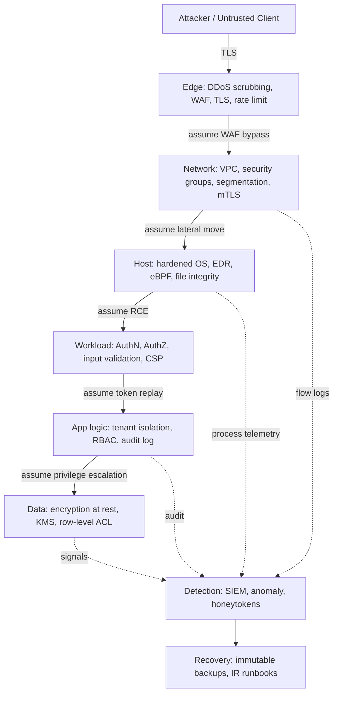
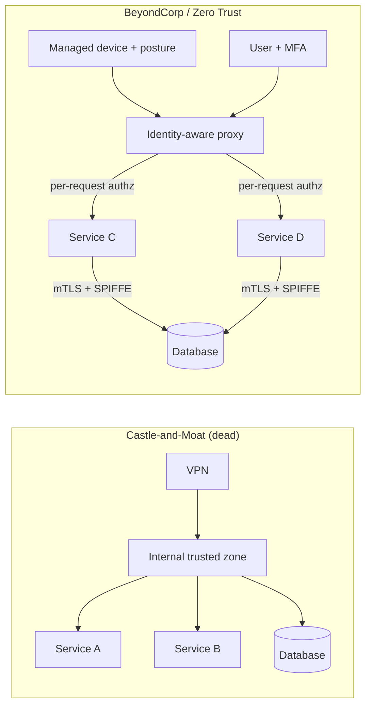
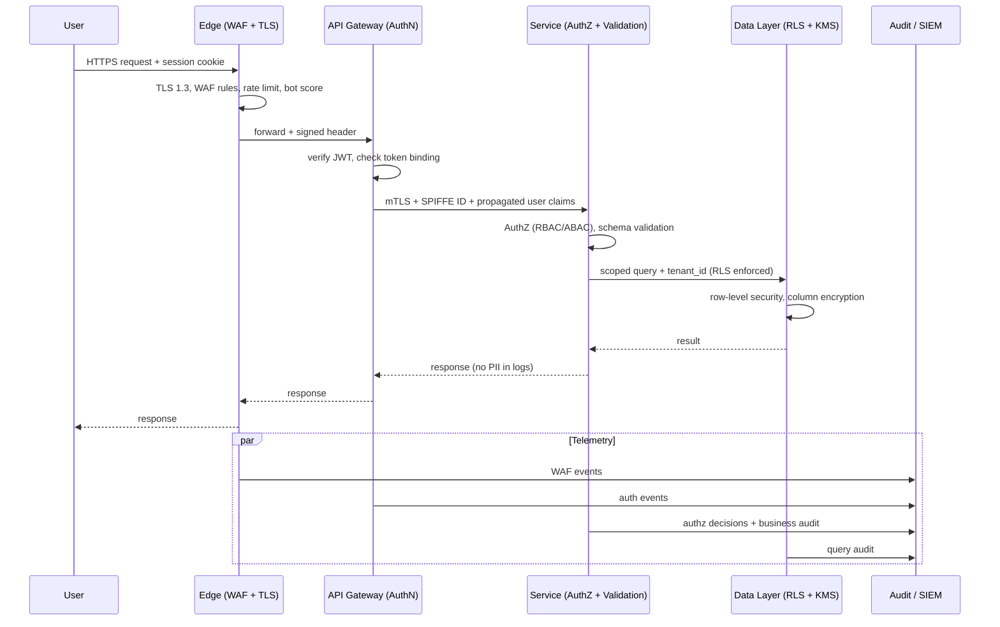

# Defense in Depth

## Why This Exists

**Problem.** A single security control will fail. Firewalls get misconfigured. WAF rules get bypassed. Service accounts get over-privileged. TLS terminates somewhere with weaker validation. A zero-day drops on Log4j on a Friday afternoon. If your security model is "this one control prevents the breach", you have a single point of failure dressed up as a strategy. The 2013 Target breach, the 2017 Equifax breach, the 2020 SolarWinds compromise, the 2023 MOVEit incident — every one of them defeated a "primary" control and then walked through a flat internal network because nothing else stood in the way.

**Key insight.** *Defense in depth* is the engineering response to the fact that controls fail independently with low but non-zero probability. If a single control catches an attack with probability `p`, then `n` **independent** controls in series catch it with probability `1 - (1-p)^n`. The math only works when the controls are genuinely independent — same vendor, same identity provider, same admin credential, and they fail together. The discipline is: **assume each layer has already been bypassed and design the next layer to still do its job.**

This isn't paranoia; it's the same reliability reasoning we apply to availability (redundant AZs, retries, circuit breakers). Security gets the same treatment: redundant, independent controls; least privilege; explicit authentication and authorization at every hop; encryption at rest and in transit; auditable logs; segmentation; and the assumption that the network is hostile — including your own internal network. That last assumption is what kills the "castle-and-moat" model and motivates BeyondCorp / zero trust.

NIST SP 800-160 Vol. 1 (*Engineering Trustworthy Secure Systems*) and Vol. 2 (*Developing Cyber-Resilient Systems*) frame this as systems engineering: security properties must be designed in, distributed across components, and verifiable. Not bolted on at the edge.

**Reach for this when:**
- Designing any system with sensitive data, multi-tenant boundaries, or regulatory exposure (PCI, HIPAA, SOC 2, GDPR).
- A threat model identifies "single point of compromise" risks — one IAM role, one VPN, one admin user, one shared secret.
- You're moving from a flat data-center network to cloud / hybrid / contractor-laptop reality.
- After an incident where the attacker pivoted from initial foothold to crown jewels with no friction.
- Designing CI/CD, build pipelines, supply chain (post-SolarWinds, post-Codecov, post-XZ).
- Anywhere SSRF, deserialization, or auth bypass would be game-over because the next service blindly trusts the caller.

**Don't reach for this when:**
- The threat model genuinely is "casual web scraper", and the data has zero value. Don't perform security theater on a static marketing site.
- You haven't yet done basic hygiene (patching, MFA, IAM least privilege). Layering on more controls before fixing the leaky basics is wasted effort.
- The "extra layers" you're considering are actually the same control re-skinned (two WAFs from the same vendor, two MFAs from the same IdP). That's not depth, that's correlated failure with extra latency.
- You're using "defense in depth" as cover for not fixing a known vulnerability ("we have other controls"). That's risk acceptance, not defense in depth.

## Diagrams

### The layered model — assume each layer has been bypassed



### Perimeter model vs. zero-trust (BeyondCorp)



### Request flow with controls at every hop



## Core content

### 1. Independence is the whole game

Two controls in series are only as strong as their independence. Examples of **fake** independence:

- Two WAFs that both subscribe to the same managed rule set.
- App-level auth and API-gateway auth that both call the same `validateJwt()` library — one CVE in the JWT lib defeats both.
- "Encryption at rest" via the disk and "encryption at rest" via the same KMS key with the same IAM role granting `kms:Decrypt` to the same service account. Steal the role, get both.

Examples of **real** independence:
- Network ACLs (deny by default at the subnet) **and** security groups (deny by default at the instance) **and** application-layer authz. Each enforces a different policy, fails differently, is administered by different teams.
- Hardware-backed keys (HSM/Nitro/Cloud HSM) for the master key, software KMS for envelope keys, application-layer field encryption with a per-tenant key. An attacker needs to compromise three distinct trust boundaries.

### 2. The canonical layers

| Layer | Examples | What it stops if upstream layers failed |
| --- | --- | --- |
| **Edge** | DDoS scrubbing, WAF, TLS termination with strict ciphers, rate limit, bot management | L7 floods, known-CVE exploit strings, slowloris |
| **Network** | VPC, private subnets, security groups, NACLs, service-to-service mTLS, egress proxy with allowlist | Lateral movement, exfil to attacker C2, unauthorized internal calls |
| **Host** | Hardened AMI, immutable infra, EDR/eBPF runtime detection, SELinux/AppArmor, no shell access in prod | Persistence, kernel exploits, container escape pivots |
| **Workload / runtime** | Sandboxed runtime (gVisor, Firecracker), seccomp, read-only root FS, distroless images, capability drops | Container breakout, file write, raw socket use |
| **Identity / AuthN** | OIDC + MFA + WebAuthn, short-lived tokens, mTLS with SPIFFE, device attestation | Stolen long-lived credentials, replay |
| **Application AuthZ** | RBAC/ABAC, policy engine (OPA/Cedar), per-request authorization, tenant-scoped queries | Confused deputy, IDOR, cross-tenant access |
| **Data** | Encryption in transit + at rest, per-tenant KMS keys, field-level encryption for PII, row-level security in DB | Backup theft, snapshot exfil, SQL injection that bypasses app authz |
| **Supply chain** | SBOM, signed artifacts (Sigstore/cosign), provenance (SLSA), reproducible builds, dependency pinning | Compromised build, malicious transitive dep, typosquats |
| **Detection** | SIEM, audit logs (immutable, separate account), anomaly detection, honeytokens, canary credentials | Catches attackers who got past everything else |
| **Recovery** | Immutable backups (object lock), tested restore runbooks, IR playbooks, kill-switch, secret rotation | Ransomware, total compromise — limits blast radius |

### 3. Concrete example: a payment service, layer by layer

```hcl
# --- Network layer: deny by default, allow only what's needed ---
resource "aws_security_group" "payments" {
  name        = "payments-svc"
  description = "Payment service - ingress from API GW only"
  vpc_id      = var.vpc_id

  # No ingress rules here — added explicitly below
  egress = []  # default-deny egress, then opt in
}

resource "aws_security_group_rule" "ingress_from_api_gw" {
  type                     = "ingress"
  from_port                = 8443
  to_port                  = 8443
  protocol                 = "tcp"
  source_security_group_id = aws_security_group.api_gateway.id
  security_group_id        = aws_security_group.payments.id
}

# Egress: only the DB and the KMS endpoint, nothing else.
# This is the layer that catches an SSRF or RCE trying to call out.
resource "aws_security_group_rule" "egress_to_db" {
  type                     = "egress"
  from_port                = 5432
  to_port                  = 5432
  protocol                 = "tcp"
  source_security_group_id = aws_security_group.payments_db.id
  security_group_id        = aws_security_group.payments.id
}

resource "aws_vpc_endpoint" "kms" {
  vpc_id              = var.vpc_id
  service_name        = "com.amazonaws.${var.region}.kms"
  vpc_endpoint_type   = "Interface"
  security_group_ids  = [aws_security_group.kms_endpoint.id]
  private_dns_enabled = true

  # Endpoint policy: only this role, only these keys, only Decrypt.
  # If app gets RCE, it can't pivot to other KMS keys.
  policy = jsonencode({
    Statement = [{
      Effect    = "Allow"
      Principal = { AWS = aws_iam_role.payments.arn }
      Action    = ["kms:Decrypt", "kms:GenerateDataKey"]
      Resource  = [aws_kms_key.payments_data.arn]
    }]
  })
}
```

```python
# --- Workload layer: AuthN + AuthZ + input validation + audit ---
# Note: every one of these checks assumes the others have failed.

from dataclasses import dataclass
from typing import Optional
import structlog

log = structlog.get_logger()

@dataclass(frozen=True)
class Principal:
    user_id: str
    tenant_id: str
    roles: frozenset[str]
    auth_method: str       # "webauthn", "password+totp", "service-mtls"
    token_binding: str     # cnf claim — proves token was used by holder

class AuthError(Exception): ...
class ForbiddenError(Exception): ...

def authenticate(request) -> Principal:
    # Layer 1: gateway already verified JWT signature and expiry.
    # We re-verify here because gateway compromise must not equal app compromise.
    claims = verify_jwt(
        token=request.headers["authorization"].removeprefix("Bearer "),
        # Different JWKS endpoint than the gateway's — independent trust root.
        jwks_url=settings.APP_JWKS_URL,
        required_aud="payments.internal",
        max_age_seconds=300,  # Short. Steal a token, you have 5 min.
    )
    # Token binding: prevent stolen-token replay.
    if claims["cnf"]["x5t#S256"] != request.peer_cert_thumbprint:
        log.warning("token_binding_mismatch", sub=claims["sub"])
        raise AuthError("token not bound to caller")
    return Principal(
        user_id=claims["sub"],
        tenant_id=claims["tenant"],
        roles=frozenset(claims.get("roles", [])),
        auth_method=claims["amr"],
        token_binding=claims["cnf"]["x5t#S256"],
    )

def authorize_refund(p: Principal, charge_id: str, amount_cents: int) -> None:
    # Step-up auth: high-value actions require strong auth method.
    # Even if password+TOTP was used at login, a refund > $1000 needs WebAuthn.
    if amount_cents > 100_000 and p.auth_method != "webauthn":
        raise ForbiddenError("step-up auth required for high-value refund")

    if "payments:refund" not in p.roles:
        raise ForbiddenError("missing payments:refund role")

    # Tenant boundary: even with the role, you can only refund your own tenant's charges.
    # This check is REPEATED at the data layer — see RLS below.
    charge = load_charge(charge_id)
    if charge.tenant_id != p.tenant_id:
        # This is a cross-tenant attempt. Page security.
        log.error("cross_tenant_attempt",
                  actor=p.user_id, actor_tenant=p.tenant_id,
                  resource_tenant=charge.tenant_id, charge_id=charge_id)
        raise ForbiddenError("not your tenant")

def refund(request) -> dict:
    p = authenticate(request)
    body = validate_schema(request.json, RefundSchema)  # explicit schema, no extras
    authorize_refund(p, body.charge_id, body.amount_cents)

    # Business audit log — separate from access log, written to append-only store.
    audit.emit(
        actor=p.user_id, tenant=p.tenant_id,
        action="refund.create", resource=body.charge_id,
        amount_cents=body.amount_cents, auth_method=p.auth_method,
    )
    return process_refund_idempotent(body)
```

```sql
-- --- Data layer: row-level security as the backstop ---
-- If the app ever forgets to filter by tenant_id (and it WILL, eventually),
-- the database refuses to return cross-tenant rows.

ALTER TABLE charges ENABLE ROW LEVEL SECURITY;
ALTER TABLE charges FORCE ROW LEVEL SECURITY;  -- applies even to table owner

-- Connection pool sets app.tenant_id from the verified JWT claim, in a transaction.
CREATE POLICY tenant_isolation ON charges
    USING (tenant_id = current_setting('app.tenant_id')::uuid);

-- Field-level: card last4 is fine in the row, but the encrypted PAN
-- lives in a separate column encrypted with a per-tenant data key.
-- Stealing a DB dump without the KMS keys gets the attacker nothing.
ALTER TABLE charges
    ADD COLUMN pan_ciphertext bytea,
    ADD COLUMN pan_key_id text;  -- references KMS key alias, rotated yearly
```

### 4. BeyondCorp / Zero Trust — concretely

The Google BeyondCorp papers (Ward & Beyer 2014; Osborn et al. 2016; *BeyondCorp 5: The User Experience*, 2017) describe the migration from "VPN + trusted internal network" to a model where:

1. **No network is trusted.** Coffee-shop Wi-Fi and the office LAN get the same level of trust: zero.
2. **Access is granted per-request**, based on (user identity, device identity, device posture, requested resource).
3. **An identity-aware proxy** in front of every application enforces the policy. There is no "internal" application — they're all internet-facing, but only reachable through the proxy after authorization.
4. **Device inventory is the source of truth** for what's allowed. Lost laptop → device record disabled → all access revoked, no need to chase down VPN sessions.

For service-to-service traffic, the analogous primitive is **SPIFFE/SPIRE** (or service mesh mTLS — Istio, Linkerd, AWS App Mesh, Consul). Every workload gets a cryptographic identity (`spiffe://corp.example/ns/payments/sa/refund-svc`), and every call is authenticated and authorized based on that identity, not on "is this packet from inside the VPC?".

```yaml
# Example: SPIFFE-based authz between services. The "network" cannot be trusted;
# the *identity* of the caller is what matters.
apiVersion: security.istio.io/v1
kind: AuthorizationPolicy
metadata:
  name: payments-allow-only-checkout
  namespace: payments
spec:
  selector:
    matchLabels:
      app: payments
  action: ALLOW
  rules:
  - from:
    - source:
        principals: ["spiffe://corp.example/ns/checkout/sa/checkout-svc"]
    to:
    - operation:
        methods: ["POST"]
        paths: ["/v1/charges"]
    when:
    - key: request.auth.claims[aud]
      values: ["payments.internal"]
```

### 5. Why "perimeter security" is dead

The perimeter model assumed:
1. There is an inside and an outside.
2. The inside is small, well-defined, and trustworthy.
3. The boundary is a small number of choke points (firewalls, VPN concentrators) that can be hardened.

Every assumption broke:

- **SaaS, mobile, BYOD, contractors, M&A.** The "inside" is now laptops in 30 countries, phones, contractor MacBooks, acquired companies' AD forests, and SaaS tenants you don't control.
- **Cloud and microservices.** "Inside" the VPC is hundreds of services across dozens of accounts, many of which talk to internet APIs. The boundary has thousands of holes by design.
- **Phishing and supply chain.** The attacker doesn't break the perimeter; they walk in through an SSO login or a malicious npm package. Once inside the trusted zone, a flat network is a buffet.
- **The 2013 Target breach** used HVAC vendor credentials → trusted network → POS systems. Perimeter held; "inside" was wide open.
- **The 2020 SolarWinds breach** came in through signed updates from a trusted vendor. The perimeter happily let it in.

The replacement is **assume breach**: design as if the attacker is already inside. Every service authenticates every caller. Every datastore enforces authorization independently. Audit logs go to a separate account that the prod IAM roles cannot touch. Backups are immutable and on different keys. The blast radius of any single compromise is bounded by the next layer.

### 6. NIST SP 800-160: the systems-engineering frame

NIST SP 800-160 Vol. 1 (*Engineering Trustworthy Secure Systems*, 2022) and Vol. 2 (*Developing Cyber-Resilient Systems*, 2021) place defense in depth inside a broader framework:

- **Vol. 1** treats security as a property to be engineered into systems, not a feature added at the end. It maps security tasks to the ISO/IEC/IEEE 15288 systems-engineering lifecycle: requirements, architecture, design, implementation, verification, operation. Defense in depth surfaces in the *architecture* phase as one of several principles (others: least privilege, complete mediation, separation of duties, fail-safe defaults — many drawn from Saltzer & Schroeder 1975).
- **Vol. 2** introduces 14 *cyber-resilience techniques* (e.g., adaptive response, analytic monitoring, deception, diversity, dynamic positioning, non-persistence, privilege restriction, segmentation, substantiated integrity). Defense in depth in 800-160v2 is operationalized as **diversity + segmentation + substantiated integrity + analytic monitoring** working together, not just "more layers".

The practical takeaway: when you write your architecture document, name the layers, name the threats each layer catches, and name what happens when each layer fails. If you can't articulate "what stops this attack if X fails", you don't have defense in depth — you have one control with extra steps.

### 7. Detection and recovery are layers too

A common failure: teams stack preventive controls (WAF, mTLS, RBAC, encryption) and stop there. But:

> "Prevention eventually fails. The question is how fast you detect it and how fast you recover." — broadly attributed to Cisco / SANS, formalized in NIST CSF as Identify → Protect → Detect → Respond → Recover.

Detection layer essentials:
- **Audit logs** for authn, authz decisions (especially denials), data access. Stored in a separate AWS account / GCP project, write-only from prod, with object lock / WORM.
- **Honeytokens**: a fake AWS access key in a Lambda env var that pages on use; a fake admin user in AD that triggers IR if anyone ever authenticates as it; a "do not access" S3 object with a CloudTrail alarm.
- **Anomaly detection**: GuardDuty, custom rules on egress destinations, login from impossible-travel IPs, sudden role assumption from a never-seen service.

Recovery layer essentials:
- **Immutable backups** (S3 Object Lock in compliance mode, separate account, separate KMS key, separate IAM trust path). Ransomware operators specifically target backups; if your backups can be deleted by the same role that runs prod, you do not have backups.
- **Tested restore runbooks**. An untested backup is Schrödinger's backup. Run a quarterly game day where you restore prod from cold storage to a clean account.
- **Kill switches and credential rotation**: an "all hands break-glass" runbook to rotate every secret, revoke every session, and rebuild from known-good infrastructure-as-code in under 24 hours.

### 8. Anti-patterns that look like depth but aren't

```python
# ANTI-PATTERN: "depth" that's actually one control re-skinned.
# All three checks use the same is_admin() function. One bug, one bypass, all gone.
def delete_user(req):
    assert is_admin(req.user)  # check 1
    if not is_admin(req.user): # check 2 — same code path
        raise Forbidden
    with admin_required(req): # check 3 — also same code path
        do_delete()
```

```python
# BETTER: independent enforcement at independent layers.
# - Network: only the admin VPC can reach this endpoint.
# - Edge gateway: requires a header signed by a separate admin IdP.
# - App: RBAC check via OPA, evaluated against a policy fetched from a separate config service.
# - Data: DB role used by this code path can DELETE only from `users`, not from `audit_log`.
# A bug in the RBAC code does not give the attacker arbitrary deletes.
```

Other anti-patterns:
- **"We have a WAF."** A WAF is one signature-based control with a high false-negative rate against custom app logic. Treat it as a speed bump, not a wall.
- **"It's behind the VPN."** See section 5.
- **"The intern can't break anything, they only have read access."** Read access to your customer database is the breach.
- **"We rotate secrets quarterly."** Long-lived secrets in CI/CD env vars are a primary attacker target. Use OIDC federation (GitHub Actions → AWS IAM, no static keys) and short-lived credentials.
- **"DefenseInDepth" as a slide in the architecture deck with no specific layers, no specific threats, no failure analysis.** Security theater.

## Trade-offs

| Benefit | Cost |
| --- | --- |
| Independent layers mean compromise of one control doesn't equal breach | Each layer has operational cost: configuration, monitoring, on-call, false positives |
| Forces explicit threat modeling per layer ("what does this stop?") | Engineering time spent on threat models is time not spent on features |
| Auditable: each layer produces logs, easier to satisfy SOC 2 / PCI / HIPAA | Log volume + cost; SIEM + retention bills add up fast |
| Limits blast radius of any single compromise | Latency overhead (mTLS handshakes, policy evaluation, encryption) — typically 1–10ms per layer |
| Catches misconfigurations: layer N catches the bug in layer N-1 | Diagnosing a request that fails at layer 4 of 7 is a debugging nightmare without good observability |
| Buys time to detect and respond before the attacker reaches data | Doesn't reduce the *initial* probability of compromise; can give false confidence |
| Aligns with regulatory expectations (NIST 800-53 SC-29, PCI DSS Requirement 1+) | Compliance-driven layering can devolve into checkbox controls that don't actually compose |
| Independent admin domains reduce insider risk (no single admin can disable everything) | Cross-team coordination overhead; risk of nobody owning the end-to-end story |

## Common Pitfalls

- **Correlated failure dressed up as depth.** Two controls administered by the same team, using the same identity provider, deployed by the same pipeline, with the same on-call. They fail together. Independence requires distinct administrative trust roots.
- **The auth library monoculture.** Every service uses the same `auth-sdk` package. A CVE there compromises every "layer". Mitigation: keep the library small, audit it heavily, and pair it with a different mechanism at the edge (e.g., gateway does JWT verify with one library, service does mTLS verify with a different one).
- **Logging the secret you're protecting.** "Defense in depth" with debug logs that print JWTs, passwords, or PII to CloudWatch Logs that anyone with `logs:GetLogEvents` can read. Treat logs as a data layer with their own classification and access controls.
- **Forgetting east-west traffic.** Hardened north-south (internet → app), totally flat east-west (app → app). Once the attacker has any internal foothold, they walk anywhere. mTLS + AuthZ between services is non-negotiable for systems with sensitive data.
- **Backups in the same blast radius.** Backups in the same account, same region, same KMS key, deletable by the same admin role. Ransomware operators love this. Use cross-account, cross-region, object-locked backups with separate IAM trust.
- **Detection without response.** GuardDuty firing into a Slack channel that nobody reads. Detection rules should have owners, runbooks, and SLAs, or they're decoration.
- **Step-up auth that never steps up.** "Sensitive actions require MFA" — but the MFA was satisfied at login 8 hours ago and never re-checked. Sensitive actions should re-prompt or require a fresh assertion (e.g., WebAuthn re-tap), not just check that *some* MFA happened today.
- **Compliance ≠ security.** Passing PCI does not mean you have defense in depth. Compliance is a floor, often a low one. The Capital One breach (2019) was in a PCI-compliant environment.
- **Service accounts as kings.** A service account with `*:*` permissions is the universal solvent. Every layer evaporates when it's compromised. Use least privilege, scope by resource, scope by condition, and rotate.
- **"We added a layer" without removing the trust assumption.** Adding mTLS but still letting any cert from the internal CA call any service. mTLS is authentication, not authorization. You still need per-call authz.
- **The forgotten layer: the build pipeline.** Your prod controls are pristine. Your CI runner has admin credentials, no MFA on the GitHub org, and pulls a thousand npm packages on every build. The attacker doesn't bother with prod; they own you via the build. SLSA, signed artifacts, OIDC federation, and ephemeral runners are now table-stakes.

## Decision Table

| Situation | Use Defense in Depth | Alternative / Complement |
| --- | --- | --- |
| Multi-tenant SaaS with PII or payment data | **Yes — all layers**, especially app authz + DB row-level security + per-tenant keys | — |
| Internal-only tool, low-sensitivity data, small team | Light: SSO + MFA + access logs + patching. Don't over-engineer | Boring hygiene + a quarterly review |
| Public marketing site, no user data | Edge layer (TLS, WAF, CDN) is enough | CSP + dependency scanning |
| Service-to-service traffic in cloud | mTLS + SPIFFE identity + per-call authz | API gateway with HMAC if mTLS is too operationally heavy |
| Workforce remote access to internal apps | **BeyondCorp / IAP**, not VPN | Continue VPN only as transitional state |
| Highly regulated (PCI, HIPAA, FedRAMP) | All layers + documented control matrix mapped to NIST 800-53 / 800-160 | Annual third-party pentest + continuous compliance monitoring |
| Greenfield system | Bake in layers from day one (cheap) — IaC modules, mesh, default-deny | — |
| Brownfield, can't change everything | Add layers that are cheap and high-leverage first: MFA everywhere, egress allowlists, immutable backups, audit logs to separate account | Threat-model the top 3 crown jewels and harden their data layer first |
| Performance-critical hot path (HFT, ad serving) | Push policy decisions to startup, not per-request; use cached authz; co-locate decision points | Accept higher residual risk on the hot path; compensate with stronger detection |
| Threat model = nation-state / APT | All layers + active deception (honey services, fake credentials), formal verification of critical components, hardware roots of trust, air-gapped recovery | Read NIST 800-160 Vol. 2 and the BSRS chapters on resilience and recovery cover-to-cover |

## References

- NIST — *SP 800-160 Vol. 1 Rev. 1: Engineering Trustworthy Secure Systems* (2022) — https://csrc.nist.gov/pubs/sp/800/160/v1/r1/final
- NIST — *SP 800-160 Vol. 2 Rev. 1: Developing Cyber-Resilient Systems* (2021) — https://csrc.nist.gov/pubs/sp/800/160/v2/r1/final
- NIST — *Cybersecurity Framework 2.0* (2024) — https://www.nist.gov/cyberframework
- NIST — *SP 800-207: Zero Trust Architecture* (2020) — https://csrc.nist.gov/pubs/sp/800/207/final
- Saltzer & Schroeder — *The Protection of Information in Computer Systems* (1975) — https://www.cs.virginia.edu/~evans/cs551/saltzer/ — the original "design principles for secure systems" paper; defense in depth descends from these.
- Ward & Beyer — *BeyondCorp: A New Approach to Enterprise Security* (Google, 2014) — https://research.google/pubs/beyondcorp-a-new-approach-to-enterprise-security/
- Osborn, McWilliams, Beyer, Saltonstall — *BeyondCorp: Design to Deployment at Google* (2016) — https://research.google/pubs/beyondcorp-design-to-deployment-at-google/
- Google — *Building Secure and Reliable Systems* (Adkins et al., O'Reilly 2020) — https://sre.google/books/building-secure-reliable-systems/ — especially Ch. 1 (intersection of security and reliability), Ch. 6 (design for understandability), Ch. 8 (design for resilience), Ch. 21 (incident response).
- Google — *Site Reliability Engineering* — https://sre.google/sre-book/table-of-contents/ — Ch. 2 (production environment), Ch. 17 (testing for reliability) inform the "test your controls" mindset.
- SPIFFE/SPIRE — *Secure Production Identity Framework for Everyone* — https://spiffe.io/docs/latest/spiffe-about/overview/
- AWS — *Security Pillar — Well-Architected Framework* — https://docs.aws.amazon.com/wellarchitected/latest/security-pillar/welcome.html
- AWS Builders' Library — *Avoiding overload in distributed systems by putting the smaller service in control* — https://aws.amazon.com/builders-library/avoiding-overload-in-distributed-systems-by-putting-the-smaller-service-in-control/ — relevant for layered rate limiting.
- OWASP — *Application Security Verification Standard (ASVS) 4.0* — https://owasp.org/www-project-application-security-verification-standard/
- OWASP — *Cheat Sheet: Defense in Depth* — https://cheatsheetseries.owasp.org/
- CIS — *Critical Security Controls v8* — https://www.cisecurity.org/controls/v8
- MITRE — *ATT&CK Framework* — https://attack.mitre.org/ — use to enumerate "what attack does each layer disrupt".
- SLSA — *Supply-chain Levels for Software Artifacts* — https://slsa.dev/
- Sigstore — https://www.sigstore.dev/
- Kim, Humble, Debois, Willis — *The DevOps Handbook*, Part V (security) — paper-only; see ch. on "How to integrate information security into deployment pipelines".
- DDIA — *Designing Data-Intensive Applications* (Kleppmann, 2017) — Ch. 8 (Trouble with Distributed Systems) for the reliability-meets-security framing; Ch. 11 (Stream Processing) for audit log architecture.

## See Also

- `../threat-modeling/` — STRIDE / PASTA / attack trees that drive *what* layers you need.
- `../secrets-management/` — KMS, Vault, OIDC federation; replaces long-lived secrets.
- `../audit-logging/` — immutable logs, separate account, retention, query patterns.
- `../../reliability/incident-response/` — runbooks, kill switches, forensics, post-mortems.
- `../vulnerability-management/` — SLSA, SBOM, signed artifacts, OIDC for CI/CD.
