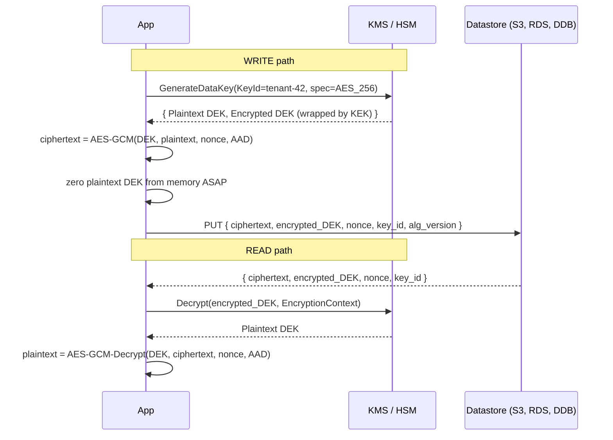
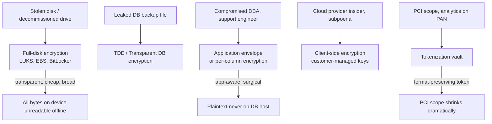
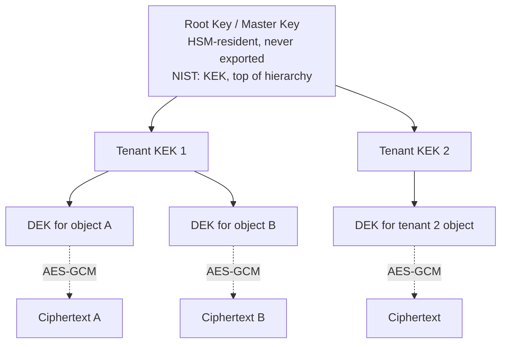

# Encryption at Rest

## Why This Exists

**Problem.** Data lives much longer than the request that wrote it. Disks get decommissioned, snapshots get cloned to dev accounts, backups get exfiltrated, laptops get stolen, S3 buckets get misconfigured, DBAs read tables, support engineers screen-share with PII visible. TLS protects the wire; **encryption at rest protects the substrate** — the bytes sitting on a block device, in an object store, on a tape, in a memory dump.

**Key insight.** "Encryption at rest" is not one thing. It's a **stack of layers**, each defending a different threat:

| Layer | Defends against | Transparent to app? |
|---|---|---|
| Full-disk (LUKS, BitLocker, EBS) | Stolen physical media, decommissioned drives | Yes |
| Filesystem (ZFS native, eCryptfs) | Per-mount/per-user separation | Mostly |
| Database TDE (Transparent Data Encryption) | Stolen DB files, backups | Yes |
| Per-column / field-level | DBA, support staff, leaked dump | No — app must encrypt/decrypt |
| Application envelope (KMS DEK/KEK) | Compromised storage tier, cross-tenant leakage | No |
| Tokenization | PCI scope reduction, analytics on sensitive fields | No |
| Client-side (E2EE) | Cloud provider, server-side compromise | No |

The deeper the layer, the **closer to the threat** and the **more friction** for legitimate access. A stolen EBS snapshot is useless if the volume was encrypted; but a SQL injection on a TDE-protected database returns plaintext rows because the DB engine decrypts transparently.

**Reach for this when:**
- You store PII, PHI, payment data, secrets, credentials, or anything covered by GDPR / HIPAA / PCI-DSS / SOC 2.
- Compliance demands FIPS 140-2/3 validated cryptography or HSM-backed keys.
- Multi-tenant SaaS — per-tenant key isolation is a hard requirement (or sales blocker).
- You need **crypto-shredding**: delete the key, the data is unrecoverable. GDPR right-to-erasure on append-only or immutable storage.
- Backups, snapshots, or replicas leave the trust boundary of the primary system.

**Don't reach for this when:**
- You're solving an in-flight problem — that's TLS / mTLS / VPN, not at-rest.
- You think encryption replaces access control. **It doesn't.** Access control prevents unauthorized reads; encryption protects the bytes if access control fails. Defense in depth means both.
- You're encrypting fields you also need to query with `WHERE col = ?` or `LIKE`. Naive per-column AES-GCM breaks indexes; you need deterministic encryption, blind indexes, or searchable encryption — each with its own trade-offs.
- You're encrypting JSON columns end-to-end and then asking why analytics broke.

## Diagrams

### Envelope encryption with KMS (the canonical pattern)



Why this shape: every object gets a **unique data key (DEK)**, but you only ever talk to KMS for the small wrapped key, never the bulk plaintext. KMS becomes a low-throughput control plane; bulk crypto stays in your app's CPU. Rotating the KEK rewraps DEKs without re-encrypting petabytes.

### Layered defense — what each layer catches



### Key hierarchy (NIST SP 800-57 terminology)



NIST 800-57 Part 1 §5 calls this a **key hierarchy**. The deeper the key, the shorter its cryptoperiod and the larger its blast radius if leaked — but a leaked DEK only loses one object, not the tenant.

## Disk-level encryption

### LUKS (Linux Unified Key Setup) — the on-prem default

```bash
# Create LUKS2 volume with Argon2id KDF (resists GPU/ASIC password cracking)
cryptsetup luksFormat \
  --type luks2 \
  --cipher aes-xts-plain64 \
  --key-size 512 \
  --hash sha256 \
  --pbkdf argon2id \
  --pbkdf-memory 1048576 \
  --pbkdf-parallel 4 \
  /dev/nvme1n1

# Open and mount
cryptsetup open /dev/nvme1n1 cryptdata
mkfs.xfs /dev/mapper/cryptdata
mount /dev/mapper/cryptdata /var/lib/postgresql

# Add a second key slot bound to TPM (so the box auto-boots only on this hardware)
systemd-cryptenroll --tpm2-device=auto --tpm2-pcrs=0+7 /dev/nvme1n1
```

**What LUKS protects:** an attacker who walks off with the drive sees only ciphertext. The XTS mode is purpose-built for sector-level random-access encryption — each 512-byte sector encrypts independently with a tweak derived from sector index, so changing one sector doesn't ripple.

**What LUKS does NOT protect:** anything once the volume is unlocked and mounted. A live host with a running database is wide open to anyone with shell access, regardless of LUKS.

### EBS encryption — the cloud equivalent

```hcl
# Terraform — EBS volume with customer-managed KMS key (CMK)
resource "aws_kms_key" "ebs" {
  description             = "EBS root volume encryption — prod"
  deletion_window_in_days = 30
  enable_key_rotation     = true   # AWS rotates the underlying HBK annually
  multi_region            = false  # set true only if you actually replicate cross-region
  policy                  = data.aws_iam_policy_document.ebs_kms.json
}

resource "aws_ebs_volume" "data" {
  availability_zone = "us-west-2a"
  size              = 500
  type              = "gp3"
  encrypted         = true
  kms_key_id        = aws_kms_key.ebs.arn
  tags = { Name = "prod-postgres-data", Tier = "prod" }
}

# Force ALL new EBS volumes in the account to be encrypted by default
resource "aws_ebs_encryption_by_default" "default" {
  enabled = true
}
```

**Critical detail.** `aws_ebs_encryption_by_default` does **not** retroactively encrypt existing volumes or snapshots. You must take a snapshot, copy with `--encrypted`, and restore. Skipping this is how plaintext snapshots end up shared cross-account.

**Snapshot sharing.** A snapshot encrypted with the default AWS-managed `aws/ebs` key **cannot be shared** with another account. Use a customer-managed CMK and grant `kms:CreateGrant` to the target account; otherwise sharing fails or — worse — engineers "fix it" by copying to an unencrypted volume.

## Application-level: envelope encryption

This is the canonical pattern for cloud-native services. Implementation in Python with AWS KMS:

```python
# pip install aws-encryption-sdk boto3
import os
import json
import base64
from dataclasses import dataclass
from typing import Optional

import boto3
from botocore.config import Config
from cryptography.hazmat.primitives.ciphers.aead import AESGCM

KMS_KEY_ID = os.environ["KMS_KEY_ID"]  # arn:aws:kms:...:key/...
ALG_VERSION = 1                         # bump when you change algorithm or AAD shape

# Use a tight retry policy. KMS is rate-limited per account/region (e.g. 10k/s default
# for symmetric crypto); a tight retry with jitter avoids cascading failures during
# a thundering herd after a deploy.
_kms = boto3.client("kms", config=Config(retries={"max_attempts": 5, "mode": "adaptive"}))


@dataclass
class Envelope:
    ciphertext: bytes
    encrypted_dek: bytes  # opaque blob from KMS
    nonce: bytes          # 12 bytes for GCM, NEVER reused with same key
    key_id: str           # for auditing / rotation
    alg_version: int
    aad: bytes            # additional authenticated data, bound at decrypt time

    def to_json(self) -> str:
        return json.dumps({
            "v": self.alg_version,
            "kid": self.key_id,
            "edk": base64.b64encode(self.encrypted_dek).decode(),
            "n": base64.b64encode(self.nonce).decode(),
            "ct": base64.b64encode(self.ciphertext).decode(),
            "aad": base64.b64encode(self.aad).decode(),
        })


def encrypt(plaintext: bytes, *, tenant_id: str, record_id: str) -> Envelope:
    # AAD binds the ciphertext to its CONTEXT. If an attacker swaps record A's
    # ciphertext into record B's row, decryption fails. This is the single most
    # forgotten step and the source of countless real-world attacks.
    aad = f"tenant={tenant_id}|record={record_id}|v={ALG_VERSION}".encode()

    # GenerateDataKey returns BOTH plaintext and ciphertext DEK in one call.
    # The plaintext copy is in memory only; we zero it after use.
    resp = _kms.generate_data_key(
        KeyId=KMS_KEY_ID,
        KeySpec="AES_256",
        EncryptionContext={"tenant": tenant_id, "alg": str(ALG_VERSION)},
    )
    dek_plain = resp["Plaintext"]
    dek_wrapped = resp["CiphertextBlob"]

    try:
        nonce = os.urandom(12)  # 96-bit nonce per NIST SP 800-38D §5.2.1.1
        aesgcm = AESGCM(dek_plain)
        ct = aesgcm.encrypt(nonce, plaintext, aad)
    finally:
        # Best-effort zeroization. Python doesn't guarantee memory wipe, but we
        # at least drop our reference and overwrite the bytearray we control.
        if isinstance(dek_plain, (bytes, bytearray)):
            dek_plain = b"\x00" * len(dek_plain)
        del dek_plain

    return Envelope(
        ciphertext=ct,
        encrypted_dek=dek_wrapped,
        nonce=nonce,
        key_id=resp["KeyId"],
        alg_version=ALG_VERSION,
        aad=aad,
    )


def decrypt(env: Envelope, *, tenant_id: str, record_id: str) -> bytes:
    # Reconstruct AAD; if it doesn't match what was used at encrypt time, GCM tag
    # verification fails and we get InvalidTag. That's the integrity check.
    expected_aad = f"tenant={tenant_id}|record={record_id}|v={env.alg_version}".encode()
    if expected_aad != env.aad:
        raise ValueError("AAD mismatch — refusing to decrypt cross-context")

    resp = _kms.decrypt(
        CiphertextBlob=env.encrypted_dek,
        EncryptionContext={"tenant": tenant_id, "alg": str(env.alg_version)},
        # Pin the key — defense against confused-deputy if the wrapped DEK was
        # somehow swapped from a different KMS key.
        KeyId=env.key_id,
    )
    dek_plain = resp["Plaintext"]
    try:
        aesgcm = AESGCM(dek_plain)
        return aesgcm.decrypt(env.nonce, env.ciphertext, env.aad)
    finally:
        del dek_plain
```

**What's load-bearing here:**

1. **One DEK per object.** Reusing a DEK across many records means a nonce collision risk and a single-key blast radius. KMS `GenerateDataKey` is cheap; use it.
2. **Encryption context = AAD.** It's both an audit primitive (CloudTrail logs the context) and a cryptographic binding (GCM authenticates it). Skipping AAD is the most common envelope-encryption bug in the wild.
3. **Nonce uniqueness.** AES-GCM catastrophically fails if you reuse a nonce with the same key. Random 96-bit nonces give a birthday bound of ~2^32 messages per key — comfortably safe for per-object DEKs (which encrypt one message and die), but **not** for a long-lived shared DEK.
4. **Algorithm version field.** When you migrate from AES-GCM to AES-GCM-SIV (or change AAD shape), you need to know which records were encrypted under which scheme. Store the version in plaintext alongside ciphertext.

### Per-column encryption

When TDE isn't enough — you don't trust the DBA, or you want crypto-shredding per row, or HIPAA demands plaintext never touch the database engine.

```sql
-- Schema: store ciphertext + per-row metadata. Notice we keep a deterministic
-- blind index for equality lookups while the actual ssn column holds randomized AEAD.
CREATE TABLE patients (
    id            UUID PRIMARY KEY,
    tenant_id     UUID NOT NULL,
    -- Randomized AEAD (different ciphertext every encrypt of same plaintext)
    ssn_ct        BYTEA NOT NULL,        -- AES-GCM ciphertext + auth tag
    ssn_nonce     BYTEA NOT NULL,
    ssn_dek_id    UUID NOT NULL REFERENCES dek_registry(id),
    -- Deterministic blind index for equality search: HMAC-SHA256(tenant_secret, ssn)
    -- Same plaintext → same hash, but reveals nothing without the tenant secret.
    ssn_bidx      BYTEA NOT NULL,
    -- Searchable substring? Use a bloom-filter or per-token blind index.
    name_ct       BYTEA NOT NULL,
    name_nonce    BYTEA NOT NULL,
    created_at    TIMESTAMPTZ NOT NULL DEFAULT now()
);

CREATE INDEX ON patients (tenant_id, ssn_bidx);  -- equality lookups on SSN

-- Registry tracks which DEK encrypted what, enabling rotation without rewriting rows.
CREATE TABLE dek_registry (
    id            UUID PRIMARY KEY,
    tenant_id     UUID NOT NULL,
    wrapped_dek   BYTEA NOT NULL,       -- DEK encrypted by current KEK in KMS
    kek_id        TEXT NOT NULL,         -- which KMS KEK wrapped it
    created_at    TIMESTAMPTZ NOT NULL,
    rotated_at    TIMESTAMPTZ,           -- when this DEK was retired
    state         TEXT NOT NULL          -- 'active' | 'retired' | 'destroyed'
);
```

**Equality search via blind index.** `bidx = HMAC(tenant_key, normalize(ssn))`. Same input → same output, so `WHERE ssn_bidx = HMAC(tenant_key, '123-45-6789')` works as an indexed lookup. Different tenants get different keys, so cross-tenant correlation attacks fail. Don't use a plain hash — `SHA256(ssn)` is brute-forceable in seconds because the SSN keyspace is tiny (10^9).

**Range queries (`WHERE age BETWEEN 30 AND 40`)** need order-preserving encryption (OPE) or a fundamentally different design (homomorphic, or store ranges in plaintext if not sensitive). OPE leaks order, which leaks a lot — Naveed et al. (2015) showed real-world OPE-encrypted databases were re-identifiable with auxiliary data. Avoid unless you've read the paper.

## Key rotation

NIST SP 800-57 Part 1 §5.3 defines **cryptoperiod** — the time a key is authorized for use. Rotation is how you bound exposure. Three flavors:

| Rotation type | What changes | Cost | When |
|---|---|---|---|
| **KEK rotation (rewrap)** | New KEK wraps existing DEKs | Cheap — re-encrypt small DEKs only | Annual or on suspicion of KEK compromise |
| **DEK rotation (re-encrypt)** | New DEK + new ciphertext for every object | Expensive — bulk re-encryption | After DEK compromise, or scheduled cryptoperiod |
| **Algorithm rotation** | Change cipher suite (e.g. AES-GCM → AES-GCM-SIV) | Expensive — same as DEK rotation | When primitive is deprecated |

```python
# Rewrap-on-read pattern: lazy KEK rotation. New writes use the new KEK; old
# objects get rewrapped opportunistically when read. After all objects have
# been touched (or after a deadline), force-rewrap the long tail.
def rewrap_if_stale(env: Envelope, current_kek_id: str) -> Envelope:
    if env.key_id == current_kek_id:
        return env  # already current

    # Decrypt the DEK under the OLD KEK (KMS resolves it via the wrapped blob).
    dek_resp = _kms.decrypt(CiphertextBlob=env.encrypted_dek)
    dek_plain = dek_resp["Plaintext"]
    try:
        # Re-wrap under the NEW KEK. Bulk ciphertext is untouched.
        rewrap = _kms.encrypt(KeyId=current_kek_id, Plaintext=dek_plain)
    finally:
        del dek_plain

    return Envelope(
        ciphertext=env.ciphertext,
        encrypted_dek=rewrap["CiphertextBlob"],
        nonce=env.nonce,
        key_id=current_kek_id,
        alg_version=env.alg_version,
        aad=env.aad,
    )
```

**War story.** A team rotated DEKs by re-encrypting a 40 TB column overnight in a single transaction. The WAL ballooned, replication lagged 14 hours, and a failover during the window read stale data. Lesson: **chunked rotation with checkpoints, dual-read during transition, and a kill switch.** Treat key rotation as a long-running migration, not a `UPDATE` statement.

## HSM-backed keys

A **Hardware Security Module** is a tamper-resistant device (FIPS 140-2 Level 3 or 140-3) where private keys are generated and used but never extracted. Attempting to extract triggers zeroization.

| HSM option | Use case | Cost |
|---|---|---|
| AWS KMS (default) | Multi-tenant FIPS 140-2 L2 / L3 (varies by region) | $1/key/month + API calls |
| AWS CloudHSM | Single-tenant FIPS 140-2 L3, you control the partition | ~$1.45/hr per HSM |
| AWS KMS External Key Store (XKS) | Key material lives in YOUR HSM, KMS proxies | KMS price + your HSM TCO |
| Azure Key Vault Managed HSM | Single-tenant FIPS 140-3 L3 | ~$3.20/hr |
| GCP Cloud HSM | FIPS 140-2 L3, integrated with Cloud KMS | $1-2.50/key/month |
| On-prem (Thales, Entrust nShield) | Air-gapped, regulated industries | $20k-$100k+ unit |

**When you actually need an HSM:**
- Regulator says so (PCI-DSS for PIN-block keys, FIPS-required workloads, some financial regulators).
- You issue PKI certificates and the root CA's private key must be non-exportable.
- Threat model includes a compromised cloud control plane and you need to prove key isolation in audit.

**When the default KMS is enough:** almost everything else. AWS KMS keys are HSM-backed under the hood; the upgrade to CloudHSM matters when you need single-tenancy or to control the key material lifecycle yourself.

## Tokenization

Tokenization replaces a sensitive value with a **non-sensitive surrogate** (a token) via a vault that holds the mapping. Distinct from encryption: tokens are not ciphertext, they're database keys into a vault.

```
Plaintext PAN: 4111-1111-1111-1111
Token:         tok_a8f3d92c4e1b
                       │
                       └──> Vault (PCI-scoped) ──> 4111-1111-1111-1111
```

**Why tokenize PANs instead of encrypting them?**

1. **Format-preserving tokens** look like the original (same length, last-4 visible) and pass through legacy systems that expect a 16-digit number.
2. **PCI scope shrinks** — only the vault is "in scope". Your analytics warehouse, support tools, log aggregator handle tokens, not PANs. PCI assessment shrinks from "all of engineering" to "the vault team".
3. **No key management for the consumer.** Application services don't decrypt; they call the vault, which enforces fine-grained access policy.

```python
# Format-preserving tokenization with FF1 (NIST SP 800-38G).
# Note: SP 800-38G has known weaknesses for very small domains (<1M); use FF3-1
# only with caution and never on tiny domains.
from cryptography.hazmat.primitives.ciphers import algorithms

def tokenize_pan(pan: str, *, vault_client) -> str:
    # Vault stores: token -> pan, with strict access control + audit log.
    # Vault returns the token; the PAN never leaves the vault except to
    # explicitly authorized consumers (e.g. the payment processor adapter).
    return vault_client.tokenize(value=pan, format="pan", retain_last_4=True)

def detokenize_pan(token: str, *, vault_client, purpose: str) -> str:
    # Every detokenize call is logged with: principal, purpose, token, timestamp.
    # Auditors love this. Engineers hate filling in `purpose`. Both are correct.
    return vault_client.detokenize(token=token, purpose=purpose)
```

**Don't roll your own vault.** Use HashiCorp Vault Transform, AWS Payment Cryptography, Skyflow, Very Good Security, or your payment processor's tokenization. The hard part isn't the crypto — it's the access control, audit, key management, HA, and formal validation against PCI-DSS.

## Crypto-shredding

If you can't physically delete data (immutable backups, append-only logs, distributed replicas), you can **delete the key** and the data becomes ciphertext-with-no-decoder. GDPR Art. 17 right-to-erasure on append-only systems is the canonical use case.

**Design rule.** Every "shreddable unit" needs its own DEK. To erase a tenant, destroy that tenant's KEK. To erase a single user, that user needs their own DEK (or a DEK shared only with their own data scope).

```
Tenant root key (KEK)
├── User-A DEK ─────► encrypts all of user A's records
├── User-B DEK ─────► encrypts all of user B's records
└── User-C DEK ─────► encrypts all of user C's records

Erase user B → schedule KMS ScheduleKeyDeletion on user-B DEK (7-30 day window).
After deletion, all of user B's ciphertext is unrecoverable, even from backups.
```

**Caveat.** Crypto-shredding is **not** equivalent to overwriting plaintext. Some regulators (notably for medical records in certain jurisdictions) require physical destruction. Confirm with counsel before committing to a crypto-shred-only erasure design.

## Trade-offs

| Benefit | Cost |
|---|---|
| Disk-level encryption is transparent and broad | Useless once disk is unlocked; doesn't defend against live-host compromise |
| Envelope encryption scales — KMS is control plane only | More complex code, AAD bugs, KMS rate-limit risk during cold-cache scans |
| Per-column encryption defeats DBA threat | Breaks indexes, joins, ORM patterns; needs blind indexes for search |
| HSM-backed keys = strong audit story, FIPS compliance | 3-10x cost, lower throughput, latency floor on every crypto op |
| Tokenization shrinks PCI scope dramatically | Every read becomes a vault round-trip; vault is now a tier-0 service |
| Crypto-shredding enables right-to-erasure on immutable storage | One-DEK-per-erasure-unit explodes key inventory; must pre-design |
| Per-tenant keys = clean isolation, satisfies enterprise sales | Cross-tenant features (analytics, search) become much harder |
| Algorithm versioning enables rolling upgrades | Code paths multiply; lazy migrations leave long tails forever |
| Customer-managed keys (CMK) give customer control | Customer can lock you out — accidentally or maliciously |
| KEK rotation via rewrap is cheap | DEK rotation requires rewriting all ciphertext, an O(N) job |

## Common Pitfalls

- **Reusing AES-GCM nonces.** Catastrophic — leaks the authentication key. Use a per-message random 96-bit nonce, or AES-GCM-SIV (RFC 8452) which is misuse-resistant, or a deterministic counter scheme with strict ownership. Never pick "the same nonce for simplicity".
- **Skipping AAD / EncryptionContext.** Without AAD, an attacker who can swap ciphertexts between rows in the same table breaks integrity at the application level. Always bind ciphertext to its row identity.
- **Storing the key next to the ciphertext.** "We encrypted the database, but the .env file with the key is in the same backup." Yes, this happens. Keys live in KMS / Vault / HSM, not git, not S3, not config files committed alongside data.
- **Default-key snapshots that can't be shared.** AWS-managed `aws/ebs` key blocks cross-account snapshot sharing. Engineers "fix it" by creating an unencrypted copy. Use a CMK with a cross-account grant from day one.
- **Encrypting fields you also need to query.** Then bolting on full-table-scan decrypt-and-filter. p99 goes from 10ms to 8s. Design for searchability up front: blind indexes for equality, separate plaintext analytics column for non-sensitive aggregates, or accept a different tier of search.
- **Forgetting to rotate.** "We have key rotation enabled" — but it's only AWS-managed annual rotation of the KEK, and your DEKs are 6 years old. NIST SP 800-57 §5.3 — define cryptoperiod per key class.
- **HSM throughput surprises.** A CloudHSM cluster does ~1,100 RSA-2048 sign/sec per HSM. Workloads that did 50k req/s through software-based crypto melt under HSM. Profile before committing.
- **Customer-managed keys with no break-glass.** Customer revokes the CMK → your service can't decrypt their data → they call support, very angry. Document escalation, monitor key access, and have a contractual SLA for key-related outages.
- **Crypto-shredding without per-unit DEKs.** "We'll just delete the user's key" — but every record was encrypted with the same tenant DEK. Now you can't shred one user without shredding all of them. Pre-design key granularity to match erasure granularity.
- **Plaintext in logs.** App encrypts the field at rest, but logs the request body unredacted, and logs go to ELK with 90-day retention on unencrypted EBS. The whole edifice falls. Log redaction is part of the at-rest story.
- **Not testing decryption from backup.** "We have encrypted backups" — but no one ever restored from one. Discovery during incident: the KMS key that wrapped the backup DEK was deleted in a cleanup script. Backup restoration drills must include key recovery.
- **Ignoring side channels in column equality search.** Even with deterministic encryption / blind indexes, frequency analysis of ciphertext distributions reveals high-cardinality info (e.g. gender, country). For low-entropy fields, consider deterministic + per-tenant salt, or add cover traffic.

## Decision Table

| Requirement | Choose | Don't choose | Why |
|---|---|---|---|
| Stolen disk threat only, transparent app | Full-disk (LUKS, EBS) | App-level | Transparent, no code change, cheap |
| DBA must not see plaintext | Per-column / app-level envelope | TDE | TDE decrypts inside the engine — DBA still reads plaintext |
| Regulator demands FIPS 140-2 L3 | CloudHSM, GCP Cloud HSM, Azure Managed HSM | Default KMS | Default KMS may be L2; check region |
| Multi-tenant SaaS, per-tenant isolation | Per-tenant KEK in KMS, per-object DEK | Single shared key | Auditable isolation, supports crypto-shred per tenant |
| GDPR right-to-erasure on append-only logs | Crypto-shredding with per-user DEK | Physical deletion | Append-only systems can't physically delete |
| PCI-DSS, want to shrink scope | Tokenization (format-preserving) | Encrypting PANs in every service | Token consumers exit PCI scope; vault is the boundary |
| Need equality search on encrypted column | Deterministic encryption + blind index | Randomized AEAD | Randomized ciphertext breaks indexes |
| Need range / sort on encrypted column | Plaintext column + access control, OR application-side range tree | OPE | OPE leaks order; vulnerable to inference attacks |
| Customer demands they hold the keys (BYOK) | CMK / External Key Store (XKS) / HYOK | Vendor-managed only | Trust boundary, but plan for break-glass |
| Backup encryption with offline recovery | Backup-specific KEK in offline HSM | Online KMS-only | If KMS account is compromised, backup is gone |
| Embedded device / IoT at rest | LUKS on flash + TPM-bound key + secure boot | Naked at-rest only | TPM ties the key to the hardware; resists clone-and-extract |
| Hot-path field-level (high QPS) | Cached DEK with bounded TTL + KMS for wrap | Per-request KMS Encrypt | KMS Encrypt is ~5-30ms; caching DEK respects rate limits |

## References

- NIST — SP 800-57 Part 1 Rev. 5: Recommendation for Key Management — https://csrc.nist.gov/publications/detail/sp/800-57-part-1/rev-5/final
- NIST — SP 800-38D: GCM/GMAC mode for confidentiality and authentication — https://csrc.nist.gov/publications/detail/sp/800-38d/final
- NIST — SP 800-38G Rev. 1 (Draft): Format-Preserving Encryption (FF1, FF3-1) — https://csrc.nist.gov/publications/detail/sp/800-38g/rev-1/draft
- NIST — FIPS 140-3: Security Requirements for Cryptographic Modules — https://csrc.nist.gov/publications/detail/fips/140/3/final
- IETF — RFC 8452: AES-GCM-SIV nonce-misuse-resistant AEAD — https://datatracker.ietf.org/doc/html/rfc8452
- IETF — RFC 5869: HKDF, the HMAC-based key derivation function — https://datatracker.ietf.org/doc/html/rfc5869
- AWS — KMS Cryptographic Details whitepaper — https://docs.aws.amazon.com/kms/latest/cryptographic-details/intro.html
- AWS — Encryption SDK developer guide — https://docs.aws.amazon.com/encryption-sdk/latest/developer-guide/introduction.html
- AWS Builders' Library — Leader Election in Distributed Systems (sibling reading on control planes; KMS is one) — https://aws.amazon.com/builders-library/leader-election-in-distributed-systems/
- Google — Encryption at rest in Google Cloud whitepaper — https://cloud.google.com/docs/security/encryption/default-encryption
- Google SRE — Building Secure and Reliable Systems, ch. 9 "Cryptographic Primitives" — https://sre.google/books/building-secure-reliable-systems/
- Naveed, Kamara, Wright (CCS 2015) — Inference Attacks on Property-Preserving Encrypted Databases — https://dl.acm.org/doi/10.1145/2810103.2813651
- HashiCorp — Vault Transform Secrets Engine (tokenization, FPE) — https://developer.hashicorp.com/vault/docs/secrets/transform
- Cryptography Engineering (Ferguson, Schneier, Kohno, 2010) — chapters on key management and storage encryption
- Designing Data-Intensive Applications (Kleppmann, 2017) — ch. 12 "The Future of Data Systems" — discussion of end-to-end argument for encryption boundaries
- The Linux Cryptsetup project — LUKS2 on-disk format spec — https://gitlab.com/cryptsetup/cryptsetup/-/wikis/LUKS2-docs
- PCI Security Standards Council — PCI-DSS v4.0 — https://www.pcisecuritystandards.org/document_library/
- OWASP — Cryptographic Storage Cheat Sheet — https://cheatsheetseries.owasp.org/cheatsheets/Cryptographic_Storage_Cheat_Sheet.html

## See Also

- ../key-management/ — KMS / HSM operations, key hierarchy, rotation cadence, break-glass procedures
- ../encryption-in-transit/ — TLS, mTLS, and why at-rest is only half the story
- ../secrets-management/ — Vault, AWS Secrets Manager, env vars, the layer above keys
- ../access-control/ — IAM, RBAC, ABAC; encryption is defense-in-depth WITH access control, not instead of it
- ../audit-logging/ — CloudTrail for KMS, vault access logs, the detective control on top of preventive crypto
- ../tokenization/ — deep dive on PCI tokenization patterns and vendor selection
- ../gdpr-compliance/ — right-to-erasure design, lawful basis, crypto-shredding caveats
- ../hipaa-compliance/ — PHI encryption requirements, BAA implications
- ../pci-dss/ — scope reduction, PAN handling, key custodian roles
- ../zero-trust-architecture/ — encryption as one pillar of the broader model
- ../../databases/postgres-tde/ — Postgres-specific TDE patterns and limitations
- ../../databases/dynamodb-encryption/ — DDB at-rest options, client-side SDK
- ../../storage/s3-encryption/ — SSE-S3 vs SSE-KMS vs SSE-C vs CSE
- ../../backup-and-restore/ — encrypted backups, key recovery drills, disaster scenarios
