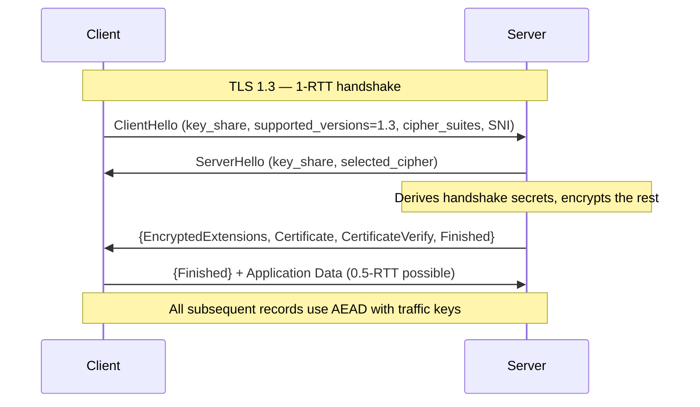
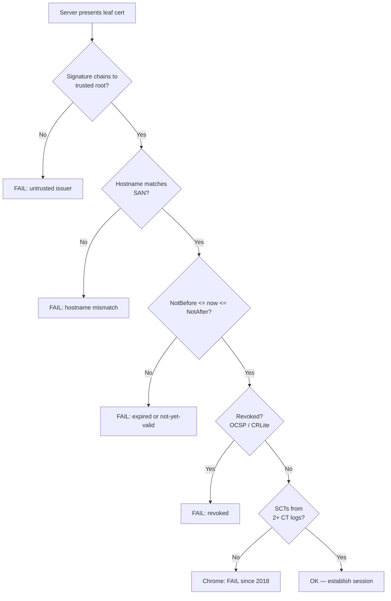
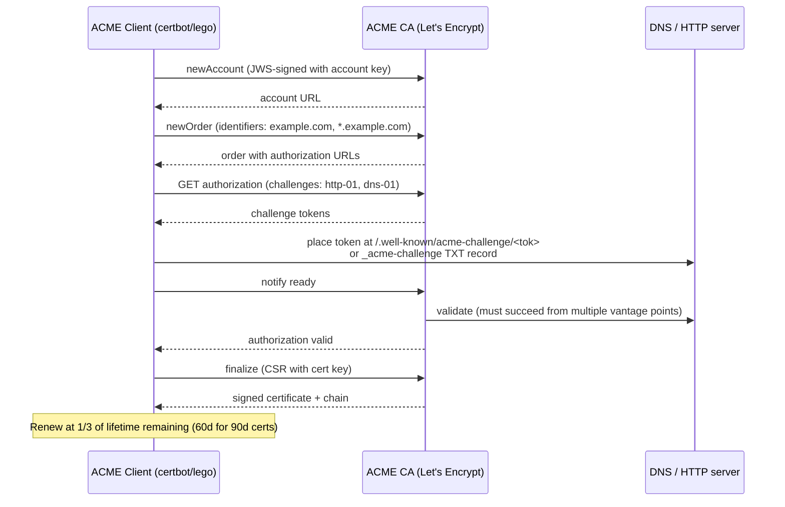

# Encryption in Transit

## Why This Exists

**Problem.** Network paths are hostile. Between your client and your server sit ISPs, transit providers, corporate proxies, captive-portal middleboxes, compromised home routers, and — for internal traffic — anyone who got a foothold in the VPC. Plaintext on any of those hops means **passive eavesdropping** (read credentials, PII, tokens), **active tampering** (inject JavaScript, swap binaries), and **impersonation** (DNS hijack + plaintext = full takeover). The Snowden disclosures (2013) and the 2010 Firesheep demo made this concrete: "internal" networks are not safe, and "we're behind a load balancer" is not a security model.

**Key insight.** TLS gives you three things, and you need all three: **confidentiality** (AEAD ciphers), **integrity** (MAC over the record), and **authentication** (X.509 certificate chain rooted in a trust store the peer accepts). Drop authentication and you have encrypted traffic to the attacker. Drop integrity and active attackers can flip bits. The whole point of TLS 1.3 (RFC 8446) was to remove the ways operators kept getting these wrong in TLS 1.2.

**Reach for this when:**
- Any traffic crosses a network you don't physically own — including "private" VPCs, VPN tunnels, and service meshes.
- You handle credentials, tokens, PII, payment data, or anything regulated (PCI-DSS, HIPAA, GDPR, SOC 2).
- You're building service-to-service auth and want **cryptographic identity** (mTLS) instead of bearer-token-in-a-header.
- You're shipping a new public endpoint and need a sane default config.

**Don't reach for this when:**
- You need *application-layer* end-to-end encryption (Signal-style, where the server can't read content). TLS terminates at the server. Use libsodium / Noise / MLS for E2EE payloads.
- You need encryption for **data at rest** — that's KMS / envelope encryption, a different skill.
- You're trying to hide *metadata* (who talked to whom). TLS encrypts payloads but SNI, IP, packet sizes, and timing leak. Use Tor / Oblivious HTTP for that.

## Diagrams

### TLS 1.3 handshake (one round trip, vs two for 1.2)



### Certificate chain validation



### ACME certificate issuance (Let's Encrypt)



## Core Patterns

### 1. Sane TLS server config (Nginx, modern profile)

The Mozilla SSL Configuration Generator is the canonical source. Don't roll your own cipher list.

```nginx
# /etc/nginx/conf.d/tls.conf — Mozilla "intermediate" profile, 2024
server {
    listen 443 ssl;
    listen [::]:443 ssl;
    http2 on;
    server_name api.example.com;

    # Certificates: full chain (leaf + intermediates), NOT just the leaf
    ssl_certificate         /etc/letsencrypt/live/api.example.com/fullchain.pem;
    ssl_certificate_key     /etc/letsencrypt/live/api.example.com/privkey.pem;

    # TLS 1.3 + 1.2 only. 1.0/1.1 are deprecated (RFC 8996, 2021).
    ssl_protocols           TLSv1.2 TLSv1.3;

    # 1.3 picks its own ciphers; this list applies to 1.2 fallback.
    ssl_ciphers             ECDHE-ECDSA-AES128-GCM-SHA256:ECDHE-RSA-AES128-GCM-SHA256:ECDHE-ECDSA-AES256-GCM-SHA384:ECDHE-RSA-AES256-GCM-SHA384:ECDHE-ECDSA-CHACHA20-POLY1305:ECDHE-RSA-CHACHA20-POLY1305;
    ssl_prefer_server_ciphers off;  # client knows its CPU better (ChaCha20 on mobile, AES-NI on desktop)

    # Session resumption — reduces handshake cost on reconnect.
    # Tickets: stateless, but rotating keys is YOUR job (see pitfalls).
    ssl_session_cache       shared:SSL:50m;   # ~200k sessions
    ssl_session_timeout     1d;
    ssl_session_tickets     on;

    # OCSP stapling — server fetches OCSP response and includes it,
    # so clients don't leak browsing history to the CA.
    ssl_stapling            on;
    ssl_stapling_verify     on;
    resolver                1.1.1.1 8.8.8.8 valid=300s;
    resolver_timeout        5s;

    # HSTS — tell browsers "always HTTPS for the next 2 years".
    # Add `preload` only after you've submitted to hstspreload.org and
    # are SURE you'll never need plaintext on this name or any subdomain.
    add_header Strict-Transport-Security "max-age=63072000; includeSubDomains; preload" always;

    # Don't leak that you run nginx version X
    server_tokens off;
}

# Plaintext listener exists only to redirect.
server {
    listen 80;
    listen [::]:80;
    server_name api.example.com;
    return 301 https://$host$request_uri;
}
```

### 2. ACME automation with `lego` (DNS-01 wildcard)

HTTP-01 doesn't work for wildcards (`*.example.com`) and breaks behind some CDNs. DNS-01 needs an API token for your DNS provider but works everywhere.

```bash
#!/usr/bin/env bash
# /opt/certs/renew.sh — runs daily via systemd timer
set -euo pipefail

LEGO_HOME=/var/lib/lego
DOMAINS="example.com,*.example.com,*.api.example.com"
EMAIL="ops@example.com"

# Renew if cert has < 30 days left. Lego is a no-op when not due.
lego --path "$LEGO_HOME" \
     --email "$EMAIL" \
     --dns route53 \
     --domains "${DOMAINS//,/ --domains }" \
     --accept-tos \
     renew --days 30 --reuse-key=false

# Atomic deploy: copy to staging, fsync, rename.
install -m 0644 -o nginx -g nginx \
    "$LEGO_HOME/certificates/example.com.crt" \
    /etc/nginx/tls/example.com.crt.new
install -m 0600 -o nginx -g nginx \
    "$LEGO_HOME/certificates/example.com.key" \
    /etc/nginx/tls/example.com.key.new

mv /etc/nginx/tls/example.com.crt.new /etc/nginx/tls/example.com.crt
mv /etc/nginx/tls/example.com.key.new /etc/nginx/tls/example.com.key

# Reload (NOT restart — preserves connections).
systemctl reload nginx
```

```ini
# /etc/systemd/system/cert-renew.timer
[Unit]
Description=Renew TLS certificates daily

[Timer]
OnCalendar=*-*-* 03:17:00       # not on the hour — avoid thundering herd
RandomizedDelaySec=1h
Persistent=true

[Install]
WantedBy=timers.target
```

**Renewal cadence.** Let's Encrypt issues 90-day certs and recommends renewing at 60 days remaining. New short-lived cert profiles (6-day, 7-day) are coming — ACME ARI (RFC 9773) tells clients exactly when to renew. **Monitor expiry as a SLI**, not just a cron success signal: a script that exits 0 because "nothing to do" while the cert silently approaches expiry has caused more outages than failed renewals.

### 3. mTLS for service-to-service auth (Go)

Bearer tokens in `Authorization` headers leak in logs, can be replayed, and don't bind to a specific connection. mTLS gives every service a cryptographic identity, and the identity is checked on **every** TCP connection, not per-request.

```go
// service-a calls service-b with mTLS
package main

import (
    "crypto/tls"
    "crypto/x509"
    "fmt"
    "net/http"
    "os"
    "time"
)

func mTLSClient(caFile, certFile, keyFile string) (*http.Client, error) {
    // Load OUR identity (cert + key)
    cert, err := tls.LoadX509KeyPair(certFile, keyFile)
    if err != nil {
        return nil, fmt.Errorf("load client cert: %w", err)
    }

    // Load the CA(s) that we trust to sign PEER certs.
    // This is your internal CA, NOT the public WebPKI bundle.
    caBytes, err := os.ReadFile(caFile)
    if err != nil {
        return nil, fmt.Errorf("read ca: %w", err)
    }
    pool := x509.NewCertPool()
    if !pool.AppendCertsFromPEM(caBytes) {
        return nil, fmt.Errorf("ca file contained no valid certs")
    }

    tlsCfg := &tls.Config{
        Certificates: []tls.Certificate{cert},
        RootCAs:      pool,
        MinVersion:   tls.VersionTLS13,            // no excuse internally
        // ServerName MUST be set or ServerName must match the cert SAN.
        // Don't set InsecureSkipVerify — it disables the whole point of mTLS.
    }

    return &http.Client{
        Timeout: 5 * time.Second,
        Transport: &http.Transport{
            TLSClientConfig:     tlsCfg,
            ForceAttemptHTTP2:   true,
            MaxIdleConnsPerHost: 100,              // amortize handshake
            IdleConnTimeout:     90 * time.Second,
        },
    }, nil
}

func mTLSServer(caFile, certFile, keyFile string) *http.Server {
    cert, _ := tls.LoadX509KeyPair(certFile, keyFile)
    caBytes, _ := os.ReadFile(caFile)
    pool := x509.NewCertPool()
    pool.AppendCertsFromPEM(caBytes)

    return &http.Server{
        Addr: ":8443",
        TLSConfig: &tls.Config{
            Certificates: []tls.Certificate{cert},
            ClientCAs:    pool,
            // RequireAndVerifyClientCert is what makes this MUTUAL.
            // VerifyClientCertIfGiven would let unauth'd clients in!
            ClientAuth:   tls.RequireAndVerifyClientCert,
            MinVersion:   tls.VersionTLS13,
        },
        Handler: http.HandlerFunc(func(w http.ResponseWriter, r *http.Request) {
            // r.TLS.PeerCertificates[0] is the AUTHENTICATED client identity.
            // Use SPIFFE URI SAN, CN, or email SAN as the principal.
            peer := r.TLS.PeerCertificates[0]
            spiffeID := ""
            for _, uri := range peer.URIs {
                if uri.Scheme == "spiffe" {
                    spiffeID = uri.String()
                    break
                }
            }
            fmt.Fprintf(w, "hello %s\n", spiffeID)
        }),
    }
}
```

**Why SPIFFE.** SPIFFE (Secure Production Identity Framework For Everyone) standardizes the SAN format as `spiffe://trust-domain/workload`, so identity is parseable across languages and meshes (Istio, Linkerd, SPIRE, Consul Connect all interop). See [spiffe.io](https://spiffe.io/).

### 4. Verifying CT logs for a hostname

Certificate Transparency (RFC 6962) makes mis-issuance detectable. Every public CA-issued cert appears in append-only Merkle-tree logs. You should monitor logs for **certificates issued for your domain that you didn't request** — that's how you catch a CA being tricked or compromised.

```python
# Query crt.sh (which scrapes the CT logs) for any certs ever issued for a domain.
# Run this in CI to alert if a new SAN appears that isn't in your inventory.
import json
import sys
import urllib.request

def certs_for(domain: str) -> list[dict]:
    url = f"https://crt.sh/?q={domain}&output=json"
    with urllib.request.urlopen(url, timeout=30) as r:
        return json.loads(r.read())

def unexpected_sans(domain: str, expected: set[str]) -> set[str]:
    seen = set()
    for entry in certs_for(domain):
        for name in entry.get("name_value", "").split("\n"):
            seen.add(name.strip().lower())
    return seen - expected

if __name__ == "__main__":
    expected = {
        "example.com", "*.example.com",
        "api.example.com", "www.example.com",
    }
    surprise = unexpected_sans("example.com", expected)
    if surprise:
        print(f"ALERT: unexpected certs for {sorted(surprise)}", file=sys.stderr)
        sys.exit(1)
```

For production use a dedicated monitor (Cert Spotter, Facebook's CT monitor, sslmate). Set up CAA DNS records to **restrict which CAs may issue for your domain**:

```
example.com.  CAA  0 issue "letsencrypt.org"
example.com.  CAA  0 issue "amazontrust.com"
example.com.  CAA  0 iodef "mailto:security@example.com"
```

### 5. HSTS — committing to HTTPS forever

```http
Strict-Transport-Security: max-age=63072000; includeSubDomains; preload
```

- `max-age=63072000` — 2 years. Browsers refuse to talk plaintext to this host for that long, even if the user types `http://`.
- `includeSubDomains` — applies to every subdomain. Once set, **you cannot have a plaintext subdomain** for the duration. Beware: `dev.example.com`, `legacy-api.example.com`, etc.
- `preload` — opt into the browser's hard-coded HSTS list (submit at [hstspreload.org](https://hstspreload.org/)). **Removal is not guaranteed and takes weeks to months.** Only preload after you've run `includeSubDomains` for months without issue.

Without HSTS, a user typing `example.com` in the address bar issues plaintext HTTP first; an attacker with on-path access (rogue Wi-Fi, ISP) can SSL-strip — serve plaintext to the browser while proxying to the real server. HSTS closes that window after the first visit; preload closes it for the first visit too.

## Trade-offs

| Benefit | Cost |
|---|---|
| Confidentiality + integrity + authentication on every byte | CPU cost of handshake (~1ms with AES-NI on modern x86) and AEAD; usually negligible since AES-NI / ARMv8 crypto extensions |
| TLS 1.3 1-RTT handshake (vs 2-RTT in 1.2) cuts cold-connect latency in half | Every middlebox you don't control may not understand 1.3; "TLS 1.3 middlebox compatibility mode" exists for a reason |
| 0-RTT resumption for repeat visitors | 0-RTT data is **replayable** — must be idempotent (RFC 8446 §8) |
| Forward secrecy (ECDHE only in 1.3) — past traffic stays safe even if private key leaks | Can't passively decrypt your own traffic for debugging; need eBPF / SSLKEYLOGFILE / decrypting proxy |
| ACME + Let's Encrypt → free, automated, ubiquitous certs | Domain validation only (no EV); rate limits (50 certs/registered-domain/week); your renewal pipeline is now critical infra |
| mTLS gives connection-bound cryptographic identity | Cert lifecycle for every workload; rotation, revocation, bootstrap-trust problem; bad libraries make it a footgun |
| HSTS prevents SSL-strip after first visit | A misconfigured cert is now an outage you can't fix by serving HTTP; `includeSubDomains` is a long-term commitment |
| Session resumption avoids full handshake on reconnect | Ticket keys are long-term secrets; if you don't rotate them, you break forward secrecy |
| CT logs catch CA mis-issuance | Logs are public — you cannot use private hostnames in public certs without revealing them. Use a private CA for internal names. |

## Common Pitfalls

- **Serving only the leaf cert, not the chain.** The browser bundles roots, not intermediates. Without `fullchain.pem` you'll see "incomplete chain" — works in Chrome (it caches intermediates) but breaks in `curl`, Python `requests`, and many mobile clients. Test with `openssl s_client -connect host:443 -servername host -showcerts`.

- **`InsecureSkipVerify` / `CURLOPT_SSL_VERIFYPEER=0` left in production.** A junior dev added it to "make the test pass" against a self-signed staging cert, code shipped, prod now accepts any cert. Grep your codebase. Make it a CI failure.

- **Hostname not validated.** Many languages let you have a cert *and* skip hostname check. `tls.Config{ServerName: ""}` in Go with a custom Dial that doesn't pass the hostname. The cert chains correctly to a root, attacker presents `attacker.com`'s real Let's Encrypt cert, you accept it.

- **TLS ticket keys never rotated.** Nginx/HAProxy generate a random ticket key at startup. If the process never restarts, that key encrypts every resumption ticket forever; one memory disclosure → all past sessions decryptable. Rotate ticket keys hourly, distribute across LB fleet via a shared secret store.

- **HSTS `includeSubDomains` set before all subdomains were HTTPS.** `internal-tools.example.com` was HTTP-only, set HSTS on the apex with subdomains, internal tools instantly inaccessible to anyone who'd visited the apex. Roll out HSTS in stages: short max-age first (300s), confirm nothing breaks, then ramp up.

- **Preload list submission is irreversible-ish.** Once on the list, removal request is processed but it takes weeks for browser updates to ship; users on old browsers wait years. **Don't preload domains you might want to sell or reassign.**

- **OCSP stapling without `ssl_stapling_verify on`.** Server fetches an OCSP response, doesn't verify it, attacker replaces it with a "good" response for a revoked cert. Always verify staples; better, use OCSP Must-Staple cert extension so clients refuse a cert without a valid stapled response.

- **0-RTT replay.** TLS 1.3 0-RTT data has no anti-replay guarantee — RFC 8446 §8 explicitly warns: "early data has weaker security properties than other kinds of TLS data". Don't accept 0-RTT for non-idempotent endpoints. Cloudflare wrote a [postmortem](https://blog.cloudflare.com/introducing-0-rtt/) on this.

- **CT log monitoring set up but no alerting.** A monitor that emails an unread distribution list when a rogue cert appears is not security; it's CYA. Page someone.

- **CA bundle pinned to a single root that rotates.** Root CAs do change (Let's Encrypt's ISRG Root X1 vs old DST Root X3 transition in Sept 2021 broke a lot of old Android devices). Don't pin roots in code. If you must pin, pin SPKI of the leaf or pin to a CA you control (private PKI for mTLS).

- **Self-signed CAs distributed via "scp this PEM to each box".** No rotation story, no revocation, no audit trail. Use SPIRE, HashiCorp Vault PKI engine, AWS Private CA, or `step-ca` from Smallstep. Short-lived certs (hours to days) make revocation a non-problem.

- **TLS terminated at the LB, plaintext to the backend.** Common, defensible if backends are in the same VPC and you trust the network. **Indefensible** if you're processing PCI / HIPAA data — auditors will fail you. Either re-encrypt LB→backend, or use a service mesh sidecar.

- **Forgetting that SNI is in the clear.** TLS 1.3 still sends the hostname in plaintext during ClientHello. ECH (Encrypted Client Hello, RFC 9460 + draft-ietf-tls-esni) fixes this but is not yet ubiquitous. If hostname leakage matters, you need ECH-capable client + server (Cloudflare supports it).

## Decision Table

| Situation | Use this | Not this | Why |
|---|---|---|---|
| Public-facing HTTPS website | Let's Encrypt + ACME (DNS-01 or HTTP-01), TLS 1.3 + 1.2 | EV cert from a paid CA | EV bar didn't move attackers; browsers stopped showing the green bar in 2019 |
| Wildcard cert needed | ACME DNS-01 | ACME HTTP-01 | HTTP-01 cannot validate wildcards |
| Service-to-service inside one VPC | mTLS via service mesh (Istio/Linkerd) or SPIRE-issued certs | Plaintext + "we trust the VPC" | Lateral movement within VPCs is normal in incident retros; assume breach |
| Service-to-service across VPCs / clouds | mTLS, full stop | VPN tunnel + plaintext | VPN encrypts the wire but doesn't authenticate the service |
| Mobile API client → server | TLS 1.3 + cert pinning (SPKI pin, with backup pin) | Bare cert validation only | Hostile networks (carrier portals) MITM aggressively; pin to your CA, not a leaf |
| Internal admin tool, < 10 users | Same TLS as prod, no special case | "It's behind the VPN, who cares" | VPN endpoints get phished; defense in depth |
| Need to debug TLS traffic in dev | `SSLKEYLOGFILE` env var → Wireshark | Disabling TLS | Wireshark with the keylog file decrypts in place; works with curl, Chrome, Firefox |
| Long-lived, highly valuable cert (root CA) | HSM-backed key, offline, multi-person ceremony | File on a server | Root key compromise = trust collapse; cf. DigiNotar 2011 |
| Renewing certs at scale (>1000 hosts) | ACME with caching CA, or short-lived (hours) certs | Shared 2-year wildcard | Short-lived means revocation = "wait an hour"; long-lived = "panic" |
| Need to revoke a leaked key fast | Re-issue + rely on cert lifetime expiry; CRLite if Firefox-targeted | OCSP / CRL alone | OCSP soft-fail is the default — most clients ignore "OCSP unreachable" |
| Considering TLS 1.2 vs 1.3 | TLS 1.3, with 1.2 fallback only if you have legacy clients (Java 7, Android < 5) | TLS 1.2 only | 1.3 is faster, simpler, removes every footgun cipher (RC4, CBC, RSA key exchange, renegotiation) |

## References

- IETF — RFC 8446: The Transport Layer Security (TLS) Protocol Version 1.3 — https://datatracker.ietf.org/doc/html/rfc8446
- IETF — RFC 8996: Deprecating TLS 1.0 and TLS 1.1 — https://datatracker.ietf.org/doc/html/rfc8996
- IETF — RFC 6962: Certificate Transparency — https://datatracker.ietf.org/doc/html/rfc6962
- IETF — RFC 9162: Certificate Transparency Version 2.0 — https://datatracker.ietf.org/doc/html/rfc9162
- IETF — RFC 8555: Automatic Certificate Management Environment (ACME) — https://datatracker.ietf.org/doc/html/rfc8555
- IETF — RFC 6797: HTTP Strict Transport Security (HSTS) — https://datatracker.ietf.org/doc/html/rfc6797
- IETF — RFC 8879: TLS Certificate Compression — https://datatracker.ietf.org/doc/html/rfc8879
- IETF — RFC 8446 §8 (0-RTT and Anti-Replay) — https://datatracker.ietf.org/doc/html/rfc8446#section-8
- Mozilla — Server Side TLS Configuration Guide — https://wiki.mozilla.org/Security/Server_Side_TLS
- Mozilla — SSL Configuration Generator — https://ssl-config.mozilla.org/
- Let's Encrypt — How It Works — https://letsencrypt.org/how-it-works/
- Let's Encrypt — Chain of Trust (X1/X2 transition postmortem context) — https://letsencrypt.org/certificates/
- Cloudflare — Introducing 0-RTT (and replay risk) — https://blog.cloudflare.com/introducing-0-rtt/
- Cloudflare — A Detailed Look at RFC 8446 (a.k.a. TLS 1.3) — https://blog.cloudflare.com/rfc-8446-aka-tls-1-3/
- Google — Building Secure and Reliable Systems, ch. 6 (Design for Understandability) and ch. 8 (Design for Resilience) — https://sre.google/books/building-secure-reliable-systems/
- Google SRE Workbook — Managing Load (relevant for handshake/cert renewal capacity) — https://sre.google/workbook/managing-load/
- AWS Builders' Library — How AWS Builds Trust in Its Services — https://aws.amazon.com/builders-library/
- AWS — Private Certificate Authority User Guide — https://docs.aws.amazon.com/privateca/latest/userguide/
- SPIFFE / SPIRE — https://spiffe.io/docs/
- Smallstep — Everything you should know about certificates and PKI — https://smallstep.com/blog/everything-pki/
- OWASP — Transport Layer Security Cheat Sheet — https://cheatsheetseries.owasp.org/cheatsheets/Transport_Layer_Security_Cheat_Sheet.html
- Adam Langley — ImperialViolet (canonical TLS implementer commentary) — https://www.imperialviolet.org/
- DigiCert / Chromium — Certificate Transparency policy — https://googlechrome.github.io/CertificateTransparency/ct_policy.html
- DDIA (Kleppmann, 2017), ch. 9 — Consistency and Consensus, "Trust, but verify" sidebar on cryptographic primitives in distributed systems
- BetterTLS test suite (Netflix) — https://bettertls.com/
- Bulletproof TLS and PKI (Ivan Ristic, 2nd ed., 2022) — definitive practitioner reference

## See Also

- ../authentication-authorization/ — how mTLS identity feeds into authz decisions
- ../secrets-management/ — where private keys live, KMS / Vault / SPIRE
- ../encryption-at-rest/ — the other half: KMS, envelope encryption, disk encryption
- ../zero-trust-networking/ — mTLS as the cornerstone of BeyondCorp-style architectures
- ../security-headers/ — HSTS belongs here too; pairs with CSP, X-Frame-Options
- ../public-key-infrastructure/ — building and operating a private CA
- ../certificate-transparency/ — deep dive on CT logs, monitors, and policy
- ../service-mesh/ — Istio / Linkerd / Consul Connect operationalizing mTLS at scale
- ../api-gateway-patterns/ — TLS termination strategies at the edge
- ../incident-response/ — what to do when a private key leaks
- ../compliance-pci-hipaa/ — auditor-facing requirements for in-transit encryption
- ../load-balancing/ — TLS termination vs. passthrough trade-offs
