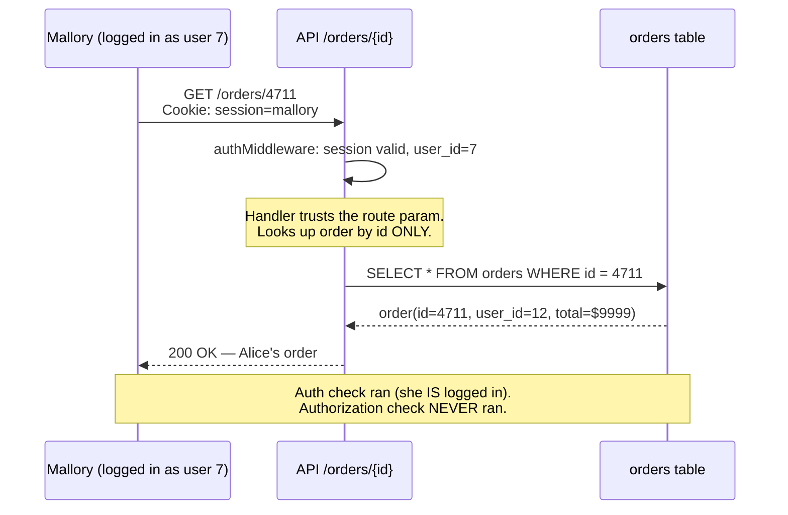
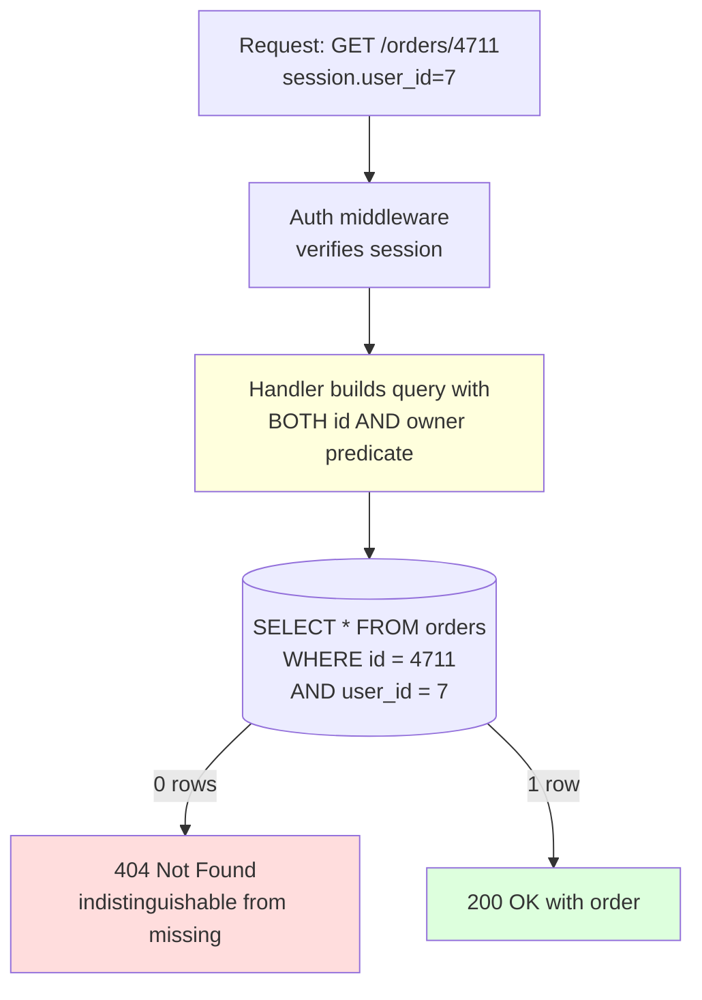

# IDOR — Insecure Direct Object Reference

## Why This Exists

**Problem.** Most CRUD endpoints accept an object identifier (`/orders/4711`, `?invoice_id=abc`, `userId` in a JWT body claim) and return the object if it exists. **Authentication** answers "who are you?" — and most teams get that right with sessions, JWTs, OIDC. **Authorization** answers "are you allowed to touch *this specific row*?" — and most teams get this catastrophically wrong, because they enforce it at the *route* (is the caller logged in?) instead of at the *data layer* (does this row belong to the caller's tenant/team/self?).

**Key insight.** *Authorization is a data-layer concern, not a routing concern.* Every query that reads or writes a domain object MUST include the caller's identity (or a derived scope) as a `WHERE` clause / filter / predicate. Auth middleware that runs before the handler can never enforce this — by definition it doesn't know which row you're about to load. Object-level access control belongs *next to the data access*, ideally inside the repository layer or behind a policy engine that the query cannot bypass.

**Bonus insight.** Opaque IDs (UUIDv4, ULIDs, signed identifiers) are *defense in depth*, **not** authorization. A leaked UUID is just as dangerous as a leaked sequential ID — the only thing UUIDs prevent is *trivial enumeration*. Code that says "we use UUIDs so IDOR isn't possible" is broken. The OWASP IDOR cheat sheet is explicit on this.

**Reach for this when:**
- Designing or reviewing any API/handler that takes an `id`, `slug`, `key`, `token`, or path parameter pointing to a domain object.
- A pentest or bug bounty report mentions "BOLA", "horizontal privilege escalation", "missing object-level authz", or "tenant data leak".
- Onboarding a new ORM/repository pattern — bake the authorization predicate in from day one.
- You're moving from a single-tenant to multi-tenant model and need to retrofit `tenant_id` everywhere.

**Don't reach for this when:**
- The endpoint genuinely returns public data (e.g. a public blog post, a public NPM package metadata route). But be honest about "public" — if it can include draft posts, paid content, or deleted-but-not-purged rows, it isn't public.
- The concern is *function-level* authorization (admin-only endpoints, role gating). That's a related but separate category — use RBAC/ABAC patterns alongside, not instead of, object-level checks.
- The concern is *vertical* privilege escalation (regular user becomes admin). IDOR is *horizontal* — peer-level access to another peer's data.

## Diagrams

### The classic IDOR



### The fix — enforce at the data layer



Note: return **404**, not 403. A 403 leaks the existence of the row. The OWASP guidance is split here — pick a convention and stick to it for the whole API.

## Core Patterns

### 1. The vulnerable code (what NOT to do)

```python
# Flask + SQLAlchemy — classic IDOR
@app.get("/api/orders/<int:order_id>")
@login_required  # <-- only checks authentication
def get_order(order_id):
    order = Order.query.get(order_id)  # <-- no owner predicate
    if not order:
        return {"error": "not found"}, 404
    return order.to_dict()  # leaks any order to any logged-in user
```

```typescript
// Express + Prisma — same bug, different stack
app.get("/api/orders/:id", requireAuth, async (req, res) => {
  const order = await prisma.order.findUnique({
    where: { id: req.params.id },  // <-- no tenant/user filter
  });
  if (!order) return res.status(404).end();
  res.json(order);  // BOLA
});
```

### 2. Fix at the query — narrow predicate

The minimal correct fix: include the caller's identity as a predicate **in the same query** that loads the object. Never load-then-check.

```python
@app.get("/api/orders/<int:order_id>")
@login_required
def get_order(order_id):
    # Authorization is part of the query. There is no "load then check" race
    # window, no forgotten branch, no log-and-allow accident.
    order = (
        Order.query
        .filter(Order.id == order_id)
        .filter(Order.user_id == current_user.id)  # <-- the predicate
        .first()
    )
    if not order:
        return {"error": "not found"}, 404  # 404, not 403 — don't leak existence
    return order.to_dict()
```

```typescript
const order = await prisma.order.findFirst({
  where: {
    id: req.params.id,
    userId: req.session.userId,  // tenant predicate, baked in
  },
});
if (!order) return res.status(404).end();
```

### 3. Fix at the repository — make it impossible to forget

A predicate you have to remember on every call site is a predicate you'll forget. Push it into a *scoped repository* that takes the caller as a constructor argument, so you cannot construct a query without it.

```python
class OrderRepository:
    """Every query is auto-scoped to the caller. There is no method that
    returns rows the caller doesn't own."""

    def __init__(self, db, caller: User):
        self._db = db
        self._caller = caller

    def _base(self):
        # Single chokepoint. New methods inherit this filter for free.
        return (
            self._db.query(Order)
            .filter(Order.tenant_id == self._caller.tenant_id)
        )

    def get(self, order_id: int) -> Order | None:
        return self._base().filter(Order.id == order_id).first()

    def list_recent(self, limit: int = 20) -> list[Order]:
        return self._base().order_by(Order.created_at.desc()).limit(limit).all()

    def update_status(self, order_id: int, status: str) -> bool:
        # WRITES too — same scope. UPDATE...WHERE returns rows-affected;
        # 0 rows = either missing or not-yours = both look the same to caller.
        rows = (
            self._base()
            .filter(Order.id == order_id)
            .update({"status": status})
        )
        return rows == 1
```

### 4. Fix at the database — Postgres Row-Level Security

When you can't trust every code path (legacy app, many microservices, third-party reporting tools talking directly to Postgres), enforce in the DB itself. RLS is the strongest backstop — it works even if a developer writes a raw `SELECT * FROM orders`.

```sql
-- 1. Tenant isolation column
ALTER TABLE orders ADD COLUMN tenant_id UUID NOT NULL;
CREATE INDEX ON orders (tenant_id, id);

-- 2. Turn on RLS (off by default — you must opt in per table)
ALTER TABLE orders ENABLE ROW LEVEL SECURITY;
ALTER TABLE orders FORCE ROW LEVEL SECURITY;  -- applies to table owner too

-- 3. Policy: only rows whose tenant_id matches the session-scoped GUC
CREATE POLICY tenant_isolation ON orders
    FOR ALL
    USING (tenant_id = current_setting('app.current_tenant')::uuid)
    WITH CHECK (tenant_id = current_setting('app.current_tenant')::uuid);

-- 4. Application sets the GUC at the start of every request/transaction
-- (using SET LOCAL so it dies with the transaction; never SET without LOCAL
-- on a connection-pooled system or you'll leak tenants across requests)
BEGIN;
SET LOCAL app.current_tenant = '7c3b...e1';
SELECT * FROM orders WHERE id = 4711;  -- RLS appends tenant_id predicate automatically
COMMIT;
```

**Watch out:** with PgBouncer in transaction-pool mode, `SET LOCAL` works because it's transaction-scoped; `SET` without `LOCAL` will leak across customers and is a CVE waiting to happen.

### 5. Fix with a policy engine — for complex rules

When ownership isn't a single column ("project members can read; project admins can write; org admins can read all projects in their org; auditors get read-only across all orgs but only during business hours"), embed a policy engine. OPA/Rego, Cedar, or Oso let you co-locate rules outside the data access code.

```rego
# OPA / Rego — policies/orders.rego
package orders

default allow := false

# Owners can do anything to their own orders.
allow if {
    input.action in {"read", "update", "delete"}
    input.resource.user_id == input.subject.id
}

# Org admins can read any order in their org.
allow if {
    input.action == "read"
    input.subject.role == "org_admin"
    input.resource.org_id == input.subject.org_id
}

# Auditors can read during business hours only.
allow if {
    input.action == "read"
    input.subject.role == "auditor"
    business_hours
}

business_hours if {
    h := time.clock(time.now_ns())[0]
    h >= 9
    h < 17
}
```

```python
# Call site — every read goes through the policy
def get_order(order_id, caller):
    order = db.find_order(order_id)
    if not order:
        return None
    decision = opa.evaluate("orders.allow", {
        "subject": caller.to_dict(),
        "action": "read",
        "resource": order.to_dict(),
    })
    if not decision:
        return None  # 404, not 403
    return order
```

### 6. Opaque IDs — defense in depth, NOT authorization

Use UUIDv4, ULIDs, or HMAC-signed IDs to prevent *enumeration*. This stops scripted scraping but does **nothing** to stop a leaked-ID attack. Always combine with #1–#5.

```python
# Signed ID — verifies ID hasn't been tampered with AND ties it to the user
import hmac, base64

def sign_id(raw_id: int, user_id: int, secret: bytes) -> str:
    payload = f"{raw_id}:{user_id}".encode()
    sig = hmac.new(secret, payload, "sha256").digest()[:8]
    return base64.urlsafe_b64encode(payload + b"|" + sig).decode().rstrip("=")

def verify_id(token: str, user_id: int, secret: bytes) -> int | None:
    # Returns the raw id ONLY if the token was signed for this user.
    # Even if the token leaks, attacker can't forge one for their own session.
    raw = base64.urlsafe_b64decode(token + "==")
    payload, sig = raw.rsplit(b"|", 1)
    expected = hmac.new(secret, payload, "sha256").digest()[:8]
    if not hmac.compare_digest(sig, expected):
        return None
    rid, uid = payload.decode().split(":")
    if int(uid) != user_id:
        return None
    return int(rid)
```

This is *useful* (it makes share-link leaks less catastrophic) but is **not a substitute** for a `WHERE user_id = ?` predicate. A capability URL pattern (signed token with embedded scope, no separate auth) is a related-but-distinct design — appropriate for one-time download links, not for normal CRUD.

### 7. Mass-assignment — the IDOR you didn't see

IDOR isn't only on read. It hides in update endpoints that accept the whole object:

```typescript
// VULNERABLE — client can write user_id, role, tenant_id, anything
app.patch("/api/orders/:id", requireAuth, async (req, res) => {
  await prisma.order.update({
    where: { id: req.params.id },
    data: req.body,  // <-- mass assignment + IDOR combined
  });
});

// FIXED — explicit allowlist of mutable fields, and scoped predicate
const UpdateSchema = z.object({
  notes: z.string().max(500).optional(),
  shippingAddress: z.string().optional(),
});
app.patch("/api/orders/:id", requireAuth, async (req, res) => {
  const data = UpdateSchema.parse(req.body);
  const result = await prisma.order.updateMany({
    where: { id: req.params.id, userId: req.session.userId },
    data,
  });
  if (result.count === 0) return res.status(404).end();
  res.status(204).end();
});
```

## Trade-offs

| Benefit | Cost |
|---|---|
| Per-query predicate (#2) is dead simple — no new infra | Easy to forget on a new endpoint; relies on every developer remembering forever |
| Scoped repository (#3) makes the right thing the easy thing | Requires discipline to never use the unscoped DB session directly; need linting/code-review to enforce |
| RLS (#4) is enforced even on raw SQL, ad-hoc reports, BI tools | Harder to debug ("why is my query returning 0 rows?"); GUC-setting bugs leak across tenants in connection pools; not all ORMs play well |
| Policy engine (#6) centralizes complex multi-actor rules | Extra hop per check (latency); rule language to learn; eventual consistency between policy bundle and app code |
| Opaque/signed IDs reduce enumeration attacks | Real cost: IDs no longer human-debuggable in logs; share-link UX gets uglier; **gives a false sense of security** if used alone |
| Returning 404 instead of 403 hides existence | Confuses legitimate users who hit a permissions wall; harder to surface "ask the owner for access" UX |
| Defense in depth (predicate + RLS + policy) | 3 places to change when ownership rules evolve; performance overhead from layered checks |

## Common Pitfalls

- **"We use UUIDs, so IDOR isn't possible."** UUIDs only prevent enumeration. The Snapchat 2014 leak, Parler 2021, and countless HackerOne reports are all leaked-UUID attacks. *(See OWASP IDOR cheat sheet, "Mitigation".)*
- **Auth middleware as authorization.** The middleware checks "valid session" and the handler trusts the path param. This is the #1 finding in API pentests; it's the OWASP API Security Top 10 #1: *Broken Object Level Authorization*.
- **Load-then-check race.** `o = repo.get(id); if o.user_id != caller.id: deny()` looks fine but: (a) you've already paid the DB cost on miss, (b) a sloppy refactor drops the `if`, (c) side-effects (audit logs, lazy-loaded relations) may have already fired. Always make the predicate part of the query.
- **GraphQL nested resolvers.** Top-level resolver checks `viewer can read project`, but the nested `project.tasks[i].assignee.email` resolver doesn't re-check. Every resolver that returns a domain object must enforce — the OWASP API Top 10 explicitly calls out GraphQL.
- **Bulk endpoints.** `POST /api/orders/bulk-delete {ids: [1,2,3,...]}` — and you delete by ID without filter. Either filter inside the `WHERE id IN (...) AND user_id = ?`, or reject the request as you can't enforce per-row in a single query.
- **Indirect references via search.** `GET /search?q=email%3Avictim%40foo.com` — the search endpoint doesn't take an explicit ID, but it returns IDs and metadata of objects you don't own. Search results need the same predicate as direct gets.
- **Soft-deleted rows.** `WHERE id = ? AND user_id = ?` is correct; but if you forget `AND deleted_at IS NULL`, you may return stale data the user thinks is gone. Conversely, an admin "trash" view that omits the user predicate to support a "restore" feature accidentally restores other users' data.
- **Webhooks and signed-URL callbacks.** A webhook payload contains an `order_id`. The handler trusts it because the signature checks out — but the signature only proves *the platform sent it*, not *who it was sent on behalf of*. Always re-derive scope from the trusted side (the integration row, not the webhook body).
- **Admin impersonation.** Support staff can "view as" a customer. The audit log records `acting_as=alice` but the code path uses the support agent's own user_id for queries — they see *all* customers, not just Alice's data. Impersonation must swap the principal in the *query scope*, not just in the audit field.
- **Connection-pooled `SET` for RLS.** With PgBouncer transaction pooling, `SET app.current_tenant = ...` (without `LOCAL`) sets the value on the underlying connection and the next checkout sees the previous tenant. Use `SET LOCAL` inside an explicit transaction. (See PostgreSQL docs on RLS + connection pooling.)
- **PATCH with full object.** Mass assignment + IDOR in one request: `PATCH /users/me {role: "admin", tenant_id: "victim"}`. Always validate against an explicit DTO/schema; never spread `req.body` into the ORM.
- **403 vs 404 inconsistency.** The same API returns 403 for "exists, not yours" on `/orders/{id}` but 404 on `/invoices/{id}`. Attackers binary-search the existence of objects. Pick one and apply globally; the OWASP API guide leans toward 404 for object-level checks.

## Decision Table

| Situation | Use this | Avoid this |
|---|---|---|
| Single team, monolith, single language, ORM in use | Scoped repository (#3) + per-query predicate (#2) | Adding RLS just because; over-engineering for a 3-person team |
| Multi-tenant SaaS, many services, shared Postgres | Postgres RLS (#4) **as the backstop** + per-query predicate at app | Trusting only the app layer; one rogue migration script will exfiltrate |
| Complex rules (roles, time, project membership, delegation) | OPA/Cedar/Oso policy engine (#5) co-located with repo | Hardcoding into `if/elif` chains; they decay into bugs |
| Public marketplace listings, blog posts | No object-level check needed; document this explicitly | Adding `WHERE user_id = ?` and breaking discoverability |
| Sharing/collaboration ("share this doc") | Permissions table: `(resource_id, principal_id, role)` joined into the predicate | Flag column on the resource (`is_shared=true`) — too coarse, leaks to all |
| One-time download links, email magic links | Capability URL: HMAC-signed token with embedded scope + expiry + single-use | Exposing the raw resource ID and "trusting the link is hard to guess" |
| Admin/support read-only access | Impersonation: swap principal in scope, audit acting-as | Adding `OR caller.is_admin` everywhere — invariably ends in privilege creep |
| Bulk read/write | `WHERE id IN (...) AND owner = ?` and check `rows_affected == len(ids)` | Iterating and trusting any IDs that didn't 404 |
| Reporting / BI / Looker direct DB access | RLS (#4) — the only way; query authors will skip predicates | Hoping the dashboard author "knows about tenant_id" |
| GraphQL | Authorization at every resolver returning domain objects; consider per-field directives | Top-level only — nested traversal will leak |

## References

- OWASP — *Insecure Direct Object Reference Prevention Cheat Sheet* — https://cheatsheetseries.owasp.org/cheatsheets/Insecure_Direct_Object_Reference_Prevention_Cheat_Sheet.html
- OWASP — *API Security Top 10 — API1:2023 Broken Object Level Authorization* — https://owasp.org/API-Security/editions/2023/en/0xa1-broken-object-level-authorization/
- OWASP — *Authorization Cheat Sheet* — https://cheatsheetseries.owasp.org/cheatsheets/Authorization_Cheat_Sheet.html
- OWASP — *Access Control Cheat Sheet* — https://cheatsheetseries.owasp.org/cheatsheets/Access_Control_Cheat_Sheet.html
- OWASP — *Mass Assignment Cheat Sheet* — https://cheatsheetseries.owasp.org/cheatsheets/Mass_Assignment_Cheat_Sheet.html
- PortSwigger Web Security Academy — *Access control vulnerabilities and privilege escalation* — https://portswigger.net/web-security/access-control
- PostgreSQL Documentation — *Row Security Policies* — https://www.postgresql.org/docs/current/ddl-rowsecurity.html
- Google — *Building Secure and Reliable Systems*, ch. 5 "Design for Least Privilege" — https://sre.google/books/building-secure-reliable-systems/chapters/chapter-5/
- Google — *Building Secure and Reliable Systems*, ch. 6 "Design for Understandability" (auth invariants) — https://sre.google/books/building-secure-reliable-systems/chapters/chapter-6/
- Open Policy Agent — *Policy Reference & integration patterns* — https://www.openpolicyagent.org/docs/latest/
- AWS — *Cedar Policy Language* — https://docs.cedarpolicy.com/
- Oso — *Authorization Academy: Authorization Patterns* — https://www.osohq.com/academy
- MITRE CWE-639 — *Authorization Bypass Through User-Controlled Key* — https://cwe.mitre.org/data/definitions/639.html
- MITRE CWE-284 — *Improper Access Control* — https://cwe.mitre.org/data/definitions/284.html
- Auth0 — *On the nature of OAuth scopes vs application authorization* — https://auth0.com/blog/on-the-nature-of-oauth2-scopes/
- Kleppmann — *Designing Data-Intensive Applications*, ch. 5 (replication and per-tenant invariants) and ch. 12 (the future of data systems — end-to-end argument applied to authz)
- Helland, Pat — *Data on the Outside vs. Data on the Inside* — https://www.cidrdb.org/cidr2005/papers/P12.pdf (relevant for why opaque IDs that cross trust boundaries need re-validation)

## See Also

- `../authn/` — authentication primitives (sessions, JWT, OIDC) — *who* the caller is
- `../multi-tenancy/` — tenant isolation strategies (shared DB, schema-per-tenant, DB-per-tenant) and how RLS fits
- `../secrets-management/` — for the HMAC keys backing signed IDs and capability URLs
- `../audit-logging/` — record `principal`, `acting_as`, `resource_id`, and `decision` for every authz check
- `../threat-modeling/` — STRIDE / LINDDUN frameworks where IDOR shows up as Information Disclosure + Tampering
