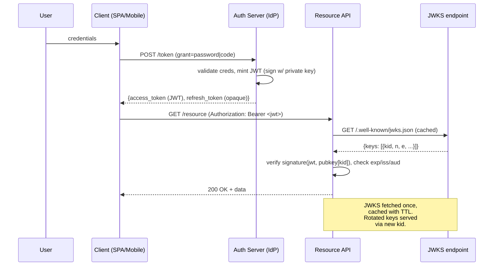
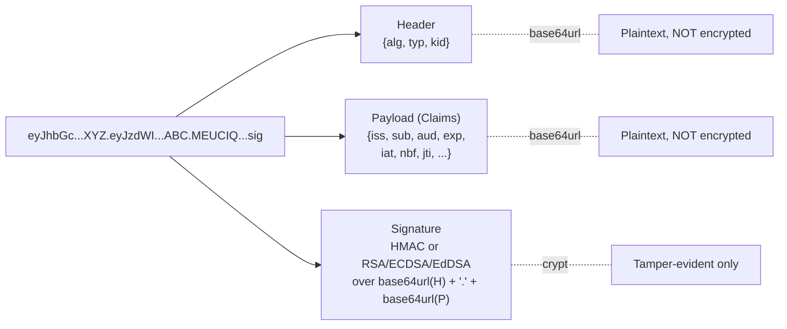
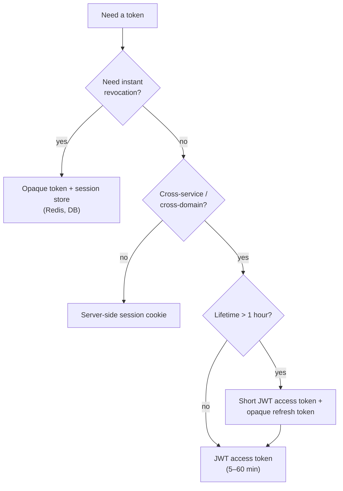

# JWT (JSON Web Tokens)

## Why This Exists

**Problem.** Server-side sessions don't scale horizontally without sticky load balancing or a shared session store. Every request becomes a database lookup. Cross-service auth (microservices, mobile-to-API, API gateways) needs a token a service can verify *without* calling back to an identity provider.

**Key insight.** A signed, self-contained token lets any service that holds the verification key (or public key) authenticate the bearer in O(1) — no I/O, no shared state. The token *is* the claim. This is great for short-lived authentication and bad for anything you need to revoke quickly.

**Reach for this when:**
- Stateless API auth between services that share trust (or a JWKS endpoint).
- Short-lived access tokens (5–60 min) issued by an OAuth2/OIDC IdP.
- Signed claims that need to traverse trust boundaries (federated SSO, mobile clients, CDN edge auth).
- You need cryptographic proof of *who* issued the token (asymmetric signing).

**Don't reach for this when:**
- You need **immediate revocation** (logout-now, account-disabled). JWT is valid until `exp`.
- You're storing **sensitive PII** in the token. JWT payloads are base64url, **not encrypted**. Use JWE if you must, but reconsider.
- Long-lived sessions (>1 day). Use opaque tokens + a session store. Refresh tokens exist for a reason.
- You only have **one monolith**. Server-side sessions are simpler, more secure, and revocable.
- The token would carry data that changes often (roles, permissions). Stale claims = bugs.

---

## Diagrams

### Token issuance and verification



### Anatomy of a JWT



### Decision: stateless JWT vs opaque token



---

## Structure

A JWT is three base64url-encoded segments joined by dots: `header.payload.signature`.

### Header (JOSE Header — RFC 7515)

```json
{
  "alg": "RS256",
  "typ": "JWT",
  "kid": "2024-Q3-signing-key-01"
}
```

- **`alg`** — signing algorithm. **Always pin this server-side.** Never trust the header's `alg` to pick a verification path. (See the `alg: none` footgun below.)
- **`typ`** — should be `JWT` or `at+jwt` (RFC 9068, OAuth2 access tokens).
- **`kid`** — key ID. Lets the verifier pick the right key from a JWKS during rotation.

### Payload (Claims — RFC 7519 §4)

Registered claims (3-letter, defined by spec):

| Claim   | Meaning                                | Required? |
|---------|----------------------------------------|-----------|
| `iss`   | Issuer (who minted it)                 | Strongly recommended |
| `sub`   | Subject (whom the token is about)      | Yes for auth |
| `aud`   | Audience (who is allowed to use it)    | Yes — verify it |
| `exp`   | Expiration time (Unix seconds)         | **Always set** |
| `nbf`   | Not before (Unix seconds)              | Optional |
| `iat`   | Issued at                              | Recommended |
| `jti`   | Unique JWT ID (for revocation/replay)  | Recommended |

```json
{
  "iss": "https://auth.example.com",
  "sub": "user_01HF8...",
  "aud": "api.example.com",
  "exp": 1717009800,
  "iat": 1717006200,
  "jti": "550e8400-e29b-41d4-a716-446655440000",
  "scope": "read:orders write:orders",
  "tenant_id": "acme-corp"
}
```

**Rules:**
- Claim values are **plaintext** (base64url ≠ encryption). Anyone with the token can read them.
- Keep payloads small. Tokens go in headers; many gateways cap headers at 8KB total.
- Don't put roles/permissions that change frequently. Stale claims become bugs.
- Don't put PII (email, SSN, address). Even if you trust the holder, log aggregators and proxies see them.

### Signature

```
sig = SIGN(alg, base64url(header) + "." + base64url(payload), key)
```

The signature covers the *encoded* header and payload. **The verifier MUST recompute it byte-for-byte and compare in constant time.**

---

## Algorithms: RS256 vs HS256 vs EdDSA

| Algorithm | Family    | Key type     | Sig size  | Speed (verify) | Use when                                   |
|-----------|-----------|--------------|-----------|----------------|--------------------------------------------|
| `HS256`   | HMAC-SHA256 | Shared secret | 32 B    | Fastest        | Single-trust-domain, monolith, short-lived |
| `RS256`   | RSA-PKCS1.5 + SHA256 | RSA 2048+ keypair | 256 B | Slow sign, fast verify | OIDC, public verifiers, key rotation via JWKS |
| `RS512`   | RSA + SHA512 | RSA 2048+   | 256 B    | Slow           | Legacy / regulatory                        |
| `PS256`   | RSA-PSS + SHA256 | RSA 2048+ | 256 B   | Slow           | Modern RSA — preferred over RS256          |
| `ES256`   | ECDSA P-256 + SHA256 | EC keypair | 64 B | Fast            | Mobile, IoT (smaller signatures)            |
| `EdDSA`   | Ed25519   | Ed25519 keypair | 64 B  | Very fast       | New systems — fastest asymmetric, deterministic |
| `none`    | (none)    | —            | 0 B      | —              | **NEVER. Disable in your library config.** |

### HS256 — when both sides are you

```python
import jwt  # PyJWT

SECRET = os.environ["JWT_HMAC_SECRET"]  # 256+ bits of entropy

token = jwt.encode(
    {"sub": "u_123", "exp": now + 900, "iss": "internal"},
    SECRET,
    algorithm="HS256",
)

# Verifier:
payload = jwt.decode(
    token,
    SECRET,
    algorithms=["HS256"],          # <-- pin algorithms list
    audience="api",
    issuer="internal",
    leeway=30,                     # tolerate 30s clock skew
)
```

**HS256 trap:** *every* service that verifies the token also has the power to *mint* tokens. If a single service is compromised, the attacker can forge tokens for everyone. Use HS256 only when one party signs and verifies.

### RS256 / EdDSA — for asymmetric trust

```python
# Auth server (signs)
private_pem = load_private_key()
token = jwt.encode(
    {"sub": "u_123", "exp": now + 900, "iss": "https://auth.example.com",
     "aud": "api.example.com"},
    private_pem,
    algorithm="EdDSA",                       # or "RS256"
    headers={"kid": "2024-Q3-key-01"},
)

# Resource server (verifies — public key only)
jwks_client = jwt.PyJWKClient("https://auth.example.com/.well-known/jwks.json")
signing_key = jwks_client.get_signing_key_from_jwt(token)
payload = jwt.decode(
    token,
    signing_key.key,
    algorithms=["EdDSA", "RS256"],           # explicit allowlist
    audience="api.example.com",
    issuer="https://auth.example.com",
)
```

**EdDSA (Ed25519)** is the modern default for new systems: fast, small keys (32B), small signatures (64B), no parameter footguns (no nonce-reuse hazard like ECDSA, no padding-oracle hazard like RSA-PKCS1.5). Library support is now broad (jose, PyJWT 2.6+, jjwt 0.12+, jose-jwt for .NET).

### The `alg: none` footgun

RFC 7519 includes an `alg: none` value meaning "this token is unsigned." This was meant for cases where the token's integrity is guaranteed by another channel (e.g., a TLS-protected request body). In practice, it's been the source of dozens of CVEs because naive verifiers do something like:

```python
# CATASTROPHIC — never do this
def verify(token):
    header = decode_header(token)
    if header["alg"] == "none":
        return decode_payload(token)        # accepts unsigned token!
    return verify_with_alg(token, header["alg"])
```

An attacker crafts `{"alg":"none"}.{"sub":"admin"}.` (empty signature) and the verifier accepts it.

**Defense:**
1. Pass an explicit `algorithms=[...]` allowlist to your JWT library — never accept whatever the header claims.
2. Disable `none` at library config if there's a flag.
3. Reject tokens with empty signature segments at the parser.

### The HS256/RS256 key-confusion attack

A related class: server is configured to verify RS256 with a public key. Attacker mints a token with `alg: HS256` and signs it using the *public key as the HMAC secret*. A naive verifier reads `alg` from the header, calls `verify(token, key=public_key)` and the library happily HMACs with the public key. Match. Forgery accepted.

**Defense:** same as above — pin the algorithm server-side, don't dispatch on `alg` from the header.

---

## Expiry, `jti`, and revocation

JWTs are valid until `exp`. There is **no built-in revocation**. This is the single biggest source of design pain.

### Always set `exp` short

| Token type      | Lifetime          |
|-----------------|-------------------|
| Access token    | 5–15 min (typical), up to 60 min |
| ID token (OIDC) | 5–15 min          |
| Refresh token   | Hours to days, **opaque, server-side state** |
| Service-to-service | Minutes — rotate aggressively |

Short access tokens + an opaque refresh token is the standard pattern. The refresh token *can* be revoked (it's looked up). The access token can't, but it expires soon.

### When you need revocation: `jti` denylist

```python
# On logout / password reset / role change:
redis.setex(f"jwt:revoked:{jti}", ttl=token_remaining_lifetime, value=1)

# On every request:
def verify(token):
    payload = jwt.decode(token, ..., algorithms=[...])
    if redis.exists(f"jwt:revoked:{payload['jti']}"):
        raise Unauthorized("token revoked")
    return payload
```

The denylist only needs entries until the token would have expired anyway — so it stays bounded. **But:** you've now reintroduced a Redis lookup per request. You've given up the main benefit of JWT. If you find yourself building this, ask whether opaque session tokens would have been simpler.

### Alternatives to `jti` denylists

- **Token versioning per user.** Embed a `token_version` claim. Increment in DB on logout-everywhere. On verify, compare against cached user version. One Redis read, but invalidates *all* tokens for a user — coarse but simple.
- **Sender-constrained tokens (DPoP, mTLS).** RFC 9449 binds the token to a client-held key; stealing the token alone isn't enough.
- **Just shorten `exp`.** A 5-minute window is often acceptable. Combined with refresh-token rotation, compromise is bounded.

---

## JWT vs opaque tokens

| Property                        | JWT (self-contained)                | Opaque (random string + lookup)        |
|---------------------------------|-------------------------------------|----------------------------------------|
| Verification                    | Stateless, O(1) crypto              | DB / cache lookup per request          |
| Revocation                      | Hard (denylist or short `exp`)      | Trivial — delete the row               |
| Claim updates (role change)     | Wait for expiry                     | Instant — read live data on lookup     |
| Size                            | 500B–2KB typical                    | 32–64B                                 |
| Cross-service trust             | Native (signature verifies anywhere)| Requires introspection endpoint        |
| Leak blast radius               | Until `exp` — no recall             | Until you delete the session           |
| Operational complexity          | Key rotation, JWKS, library version | Session store HA, sticky cache         |

**Rule of thumb:** if your auth lives in one service or behind one gateway with shared state, opaque tokens are simpler and safer. JWT pays off when you have *multiple, independent* services that need to verify tokens without calling home.

OAuth2 settled on a hybrid: short-lived JWT access tokens (stateless, fast verify, accepted blast radius) + opaque refresh tokens (revocable, single point of state).

---

## When JWT is wrong

Concrete cases where engineers reach for JWT and regret it:

1. **"Remember me for 30 days" cookies.** A 30-day JWT can't be revoked. Use an opaque cookie backed by a DB session that you can delete.
2. **Storing a shopping cart, user preferences, feature flags.** JWTs are not a database. They're auth credentials. Read state from your DB.
3. **Logout means logout.** Stakeholders assume "log out" terminates access immediately. JWT logout only deletes the cookie — the token is still valid until `exp` if exfiltrated. Either accept the window or implement a denylist (and lose statelessness).
4. **Rotating user roles.** Admin demotes a user. The JWT still says `role: admin` until expiry. Either accept stale roles for `exp` window, version tokens, or look up the live role on every request (and again — why JWT?).
5. **Sensitive payloads.** A JWT is base64, not encrypted. If you must encrypt, use **JWE** (RFC 7516) — and expect twice the spec complexity. Better: don't put the data in the token.
6. **Public clients (browser SPAs) with localStorage.** JWT in `localStorage` is XSS-readable. Cookies (`HttpOnly`, `Secure`, `SameSite=Strict`) are safer. Or use BFF (backend-for-frontend) pattern — token never reaches the browser.

---

## Production-grade verifier (Go)

```go
package authz

import (
    "context"
    "errors"
    "fmt"
    "time"

    "github.com/golang-jwt/jwt/v5"
    "github.com/MicahParks/keyfunc/v3"
)

type Verifier struct {
    jwks       keyfunc.Keyfunc
    issuer     string
    audience   string
    leeway     time.Duration
    revokedJTI RevocationStore // Redis-backed, optional
}

func NewVerifier(ctx context.Context, jwksURL, iss, aud string) (*Verifier, error) {
    k, err := keyfunc.NewDefaultCtx(ctx, []string{jwksURL})
    if err != nil {
        return nil, fmt.Errorf("jwks: %w", err)
    }
    return &Verifier{
        jwks:     k,
        issuer:   iss,
        audience: aud,
        leeway:   30 * time.Second,
    }, nil
}

func (v *Verifier) Verify(ctx context.Context, raw string) (*Claims, error) {
    parser := jwt.NewParser(
        // CRITICAL: explicit allowlist. Never trust header alg.
        jwt.WithValidMethods([]string{"RS256", "EdDSA"}),
        jwt.WithIssuer(v.issuer),
        jwt.WithAudience(v.audience),
        jwt.WithLeeway(v.leeway),
        jwt.WithExpirationRequired(),
    )

    var claims Claims
    tok, err := parser.ParseWithClaims(raw, &claims, v.jwks.Keyfunc)
    if err != nil {
        return nil, fmt.Errorf("parse: %w", err)
    }
    if !tok.Valid {
        return nil, errors.New("token invalid")
    }

    // Check revocation list (only if you need it; this re-introduces I/O)
    if v.revokedJTI != nil && claims.ID != "" {
        revoked, err := v.revokedJTI.IsRevoked(ctx, claims.ID)
        if err != nil {
            return nil, fmt.Errorf("revocation check: %w", err)
        }
        if revoked {
            return nil, errors.New("token revoked")
        }
    }

    return &claims, nil
}

type Claims struct {
    Scope    string `json:"scope"`
    TenantID string `json:"tenant_id"`
    jwt.RegisteredClaims
}
```

Notes on this code:
- `WithValidMethods` is the algorithm allowlist. Without it, libraries dispatch on the header's `alg` and you've shipped CVE-prone code.
- `WithExpirationRequired` rejects tokens missing `exp` — defense against forgotten claims.
- Leeway of 30s tolerates clock skew. Don't go above 60s.
- JWKS is fetched once and cached with rotation. The library refreshes on `kid` miss.

---

## Trade-offs

| Benefit                                          | Cost                                                            |
|--------------------------------------------------|------------------------------------------------------------------|
| Stateless verification — no I/O per request      | No revocation; leaked tokens valid until `exp`                  |
| Cross-service trust via public key (JWKS)        | Key rotation is a real operational burden                       |
| Self-describing claims (scopes, tenant)          | Stale claims (role changes wait for `exp`)                      |
| Standardized (RFC 7519, broad library support)   | Many libraries had/have CVEs; choice of algorithm matters       |
| Fits OIDC / OAuth2 ecosystem                     | Spec complexity (JWS, JWE, JWA, JWK, JWT all interlock)         |
| Small enough to fit in a header                  | Big enough to bloat headers (1–2KB) — header limits, log noise  |
| Asymmetric signing → verifier can't forge        | RS256 verify is ~10x slower than HS256; budget CPU              |

---

## Common Pitfalls

- **Trusting the `alg` header.** Always pass an explicit allowlist to your JWT library. The CVE list for "alg: none acceptance" spans dozens of libraries across years. (Auth0, jsonwebtoken, jose, jjwt have all had variants.)
- **HS256/RS256 confusion.** Verifier configured for RSA, attacker submits HS256 signed with the *public key*. Library HMACs with public key, signature matches. Pin the algorithm.
- **Skipping `aud` verification.** Token issued for service A is replayed against service B. If B doesn't check `aud`, it accepts. Always validate audience.
- **Skipping `iss` verification.** Token from a different (attacker-controlled) IdP that happens to use the same algorithm and key bytes — set the issuer.
- **Long-lived JWTs.** "Why is this 90-day token still working after the user was fired?" Because `exp` is in 60 days. Use refresh tokens.
- **JWT in `localStorage`.** XSS-readable. Use `HttpOnly` cookies or BFF pattern.
- **Putting the password / API key / PII in claims.** It's base64, not encrypted. Anyone with the token reads it.
- **No clock skew tolerance.** Microservices with drifting clocks reject legitimate tokens. Allow 30–60s leeway on `exp` and `nbf`.
- **No `kid` during rotation.** Auth server starts signing with a new key, verifiers can't pick the right one from JWKS, all tokens fail. Always include `kid`.
- **Caching JWKS forever.** Auth server rotates, you don't pick it up, signatures stop verifying. TTL or refresh-on-`kid`-miss.
- **Caching JWKS for zero seconds.** Every request fetches the JWKS endpoint. DDoSing your IdP. TTL 1–24 hours, plus refresh on miss.
- **Forgetting `exp` entirely.** Library accepts; token is immortal. `WithExpirationRequired()` or equivalent.
- **Using JWT for sessions in a single monolith.** You wanted a session cookie. Use one.
- **Missing constant-time comparison.** Custom verifiers that compare signatures with `==` leak timing. Use library APIs.
- **Embedding everything in the token.** Token grows to 4KB, breaks header limits at proxies. Keep claims minimal.

---

## Decision Table

| Situation                                           | Use                                            | Why                                            |
|-----------------------------------------------------|------------------------------------------------|------------------------------------------------|
| Single-monolith web app, server-rendered             | Server-side session + cookie                   | Simpler, instantly revocable                   |
| OAuth2 / OIDC federation                             | RS256 or EdDSA JWT (access) + opaque refresh   | Industry standard; resource servers verify with public key |
| Service-to-service inside one trust domain           | HS256 short-lived JWT, or mTLS                 | Symmetric is fine when one party signs+verifies |
| Mobile app → API                                     | Short-lived JWT + refresh, or DPoP-bound JWT   | Stateless, but bind to client to limit theft   |
| API gateway authenticating to downstream            | Internally minted HS256 / RS256 JWT            | Gateway is the single signer                   |
| Browser SPA                                          | BFF pattern (cookie session) > localStorage JWT| XSS protection                                 |
| Need instant revocation                              | Opaque token + session store                   | JWT can't revoke without giving up statelessness |
| Long-lived "remember me"                             | Opaque cookie + DB row                         | Long JWT is a leak with a 30-day window         |
| Confidential payload (PII, medical)                  | JWE (encrypted) or don't put in token at all   | JWT payload is plaintext base64                |
| New greenfield system, modern stack                  | EdDSA (Ed25519)                                | Fastest asymmetric, no parameter footguns      |
| Legacy interop (older clients, FIPS)                 | RS256 or PS256                                 | Broadest compatibility                         |
| Algorithm `none`                                     | Never                                          | Footgun, no legitimate use in auth             |

---

## References

- IETF — RFC 7519: JSON Web Token (JWT) — https://datatracker.ietf.org/doc/html/rfc7519
- IETF — RFC 7515: JSON Web Signature (JWS) — https://datatracker.ietf.org/doc/html/rfc7515
- IETF — RFC 7516: JSON Web Encryption (JWE) — https://datatracker.ietf.org/doc/html/rfc7516
- IETF — RFC 7517: JSON Web Key (JWK) — https://datatracker.ietf.org/doc/html/rfc7517
- IETF — RFC 7518: JSON Web Algorithms (JWA) — https://datatracker.ietf.org/doc/html/rfc7518
- IETF — RFC 8037: CFRG Curves for JOSE (Ed25519/EdDSA) — https://datatracker.ietf.org/doc/html/rfc8037
- IETF — RFC 9068: JWT Profile for OAuth 2.0 Access Tokens — https://datatracker.ietf.org/doc/html/rfc9068
- IETF — RFC 8725: JWT Best Current Practices — https://datatracker.ietf.org/doc/html/rfc8725
- IETF — RFC 9449: OAuth 2.0 Demonstrating Proof of Possession (DPoP) — https://datatracker.ietf.org/doc/html/rfc9449
- IETF — RFC 7009: OAuth 2.0 Token Revocation — https://datatracker.ietf.org/doc/html/rfc7009
- IETF — RFC 7662: OAuth 2.0 Token Introspection — https://datatracker.ietf.org/doc/html/rfc7662
- OWASP — JSON Web Token for Java Cheat Sheet — https://cheatsheetseries.owasp.org/cheatsheets/JSON_Web_Token_for_Java_Cheat_Sheet.html
- Tim McLean — "Critical vulnerabilities in JSON Web Token libraries" (the original alg:none disclosure) — https://www.chosenplaintext.ca/2015/03/31/jwt-algorithm-confusion.html
- Auth0 — JWT Handbook (free) — https://auth0.com/resources/ebooks/jwt-handbook
- Google — Building Secure and Reliable Systems, ch. 6 (Design for Understandability) and ch. 8 (Design for Resilience) — https://sre.google/books/building-secure-reliable-systems/
- DDIA — ch. 4 (Encoding and Evolution) for the trade-offs around forward/backward-compatible token claims.

---

## See Also

- `../authn/` — Server-side sessions, cookie security flags.
- `../mtls/` — Mutual TLS as an alternative / complement for service-to-service auth.
- `../secrets-management/` — Storing the HS256 secret / signing private key.
