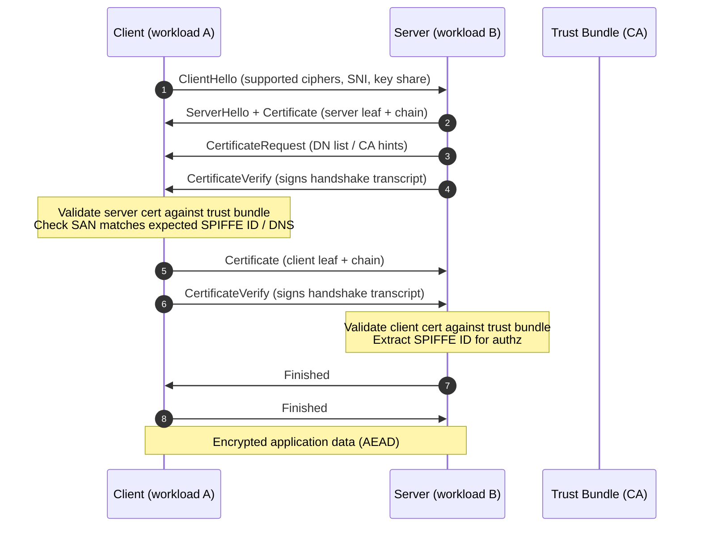
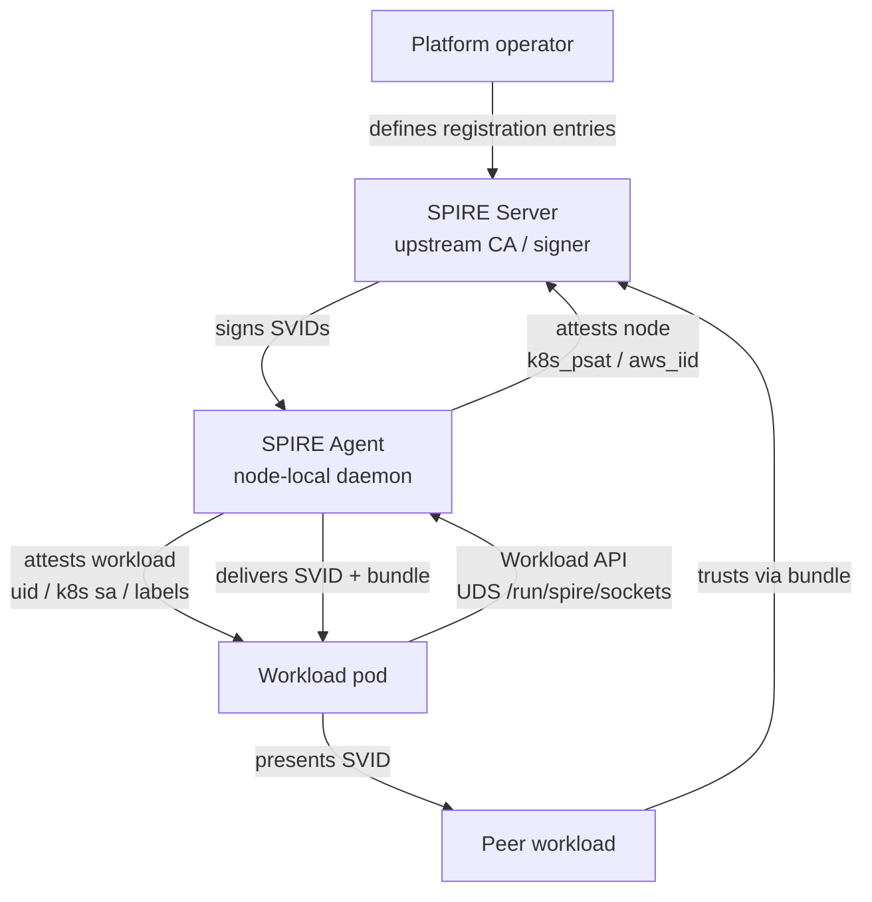
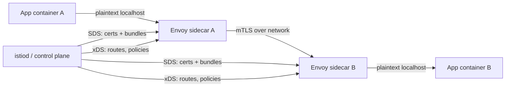
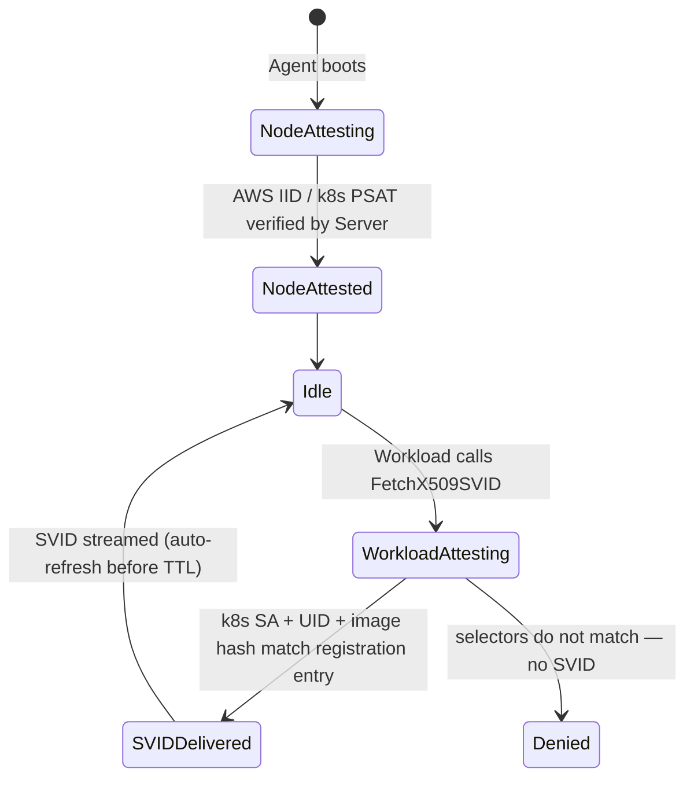
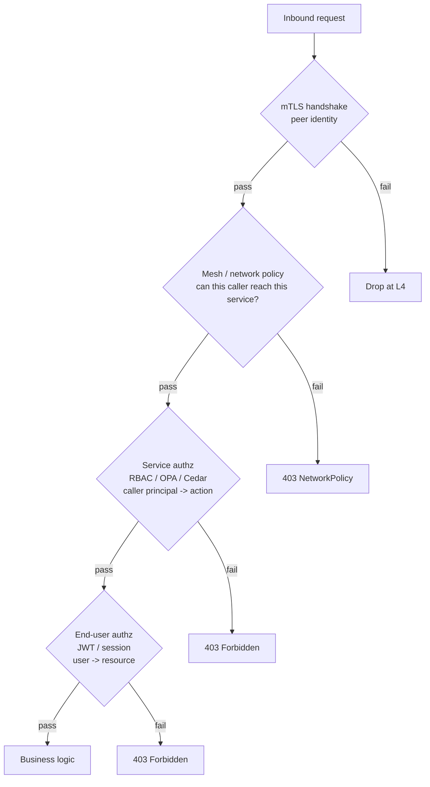

# Mutual TLS (mTLS)

## Why This Exists

**Problem.** Plain TLS authenticates the server to the client. The server has no cryptographic proof of who is calling it. Inside a typical datacenter or VPC, services trust each other based on **network position** — "you're in our subnet, you must be one of us." That assumption fails the moment an attacker lands a single shell on any pod, an SSRF leaks into the cluster, a stolen API token is replayed from outside, or a misconfigured ingress lets the public reach an internal endpoint. Network-position trust is the substrate every breach post-mortem describes as "lateral movement."

**Key insight.** Move identity off the network and onto the workload. Each service holds an X.509 leaf certificate naming **what it is** (e.g. `spiffe://prod/ns/payments/sa/charge-service`), signed by a CA the receiver trusts. Both ends present certs during the TLS handshake. The peer's identity is now a cryptographic fact, not a routing assumption. This is **zero trust at the transport layer**, and it composes cleanly with application-layer authorization.

**Reach for mTLS when:**

- Service A must prove its identity to Service B, not just "be reachable."
- You need encryption-in-transit on internal links (PCI, HIPAA, FedRAMP, SOC 2 frequently demand this even inside a VPC).
- You want to retire IP allowlists, security-group spaghetti, and shared bearer secrets.
- You operate a multi-tenant cluster, a service mesh, or cross-cluster federation.
- A compromised pod must NOT be able to impersonate any other pod.

**Don't reach for mTLS when:**

- You only need user authentication — that's what OIDC/JWT is for. mTLS authenticates the **calling workload**, not the human behind it.
- The peer is an unmanaged endpoint (random mobile app, third-party browser). Distributing client certs to humans is operationally painful.
- You haven't solved the **authorization** question. mTLS tells you *who* is calling; it doesn't tell you *what they're allowed to do*. A naked mTLS deployment with no policy is "everyone in the trust domain can call everything."
- You're early-stage with two services and no compliance pressure. The operational cost of CA + rotation + observability is non-trivial.

## Diagrams

### TLS 1.3 mutual handshake



### SPIFFE/SPIRE identity issuance



### Service mesh sidecar interception



## Core: how mTLS actually works on the wire

TLS 1.3 collapses the handshake to a single round trip. Both sides exchange ephemeral key shares in the first flight, derive handshake keys via HKDF, and authenticate by **signing the handshake transcript** with the private key corresponding to the cert they presented. There is no static "client auth" RSA decryption like the bad old TLS 1.2 RSA key exchange. Forward secrecy is mandatory.

Two facts dominate operational reality:

1. **The cert binds a public key to an identity.** The identity is whatever fields the verifier inspects. For browsers it's the DNS name in SAN. For SPIFFE it's the URI SAN `spiffe://<trust-domain>/<path>`. **Never** rely on Subject CN — RFC 6125 deprecated it and most modern stacks ignore it.
2. **Trust is a tree.** Every leaf chains to a root the verifier has pinned in its trust bundle. The CA is the authoritative answer to "who can speak as `payments`?" If the CA is compromised, the entire trust domain is compromised. Treat root keys like nuclear codes.

### Minimal Go mTLS server and client

```go
// server.go — accepts only clients whose leaf chains to our CA.
package main

import (
	"crypto/tls"
	"crypto/x509"
	"log"
	"net/http"
	"os"
)

func main() {
	caPEM, err := os.ReadFile("/var/run/spire/bundle.pem")
	if err != nil {
		log.Fatal(err)
	}
	pool := x509.NewCertPool()
	if !pool.AppendCertsFromPEM(caPEM) {
		log.Fatal("bundle: no certs parsed")
	}

	cert, err := tls.LoadX509KeyPair("/var/run/spire/svid.pem", "/var/run/spire/svid.key")
	if err != nil {
		log.Fatal(err)
	}

	tlsCfg := &tls.Config{
		Certificates: []tls.Certificate{cert},
		ClientAuth:   tls.RequireAndVerifyClientCert, // <- the line that makes it mTLS
		ClientCAs:    pool,
		MinVersion:   tls.VersionTLS13,
		// VerifyConnection runs AFTER chain validation. Use it to enforce SPIFFE ID.
		VerifyConnection: func(cs tls.ConnectionState) error {
			if len(cs.PeerCertificates) == 0 {
				return errNoClientCert
			}
			leaf := cs.PeerCertificates[0]
			for _, u := range leaf.URIs {
				if u.String() == "spiffe://prod/ns/payments/sa/charge-service" {
					return nil
				}
			}
			return errWrongCaller
		},
	}

	srv := &http.Server{
		Addr:      ":8443",
		TLSConfig: tlsCfg,
		Handler:   http.HandlerFunc(handle),
	}
	log.Fatal(srv.ListenAndServeTLS("", ""))
}

func handle(w http.ResponseWriter, r *http.Request) {
	// Caller identity is now a server-side fact, NOT a header the caller can forge.
	leaf := r.TLS.PeerCertificates[0]
	caller := leaf.URIs[0].String()
	// Pass `caller` into your authz layer. mTLS proves WHO; authz decides WHAT.
	w.Header().Set("X-Verified-Caller", caller)
	w.Write([]byte("ok"))
}

var (
	errNoClientCert = &tlsError{"client cert missing"}
	errWrongCaller  = &tlsError{"caller not authorized for this endpoint"}
)

type tlsError struct{ msg string }

func (e *tlsError) Error() string { return e.msg }
```

```go
// client.go — presents our SVID and pins the expected server SPIFFE ID.
package main

import (
	"crypto/tls"
	"crypto/x509"
	"net/http"
	"os"
)

func mtlsClient() (*http.Client, error) {
	caPEM, _ := os.ReadFile("/var/run/spire/bundle.pem")
	pool := x509.NewCertPool()
	pool.AppendCertsFromPEM(caPEM)

	cert, err := tls.LoadX509KeyPair("/var/run/spire/svid.pem", "/var/run/spire/svid.key")
	if err != nil {
		return nil, err
	}

	return &http.Client{
		Transport: &http.Transport{
			TLSClientConfig: &tls.Config{
				Certificates: []tls.Certificate{cert},
				RootCAs:      pool,
				MinVersion:   tls.VersionTLS13,
				// We do NOT trust the DNS name. We trust the URI SAN.
				// Skip default name verification, then enforce SPIFFE ID below.
				InsecureSkipVerify: true, // misleading flag — verify replaces it
				VerifyPeerCertificate: spiffeIDVerifier(
					pool, "spiffe://prod/ns/payments/sa/ledger",
				),
			},
		},
	}, nil
}

func spiffeIDVerifier(pool *x509.CertPool, want string) func([][]byte, [][]*x509.Certificate) error {
	return func(rawCerts [][]byte, _ [][]*x509.Certificate) error {
		certs := make([]*x509.Certificate, 0, len(rawCerts))
		for _, raw := range rawCerts {
			c, err := x509.ParseCertificate(raw)
			if err != nil {
				return err
			}
			certs = append(certs, c)
		}
		opts := x509.VerifyOptions{Roots: pool, Intermediates: x509.NewCertPool()}
		for _, c := range certs[1:] {
			opts.Intermediates.AddCert(c)
		}
		if _, err := certs[0].Verify(opts); err != nil {
			return err
		}
		for _, u := range certs[0].URIs {
			if u.String() == want {
				return nil
			}
		}
		return errWrongPeer
	}
}

var errWrongPeer = &tlsError{"server SPIFFE ID mismatch"}
```

The two non-obvious lines:

- `tls.RequireAndVerifyClientCert` is the entire difference between TLS and mTLS on the server. The other `ClientAuth` modes (`RequestClientCert`, `VerifyClientCertIfGiven`) are footguns — they accept anonymous connections.
- `VerifyConnection` / `VerifyPeerCertificate` is where you enforce **identity**, not just chain validity. Without this, any cert signed by your CA is accepted, including ones for other services in the trust domain. mTLS without identity pinning is "everyone-in-the-VPC mTLS" — it stops outsiders, not insiders.

## Certificate rotation: the part that breaks production

**The rule:** rotate often, automatically, with overlap. Long-lived certs are how you end up paged at 3am because Pinpoint Service expired and took down your auth flow. Short-lived certs (1h–24h) are not paranoia — they make rotation a normal, exercised path instead of a once-a-year fire drill.

### What "overlap" means

You cannot atomically swap a cert across a fleet. At any instant some pods have the old cert, some have the new. Your trust bundle MUST contain **both old and new CA roots** during the rollover window. SPIRE expresses this as a `JwtSvidTtl`/`X509SvidTtl` plus a bundle that carries multiple roots until all leaves signed by the old root have aged out.

### Three rotation patterns, ranked

1. **SPIFFE Workload API + memory-only keys (preferred).** Workload calls `FetchX509SVID` over a Unix socket; SPIRE Agent streams new SVIDs before the old one expires. Private key never touches disk. No restart, no reload signal.
2. **File-based with inotify reload.** Cert manager (cert-manager, Vault PKI, AWS Private CA) writes new files; the app watches and calls `tls.Config.GetCertificate` to pick them up. Works, but every consumer needs file-watch logic and graceful reload.
3. **Process restart on rotation.** Acceptable only if your rollout is fast and frequent. With 24h certs and a slow deploy pipeline you will lose the race.

### cert-manager + SPIRE on Kubernetes

```yaml
# spire-csi-driver delivers SVIDs into pods via projected volume.
# This is the modern path — no sidecar, no app changes beyond reading from a path.
apiVersion: v1
kind: Pod
metadata:
  name: charge-service
spec:
  containers:
    - name: app
      image: charge-service:v42
      env:
        - name: SPIFFE_ENDPOINT_SOCKET
          value: unix:///spiffe-workload-api/spire-agent.sock
      volumeMounts:
        - name: spiffe-workload-api
          mountPath: /spiffe-workload-api
          readOnly: true
  volumes:
    - name: spiffe-workload-api
      csi:
        driver: csi.spiffe.io
        readOnly: true
```

```yaml
# SPIRE registration entry: this pod, with this service account, on this node, gets this SVID.
# Selector chain prevents impersonation: an attacker who lands a shell in another namespace
# cannot fetch this SVID because the agent attests the workload's k8s SA + node binding.
apiVersion: spire.spiffe.io/v1alpha1
kind: ClusterSPIFFEID
metadata:
  name: charge-service
spec:
  spiffeIDTemplate: "spiffe://prod.example.com/ns/{{ .PodMeta.Namespace }}/sa/{{ .PodSpec.ServiceAccountName }}"
  podSelector:
    matchLabels:
      app: charge-service
  ttl: 1h            # short — forces rotation to be a tested, regular event
  jwtTtl: 5m         # JWT-SVIDs even shorter; they're easier to replay
```

### What to monitor

- **Cert age histogram** per service, p50/p99. If p99 climbs near TTL, rotation is failing somewhere.
- **Handshake failure rate** broken down by error class (`bad certificate`, `unknown ca`, `expired`, `revoked`).
- **Trust bundle freshness.** Time since last bundle update. If this exceeds rotation period, you'll have a cliff.
- **CA root expiry countdown.** Roots are usually 5–10 year lived; renewal is rare and therefore high-blast-radius. Alert at T-180 days.

## SPIFFE / SPIRE in one page

**SPIFFE** is a spec defining workload identity as a URI: `spiffe://<trust-domain>/<workload-path>`. **SPIRE** is the reference implementation: a server (CA + registration database) and an agent (node-local daemon that attests workloads and delivers SVIDs).

The killer feature is **attestation chains**. SPIRE Agent attests the *node* (via cloud metadata API like AWS IID, or k8s PSAT token), and then attests each *workload* on that node (via Linux UID/GID, k8s service account, container image hash, AWS IAM role, etc). To get an SVID for `charge-service`, an attacker must compromise a host that's actually running `charge-service` AND defeat the workload attestor. This is dramatically harder than "obtain a static credential from a config repo."



**Federation.** Two trust domains exchange bundles so workloads in `prod.example.com` can verify peers in `prod.partner.com`. This is the right primitive for cross-cluster, cross-account, or cross-organization mTLS — far cleaner than embedding partner CAs in every config.

**Don't roll your own CA.** Use SPIRE, Vault PKI, AWS Private CA, or step-ca. Building a CA correctly (HSM-backed root, offline signing, CRL/OCSP, key ceremony) is a year of work that has been done.

## Service mesh: Istio and Linkerd

A service mesh deploys a proxy (Envoy for Istio, linkerd2-proxy for Linkerd) next to every pod and forces traffic through it. The proxy terminates plaintext from the local app and originates mTLS to peer proxies. The control plane (istiod, linkerd-destination) issues certs and pushes config.

### Istio — the knobs that matter

```yaml
# Cluster-wide strict mTLS. Anything plaintext is REJECTED.
# Start with PERMISSIVE during migration, then flip to STRICT.
apiVersion: security.istio.io/v1beta1
kind: PeerAuthentication
metadata:
  name: default
  namespace: istio-system
spec:
  mtls:
    mode: STRICT
---
# Authorization policy — mTLS gives identity, this gives authorization.
# Without this, every authenticated workload in the mesh can call charge-service.
apiVersion: security.istio.io/v1beta1
kind: AuthorizationPolicy
metadata:
  name: charge-service-callers
  namespace: payments
spec:
  selector:
    matchLabels:
      app: charge-service
  action: ALLOW
  rules:
    - from:
        - source:
            principals:
              - "cluster.local/ns/checkout/sa/checkout-service"
              - "cluster.local/ns/refunds/sa/refunds-service"
      to:
        - operation:
            methods: ["POST"]
            paths: ["/v1/charges"]
```

**PERMISSIVE → STRICT migration.** Flipping a busy mesh from `PERMISSIVE` to `STRICT` without observing plaintext traffic for weeks is how you break batch jobs, legacy clients, and anything talking to a service from outside the mesh. Use Istio's `tls.istio.io/peer-mtls-mode` metric to enumerate every pair and verify zero plaintext before flipping.

### Linkerd — opinionated and faster to operate

Linkerd auto-enables mTLS for all pod-to-pod TCP between meshed pods. There is no `STRICT` toggle; it's the default. Trade-off: Linkerd's authorization story (`Server` / `ServerAuthorization` / `MeshTLSAuthentication` CRDs) is newer than Istio's and less granular. If you need request-level authz across namespaces with JWT claims, Istio + AuthorizationPolicy is more expressive. If you want mTLS to "just be on" with low operator overhead, Linkerd is the shorter path.

### Sidecar vs sidecar-less (ambient mode)

Istio Ambient and the per-node ztunnel pattern remove the per-pod proxy in favor of a node-level L4 proxy plus optional waypoint proxies for L7. This cuts memory cost (one proxy per node, not per pod) and CPU on hot paths. As of 2026 ambient is GA in Istio but still less battle-tested than sidecar mode; production workloads with strict latency budgets should benchmark both.

## When mTLS is enough vs needs additional authz

mTLS answers exactly one question: **who is the peer?** It does not answer:

- *What* is this peer allowed to do? (authorization)
- *Who* is the end user behind this request? (user identity)
- *Has this specific call been authorized for this specific resource?* (object-level authz)
- *Is this request a replay?* (per-request anti-replay tokens)

A correct production stack layers:



**mTLS alone is enough when:** the calling workload's *identity itself* is the authorization decision. Example: a metrics scraper calling `/metrics` — if you're `prometheus`, you can scrape. There's no per-user dimension.

**mTLS needs more when:** the caller is a multi-tenant gateway (e.g. API gateway calling user-service) where the *user* behind the call drives authorization. The gateway is mTLS-authenticated; the user is JWT/OIDC-authenticated; OPA or your service's authz layer combines both. This is the **dual-identity** pattern and it's what BeyondCorp, BSRS ch. 6, and most production zero-trust deployments converge on.

## Trade-offs

| Benefit | Cost |
|---|---|
| Cryptographic peer identity replaces network-position trust | CA infrastructure, registration entries, attestation pipeline |
| Encryption-in-transit by default (compliance: PCI 4.0, HIPAA §164.312, FedRAMP SC-8) | CPU overhead: ~5–15% on small-payload RPC; negligible on large payloads with AES-NI/AES-GCM |
| Lateral movement after host compromise becomes hard — attacker needs a valid SVID, not just network access | Per-pod proxy memory (Envoy: 50–150 MB) in sidecar meshes |
| Composes cleanly with policy engines (OPA, Cedar, Istio AuthZ) | Debugging is harder: TLS errors are opaque, packet captures are encrypted, you need keylog files and skill |
| Short-lived certs make credential theft a small window | Operational complexity: rotation must be automated, monitored, alerted |
| Eliminates shared secrets (no more "service account API key" in env vars) | Cross-trust-domain federation needs explicit bundle exchange — not transparent |
| Mesh integration delivers it without app code changes | Sidecar adds latency: ~0.5–2 ms per hop p50, more at p99 under load |
| Works for any TCP protocol (gRPC, HTTP, Postgres, Kafka, Redis with TLS) | Some protocols (legacy DBs, RabbitMQ ≤3.7) handle client certs poorly or not at all |
| SPIFFE trust-domain federation enables cross-cloud, cross-org auth | Federation introduces shared-fate: a compromised partner CA can issue valid SVIDs into your domain (mitigate via constrained namespaces) |

## Common Pitfalls

- **`InsecureSkipVerify: true` "just to get past the chain error."** This disables ALL verification, including the chain. Always pair with `VerifyPeerCertificate` if you skip default verification; never deploy with skip alone.
- **Trusting the Subject CN.** RFC 6125 deprecated CN-based identity in 2011. Always use SAN (DNS, URI, IP). Most modern stacks ignore CN; a few legacy clients still match it and that's how spoofing happens.
- **Wildcard or overly broad certs in service-to-service.** A `*.prod.internal` cert matches every service. If the private key leaks, every service is impersonatable. Use one identity per workload.
- **"PERMISSIVE forever."** Teams turn on Istio PEER_MTLS in PERMISSIVE for migration, then never flip to STRICT. Plaintext continues to flow alongside mTLS — you have the ops cost of a mesh and none of the security guarantee.
- **Forgetting the bundle.** Rotating leaves while the trust bundle still contains only the old root means the new leaves are rejected. Bundle must be updated *before* leaves migrate.
- **Long-lived service account tokens that bypass mTLS.** A service exposes an HTTP path authenticated by a static bearer token "for the cron job." That path is now the soft underbelly. Either put cron behind mTLS too, or accept that you have a non-mTLS attack surface and minimize it.
- **mTLS without authorization.** Every pod in the mesh has an identity, and your service accepts every valid identity. A compromised `weather-service` pod can now call `payments`. Always pair PeerAuthentication with AuthorizationPolicy (or equivalent).
- **CA root pinned in code or images.** Rebuilding every image to rotate a root is a multi-month nightmare. Roots live in the trust bundle that the workload reads at runtime, never baked in.
- **Clock skew breaks everything.** TLS validates `notBefore` and `notAfter` against the local clock. A node with a 10-minute skew rejects fresh certs as "not yet valid" or accepts long-expired ones. Run `chrony` or `systemd-timesyncd`, alert on skew > 30s.
- **Terminating mTLS at the load balancer and forgetting the inside.** TLS terminator → plaintext to backends. Now your "mTLS" stops at the perimeter. If you need internal mTLS, terminate the external session and re-originate, or use TCP passthrough.
- **Revocation isn't real with short-lived certs — but people configure CRL/OCSP anyway.** OCSP stapling with 1h leaves is wasted work; the cert expires before revocation propagates. Just shorten TTL and skip OCSP. (For long-lived certs, OCSP stapling is genuinely necessary.)
- **Mixing trust domains by accident.** Two clusters with the same SPIFFE trust domain (`example.org`) but different CAs are an integration disaster waiting to happen. Trust domain identity = CA identity; treat them as 1:1.

## Decision Table

| Situation | Use | Rationale |
|---|---|---|
| Greenfield k8s, multi-team, compliance pressure | Istio STRICT mTLS + AuthorizationPolicy + OPA for L7 authz | Most expressive, biggest ecosystem, request-level policy |
| k8s, small team, want mTLS with minimal ops | Linkerd (mTLS auto-on) | Lowest operational cost; sufficient for most workloads |
| Multi-cluster, multi-cloud, cross-org partners | SPIFFE/SPIRE with trust domain federation | Vendor-neutral identity model, designed for federation |
| Legacy VMs, no orchestrator | SPIRE + Vault PKI + cert-manager-equivalent or HashiCorp Consul Connect | Works without k8s; Consul Connect bundles mesh + service catalog |
| Browser/mobile to backend | Plain TLS + OAuth/OIDC, NOT mTLS | Distributing client certs to humans / devices is operationally infeasible at scale |
| Service-to-DB inside VPC | mTLS if DB supports it (Postgres, MySQL ≥8, Mongo, Cassandra) | Otherwise: VPC + IAM auth + audit log + minimal blast radius |
| Internet-facing public API | TLS 1.3 server-only + API keys / OAuth | Client certs are a UX disaster; reserve mTLS for B2B partners with managed clients |
| Need to authenticate humans | OIDC/JWT, NOT mTLS | mTLS authenticates workloads; humans are not workloads |
| Two services owned by the same team, no compliance need | Network policy + bearer token, defer mTLS | Real cost; reach for mTLS when threat model or compliance demands it |
| Need "who initiated this request 5 hops back" | mTLS for hop-by-hop + signed identity propagation header (e.g. JWT in metadata, signed by gateway) | mTLS proves immediate caller; end-user identity needs explicit propagation |

## References

- IETF — RFC 8446: TLS 1.3 — https://www.rfc-editor.org/rfc/rfc8446
- IETF — RFC 5280: Internet X.509 Public Key Infrastructure Certificate and CRL Profile — https://www.rfc-editor.org/rfc/rfc5280
- IETF — RFC 6125: Representation and Verification of Domain-Based Application Service Identity (deprecates CN) — https://www.rfc-editor.org/rfc/rfc6125
- IETF — RFC 8705: OAuth 2.0 Mutual-TLS Client Authentication — https://www.rfc-editor.org/rfc/rfc8705
- SPIFFE — The SPIFFE Specification — https://github.com/spiffe/spiffe/blob/main/standards/SPIFFE.md
- SPIFFE — X.509-SVID Specification — https://github.com/spiffe/spiffe/blob/main/standards/X509-SVID.md
- SPIRE — Concepts and Architecture — https://spiffe.io/docs/latest/spire-about/spire-concepts/
- Istio — Security Architecture — https://istio.io/latest/docs/concepts/security/
- Istio — PeerAuthentication and AuthorizationPolicy — https://istio.io/latest/docs/reference/config/security/peer_authentication/
- Linkerd — Automatic mTLS — https://linkerd.io/2/features/automatic-mtls/
- Google — Building Secure and Reliable Systems (BSRS), ch. 5 (Design for Least Privilege) and ch. 6 (Design for Understandability) — https://sre.google/books/building-secure-reliable-systems/
- Google — BeyondCorp papers (zero trust foundations) — https://research.google/pubs/?area=security-privacy-and-abuse-prevention
- NIST — SP 800-207: Zero Trust Architecture — https://csrc.nist.gov/publications/detail/sp/800-207/final
- NIST — SP 800-204A: Building Secure Microservices-based Applications Using Service-Mesh Architecture — https://csrc.nist.gov/publications/detail/sp/800-204a/final
- AWS — AWS Private CA documentation — https://docs.aws.amazon.com/privateca/
- HashiCorp — Vault PKI Secrets Engine — https://developer.hashicorp.com/vault/docs/secrets/pki
- Cloudflare — A Detailed Look at TLS 1.3 — https://blog.cloudflare.com/tls-1-3-overview-and-q-and-a/
- Adam Langley — ImperialViolet (canonical TLS commentary) — https://www.imperialviolet.org/
- Kleppmann — Designing Data-Intensive Applications, ch. 9 (Consistency and Consensus, sidebars on trust) — O'Reilly 2017
- Beyer et al. — Site Reliability Engineering, ch. 5 (Eliminating Toil) on automating cert rotation — https://sre.google/sre-book/eliminating-toil/

## See Also

- ../zero-trust-architecture/ — broader zero-trust patterns; mTLS is one pillar
- ../oauth-oidc/ — user identity layer that composes with mTLS for dual-identity authz
- ../jwt-best-practices/ — propagating end-user identity past the mTLS hop
- ../authorization-opa-cedar/ — the policy layer that consumes the SPIFFE ID mTLS hands you
- ../secrets-management/ — Vault, KMS, and how private keys never end up in env vars
- ../pki-and-ca-design/ — root key ceremonies, intermediate hierarchies, HSMs
- ../../networking/service-mesh/ — Istio vs Linkerd vs Consul Connect deeper comparison
- ../../networking/network-policy/ — k8s NetworkPolicy / Calico, the L4 layer below mTLS
- ../../observability/distributed-tracing/ — propagating trace context alongside mTLS-authenticated calls
- ../../reliability/cert-rotation-runbook/ — operational playbook for rotation incidents
- ../../compliance/pci-hipaa-fedramp/ — which controls mTLS satisfies and which it doesn't
- ../../platform/kubernetes-security/ — RBAC, PodSecurity, admission control siblings
