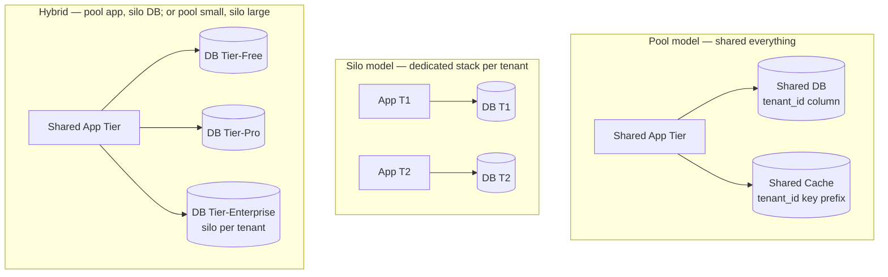
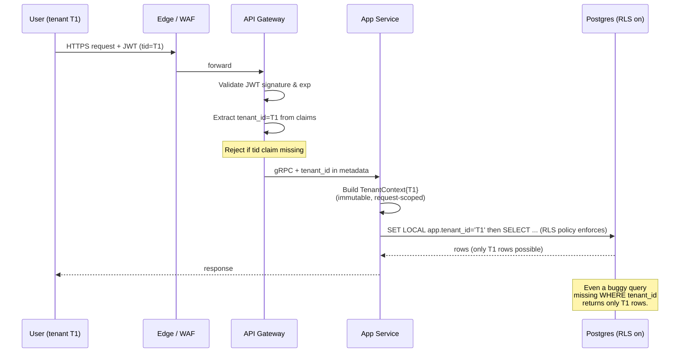
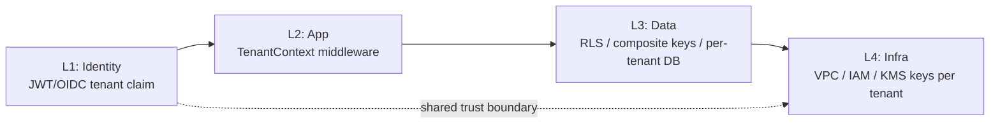

# Multi-Tenancy

## Why This Exists

**Problem.** A SaaS application serves many customers (tenants) on shared infrastructure. Three forces fight each other constantly:

1. **Isolation** — tenant A's data must be invisible and inviolable to tenant B. A single missing `WHERE tenant_id = ?` is a public breach.
2. **Density** — packing tenants tightly is the entire reason SaaS economics work. One database per tenant for 50,000 small tenants is bankruptcy.
3. **Variance** — tenants differ by 4–6 orders of magnitude in size, traffic, compliance posture, and willingness to pay. A pricing tier that works for the median tenant is wrong for the top 1% and the bottom 50%.

**Key insight.** *Multi-tenancy is not a single architecture; it's a per-resource decision.* You can pool the compute layer, silo the database, and pool the cache — and it's often the right answer. The AWS SaaS Lens calls this **"isolation per tenant resource"** rather than "isolation per tenant." Ask the question for each layer: app, data, network, identity, observability, billing.

**Reach for this when:**
- You're building or operating a SaaS product with ≥2 customers on shared infrastructure.
- You need to evaluate "should we go single-tenant for this customer?" without breaking the rest of the platform.
- A regulatory regime (HIPAA, PCI-DSS, FedRAMP, sovereignty) requires data residency or strong isolation for *some* tenants.
- You're investigating a noisy-neighbor incident or a near-miss data leak.
- You're sizing a tenant onboarding flow, a metering pipeline, or a per-tenant rate limiter.

**Don't reach for this when:**
- The system is internal-only with one logical "customer" — multi-tenancy machinery is overhead with no upside.
- You're really asking about *authorization* within a single tenant (RBAC/ABAC); see `../authz/` instead.

---

## Diagrams

### The three deployment models



### Request path with tenant context propagation



### Defense in depth — the four layers that must all agree



A breach happens when *any one layer* assumes another did the check. Build redundant enforcement; don't trust the previous hop.

---

## The pool / silo / hybrid spectrum

This is the single most important framing in multi-tenant design (popularized by the AWS SaaS Lens and Tod Golding's *Building Multi-Tenant SaaS Architectures*, O'Reilly 2024).

### Pool (shared everything)

One database, one app tier, one cache. Every row carries `tenant_id`. Every query filters on it. Every cache key is namespaced.

- **Cheapest** by far at scale. A pool DB with 100k tenants costs roughly the same as a pool DB with 100.
- **Most operationally homogeneous** — one schema migration applies everywhere; one dashboard shows the whole fleet.
- **Hardest to isolate.** A single missing filter, a SQL injection, an ORM bug, or a SECURITY DEFINER function that forgets to re-set the tenant context is a cross-tenant breach.
- **Noisy neighbor risk is highest.** A tenant running an unindexed query, an analytics export, or a 10× traffic spike degrades everyone.

### Silo (dedicated stack per tenant)

Each tenant gets its own database (and possibly its own app cluster, VPC, KMS key, account).

- **Strongest isolation.** A bug in tenant A's stack physically cannot reach tenant B.
- **Easiest compliance story** — "your data lives in your own database, encrypted with your own KMS key, in the region you chose."
- **Most expensive per tenant.** Idle tenants still cost a database. Onboarding a tenant means provisioning infrastructure, not inserting a row.
- **Operational scaling pain.** Schema migrations across 5,000 silo databases require orchestration (e.g., a migration coordinator, blue/green per tenant). Observability has to roll up across N stacks.

### Hybrid (the real-world answer)

Pool the app tier. Silo the database for enterprise tier; pool it for free/pro tiers. Pool Redis but use silo'd ElastiCache for tenants over X RPS. Pool S3 with prefix isolation but provision a dedicated bucket for tenants needing CMK-per-bucket.

This is what most mature SaaS converges on, because the cost/risk curves for each resource are different. **Decide per resource, not per platform.**

---

## Tenant isolation at each layer

### Layer 1 — Identity / request entry

Every request arriving at your platform must carry a verified, unforgeable `tenant_id`. Two patterns:

1. **Subdomain-based** — `acme.example.com` → tenant `acme`. Easy for users; the Host header is the tenant cue. **Verify it, don't trust it** — once the request is past TLS termination, the Host header is a string. Bind it to authenticated session/JWT before trusting.
2. **JWT claim-based** — The OIDC IdP issues a token containing `tid: "acme"`. The API gateway validates signature & expiration, then propagates `tenant_id` as immutable downstream metadata.

```python
# fastapi-style middleware. Read once, build immutable context, fail closed.
from contextvars import ContextVar
from fastapi import Request, HTTPException

_tenant_ctx: ContextVar[str] = ContextVar("tenant_id")

async def tenant_middleware(request: Request, call_next):
    claims = request.state.jwt_claims  # set by upstream auth middleware
    tid = claims.get("tid")
    if not tid:
        # Fail closed. NEVER default to a tenant or "public".
        raise HTTPException(401, "missing tenant claim")
    if not _is_active_tenant(tid):  # cached lookup, < 1ms
        raise HTTPException(403, "tenant suspended or unknown")
    token = _tenant_ctx.set(tid)
    try:
        return await call_next(request)
    finally:
        _tenant_ctx.reset(token)

def current_tenant() -> str:
    try:
        return _tenant_ctx.get()
    except LookupError:
        # If anyone in the request path forgot to set context, crash loudly.
        # A silent default would be a cross-tenant leak.
        raise RuntimeError("tenant context not set — refusing to proceed")
```

The pattern: **fail closed, fail loud, never default**. There is no "public" tenant. There is no "admin" tenant that sees all rows in the same code path as user requests.

### Layer 2 — Application

The app must propagate `tenant_id` to *every* downstream call: DB, cache, search index, queue, S3, log line, metric tag. Two enforcement styles:

- **Composite keys everywhere.** Every primary key is `(tenant_id, entity_id)`. Every foreign key includes `tenant_id`. The database refuses to join across tenants because the keys don't match. This is the simplest model and it works in any database.
- **Tenant-scoped repositories.** All data access goes through a repository that accepts a `TenantContext` and refuses to operate without one. No raw SQL escape hatches in product code.

```go
// Go: a repository that physically cannot run without tenant context.
type UserRepo struct{ db *sql.DB }

func (r *UserRepo) GetByEmail(ctx context.Context, email string) (*User, error) {
    tid, ok := tenant.FromContext(ctx)
    if !ok {
        return nil, errors.New("tenant context required") // never silently broaden
    }
    var u User
    // Composite key in the WHERE clause AND the index leading column is tenant_id.
    err := r.db.QueryRowContext(ctx,
        `SELECT id, email, name FROM users
         WHERE tenant_id = $1 AND email = $2`,
        tid, email,
    ).Scan(&u.ID, &u.Email, &u.Name)
    return &u, err
}
```

### Layer 3 — Data

#### Pattern A — Composite keys + app-enforced filtering

Every table has `tenant_id` as the leading column of the primary key (or at minimum, leading column of every index that matters). The app is responsible for adding `WHERE tenant_id = ?` to every query. This is the *bare minimum* — and on its own, **it is one bug away from a breach**.

```sql
CREATE TABLE invoice (
    tenant_id  uuid    NOT NULL,
    invoice_id uuid    NOT NULL,
    amount     numeric NOT NULL,
    PRIMARY KEY (tenant_id, invoice_id)
);
-- Any index that doesn't lead with tenant_id will scan across tenants.
CREATE INDEX idx_invoice_status ON invoice (tenant_id, status, created_at DESC);
```

#### Pattern B — Postgres Row-Level Security (RLS)

Defense in depth: the database itself refuses to return rows from the wrong tenant, even if the query forgets the filter.

```sql
ALTER TABLE invoice ENABLE ROW LEVEL SECURITY;
ALTER TABLE invoice FORCE ROW LEVEL SECURITY;  -- applies even to table owner

CREATE POLICY tenant_isolation ON invoice
    USING (tenant_id = current_setting('app.tenant_id')::uuid);

-- In the connection, before issuing queries:
SET LOCAL app.tenant_id = 'a3f1...';
-- Now every SELECT/UPDATE/DELETE is scoped automatically.
```

**RLS gotchas you must internalize:**

- `SET` (without `LOCAL`) leaks across queries on a pooled connection. Always `SET LOCAL` and reset on connection return.
- `FORCE ROW LEVEL SECURITY` is critical — without it, the table owner bypasses RLS, and your app role is often the owner.
- `SECURITY DEFINER` functions run as the function owner; if that owner has `BYPASSRLS`, your policy is gone. Audit them.
- `pg_dump`, replication, logical decoding, and partition pruning have edge cases. Test them.
- RLS adds a per-row predicate; on hot queries it can cost 5–15% latency. Measure.
- Connection poolers (PgBouncer in transaction mode) are fine *only* if you `SET LOCAL` inside the transaction. Session-mode pooling can leak the setting across requests.

```python
# Correct pattern with SQLAlchemy + PgBouncer transaction mode.
@contextmanager
def tenant_session(tenant_id: str):
    with engine.begin() as conn:  # transaction-scoped
        # SET LOCAL is rolled back at COMMIT/ROLLBACK; safe with poolers.
        conn.execute(text("SET LOCAL app.tenant_id = :tid"), {"tid": tenant_id})
        yield conn
        # On exit, COMMIT runs; setting is discarded with the transaction.
```

#### Pattern C — Schema-per-tenant

Each tenant gets its own Postgres schema (`tenant_acme.invoice`, `tenant_globex.invoice`). Same database, separate namespaces. Useful when:

- You want strong isolation without N databases.
- Tenants want their own backup/restore granularity.
- Schema-level permissions can be granted per role.

But: 1,000s of schemas in one Postgres make `pg_catalog` enormous, slow `\d`, slow autovacuum, and break pg_dump tooling. Anything past ~500 tenants per cluster, switch to silo databases.

#### Pattern D — Database-per-tenant (silo)

The cleanest isolation. Each tenant has a dedicated database (or RDS/Aurora cluster). The connection string itself is the tenant scope. Common for:

- Enterprise tier of a hybrid platform.
- Regulated tenants (HIPAA, PCI, sovereign-region).
- Tenants paying for "dedicated infrastructure" SKUs.

A tenant-routing layer (often called a **Tenant Router** or **Sharding Router**) maps `tenant_id → connection string`.

```python
# Sharding router with cached lookups and lazy pool creation.
class TenantRouter:
    def __init__(self, catalog_db):
        self._catalog = catalog_db  # central tenant->shard mapping
        self._pools: dict[str, Engine] = {}
        self._lock = Lock()

    def get_engine(self, tenant_id: str) -> Engine:
        if tenant_id in self._pools:
            return self._pools[tenant_id]
        with self._lock:
            if tenant_id in self._pools:
                return self._pools[tenant_id]
            shard = self._catalog.lookup_shard(tenant_id)  # e.g. RDS endpoint
            self._pools[tenant_id] = create_engine(
                shard.dsn,
                pool_size=5,         # bounded — silo'd pools fan out
                max_overflow=2,
                pool_pre_ping=True,
            )
            return self._pools[tenant_id]
```

**Watch the connection multiplication.** With 1,000 silo'd tenants × 5 connections each = 5,000 backend connections per app instance × 20 instances = 100k. Postgres dies. Mitigate with PgBouncer fronting each shard, or with serverless-style "open connection just for this query" patterns.

### Layer 4 — Network / Infrastructure

For high-isolation tenants:

- Per-tenant VPC or per-tenant AWS account (the AWS Control Tower / Organizations pattern).
- Per-tenant KMS Customer Master Key (CMK) — supports key rotation/revocation per tenant; "delete the key" is a credible "delete the tenant's data" story.
- Per-tenant IAM roles / S3 prefixes scoped by `aws:PrincipalTag/TenantId`.

For pool tenants:

- Single VPC, single account, but tag every resource with `TenantId` for cost allocation and IAM condition keys.

---

## Per-tenant encryption

Two questions, two answers:

1. **Is each tenant's data encrypted with a key that is unique to them?**
2. **Can a tenant rotate or revoke their own key?**

**Envelope encryption with per-tenant Data Encryption Keys (DEKs).**

```python
# At write time:
def encrypt_for_tenant(tenant_id: str, plaintext: bytes) -> bytes:
    # 1. Generate a fresh DEK (256-bit AES) per object (or per tenant per epoch).
    dek = os.urandom(32)
    # 2. Wrap the DEK with the tenant's KMS CMK. KMS never exports the CMK.
    wrapped_dek = kms.encrypt(KeyId=cmk_for(tenant_id), Plaintext=dek)["CiphertextBlob"]
    # 3. Encrypt the payload with the DEK.
    nonce = os.urandom(12)
    ct = AESGCM(dek).encrypt(nonce, plaintext, associated_data=tenant_id.encode())
    # 4. Store wrapped_dek + nonce + ciphertext. Never the DEK in plaintext.
    return _serialize(wrapped_dek, nonce, ct)
```

**Crypto-shredding.** Deleting a tenant becomes a one-step operation: schedule the CMK for deletion in KMS. Every wrapped DEK becomes unrecoverable, every ciphertext becomes plaintext-irrecoverable. This is how the AWS SaaS Lens recommends modeling "right to erasure" for high-tier tenants. (For pool tenants, you still need per-row deletion; crypto-shred is layered on top, not in place of.)

**Costs to know.** KMS API calls are ~$0.03 per 10k requests, but at SaaS scale that adds up. Cache plaintext DEKs in memory (with TTL) and re-wrap, don't call KMS per row.

---

## Noisy neighbor: detection and containment

A noisy neighbor is a tenant whose load degrades others. Symptoms include p99 latency spikes correlated with one tenant's request volume, lock contention from one tenant's long transactions, cache eviction storms when one tenant's working set explodes, queue head-of-line blocking when one tenant's slow consumer holds workers.

### Detection — every metric must carry tenant_id as a label

This is non-negotiable. If your latency histogram doesn't have `tenant_id`, you cannot tell whether a p99 spike is one tenant or all of them. Cardinality cost is real; mitigate with:

- Top-N labeling — only emit per-tenant labels for the top 100 tenants by volume; bucket the rest as `tenant_id="other"`.
- Reservoir sampling for traces.
- Exemplar-based debugging (Tempo/Honeycomb) instead of high-cardinality histograms.

```python
# Always tag metrics with tenant_id, but cap cardinality.
TOP_TENANTS = lru_cache(maxsize=100)
def metric_tenant_label(tid: str) -> str:
    return tid if TOP_TENANTS.contains(tid) else "other"

http_request_duration.labels(
    route="/api/invoice",
    tenant=metric_tenant_label(tid),
    status="200",
).observe(elapsed)
```

### Containment — bulkheads, quotas, and back-pressure

1. **Per-tenant rate limits at the edge.** Token bucket keyed by `tenant_id` in the API gateway. Reject 429 before the request consumes app-tier resources.
2. **Per-tenant connection / concurrency caps.** No single tenant can occupy more than, say, 20% of the connection pool. Use semaphores keyed by `tenant_id`.
3. **Bulkheads — separate worker pools for premium vs. free tier.** A free-tier batch job cannot starve premium-tier interactive requests.
4. **Per-tenant DB resource governance.**
   - Postgres: `ALTER ROLE tenant_acme SET statement_timeout = '5s';`
   - Aurora Serverless v2 with per-tenant ACU caps (silo model).
   - Citus / Vitess shard-isolation per tenant for true blast-radius containment.
5. **Shuffle sharding (Route 53 / DynamoDB style)** — assign each tenant to a random subset of, say, 4 of 8 worker nodes. A misbehaving tenant degrades only their 4 nodes, and the probability that *any other tenant* shares all 4 is small. AWS Builders' Library has the canonical write-up.
6. **Per-tenant circuit breakers** for downstream calls — one tenant's failing webhook doesn't tie up the worker pool for everyone.

```python
# Per-tenant bulkhead: bounded concurrency per tenant.
class TenantBulkhead:
    def __init__(self, max_per_tenant: int = 50):
        self._max = max_per_tenant
        self._sems: dict[str, asyncio.Semaphore] = defaultdict(
            lambda: asyncio.Semaphore(self._max)
        )

    async def run(self, tenant_id: str, coro):
        sem = self._sems[tenant_id]
        # If a tenant is using all 50 slots, *they* queue or 429 — others don't.
        async with sem:
            return await coro

# At request handler:
return await bulkhead.run(current_tenant(), handle_request(req))
```

---

## Cross-tenant data leak prevention — concrete defenses

Lessons collected from real SaaS post-mortems (Salesforce, Atlassian, Slack, GitHub, and many smaller breaches):

1. **Make `tenant_id` a required argument, not an option.** Repositories accept `TenantContext` as a typed parameter. There is no `getInvoice(id)` — only `getInvoice(ctx, id)`. The compiler/type checker enforces this.

2. **Composite primary keys + composite foreign keys.** Forge it impossible at the schema level. A forgotten join condition produces no rows, not someone else's rows.

3. **Postgres RLS as defense in depth**, even with composite keys. It catches the bug you didn't think of.

4. **Linters and code review rules.** `WHERE` clauses without `tenant_id` should fail CI. Some teams use a custom semgrep rule, an ORM-level audit hook, or a database proxy that rejects queries without a tenant filter.

5. **Tenant-scoped IDs are not random per database — they are random per tenant.** If two tenants both have invoice `id=42`, fine — composite keys mean they never collide. If you've UUIDv4'd everything, also fine. Just don't accept a bare `42` from a URL and look it up by `id` alone.

6. **No "admin override" code paths in the user request handler.** Internal/support tools that read across tenants must be a separate service, separate code, separate audit log, separate review process. The pattern of "if `is_admin`, skip the tenant filter" is a backdoor; it will get exploited or accidentally invoked.

7. **Logs are tenant data too.** Don't write tenant A's PII into a log line tenant B's support engineer can read. Log tenant_id as a tag; don't log payloads at INFO.

8. **Test for it.** Property-based and fuzz tests that issue requests as tenant A using IDs known to belong to tenant B. Your integration suite should have an "isolation" suite that fails if any cross-tenant access succeeds.

```python
# pytest pattern: every endpoint must pass an isolation test.
@pytest.mark.parametrize("endpoint,method", ALL_ENDPOINTS)
def test_tenant_isolation(endpoint, method, tenantA, tenantB):
    # tenantB creates a resource
    res = client.as_tenant(tenantB).post(endpoint, json=fixture)
    bad_id = res.json()["id"]
    # tenantA tries to read/update/delete it
    resp = client.as_tenant(tenantA).request(method, f"{endpoint}/{bad_id}")
    # MUST be 404 (don't leak existence) — never 200, never 403 with the body.
    assert resp.status_code == 404, f"{endpoint} leaks across tenants"
```

---

## Trade-offs

| Benefit                                         | Cost                                                                                       |
| ----------------------------------------------- | ------------------------------------------------------------------------------------------ |
| Pool model: lowest infra cost per tenant        | Highest blast radius; one bug = many tenants exposed; harder per-tenant SLAs               |
| Silo model: strongest isolation, simplest story | 5–50× per-tenant cost; provisioning is a workflow, not a SQL insert; ops scales with N     |
| Hybrid: matches cost to risk per tier           | Two code paths to maintain; tier-migration is a non-trivial customer event                 |
| Postgres RLS: defense in depth at DB layer      | 5–15% query overhead; pooler discipline required; SECURITY DEFINER footguns                |
| Composite keys everywhere                       | Migration burden if added late; widens indexes; can complicate ORM tooling                 |
| Per-tenant KMS CMK                              | Crypto-shred deletion; per-call KMS cost; cache invalidation if rotating CMK               |
| Per-tenant rate limits & bulkheads              | Containment of noisy neighbors; over-tight limits cause user-visible 429s                  |
| Shuffle sharding                                | Massive blast-radius reduction; routing is more complex; observability is per-shard        |
| Schema-per-tenant                               | Per-tenant backups/permissions; pg_catalog bloat past ~500 tenants; migration orchestration |
| Tenant-scoped repositories (typed context)      | Compile-time safety against missing filters; some boilerplate; hard to retrofit            |

---

## Common Pitfalls

- **Trusting the Host header or a URL path segment as the tenant identifier without binding it to the authenticated session.** A logged-in user from tenant A who edits the URL to `/t/B/...` should get 404, not data.
- **Connection pool leaks `SET app.tenant_id` across requests.** Always `SET LOCAL` inside a transaction. Verify with PgBouncer in transaction mode, not session mode.
- **`SECURITY DEFINER` functions silently bypass RLS.** Audit every one. Add `SET row_security = on` and explicit `current_setting('app.tenant_id')` checks.
- **The "admin" code path that skips filters.** Eventually a regular user will reach it via a misconfigured role. Make admin tools a separate service with separate auth.
- **Background jobs forget the tenant context.** A queued job must serialize `tenant_id` and the worker must restore it before doing anything. Lots of leaks happen here.
- **Caches without tenant prefixing.** Two tenants both have `user:42`; one caches over the other. Always prefix: `t:{tenant_id}:user:42`.
- **Search indexes (Elasticsearch/OpenSearch) without tenant filtering at query time.** OpenSearch has document-level security, but most teams under-use it; add a mandatory tenant filter in a query-builder middleware.
- **Cardinality explosion in metrics.** Naively tagging every metric with `tenant_id` can blow up Prometheus. Use top-N labeling.
- **Provisioning a silo tenant takes 20 minutes.** Onboarding becomes a sales bottleneck. Pre-warm a pool of empty silo databases, then claim one at signup.
- **Forgetting to budget cost per tenant.** Without per-tenant cost attribution (tags + Cost Explorer / Cost & Usage Report), you can't tell if one customer is unprofitable.
- **Schema migrations across thousands of silo databases.** Build a migration coordinator with retries, blue/green per tenant, and an observability dashboard. Don't just "for tenant in tenants: alembic upgrade head" in a shell loop.
- **One tenant fills the disk and takes everyone down.** Per-tenant storage quotas at the DB layer, plus billing-driven enforcement.
- **The biggest tenant outgrows the pool.** Plan a "graduate to silo" path before you need it. Most platforms do this for the top 1% of customers.
- **Tenant deletion that doesn't actually delete.** GDPR / right-to-erasure requires deletion of replicas, backups, search indexes, logs. Crypto-shred at the silo level; a documented purge job at the pool level.

---

## Decision Table

| Situation                                                              | Choose                              | Why                                                                                       |
| ---------------------------------------------------------------------- | ----------------------------------- | ----------------------------------------------------------------------------------------- |
| Hundreds of small tenants, freemium / SMB SaaS, low compliance bar     | **Pool + composite keys + RLS**     | Cheapest; RLS is your seatbelt; one schema; one observability story                       |
| Mix of small free + large enterprise; 80/20 by revenue                 | **Hybrid: pool free/pro, silo enterprise** | Match cost to revenue; enterprise gets compliance story; SMBs subsidize their own density |
| Regulated industry (HIPAA, PCI-DSS Level 1, FedRAMP, sovereign)        | **Silo per tenant + per-tenant CMK**| Auditors love clear physical boundaries; crypto-shred for erasure                         |
| Few very large tenants (B2B, single-digit count)                       | **Silo per tenant**                 | Pool overhead has no benefit at low N; silo gives them dedicated SLAs                     |
| Building MVP, < 10 tenants, will refactor later                        | **Pool + composite keys** (no RLS yet) | Get to PMF first; add RLS before scale; never accept "we'll add tenant_id later"          |
| Tenants demand data residency by region                                | **Silo per region; pool within region** | Routing layer maps tenant → region; comply with sovereign-cloud asks                      |
| Noisy neighbor incidents in pool, can't migrate everyone               | **Pool + shuffle sharding + per-tenant rate limits** | Cap blast radius; preserves pool economics                                                |
| One tenant doing 50% of total load                                     | **Silo just that tenant**           | Don't let them ruin the pool's economics or stability                                     |
| You're seeing "tenant A saw tenant B's row" in production             | **Stop. RLS ON immediately**, then audit | Composite keys are not enough on their own; defense in depth was missing                  |
| Multi-region active-active, every tenant in every region               | **Silo per tenant per region with conflict-free design** | Multi-region pool is a nightmare; per-tenant gives independent failure domains             |

---

## References

- **AWS — SaaS Lens (Well-Architected Framework)** — *Multi-tenant isolation strategies, identity, tenant-aware operations* — https://docs.aws.amazon.com/wellarchitected/latest/saas-lens/welcome.html
- **AWS — SaaS Tenant Isolation Strategies whitepaper** — https://docs.aws.amazon.com/whitepapers/latest/saas-tenant-isolation-strategies/saas-tenant-isolation-strategies.html
- **AWS Builders' Library — Workload isolation using shuffle-sharding** — https://aws.amazon.com/builders-library/workload-isolation-using-shuffle-sharding/
- **AWS Builders' Library — Avoiding fallback in distributed systems** (relevant for tenant-scoped retries) — https://aws.amazon.com/builders-library/avoiding-fallback-in-distributed-systems/
- **AWS Builders' Library — Going faster with continuous delivery** (per-tenant migration patterns) — https://aws.amazon.com/builders-library/going-faster-with-continuous-delivery/
- **Tod Golding — *Building Multi-Tenant SaaS Architectures*** (O'Reilly, 2024) — canonical text on pool/silo/hybrid; chapters on tenant isolation, identity, and onboarding.
- **PostgreSQL Documentation — Row Security Policies** — https://www.postgresql.org/docs/current/ddl-rowsecurity.html
- **PostgreSQL Documentation — `SET LOCAL` and transaction-scoped GUCs** — https://www.postgresql.org/docs/current/sql-set.html
- **DDIA — *Designing Data-Intensive Applications*** (Kleppmann, 2017) — ch. 6 (Partitioning) for sharding-as-tenant-isolation; ch. 7 (Transactions) for isolation level interactions with RLS.
- **Google SRE Workbook — Ch. 8 *Managing Load*** — https://sre.google/workbook/managing-load/ — bulkheads, graceful degradation, per-customer quotas.
- **Building Secure & Reliable Systems (Google)** — ch. 6 *Design for Understandability*, ch. 8 *Design for Resilience* — https://sre.google/books/building-secure-reliable-systems/
- **Salesforce Multi-Tenant Architecture whitepaper** — *The Force.com Multitenant Architecture* (Weissman & Bobrowski, SIGMOD 2009) — http://www.developerforce.com/media/ForcedotcomBookLibrary/Force.com_Multitenancy_WP_101508.pdf
- **Microsoft Azure Architecture Center — Multitenant SaaS patterns** — https://learn.microsoft.com/en-us/azure/architecture/guide/multitenant/overview
- **Stripe — *How we built tenant isolation in our database*** — https://stripe.com/blog (search: "tenant isolation"; Stripe writes regularly on multi-tenant DB design).
- **Citus / Postgres — *Designing your SaaS database for scale with Postgres*** — https://www.citusdata.com/blog/2016/10/03/designing-your-saas-database-for-high-scalability/

---

## See Also

- `../authz/` — RBAC/ABAC *within* a tenant; complementary to tenant isolation, not a substitute
- `../authn/` — OIDC, JWT, SSO; where the `tenant_id` claim originates
- `../encryption-at-rest/` — KMS, envelope encryption, crypto-shredding details
- `../zero-trust/` — defense-in-depth principles applied to internal services
- `../../reliability/bulkheads/` — concurrency isolation between tenants and request classes
- `../../reliability/circuit-breaker/` — per-tenant circuit breakers for downstream containment
