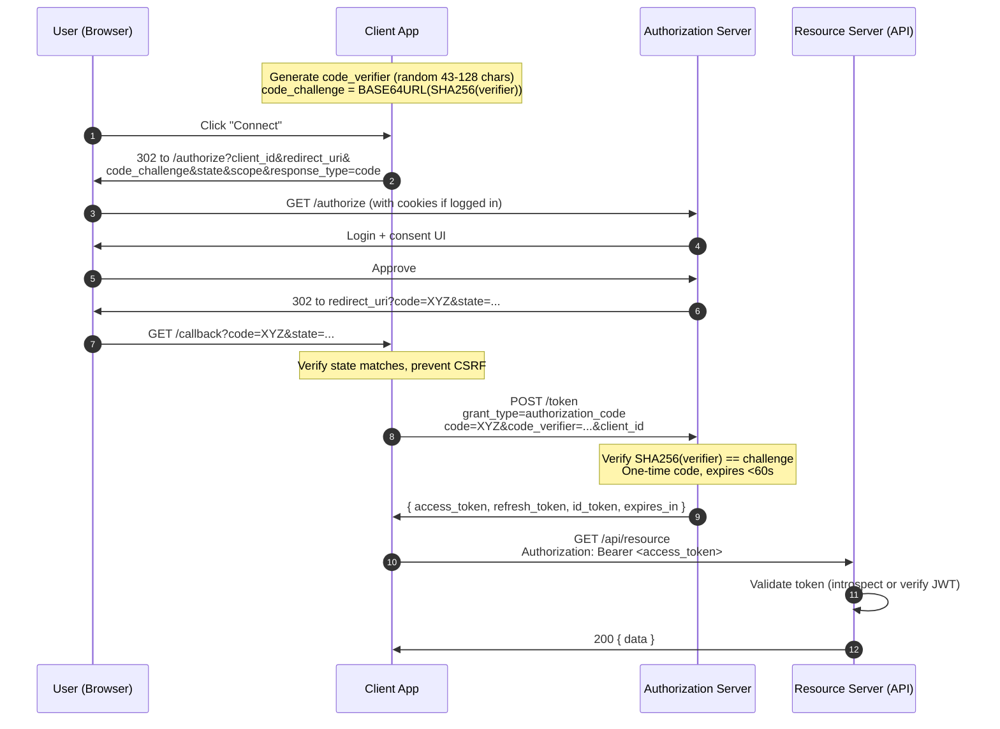
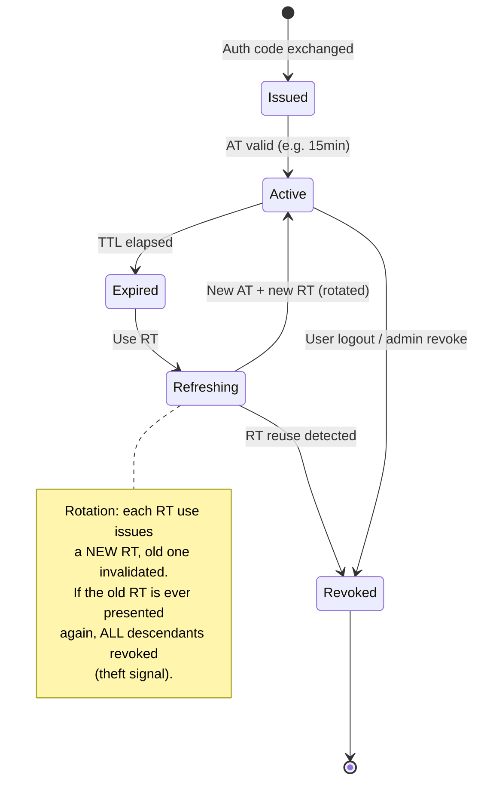
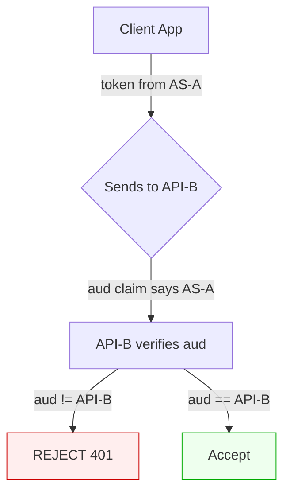

# OAuth 2.0 / OIDC

## Why This Exists

**Problem.** A user wants to grant a third-party app limited access to their data on your service without handing over their password. Or: a user wants to sign in to your app with their existing identity from Google/Okta/Entra ID. These are *different problems* — delegation vs authentication — and conflating them produced a decade of CVEs.

**Key insight.** OAuth 2.0 is an **authorization framework** (RFC 6749). It answers: *"Can this client act on this user's behalf with these scopes?"* OIDC layers on top and answers: *"Who is this user?"* via a signed **ID token** (JWT). Access tokens are credentials for APIs; ID tokens are assertions about the user. **Treating them interchangeably is the single most common bug.**

**The modern default in 2024+** is the **Authorization Code flow with PKCE** (RFC 7636) for *every* client type — confidential server apps, SPAs, mobile, desktop, CLI. The old advice ("implicit flow for SPAs", "ROPC for first-party apps") is dead. The OAuth 2.0 Security BCP (RFC 9700) and OAuth 2.1 draft codify this.

**Reach for this when:**
- Building a third-party API where external apps need scoped access to user data
- Adding "Sign in with Google/GitHub/Okta" to your app (you want OIDC, not raw OAuth)
- Designing service-to-service auth where one service acts on a user's behalf
- Auditing an existing flow for token-leak / replay / mix-up vulnerabilities
- Picking between session cookies, bearer tokens, and DPoP/mTLS-bound tokens
- Federating identity across an acquisition or B2B partnership (SAML or OIDC)

**Don't reach for this when:**
- **Pure machine-to-machine** with no user in the loop → use **Client Credentials** grant (a sub-flow of OAuth, but most of the PKCE/redirect/ID-token concerns don't apply). For non-HTTP, mTLS or signed requests (SigV4) are often simpler.
- **First-party web app, same origin, no third parties** → a plain **session cookie** with `Secure; HttpOnly; SameSite=Lax` is simpler, safer (no token-in-JS exposure), and sufficient. Don't OAuth your own monolith.
- **Internal microservices behind a mesh** → service-mesh mTLS (Istio, Linkerd) + SPIFFE identities is the right primitive. Bearer JWTs between internal services often add risk without benefit.
- **You need encrypted payloads, not just signatures** → JWE is heavy and rarely correctly implemented; consider TLS + signed JWT, or Macaroons / Biscuit for capability tokens.

## Diagrams

### Authorization Code + PKCE (the one you should use)



### Token lifecycle and refresh rotation



### Token-mix-up: why audience matters



## Core Patterns

### 1. The Authorization Code + PKCE flow (TypeScript, server-side client)

```typescript
// PKCE generation - do this fresh per authorization request, store in session
import crypto from "node:crypto";

function base64url(buf: Buffer): string {
  return buf.toString("base64").replace(/=/g, "").replace(/\+/g, "-").replace(/\//g, "_");
}

export function newPkce() {
  // RFC 7636 §4.1: verifier is 43-128 chars from [A-Z][a-z][0-9]-._~
  const verifier = base64url(crypto.randomBytes(32)); // 43 chars
  const challenge = base64url(crypto.createHash("sha256").update(verifier).digest());
  return { verifier, challenge, method: "S256" as const };
}

// State must be unguessable + bound to the user's session (CSRF defense)
export function newState() {
  return base64url(crypto.randomBytes(16));
}

// /login route — kicks off the flow
app.get("/login", (req, res) => {
  const { verifier, challenge, method } = newPkce();
  const state = newState();
  const nonce = base64url(crypto.randomBytes(16)); // OIDC: bind ID token to this session

  // CRITICAL: store verifier + state + nonce server-side keyed to the user's session.
  // NEVER put the verifier in a cookie sent to the browser; it must not leak.
  req.session.oauth = { verifier, state, nonce };

  const url = new URL("https://as.example.com/authorize");
  url.searchParams.set("response_type", "code");
  url.searchParams.set("client_id", CLIENT_ID);
  url.searchParams.set("redirect_uri", REDIRECT_URI); // MUST be pre-registered, exact match
  url.searchParams.set("scope", "openid profile email offline_access");
  url.searchParams.set("state", state);
  url.searchParams.set("nonce", nonce);
  url.searchParams.set("code_challenge", challenge);
  url.searchParams.set("code_challenge_method", method);
  res.redirect(url.toString());
});

// /callback — exchange code for tokens
app.get("/callback", async (req, res) => {
  const { code, state, error, error_description } = req.query;

  if (error) return res.status(400).send(`AS error: ${error} ${error_description}`);
  if (!req.session.oauth) return res.status(400).send("No flow in progress");

  // CSRF defense: state must match what we stored
  if (state !== req.session.oauth.state) {
    return res.status(400).send("State mismatch — possible CSRF");
  }

  const tokenRes = await fetch("https://as.example.com/token", {
    method: "POST",
    headers: {
      "Content-Type": "application/x-www-form-urlencoded",
      // Confidential clients authenticate. Public clients (SPA, mobile) omit this.
      Authorization: "Basic " + Buffer.from(`${CLIENT_ID}:${CLIENT_SECRET}`).toString("base64"),
    },
    body: new URLSearchParams({
      grant_type: "authorization_code",
      code: String(code),
      redirect_uri: REDIRECT_URI,
      code_verifier: req.session.oauth.verifier,
    }),
  });

  if (!tokenRes.ok) {
    // 400 here usually means: bad verifier, expired code, or code reused. Treat as fatal.
    return res.status(401).send("Token exchange failed");
  }

  const tokens = await tokenRes.json();
  // tokens = { access_token, token_type: "Bearer", expires_in, refresh_token, id_token, scope }

  // Verify ID token before trusting it (see next section)
  const claims = await verifyIdToken(tokens.id_token, req.session.oauth.nonce);

  // Establish a session — DO NOT just hand the access_token to the browser as a cookie.
  // Keep tokens server-side; issue your own session cookie.
  req.session.user = { sub: claims.sub, email: claims.email };
  req.session.tokens = tokens;
  delete req.session.oauth;

  res.redirect("/");
});
```

### 2. Verifying an OIDC ID token (the part everyone gets wrong)

```typescript
import { jwtVerify, createRemoteJWKSet } from "jose";

const JWKS = createRemoteJWKSet(new URL("https://as.example.com/.well-known/jwks.json"));

export async function verifyIdToken(idToken: string, expectedNonce: string) {
  const { payload, protectedHeader } = await jwtVerify(idToken, JWKS, {
    // OIDC Core §3.1.3.7 validation steps
    issuer: "https://as.example.com",          // iss must match exactly
    audience: CLIENT_ID,                        // aud must contain our client_id
    algorithms: ["RS256", "ES256"],             // NEVER allow "none". NEVER allow HS256 with a public key.
    clockTolerance: 30,                         // small skew window
  });

  // Manually verify nonce — jose doesn't do this automatically
  if (payload.nonce !== expectedNonce) {
    throw new Error("nonce mismatch — possible replay");
  }

  // azp (authorized party) check when multiple audiences
  if (Array.isArray(payload.aud) && payload.aud.length > 1) {
    if (payload.azp !== CLIENT_ID) throw new Error("azp mismatch");
  }

  return payload;
}
```

**The cardinal sins this code prevents:**
1. Accepting `alg: none` (CVE-2015-9235 class — JWT library footgun)
2. Accepting an HS256 token signed with the public key as if it were the secret (alg confusion)
3. Skipping `iss` / `aud` checks → token from a different tenant or app accepted
4. Skipping `nonce` → replay of a captured ID token
5. Trusting the token without fetching JWKS → can't rotate keys

### 3. Refresh token rotation with reuse detection

```typescript
// Pseudocode for the AS side. The CLIENT side just retries with the new RT.
async function exchangeRefreshToken(presented: string) {
  const rt = await db.refreshTokens.findOne({ token_hash: hash(presented) });
  if (!rt) throw new InvalidGrantError("unknown refresh token");

  if (rt.used_at) {
    // RT reuse = theft signal. Revoke the entire token family.
    await db.refreshTokens.updateMany(
      { family_id: rt.family_id },
      { revoked_at: new Date(), revoke_reason: "reuse_detected" }
    );
    // Also revoke any access tokens issued from this family
    await invalidateAccessTokensByFamily(rt.family_id);
    throw new InvalidGrantError("refresh token reuse detected");
  }

  if (rt.revoked_at || rt.expires_at < new Date()) {
    throw new InvalidGrantError("refresh token expired/revoked");
  }

  // Mark old RT as used, mint new RT in same family
  await db.refreshTokens.update(rt.id, { used_at: new Date() });
  const newRt = await db.refreshTokens.create({
    family_id: rt.family_id,            // chain links back to original auth
    token_hash: hash(generate()),
    expires_at: addDays(new Date(), 30),
    user_id: rt.user_id,
    client_id: rt.client_id,
    scopes: rt.scopes,
  });
  const accessToken = mintAccessToken(rt.user_id, rt.client_id, rt.scopes);
  return { access_token: accessToken, refresh_token: newRt.token, expires_in: 900 };
}
```

This pattern (Auth0, Okta, and the OAuth 2.0 Security BCP §4.14 all recommend it) gives you a **theft tripwire**: if a thief and the legit client both try to use the same RT, one succeeds and the next exchange burns down the whole family.

### 4. Resource server: validating an access token

Two flavors. Pick one and document it for clients.

**JWT access tokens (self-contained, fast).** Validate signature + iss + aud + exp + scope locally:

```typescript
async function authMiddleware(req, res, next) {
  const auth = req.headers.authorization;
  if (!auth?.startsWith("Bearer ")) return res.status(401).send("missing bearer");
  const token = auth.slice(7);

  try {
    const { payload } = await jwtVerify(token, JWKS, {
      issuer: "https://as.example.com",
      audience: "https://api.example.com", // THIS API's identifier — RFC 8707
      algorithms: ["RS256"],
    });
    req.user = { sub: payload.sub, scopes: String(payload.scope ?? "").split(" ") };
    next();
  } catch (e) {
    res.status(401).set("WWW-Authenticate", `Bearer error="invalid_token"`).send();
  }
}

function requireScope(scope: string) {
  return (req, res, next) =>
    req.user.scopes.includes(scope) ? next() : res.status(403).send("insufficient_scope");
}

app.get("/api/orders", authMiddleware, requireScope("orders:read"), getOrders);
```

**Opaque access tokens (revocable, requires AS round-trip).** Use RFC 7662 introspection:

```typescript
const introspectionCache = new LRUCache({ max: 10000, ttl: 60_000 });

async function introspect(token: string) {
  const cached = introspectionCache.get(token);
  if (cached) return cached;

  const r = await fetch("https://as.example.com/introspect", {
    method: "POST",
    headers: {
      "Content-Type": "application/x-www-form-urlencoded",
      Authorization: "Basic " + b64(`${RS_ID}:${RS_SECRET}`),
    },
    body: new URLSearchParams({ token }),
  });
  const data = await r.json();
  // Cache only if active=true; cache TTL must be << token lifetime
  if (data.active) introspectionCache.set(token, data);
  return data;
}
```

**Trade-off:** opaque tokens give you instant revocation; JWTs give you scale (no AS hop) but are revocable only via short TTLs + a denylist. Most large-scale APIs (Google, GitHub) use JWTs with TTLs measured in minutes.

### 5. Public client (SPA / mobile / native) — no client secret

```typescript
// SPA in browser. PKCE is MANDATORY (no client secret to authenticate with).
// Tokens MUST NOT be stored in localStorage (XSS exfiltration). Options:
//   1. In-memory only + silent refresh via iframe + first-party cookie session at AS
//   2. BFF (Backend-for-Frontend) pattern — server holds tokens, browser holds session cookie
// Option 2 is the OAuth 2.0 BCP recommendation in 2024+.

// Mobile native: use the system browser (ASWebAuthenticationSession on iOS,
// Custom Tabs on Android). NEVER an embedded WebView — it can phish credentials
// and bypasses the OS credential manager. Use claimed-https redirect URIs
// (App Links / Universal Links), not custom schemes (vulnerable to interception).
```

## Trade-offs

| Benefit | Cost |
|---|---|
| **Authorization Code + PKCE** works for every client type, prevents code interception | Round-trips and redirects feel heavy for simple cases |
| **JWT access tokens** scale to millions of RPS, no AS dependency on hot path | Revocation is hard; long TTL = long blast radius if leaked |
| **Opaque access tokens** revocable instantly, hide claims from client | Every API call needs introspection (or short cache); AS becomes a SPOF |
| **Refresh token rotation** detects theft, limits replay window | Stateful storage at AS; rotation races on flaky networks need replay grace |
| **OIDC ID token (JWT)** standard claims, federation works across vendors | Misuse: people ship the ID token to APIs as if it were an access token |
| **Short access token TTL (5–15 min)** small leak window | More refresh traffic; clock skew issues; UX glitches if RT also expires |
| **Long refresh token TTL (30–90 days)** smooth UX, fewer logins | Bigger prize for attackers; rotation + reuse detection mandatory |
| **DPoP / mTLS-bound tokens (RFC 9449, RFC 8705)** sender-constrained, leak-resistant | Implementation complexity; client key management; not all libraries support |
| **BFF pattern for SPAs** tokens never reach JS; XSS can't exfiltrate | Extra hop, extra service to run; defeats some "static SPA" architectures |
| **Implicit flow** simple, one round-trip | **Don't.** Tokens in URL fragment leak via Referer, history, logs. Deprecated by RFC 9700 |
| **ROPC (password grant)** lets you keep your own login UI | **Don't.** Trains users to type passwords into apps; impossible to add MFA/SSO; deprecated |

## Common Pitfalls

- **Implicit flow with `response_type=token`.** Access tokens in the URL fragment end up in browser history, server logs, and `Referer` headers. Use Authorization Code + PKCE even for SPAs. RFC 9700 §2.1.2 is unambiguous.
- **Resource Owner Password Credentials (ROPC).** Spec'd for legacy migration only. Disables MFA, federation, and breaks the trust model. OAuth 2.1 removes it entirely.
- **Sending the ID token as `Authorization: Bearer`.** ID tokens are for the *client* to learn who the user is. APIs should only accept *access tokens*. ID tokens used as access tokens often have wrong audience and longer lifetimes — a classic CVSS 8+ finding.
- **No `aud` validation on the resource server.** A token minted for `api-A` accepted by `api-B` is the OAuth equivalent of confused deputy. RFC 8707 (Resource Indicators) lets clients explicitly bind tokens to a target.
- **No `iss` validation.** In multi-tenant or federation setups, tokens from a different IdP get accepted. Always pin issuers.
- **Open redirect on `redirect_uri`.** If your AS does prefix matching instead of exact matching (`https://app.example.com/cb*`), an attacker registers `…/cb?next=evil` and exfiltrates codes. Exact match only.
- **Storing tokens in `localStorage` / `sessionStorage`.** Any XSS reads them. Use HttpOnly cookies (BFF) or in-memory + silent refresh.
- **Embedded WebView on mobile for the auth flow.** Lets the host app keylog the password. Apple App Store and Google Play increasingly reject this. Use the system browser surface.
- **PKCE without S256.** The `plain` method offers zero protection — the verifier IS the challenge. Always require `S256`. Some old AS implementations let `plain` slip through.
- **Skipping `state`.** No CSRF defense on the callback. Attacker initiates a flow in their own browser, gets you to complete it, and ends up with their account linked to your session.
- **Long-lived access tokens with no introspection.** A leaked 90-day JWT is sovereign immortal authority until rotation. Either short TTLs OR introspection — pick one.
- **`alg: none` and HS256 confusion.** A library that accepts `alg: none` (CVE-2015-9235) or treats your RSA public key as an HS256 secret is a remote auth bypass. Pin algorithms in your verifier.
- **Refresh tokens issued to public clients without rotation.** Auth0's 2018 advisory and the OAuth Security BCP both require rotation + reuse detection for public clients.
- **Conflating scope with permission.** `scope=admin` on a token does not mean the user is an admin — it means the *token* is permitted to invoke admin APIs. Authorization checks must still consult your authoritative permission store.
- **Forgetting to revoke on logout.** RFC 7009 token revocation exists for a reason. Logout that only clears the cookie leaves the access token + refresh token live until expiry.

## Decision Table

| Situation | Use | Don't use | Why |
|---|---|---|---|
| Web app w/ backend, third-party API access | Authorization Code + PKCE (confidential client) | Implicit, ROPC | Standard, secure, supports refresh |
| SPA (no backend) | Auth Code + PKCE, tokens in memory + silent refresh | localStorage tokens, implicit flow | XSS exfiltrates anything in JS-accessible storage |
| SPA + want best security | BFF pattern: server holds tokens, browser gets session cookie | Direct token-to-browser | OAuth 2.0 BCP 2024+ recommendation |
| Mobile/native app | Auth Code + PKCE via system browser, claimed-https redirect | Embedded WebView, custom URI scheme | App-to-app interception of custom schemes |
| CLI / desktop | Auth Code + PKCE w/ loopback redirect (`http://127.0.0.1:<port>`) or device flow | ROPC, hardcoded secrets | RFC 8252 §7.3 |
| Smart TV, console (no keyboard) | Device Authorization Grant (RFC 8628) | ROPC | User auths on a second device |
| Service-to-service (no user) | Client Credentials grant, or mTLS, or AWS SigV4 | Reusing user tokens | Different threat model — no delegation |
| Sign-in only (no API access) | OIDC Auth Code + PKCE, consume `id_token` | OAuth without OIDC | OAuth alone doesn't say who the user is |
| Need user identity for an API call too | OIDC + access token, validate ID token client-side, send AT to API | Send ID token to API | Different audiences, different lifetimes |
| Need instant revocation | Opaque tokens + introspection, OR short JWT TTL + denylist | Long-lived JWTs without revocation strategy | JWTs are not natively revocable |
| First-party monolith, single domain | Plain session cookies | OAuth | Simpler, fewer attack surfaces |
| Internal mesh service-to-service | mTLS + SPIFFE | Bearer JWTs | Bearer = anyone holding it; mTLS binds to identity |
| High-value tokens (banking, admin) | DPoP (RFC 9449) or mTLS-bound (RFC 8705) | Plain bearer | Sender-constrained, leak-resistant |
| Federating with enterprise IdP | OIDC if available, SAML if legacy | Custom | Standards work; custom doesn't |

## References

**Primary specs:**
- Hardt — *RFC 6749: The OAuth 2.0 Authorization Framework* — https://datatracker.ietf.org/doc/html/rfc6749
- Sakimura, Bradley, Agarwal — *RFC 7636: Proof Key for Code Exchange (PKCE)* — https://datatracker.ietf.org/doc/html/rfc7636
- Jones, Bradley, Sakimura — *RFC 7519: JSON Web Token (JWT)* — https://datatracker.ietf.org/doc/html/rfc7519
- Richer — *RFC 7662: OAuth 2.0 Token Introspection* — https://datatracker.ietf.org/doc/html/rfc7662
- Lodderstedt, Dronia, Scurtescu — *RFC 7009: OAuth 2.0 Token Revocation* — https://datatracker.ietf.org/doc/html/rfc7009
- Denniss, Bradley — *RFC 8252: OAuth 2.0 for Native Apps (BCP 212)* — https://datatracker.ietf.org/doc/html/rfc8252
- Denniss, Bradley, Jones, Tschofenig — *RFC 8628: OAuth 2.0 Device Authorization Grant* — https://datatracker.ietf.org/doc/html/rfc8628
- Campbell et al. — *RFC 8705: Mutual-TLS Client Authentication and Certificate-Bound Tokens* — https://datatracker.ietf.org/doc/html/rfc8705
- Campbell, Bradley, Jones — *RFC 8707: Resource Indicators for OAuth 2.0* — https://datatracker.ietf.org/doc/html/rfc8707
- Fett, Campbell, Bradley, Lodderstedt, Jones, Waite — *RFC 9449: OAuth 2.0 Demonstrating Proof of Possession (DPoP)* — https://datatracker.ietf.org/doc/html/rfc9449
- Lodderstedt, Bradley, Labunets, Fett — *RFC 9700: Best Current Practice for OAuth 2.0 Security* — https://datatracker.ietf.org/doc/html/rfc9700
- Hardt, Parecki, Lodderstedt — *OAuth 2.1 (draft-ietf-oauth-v2-1)* — https://datatracker.ietf.org/doc/html/draft-ietf-oauth-v2-1
- Sakimura, Bradley, Jones, de Medeiros, Mortimore — *OpenID Connect Core 1.0* — https://openid.net/specs/openid-connect-core-1_0.html
- *OpenID Connect Discovery 1.0* — https://openid.net/specs/openid-connect-discovery-1_0.html

**Practitioner guides:**
- Parecki — *OAuth 2.0 Simplified* — https://www.oauth.com/
- Auth0 — *Refresh Token Rotation* — https://auth0.com/docs/secure/tokens/refresh-tokens/refresh-token-rotation
- Okta — *OAuth 2.0 and OpenID Connect Overview* — https://developer.okta.com/docs/concepts/oauth-openid/
- Google — *OAuth 2.0 for Web Server Applications* — https://developers.google.com/identity/protocols/oauth2/web-server
- Curity — *OAuth Tools and Token Handler / BFF Pattern* — https://curity.io/resources/learn/the-token-handler-pattern/

**Security research:**
- Fett, Küsters, Schmitz — *A Comprehensive Formal Security Analysis of OAuth 2.0* (CCS 2016) — https://arxiv.org/abs/1601.01229
- Mainka, Mladenov, Schwenk, Wich — *SoK: Single Sign-On Security — An Evaluation of OpenID Connect* (EuroS&P 2017) — https://www.nds.rub.de/research/publications/sok-sso-security/
- Google — *Building Secure and Reliable Systems* (chapters 5 "Design for Understandability" and 14 "Deploying Code") — https://sre.google/books/building-secure-reliable-systems/

**Books / chapter refs:**
- Kleppmann — *Designing Data-Intensive Applications* — Chapter 4 "Encoding and Evolution" (token formats, schema evolution); Chapter 9 "Consistency and Consensus" (session vs token tradeoffs in distributed auth)
- Anderson — *Security Engineering, 3rd ed.* — Chapter 4 "Access Control" and Chapter 18 "Banking and Bookkeeping" — https://www.cl.cam.ac.uk/~rja14/book.html

## See Also

- `../authn/` — when cookies beat tokens, fixation, hijacking
- `../authz/` — what to do *after* the token validates: RBAC/ABAC, scopes vs claims.
- `../jwt/` — the bearer token format, signing, key rotation, the 'alg: none' family of mistakes.
- `../saml/` — the enterprise SSO predecessor; when SAML wins, when OIDC wins.
- `../mtls/` — service-to-service authentication when bearer tokens are inappropriate.
- `../zero-trust/` — context-aware access where every request reauthenticates.
- `../../communication/api-gateway/` — token introspection and edge-validation patterns.
