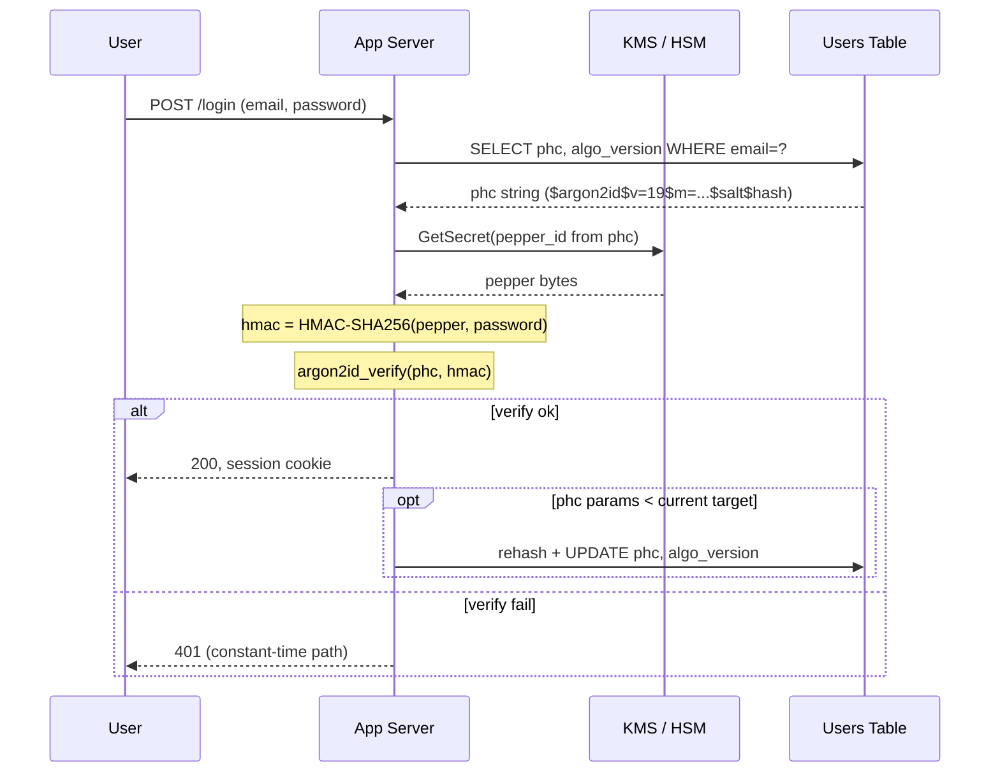
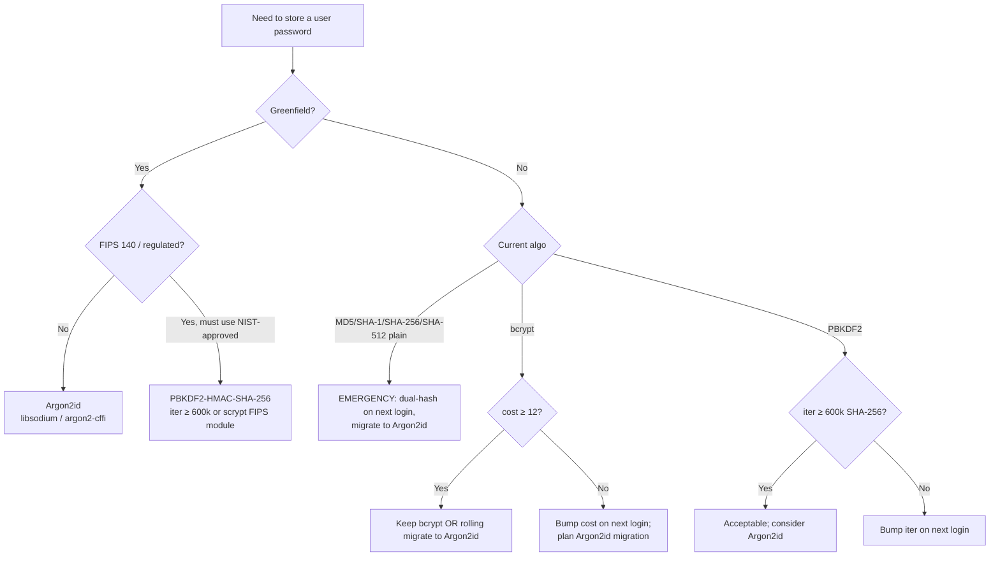

# Password Storage

## Why This Exists

**Problem.** Users reuse passwords across sites. When your database leaks — and it will leak, eventually — every user whose hash an attacker can crack is also compromised on their bank, email, and employer. Storing a password as plaintext, MD5, SHA-1, SHA-256, or any "fast" hash means a leak gets cracked in hours on a $2k GPU rig. The cost of a bad scheme is paid by your users, on systems you don't own, years after the breach.

**Key insight.** A password hash function is **not** a general-purpose hash. You want it to be **deliberately slow and memory-hungry** — fast enough that one legit login takes ~250 ms on your server, slow enough that an attacker with 10,000 GPUs still can't grind through a leaked dump in a reasonable time. This is a one-way ratchet: every year, hardware gets cheaper and attackers get faster, so the bar moves up. **Argon2id is the 2026 default** because it's memory-hard, which neutralizes the GPU/ASIC advantage that keeps shrinking bcrypt's safety margin.

**Reach for this when:**
- You're storing user-chosen secrets (passwords, PINs, recovery phrases) that humans will type.
- You're picking a KDF for a new service or migrating an existing one off a fast/weak hash.
- A pen-test or audit flagged "uses MD5/SHA-1/SHA-256/SHA-512 for passwords" or "no salt".
- You're tuning cost parameters and need to balance login latency vs. cracking cost.
- You're defending against password-spray (one common password, many usernames) and credential-stuffing (leaked username/password pairs replayed) attacks.

**Don't reach for this when:**
- You need to hash high-entropy machine secrets (API keys, session tokens). Use HMAC-SHA-256 or just store them as random bytes — they don't need a slow KDF, and using one wastes CPU.
- You need a MAC, signature, or content hash. Use HMAC, Ed25519, BLAKE3.
- You can avoid passwords entirely. Passkeys (WebAuthn) eliminate this whole class of risk. **If you're greenfield in 2026, prefer passkeys with passwords as fallback.**
- You need encryption-at-rest for a non-password secret. Use AES-GCM or libsodium `secretbox`.

## Diagrams

### Login flow with peppered Argon2id



### Algorithm-family decision



## Algorithm comparison (the actual numbers)

| Algorithm   | Year | Memory-hard | GPU-resistant | ASIC-resistant | Side-channel-resistant | FIPS-approved | OWASP 2026 default? |
|-------------|------|-------------|---------------|----------------|------------------------|---------------|----------------------|
| MD5         | 1992 | No          | No            | No             | n/a                    | No            | **NEVER**            |
| SHA-1/2 plain | 1995/2001 | No   | No            | No             | n/a                    | Yes (hash)    | **NEVER for passwords** |
| PBKDF2-HMAC-SHA-256 | 2000 | No   | Weak          | No             | Yes                    | **Yes**       | Acceptable for FIPS  |
| bcrypt      | 1999 | Slightly (4 KiB) | Modest    | Modest         | Yes                    | No            | Acceptable           |
| scrypt      | 2009 | **Yes**     | Strong        | Modest         | Partial                | Yes (SP 800-185 family in some modules) | Acceptable |
| Argon2id    | 2015 (PHC winner) | **Yes** | **Strong** | **Strong**    | **Yes** (id variant)   | Approved by NIST in SP 800-63B-4 (2024)  | **Yes — preferred** |

The "id" in Argon2id means hybrid: first pass is data-independent (resists side-channel timing leaks), subsequent passes are data-dependent (resists tradeoff attacks). Don't pick Argon2i (timing-attack resistance only, weaker against TMTO) or Argon2d (GPU-resistance only, leaks via cache timing). **Always Argon2id.**

## Recommended parameters (2026, OWASP)

These are starting points. **You must measure on your own hardware** and tune to your latency budget (typical target: 250–500 ms per verify on a single core).

| Algorithm | OWASP 2026 minimum | Notes |
|-----------|---------------------|-------|
| Argon2id  | `m=19 MiB, t=2, p=1` (memory-constrained) OR `m=64 MiB, t=3, p=4` (server-class) | Memory cost dominates; raise `m` before `t`. |
| scrypt    | `N=2^17 (131072), r=8, p=1` (~128 MiB) | r=8, p=1 are conventional; vary N. |
| bcrypt    | `cost=12` (= 2^12 iterations) minimum, `cost=13–14` preferred for new systems | Truncates input to 72 bytes — pre-hash with HMAC-SHA-256 if longer. |
| PBKDF2    | HMAC-SHA-256, **600,000 iterations** (or HMAC-SHA-512 with 210,000) | Use only when FIPS-mandated. Re-tune annually. |

**Salt: 16 bytes from a CSPRNG, unique per password, stored alongside the hash.** All four algorithms above generate and embed the salt for you when you use the standard `phc-string` output format.

**Pepper: 32 bytes from a CSPRNG, stored in KMS/HSM, *not* in the DB.** Apply as `HMAC-SHA-256(pepper, password)` *before* feeding to the KDF. A pepper turns a DB-only leak into a non-event because the attacker has the hashes but not the secret. See "Pepper" section below.

## Reference implementation: Python (argon2-cffi)

```python
# pip install argon2-cffi
# Argon2id with peppered HMAC pre-hash and PHC string storage.
from argon2 import PasswordHasher, exceptions as argon2_exc
from argon2.profiles import RFC_9106_HIGH_MEMORY  # m=2 GiB; we'll override
import hmac, hashlib, secrets, os

# --- 1. Tuned parameters. MEASURE on prod-like hardware. ---
# These values target ~300ms per verify on a c6i.large (Skylake, 2 vCPU).
# Re-benchmark every 12 months and bump.
PH = PasswordHasher(
    time_cost=3,        # t — number of passes
    memory_cost=64*1024, # m — KiB; 64 MiB
    parallelism=4,      # p — lanes (must be ≤ available CPU)
    hash_len=32,
    salt_len=16,
)

# --- 2. Pepper: load from KMS at process start, never from disk plaintext. ---
PEPPER = bytes.fromhex(os.environ["AUTH_PEPPER_HEX"])  # injected by KMS sidecar
assert len(PEPPER) == 32, "pepper must be 32 bytes"

def _prehash(password: str) -> bytes:
    # HMAC pre-hash gives us:
    #   (a) pepper application
    #   (b) fixed-length input (avoids bcrypt-style 72-byte truncation gotcha if we ever switch)
    #   (c) defense if argon2 ever has a length-extension surprise
    return hmac.new(PEPPER, password.encode("utf-8"), hashlib.sha256).digest()

def hash_password(password: str) -> str:
    """Returns a PHC string: $argon2id$v=19$m=65536,t=3,p=4$<salt>$<hash>"""
    if len(password) > 1024:
        # Reject absurd inputs to avoid CPU DoS via giant passwords.
        # Cost is bounded anyway by HMAC, but be explicit.
        raise ValueError("password too long")
    return PH.hash(_prehash(password))

def verify_password(stored_phc: str, password: str) -> tuple[bool, str | None]:
    """Returns (ok, new_phc_or_None). If new_phc is non-None, persist it."""
    try:
        PH.verify(stored_phc, _prehash(password))
    except argon2_exc.VerifyMismatchError:
        return False, None
    except argon2_exc.InvalidHash:
        # Stored value is corrupt or from a non-Argon2 algorithm; treat as fail
        # but signal upstream to migrate (handled by the dual-hash adapter, see below).
        return False, None
    # Success. Check if we should rehash with stronger params.
    if PH.check_needs_rehash(stored_phc):
        return True, PH.hash(_prehash(password))
    return True, None
```

**Three things that code does that beginner tutorials skip:**

1. **Pepper via HMAC pre-hash, not concat.** `HMAC(pepper, pw)` is cleaner than `pepper || pw` — it gives a fixed-size output, has formal MAC properties, and survives if you later switch KDFs.
2. **`check_needs_rehash`.** Every successful login is an opportunity to migrate that user to current params at zero extra cost. Without this, you have to force everyone to reset.
3. **Constant-time path on failure.** `argon2-cffi` uses constant-time comparison internally, but you also need to make sure your "user not found" branch does the same amount of work. See pitfalls below.

## Reference implementation: Go (golang.org/x/crypto/argon2)

```go
// go get golang.org/x/crypto/argon2
package auth

import (
	"crypto/hmac"
	"crypto/rand"
	"crypto/sha256"
	"crypto/subtle"
	"encoding/base64"
	"errors"
	"fmt"
	"strings"

	"golang.org/x/crypto/argon2"
)

// Tuned for ~300ms on a Graviton3 (c7g.large). Benchmark on YOUR hardware.
const (
	argonTime    = 3
	argonMemory  = 64 * 1024 // 64 MiB
	argonThreads = 4
	argonKeyLen  = 32
	saltLen      = 16
)

var (
	ErrIncompatibleHash = errors.New("incompatible hash format")
	ErrAlgoMismatch     = errors.New("hash uses different algorithm version")
)

// pepper is loaded from KMS at startup. 32 random bytes.
var pepper []byte

func prehash(password string) []byte {
	mac := hmac.New(sha256.New, pepper)
	mac.Write([]byte(password))
	return mac.Sum(nil)
}

// HashPassword returns a PHC-formatted string: $argon2id$v=19$m=65536,t=3,p=4$<salt>$<hash>
func HashPassword(password string) (string, error) {
	if len(password) > 1024 {
		return "", errors.New("password too long")
	}
	salt := make([]byte, saltLen)
	if _, err := rand.Read(salt); err != nil {
		return "", err
	}
	hash := argon2.IDKey(prehash(password), salt, argonTime, argonMemory, argonThreads, argonKeyLen)
	b64salt := base64.RawStdEncoding.EncodeToString(salt)
	b64hash := base64.RawStdEncoding.EncodeToString(hash)
	return fmt.Sprintf("$argon2id$v=%d$m=%d,t=%d,p=%d$%s$%s",
		argon2.Version, argonMemory, argonTime, argonThreads, b64salt, b64hash), nil
}

// VerifyPassword returns (ok, needsRehash, error).
// If needsRehash is true, the caller MUST persist a fresh hash with current params.
func VerifyPassword(phc, password string) (bool, bool, error) {
	parts := strings.Split(phc, "$")
	if len(parts) != 6 || parts[1] != "argon2id" {
		return false, false, ErrIncompatibleHash
	}
	var version int
	if _, err := fmt.Sscanf(parts[2], "v=%d", &version); err != nil || version != argon2.Version {
		return false, false, ErrAlgoMismatch
	}
	var m, t uint32
	var p uint8
	if _, err := fmt.Sscanf(parts[3], "m=%d,t=%d,p=%d", &m, &t, &p); err != nil {
		return false, false, ErrIncompatibleHash
	}
	salt, err := base64.RawStdEncoding.DecodeString(parts[4])
	if err != nil {
		return false, false, err
	}
	want, err := base64.RawStdEncoding.DecodeString(parts[5])
	if err != nil {
		return false, false, err
	}
	got := argon2.IDKey(prehash(password), salt, t, m, p, uint32(len(want)))
	// subtle.ConstantTimeCompare is the only way to compare; bytes.Equal leaks via timing.
	if subtle.ConstantTimeCompare(got, want) != 1 {
		return false, false, nil
	}
	needsRehash := m < argonMemory || t < argonTime || p < argonThreads
	return true, needsRehash, nil
}
```

## The pepper, in detail

A pepper is a server-side secret applied to every password. Salts are public (in the DB row). The pepper is **not**.

**Threat model the pepper closes:** SQL injection, backup theft, read-only DB leak. The attacker walks away with hashes + salts but no pepper, so even a perfect cracking rig gets nothing — the keyspace they're attacking is `2^256` (the pepper) instead of "all human passwords" (`2^25` realistic entropy).

**Threat model the pepper does *not* close:** RCE on the app server, memory dump of a running process, malicious insider with prod access. If the attacker can read app memory, they have the pepper.

**How to apply.** `HMAC-SHA-256(pepper, password)` then feed to Argon2id. Don't `password || pepper` — concatenation is brittle (length-extension, ambiguity if password contains the pepper bytes by accident, etc).

**Where to store.** AWS KMS / GCP KMS / HashiCorp Vault / on-prem HSM. The pepper should be retrievable only by the auth service's IAM role. Rotate it by versioning: store `pepper_id` alongside the hash in the DB so you can roll forward.

```sql
-- users table layout
CREATE TABLE users (
  id            BIGINT PRIMARY KEY,
  email         CITEXT UNIQUE NOT NULL,
  phc           TEXT   NOT NULL,                  -- $argon2id$...
  pepper_id     SMALLINT NOT NULL DEFAULT 1,      -- which KMS key version
  algo_version  SMALLINT NOT NULL DEFAULT 3,      -- internal "auth scheme" rev
  created_at    TIMESTAMPTZ NOT NULL DEFAULT now(),
  updated_at    TIMESTAMPTZ NOT NULL DEFAULT now()
);
```

**Rotating the pepper.** Adding a new pepper version is easy: write a new pepper to KMS, rev `pepper_id`, hash all *new* registrations and password-changes with it. Migrating existing rows requires either (a) a forced password reset, or (b) a "double pepper" trick where you re-encrypt by computing `H(pepper_v2, H(pepper_v1, pw))` server-side using the stored old hash — this works only if you stored the *raw* HMAC output as the salt input, which most schemes don't. In practice: **rotate on breach, not on schedule**, unless you've designed the migration up front.

## Cost tuning: how to actually pick numbers

Don't copy params from a blog post. **Measure.**

```python
# benchmark.py — run on prod-like hardware, NOT your laptop.
import time, statistics
from argon2 import PasswordHasher

TARGET_MS = 300  # your latency budget per verify

for m_kib in [16*1024, 32*1024, 64*1024, 128*1024]:
    for t in [1, 2, 3, 4]:
        ph = PasswordHasher(time_cost=t, memory_cost=m_kib, parallelism=4)
        h = ph.hash(b"benchmark")
        samples = []
        for _ in range(20):
            s = time.perf_counter()
            ph.verify(h, b"benchmark")
            samples.append((time.perf_counter() - s) * 1000)
        med = statistics.median(samples)
        marker = " <-- candidate" if abs(med - TARGET_MS) < 50 else ""
        print(f"m={m_kib//1024} MiB, t={t}: {med:.0f} ms{marker}")
```

**Rules of thumb:**

- **Memory first, then time.** Doubling `m` doubles GPU/ASIC cost roughly linearly. Doubling `t` only doubles serial cost. Memory-hardness is the whole point.
- **Single core per verify is enough** for parallelism. `p=4` is conventional but `p=1` is fine for low-CPU environments. Don't set `p` higher than your available cores or you starve other requests.
- **Don't go below 19 MiB** even on memory-constrained devices (this is OWASP 2026 floor for Argon2id `m`).
- **Re-tune at least annually.** Hardware gets faster ~15%/year. Your 2026 numbers are 2030's "fast hash."

### Capacity planning

If you target 300 ms per verify on a single core, a 4-core server can do ~13 logins/sec sustained. Login is bursty (Monday morning, password resets) — size for **5–10× your steady-state QPS**, not the average. If you have a million daily actives and 3% log in per peak hour, that's 8.3 logins/sec average → 80 logins/sec peak → 6+ cores burning just on auth at peak. Either provision for it, or put a queue + rate limiter in front so you fail fast instead of pile-up.

## Migration: replacing a weak scheme without breaking everyone

You inherited a system using SHA-256 (or worse, plain MD5). Don't force a global password reset — that wrecks UX and most users will pick worse passwords on the way out.

**Pattern: dual-hash, lazy migration.**

```python
def verify_and_migrate(stored_phc: str, legacy_hash: bytes | None,
                       legacy_algo: str | None, password: str) -> tuple[bool, str | None]:
    """
    If user is on legacy scheme, verify against legacy AND if ok, return new Argon2id PHC.
    Caller persists the new PHC and clears legacy_hash.
    """
    if legacy_hash is not None:
        # Legacy path. Verify with legacy algorithm.
        if not _legacy_verify(legacy_algo, legacy_hash, password):
            return False, None
        # Legacy verified — issue new hash and signal migration.
        return True, hash_password(password)
    # Already migrated.
    ok, new_phc = verify_password(stored_phc, password)
    return ok, new_phc
```

**Aggressive variant: pre-wrap the legacy hash.** You don't have to wait for users to log in. Compute `Argon2id(prehash(legacy_sha256(pw)))` for every row in a batch, store as `$argon2id-wrapped-sha256$...`. Now every user is *immediately* protected at Argon2id strength, and on next login you can unwrap to a clean Argon2id of the actual password. The downside: you accumulate two layers permanently for users who never log in again. Most teams accept that.

**The migration timeline.**

```
Day 0:   Deploy new code. New users hashed with Argon2id. Existing users: dual-path.
Day 0+:  Wrap all legacy rows in a background job (optional but recommended).
Day 30:  ~70% of active users migrated via login. Audit count remaining.
Day 90:  Force password reset email for users still on legacy. Lock accounts that don't.
Day 180: Drop legacy_hash column. Delete migration code.
```

## Defense against password-spray and credential-stuffing

A slow hash protects against **offline** cracking after a breach. It does **nothing** against **online** spray (attacker tries `Summer2026!` against a list of usernames against your live login endpoint).

Layer these:

1. **Rate limit per IP and per account.** Per-IP catches naive spray; per-account catches distributed spray that rotates IPs but targets one user. Use exponential backoff: 1, 2, 4, 8, 16 seconds, then lockout.
2. **Breach-password check.** Block known-leaked passwords on registration and password-change using **HaveIBeenPwned k-anonymity API** (you send a 5-char SHA-1 prefix; you get back all suffixes; you check locally). This catches `Summer2026!` if it's in any breach corpus.
3. **CAPTCHA / proof-of-work** on the login endpoint after N failures from an IP/ASN. Cloudflare Turnstile, hCaptcha, or a homegrown PoW.
4. **MFA for anything sensitive.** Even SMS is better than nothing. TOTP > SMS. Passkey/WebAuthn > TOTP.
5. **Constant-time "user not found" path.** If `users.get(email)` returns None, you must still do a dummy Argon2id verify (against a fixed dummy PHC) before returning 401. Otherwise an attacker enumerates valid emails by timing. *The dummy PHC must be pre-computed at startup so it's not on the hot path.*
6. **Login-anomaly signal.** Geo-velocity (login from Lagos 5 minutes after login from Seattle), new-device challenges, impossible-travel — feed into MFA step-up, not into auto-block, so you don't lock out real users on flaky CGNAT.

## Trade-offs

| Benefit                                          | Cost                                                                                          |
|--------------------------------------------------|-----------------------------------------------------------------------------------------------|
| Argon2id memory-hardness defeats GPU/ASIC farms  | Each verify needs 64+ MiB RAM — concurrent logins can cause memory pressure on small servers   |
| Pepper turns a DB leak into a non-event          | KMS dependency on auth path; KMS outage = nobody can log in. Cache it in process memory       |
| `check_needs_rehash` migrates users transparently | Adds a write to a read-heavy code path; increases p99 of successful logins by one DB round-trip|
| 300 ms verify is hard to brute-force             | 300 ms verify means your login endpoint is slow; bursty traffic needs queueing/headroom        |
| Per-user salt prevents rainbow tables and dedup  | Can't use the hash as a dedup key — every account stores a unique hash even for same password  |
| HMAC pre-hash future-proofs algorithm swaps      | One extra HMAC per login (negligible cost, ~1 µs)                                              |
| Forced reset is the cleanest migration           | Users hate it; many won't return; many pick worse passwords                                    |
| Lazy migration preserves UX                      | Long tail of legacy hashes never gets migrated; you carry old code for years                   |
| Bcrypt is mature, vetted, ubiquitous             | Memory-only-4-KiB; modern GPU farms hit 10⁹ guesses/sec at cost=10. Margin shrinks each year   |
| PBKDF2 is FIPS-approved                           | Not memory-hard at all — worst GPU-resistance of the four; needs 600k+ iter to be acceptable   |

## Common Pitfalls

- **"We'll just use SHA-256, it's fast and cryptographic."** Fast is exactly the problem. SHA-256 hashes 10⁹/sec on a single GPU. A password leaked as SHA-256 is cracked the same day. Cryptographic ≠ password-suitable. *Real story: LinkedIn 2012 — 6.5M unsalted SHA-1 hashes leaked, 90%+ cracked within a week.*
- **No salt, or a global salt.** Same password → same hash → rainbow tables work, identical-password users visible in the DB. Salt must be unique per user. *Real story: Adobe 2013 — encrypted passwords with ECB mode, no salt; identical passwords identical ciphertexts; password hints leaked separately. Combined leak made cracking trivial.*
- **Salt stored in a different table or computed from username.** If the salt is `username`, two services that share usernames share salts — and an attacker who breaches both gets to amortize. Salts must be **random, unique, per-credential**, and embedded with the hash.
- **Bcrypt + long passwords silently truncated.** Bcrypt truncates input at 72 bytes. `"correct horse battery staple " * 100` → bcrypt only sees the first 72 chars → users picking long passphrases get a much weaker hash than they think. Pre-hash with HMAC-SHA-256 so the input is always 32 bytes.
- **Bcrypt + null byte truncation.** Some bcrypt implementations stop at the first null byte in the input. Combined with a unicode normalization bug, a password like `"hello\x00world"` may verify against `"hello"`. HMAC pre-hash kills this too.
- **Constant-time comparison forgotten on the hash output.** `if hash == stored:` leaks via early-return timing. Use `hmac.compare_digest` / `subtle.ConstantTimeCompare` / `crypto.timingSafeEqual`.
- **No constant-time path for "user not found".** Login takes 300 ms for real users, 5 ms for invalid emails → email enumeration. Always do a dummy verify against a pre-computed PHC when the user lookup misses.
- **Pepper checked into git.** It should be in KMS / Vault / sealed secret. If your repo or CI logs ever leak, the pepper is gone permanently and you must force a reset.
- **`check_needs_rehash` not wired up.** You bumped your `time_cost` from 2 to 3 last year. Six months later, 80% of your active users still verify at the old cost because nobody re-hashed them. Migration is silent — you have to instrument it.
- **No upper bound on password length.** Attacker submits a 100 MiB password → your server spends 30 seconds in HMAC-SHA-256 → CPU DoS. Cap at 1 KiB or 4 KiB at the request layer.
- **Memory-hard params on a tiny serverless function.** Lambda with 256 MiB memory + Argon2id at `m=64 MiB` and concurrent invocations → OOM kills. Either provision more memory, lower `m`, or batch behind a sized worker pool.
- **Storing the password in logs.** A `try/except` somewhere logs the request body on error. Now your CloudWatch contains plaintext passwords forever. Sanitize at the framework layer and add a regex-based scrubber to the log pipeline.
- **Returning a different error for "wrong password" vs "wrong email".** "Email not found" vs "Password incorrect" is a free user enumeration oracle. Always return the same generic message and the same status code.
- **Trusting client-side hashing.** "We hash the password in the browser before sending it!" — now the hashed value *is* the password. Whatever the client sends is what authenticates. Hash on the server. Always.
- **Migrating algorithms without bumping `algo_version`.** When your IR team asks "did this user log in with the old or new scheme?", you need to be able to answer.

## Decision Table

| Situation                                          | Choose                       | Don't choose                         | Why                                                                  |
|----------------------------------------------------|------------------------------|--------------------------------------|----------------------------------------------------------------------|
| New service, modern stack, no FIPS req             | **Argon2id**                 | bcrypt, PBKDF2                       | Memory-hard; 2026 OWASP and NIST SP 800-63B-4 default                 |
| New service, FIPS 140-2/3 mandated                 | **PBKDF2-HMAC-SHA-256, 600k iter** OR scrypt in a FIPS module | Argon2id (until your FIPS module supports it) | Compliance trumps cryptographic preference; document it             |
| Existing bcrypt, cost ≥ 12, no breach              | **Stay on bcrypt**, plan migration | Emergency rotation                   | Bcrypt at cost 12+ is still acceptable; migration is project work    |
| Existing bcrypt, cost ≤ 10                         | **Bump cost on next login** + plan Argon2id | Leave it                       | Cost 10 is a year or two from "trivially cracked" on commodity GPUs   |
| Existing PBKDF2, iter < 600k                       | **Bump iter on next login**  | Leave it                             | Old defaults (10k, 100k) are now too weak                            |
| Existing fast hash (MD5/SHA-1/SHA-256/SHA-512 plain) | **Wrap immediately** (Argon2id over SHA), force-reset over time | "We'll fix it next quarter"   | This is a P0 finding; treat as breach-imminent                       |
| Embedded device, ≤ 32 MiB RAM                      | **bcrypt** (cost 12) OR Argon2id with `m=8 MiB, t=4` | Argon2id at server params           | Memory budget; bcrypt's 4 KiB working-set is the lowest viable       |
| Lambda / FaaS with cold-start sensitivity          | **Argon2id `m=19 MiB, t=2`** (OWASP min) or move auth to a long-running service | Argon2id at server params | Cold start + 64 MiB allocation is painful; consider dedicated auth tier |
| Greenfield, can require modern browsers            | **Passkeys (WebAuthn)** with password fallback | Password-only                       | Passwords are a 50-year-old solution; passkeys eliminate phishing/spray entirely |
| Storing API keys / session tokens                  | **HMAC-SHA-256** or random bytes | Argon2id, bcrypt                     | High-entropy machine secrets don't need slow KDF; wastes CPU         |
| Need to compare hashes across two systems for dedup | **You can't, that's the point** | Sharing a salt                       | Per-user salt makes dedup impossible by design — re-architect         |

## References

**Primary specs and standards:**

- OWASP — Password Storage Cheat Sheet — https://cheatsheetseries.owasp.org/cheatsheets/Password_Storage_Cheat_Sheet.html
- NIST SP 800-63B-4 (Digital Identity Guidelines: Authentication) — https://pages.nist.gov/800-63-4/sp800-63b.html
- RFC 9106 — Argon2 Memory-Hard Function for Password Hashing and Proof-of-Work Applications — https://www.rfc-editor.org/rfc/rfc9106.html
- RFC 7914 — The scrypt Password-Based Key Derivation Function — https://www.rfc-editor.org/rfc/rfc7914.html
- RFC 8018 (PKCS #5 v2.1) — Password-Based Cryptography Specification (PBKDF2) — https://www.rfc-editor.org/rfc/rfc8018.html
- Password Hashing Competition (winner: Argon2) — https://www.password-hashing.net/

**Papers and analyses:**

- Biryukov, Dinu, Khovratovich — *Argon2: the memory-hard function for password hashing and other applications* (2015) — https://www.cryptolux.org/images/0/0d/Argon2.pdf
- Provos & Mazières — *A Future-Adaptable Password Scheme* (USENIX 1999, the bcrypt paper) — https://www.usenix.org/legacy/event/usenix99/provos/provos.pdf
- Percival — *Stronger Key Derivation via Sequential Memory-Hard Functions* (BSDCan 2009, the scrypt paper) — http://www.tarsnap.com/scrypt/scrypt.pdf

**Operational guidance:**

- Google BSRS — *Building Secure and Reliable Systems*, Chapter 5 "Design for Least Privilege" and Chapter 6 "Design for Understandability" — https://sre.google/books/building-secure-reliable-systems/
- AWS Builders' Library — *Reliability, constant work, and a good cup of coffee* (relevant to "constant-time auth path") — https://aws.amazon.com/builders-library/reliability-and-constant-work/
- Have I Been Pwned — *Pwned Passwords API (k-anonymity)* — https://haveibeenpwned.com/API/v3#PwnedPasswords
- Troy Hunt — *Pwned Passwords, Version 8* (history of breach corpus, design of k-anon API) — https://www.troyhunt.com/pwned-passwords-version-8/
- libsodium — Password hashing documentation (Argon2id reference impl) — https://doc.libsodium.org/password_hashing/default_phf

**For context on attack economics:**

- Hashcat benchmarks (per-algorithm GPU rates, updated continuously) — https://hashcat.net/wiki/doku.php?id=performance
- Colin Percival — *scrypt cost estimates* (the original "what does a hash cost an attacker" analysis) — http://www.tarsnap.com/scrypt/scrypt.pdf §7

## See Also

- `../authn/` — session management, MFA design, login flow architecture
- `../../reliability/rate-limiting/` — defending the login endpoint against online attacks
- `../audit-logging/` — what to log for auth events (and what to redact)
- `../../reliability/incident-response/` — what to do when hashes leak
