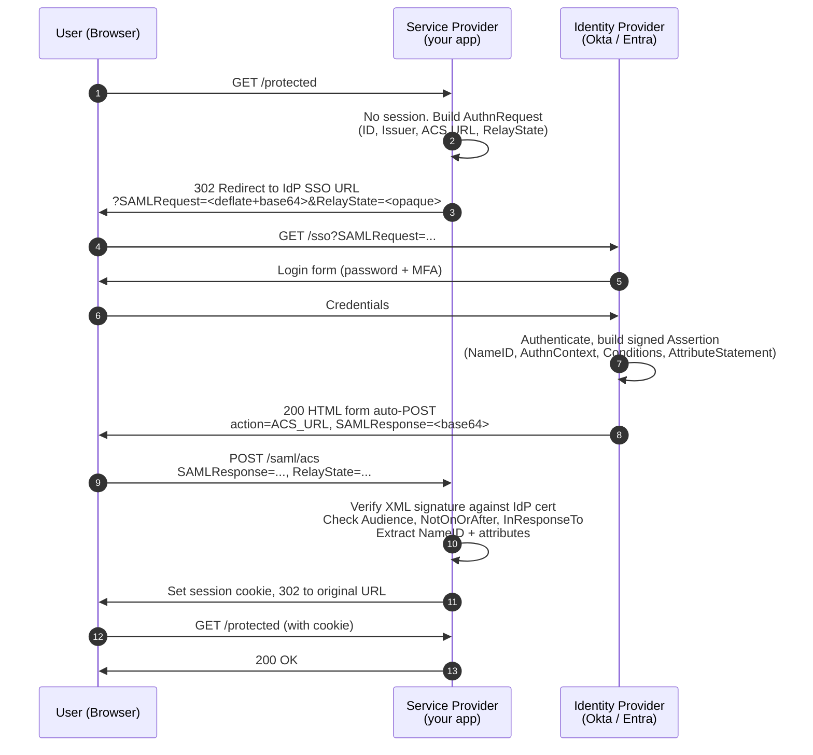
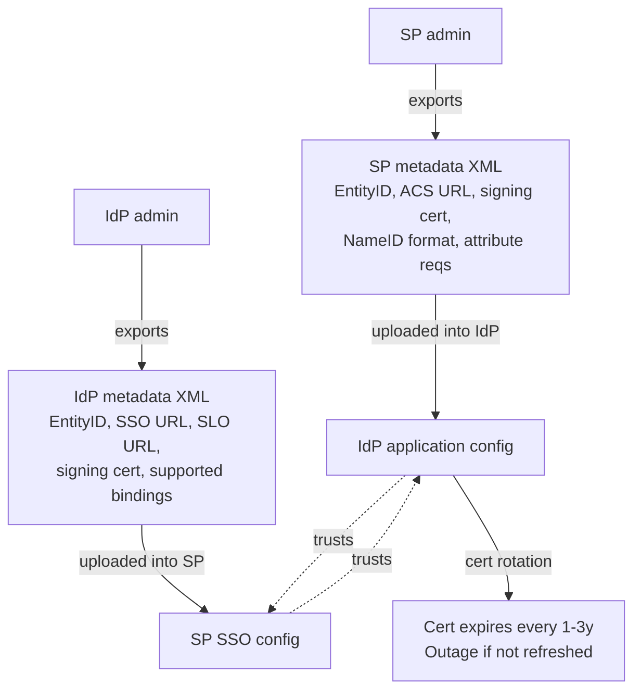
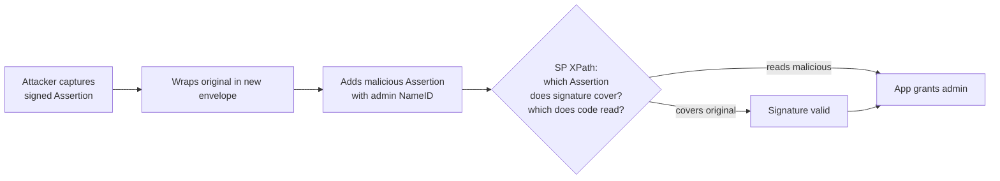
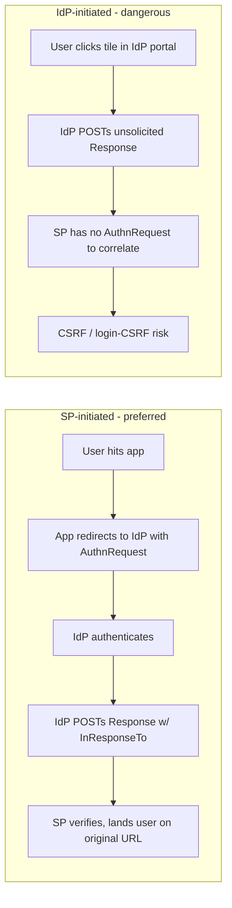
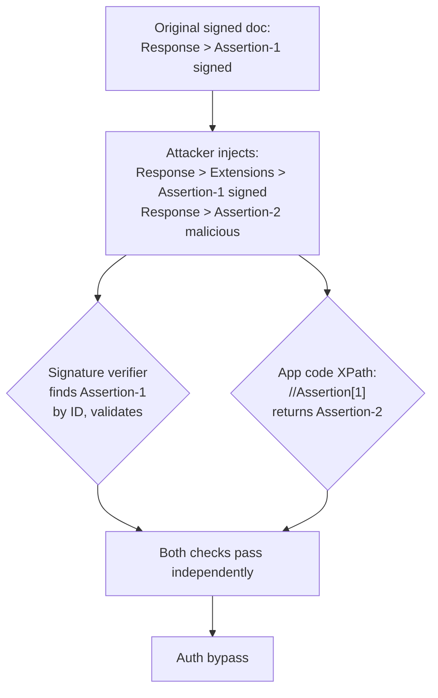

# SAML 2.0

## Why This Exists

**Problem.** Enterprises hand out one corporate identity per employee and expect every SaaS app, internal tool, and AWS account to honor it. Each app must trust the corporate IdP without holding the user's password, must enforce password policy / MFA / conditional access centrally, and must let admins deprovision in one place. SAML 2.0 (OASIS, 2005) is the lingua franca enterprise IdPs (AD FS, Azure AD/Entra, Okta, Ping, OneLogin, Shibboleth) all speak.

**Key insight.** SAML is a **browser-based, XML-signed message exchange between two pre-trusted endpoints (SP and IdP)**. The browser is a confused deputy carrying signed assertions; the SP and IdP never talk directly during login. Every security property — replay protection, audience binding, signature scope — exists because the assertion is laundered through an untrusted user agent.

**Reach for this when:**
- You're integrating with an **enterprise customer's IdP** and they say "we support SAML." That's still the default in F500 procurement, even in 2026.
- You need **SSO into AWS accounts** via IAM Identity Center / IAM SAML federation, GSuite, Salesforce, Workday, ServiceNow, Splunk, Tableau — all SAML-native.
- You're building a **B2B SaaS** and your top-tier customers' security teams will block onboarding without SAML.
- You need **encrypted assertions** because the SP backend can't be trusted with cleartext PII (rare; usually overkill).

**Don't reach for this when:**
- You're building a **mobile or SPA app** with a consumer login. Use **OIDC + PKCE** — SAML has no native mobile/non-browser story.
- You need **API-to-API auth** (machine credentials, service mesh). Use **OAuth 2.0 client credentials** or **mTLS / SPIFFE**.
- You're starting a **greenfield consumer product**. OIDC is simpler, JSON-based, and has better library support.
- You only need **API authorization** (scopes/permissions on resources). SAML carries identity, not delegated access — you'll bolt OAuth on top anyway.

A rule of thumb: **SAML for human SSO into apps where enterprises pay; OIDC for everything else.** Most real systems run both.

## Diagrams

### SP-initiated SSO with HTTP-POST binding (the common case)



### Trust establishment (what happens *before* anyone logs in)



### XML Signature Wrapping attack surface



## Anatomy of a SAML Response

A real `<samlp:Response>` (heavily abridged — production responses are 4–20 KB):

```xml
<samlp:Response xmlns:samlp="urn:oasis:names:tc:SAML:2.0:protocol"
                xmlns:saml="urn:oasis:names:tc:SAML:2.0:assertion"
                ID="_response-abc123"
                InResponseTo="_authnreq-xyz789"
                Version="2.0"
                IssueInstant="2026-06-05T14:32:11Z"
                Destination="https://app.example.com/saml/acs">
  <saml:Issuer>https://idp.corp.example.com/</saml:Issuer>

  <!-- Signature usually wraps the Assertion (preferred) or the Response -->
  <ds:Signature xmlns:ds="http://www.w3.org/2000/09/xmldsig#">
    <ds:SignedInfo>
      <ds:CanonicalizationMethod Algorithm="http://www.w3.org/2001/10/xml-exc-c14n#"/>
      <ds:SignatureMethod Algorithm="http://www.w3.org/2001/04/xmldsig-more#rsa-sha256"/>
      <ds:Reference URI="#_assertion-def456">
        <ds:Transforms>
          <ds:Transform Algorithm="http://www.w3.org/2000/09/xmldsig#enveloped-signature"/>
          <ds:Transform Algorithm="http://www.w3.org/2001/10/xml-exc-c14n#"/>
        </ds:Transforms>
        <ds:DigestMethod Algorithm="http://www.w3.org/2001/04/xmlenc#sha256"/>
        <ds:DigestValue>...</ds:DigestValue>
      </ds:Reference>
    </ds:SignedInfo>
    <ds:SignatureValue>...</ds:SignatureValue>
    <ds:KeyInfo>...</ds:KeyInfo>
  </ds:Signature>

  <samlp:Status>
    <samlp:StatusCode Value="urn:oasis:names:tc:SAML:2.0:status:Success"/>
  </samlp:Status>

  <saml:Assertion ID="_assertion-def456" IssueInstant="2026-06-05T14:32:11Z" Version="2.0">
    <saml:Issuer>https://idp.corp.example.com/</saml:Issuer>

    <!-- The user identifier the SP keys on -->
    <saml:Subject>
      <saml:NameID Format="urn:oasis:names:tc:SAML:1.1:nameid-format:emailAddress">
        alice@corp.example.com
      </saml:NameID>
      <saml:SubjectConfirmation Method="urn:oasis:names:tc:SAML:2.0:cm:bearer">
        <saml:SubjectConfirmationData
            NotOnOrAfter="2026-06-05T14:37:11Z"
            Recipient="https://app.example.com/saml/acs"
            InResponseTo="_authnreq-xyz789"/>
      </saml:SubjectConfirmation>
    </saml:Subject>

    <!-- Replay window + audience binding -->
    <saml:Conditions NotBefore="2026-06-05T14:31:11Z"
                     NotOnOrAfter="2026-06-05T14:37:11Z">
      <saml:AudienceRestriction>
        <saml:Audience>https://app.example.com/saml/metadata</saml:Audience>
      </saml:AudienceRestriction>
    </saml:Conditions>

    <!-- Authentication strength + when it occurred -->
    <saml:AuthnStatement AuthnInstant="2026-06-05T14:32:00Z"
                         SessionIndex="_session-ghi"
                         SessionNotOnOrAfter="2026-06-05T22:32:00Z">
      <saml:AuthnContext>
        <saml:AuthnContextClassRef>
          urn:oasis:names:tc:SAML:2.0:ac:classes:PasswordProtectedTransport
        </saml:AuthnContextClassRef>
      </saml:AuthnContext>
    </saml:AuthnStatement>

    <!-- Profile data the SP provisions on -->
    <saml:AttributeStatement>
      <saml:Attribute Name="http://schemas.xmlsoap.org/ws/2005/05/identity/claims/emailaddress">
        <saml:AttributeValue>alice@corp.example.com</saml:AttributeValue>
      </saml:Attribute>
      <saml:Attribute Name="groups">
        <saml:AttributeValue>engineering</saml:AttributeValue>
        <saml:AttributeValue>admins</saml:AttributeValue>
      </saml:Attribute>
    </saml:AttributeStatement>
  </saml:Assertion>
</samlp:Response>
```

**Things that go wrong with this XML in production:**
- Whitespace between elements changes the canonicalized digest. Don't reformat assertions for logging *before* verification.
- `NameID` format inconsistencies across IdPs. Some send `emailAddress`, some `persistent`, some `unspecified`. Build an SP that doesn't care and keys on a stable IdP-issued ID + email separately.
- Clock skew on `NotBefore`/`NotOnOrAfter` is the #1 ticket. Allow 60s skew, log the actual delta.

## Bindings: how the message physically travels

| Binding | Used for | Wire format | Why |
|---|---|---|---|
| **HTTP-Redirect** | `AuthnRequest` (SP→IdP) | URL query string: `SAMLRequest` (deflate+base64), optional `Signature` | Small, fits in URL. Signed via query-string signing. |
| **HTTP-POST** | `Response` (IdP→SP) | Auto-submitting HTML form, `SAMLResponse` (base64) | Responses are too big for redirect URLs. Signature lives inside the XML. |
| **HTTP-Artifact** | Either direction | Browser carries opaque "artifact" token; SP back-channels to IdP to redeem | Avoids browser seeing assertion. Rarely deployed; back-channel ops headaches. |
| **SOAP** | SLO, attribute query | Direct SP↔IdP HTTP POST | Back-channel only. |

**99% of real deployments: Redirect for the request, POST for the response.** Don't enable Artifact unless an enterprise customer demands it.

## SP-initiated vs IdP-initiated



**Prefer SP-initiated.** It gives you `InResponseTo` to bind the response to a request your SP issued, blocking replay and login-CSRF. Many enterprises insist on IdP-initiated because their portal is the user's home page; if you must support it, bind the post-login redirect to a server-stored value (not user-supplied `RelayState`) and treat `RelayState` as untrusted.

## Verification: the canonical SP-side checklist

Pseudocode — the order matters and most libraries get one of these wrong if misconfigured:

```python
def verify_saml_response(raw_post: bytes, expected_acs_url: str,
                         issued_request_ids: set[str], idp_cert: x509.Certificate,
                         entity_id: str, clock_skew_s: int = 60) -> Subject:
    response_xml = base64.b64decode(raw_post)

    # 1. Parse with a hardened parser (DTDs OFF, entity expansion OFF).
    #    XML parsers are a vuln class on their own — XXE, billion laughs.
    doc = parse_xml_safely(response_xml)

    # 2. Verify XML signature BEFORE doing anything semantic with the doc.
    #    Use a lib that resolves Reference URIs by ID and refuses to follow
    #    XPointer/XSLT transforms.  signxml, xmlsec, or OneLogin's lib.
    if not verify_xml_signature(doc, idp_cert):
        raise SamlError("signature invalid")

    # 3. Defeat XML signature wrapping: re-fetch the Assertion via the SAME
    #    path the signature covered, not a generic XPath that could match
    #    a wrapped sibling. Compare object identity.
    assertion = get_signed_assertion(doc)  # NOT doc.find('//Assertion')
    if assertion is None:
        raise SamlError("no signed assertion")

    # 4. Status must be Success
    if get_status_code(doc) != "urn:oasis:names:tc:SAML:2.0:status:Success":
        raise SamlError("non-success status")

    # 5. Issuer matches the IdP we registered
    if assertion.issuer != KNOWN_IDP_ENTITY_ID:
        raise SamlError("wrong issuer")

    # 6. Audience restriction: this assertion was minted for *us*
    if entity_id not in assertion.conditions.audiences:
        raise SamlError("audience mismatch")

    # 7. Time window with bounded skew
    now = utcnow()
    if assertion.conditions.not_before - timedelta(seconds=clock_skew_s) > now:
        raise SamlError("not yet valid")
    if assertion.conditions.not_on_or_after + timedelta(seconds=clock_skew_s) <= now:
        raise SamlError("expired")

    # 8. SubjectConfirmation: bearer + InResponseTo + Recipient + NotOnOrAfter
    sc = assertion.subject_confirmation
    if sc.method != "urn:oasis:names:tc:SAML:2.0:cm:bearer":
        raise SamlError("unsupported confirmation method")
    if sc.recipient != expected_acs_url:
        raise SamlError("recipient mismatch")  # blocks endpoint confusion
    if sc.in_response_to and sc.in_response_to not in issued_request_ids:
        raise SamlError("unknown InResponseTo")  # blocks replay / IdP-init
    if sc.not_on_or_after <= now:
        raise SamlError("confirmation expired")

    # 9. Replay cache: store assertion ID, reject re-use within window
    if replay_cache.seen(assertion.id):
        raise SamlError("replay detected")
    replay_cache.put(assertion.id, ttl=assertion.conditions.not_on_or_after)

    # 10. Destination matches our ACS (defense in depth vs cross-tenant replay)
    if get_destination(doc) != expected_acs_url:
        raise SamlError("destination mismatch")

    return Subject(
        name_id=assertion.subject.name_id,
        attributes=assertion.attribute_statement,
        session_index=assertion.authn_statement.session_index,
    )
```

**Don't roll your own parser/verifier.** Use a maintained library and audit its config:
- **Python:** `python3-saml` (OneLogin), `pysaml2`. Both have a long CVE history; pin recent versions.
- **Java:** OpenSAML (Shibboleth) — the reference impl. Spring Security SAML wraps it.
- **.NET:** ITfoxtec.Identity.Saml2, Sustainsys.Saml2.
- **Go:** `crewjam/saml`. Audit it; it has been the target of multiple wrapping CVEs.
- **Ruby:** `ruby-saml` (OneLogin). Multiple CVEs.

Whatever you pick, **track its CVE feed**.

## Signing and Encryption

| Concern | Default | When to deviate |
|---|---|---|
| Sign Response | Optional in spec | **Always sign** in practice (or sign Assertion) |
| Sign Assertion | Recommended | Signing the Assertion is more flexible than signing the Response — proxies/IdP chains can re-wrap |
| Sign AuthnRequest | Optional | Sign if IdP requires; many enterprise IdPs do |
| Encrypt Assertion | Optional | When SP runs in a multi-tenant proxy, when PII must not be browser-visible, when regulator demands. Otherwise skip — TLS already encrypts the channel |
| Algorithm: SHA-1 | **Banned** | Reject `rsa-sha1` and `xmldsig#sha1`. Many old IdPs still default to SHA-1 — refuse and force SHA-256 |
| Algorithm: SHA-256 RSA | Default | Use `rsa-sha256` and exclusive C14N |
| Cert rotation | Manual, painful | Support **two valid IdP certs** simultaneously during rollover. SAML metadata can list multiple `<KeyDescriptor>` — honor all |

## XML Signature Wrapping (XSW) — the SAML-specific footgun

The XML Signature spec lets the signer reference a subtree by `ID` and apply transforms before digesting. The verifier checks the signature on the referenced subtree but the application code reads a **different** subtree using XPath. Attackers exploit the gap: clone the signed assertion, wrap it inside a new element, add a malicious sibling assertion with admin attributes — the signature still verifies on the original, but the app reads the malicious one.



Real CVEs: CVE-2011-1411 (SimpleSAMLphp), CVE-2012-2034 (SAMLR), CVE-2017-11427 (OneLogin ruby-saml — comment-handling variant), CVE-2024-45409 (omniauth-saml).

**Mitigations the SP must enforce:**
1. **Treat the signed subtree as the only source of truth.** After signature verification, extract the assertion from the position the `Reference URI` pointed at — not via a broad XPath query.
2. **Reject documents with multiple Assertion elements** unless your IdP is known to send them and you handle each.
3. **Use a SAML library that does this for you**, and verify with a fuzzed corpus (Duo's `samltool` has wrapping test cases).
4. **Strip XML comments before parsing** or use a parser that doesn't node-split on comments — the OneLogin bug was that `getElementsByTagName(...).textContent` differs from XPath text-node behavior across `<!--comment-->`.

## SAML vs OIDC

| Dimension | SAML 2.0 | OIDC |
|---|---|---|
| Wire format | XML | JSON (JWT) |
| Token format | XML assertion | JWT (compact, JOSE-signed) |
| Mobile/SPA support | None native; you bridge with bespoke flows | First-class (PKCE, Auth Code) |
| Bindings | Redirect / POST / Artifact / SOAP | HTTP redirects + back-channel token endpoint |
| API authorization | None — identity only | OAuth 2.0 underneath, scopes built in |
| Crypto attack surface | XML-DSig + canonicalization (XSW, XXE, billion laughs) | JWS — `alg=none`, key confusion (RS↔HS) |
| Library maturity | OpenSAML mature; long CVE tail elsewhere | Newer libs, fewer historical CVEs but plenty of `alg=none` & `kid` bugs |
| Enterprise IdP support | Universal — every IdP since 2008 | Universal in 2026; was patchy 2015-2019 |
| Discoverability | Static metadata XML | `/.well-known/openid-configuration` JSON |
| Logout | SLO exists, broken in practice | RP-initiated logout + back-channel logout — also messy |
| Debuggability | XML in browser POST body, base64-decoded | JWT decodable at jwt.io |
| Best for | Human SSO into enterprise SaaS | Mobile, SPAs, API auth, consumer login |

**Practical recommendation:** if you're an enterprise SaaS, **support both**. SAML for the procurement checkbox and the F500 IdPs; OIDC for everything else and for your mobile/CLI clients. Federate them at the IdP layer (Okta, Auth0, WorkOS, Cognito) so your app sees one identity model.

## Trade-offs

| Benefit | Cost |
|---|---|
| Universal enterprise IdP support — every Fortune 500 IT department speaks SAML | XML, XML-DSig, canonicalization — a 20-year-old crypto stack with a long bug tail |
| Centralized identity, deprovisioning, MFA, conditional access at the IdP | Cert rotation outages — you will get paged at 3 a.m. when an IdP cert expires |
| Strong audit trail — assertions are signed, timestamped, attributable | Debug story is poor: opaque XML in a hidden form POST; SAML-tracer browser extension is mandatory |
| No password handling on your side — auth offloaded to the IdP | XSW, XXE, comment-injection, signature stripping — every layer of the stack has CVEs |
| Static metadata + EntityID gives long-lived trust without runtime discovery calls | Cross-tenant SaaS: each customer is a separate IdP integration, separate metadata, separate cert lifecycle |
| Works without JS — pure HTTP redirects + form POST | Doesn't work for mobile, CLI, machine-to-machine, or anything non-browser |
| Encryption of assertions is supported | Almost no one needs it; adds a second key pair and rotation surface for marginal value |
| Single Logout (SLO) is in the spec | SLO is broken in practice — race conditions, partial logout, session ghosts. Most teams disable it |

## Common Pitfalls

- **Trusting `RelayState`.** It's an opaque string the IdP echoes back. If you `redirect(RelayState)` after login, you've built an open redirect / login-CSRF gadget. Either (a) sign it, (b) store the desired URL server-side keyed by AuthnRequest ID, or (c) restrict to a same-origin allowlist.
- **Skipping `InResponseTo` validation** because "we want IdP-initiated to work too." That's how unsolicited responses get accepted. Either require SP-initiated, or have a separate IdP-initiated code path with explicit checks (no `InResponseTo`, but require user to re-authorize the destination).
- **Cert rotation outage.** IdP signing cert expires; your SP keeps the old fingerprint pinned; every login fails simultaneously across all customers. Mitigations: (1) rotate via metadata refresh, not pinning; (2) accept multiple `<KeyDescriptor>` certs during overlap; (3) alert at 30/14/7 days to expiry.
- **Clock skew.** `NotBefore`/`NotOnOrAfter` windows are typically 5 minutes. If your SP host's NTP drifts, the entire fleet starts rejecting valid assertions. Allow ±60s; alarm on skew.
- **Replay window too wide.** A captured assertion is valid until `NotOnOrAfter`. Without a replay cache, anyone with browser-history access (or an MITM-once attacker) can re-POST it. Enforce single-use via assertion ID cache.
- **Logging assertions before verification.** XXE / billion-laughs attacks can land at the parser. Use a hardened parser with DTDs disabled and entity resolution off, and verify the signature *before* doing anything semantic.
- **Trusting `Issuer` for routing.** In multi-tenant SP, the `Issuer` decides which cert to verify against. If you fetch the cert by `Issuer` *from the message*, an attacker picks the cert. Bind tenant→cert via the SP-side database, look up by ACS endpoint or pre-registered EntityID.
- **Assuming `NameID` is stable.** Many IdPs default to `transient` (changes per session) or `unspecified`. Insist on `persistent` or `emailAddress` and document it in your onboarding runbook. JIT-provision on first sign-in but key user records on the IdP-issued ID, not just email — emails change.
- **Single Logout false sense of security.** Even if SLO succeeds at the IdP, your SP session cookie may still be valid, browser back button works, and any downstream OAuth tokens you minted from the SAML session live on. Treat SLO as best-effort and shorten SP session lifetimes instead.
- **Letting `xmlns` namespace prefixes vary.** Hand-rolled XPath like `//Assertion` breaks when IdPs ship namespaces differently. Always use namespace-aware queries.
- **Multi-tenant cross-IdP confusion.** ACS endpoint `https://app.example.com/saml/acs` accepts assertions from any registered IdP. If tenant A's IdP forges an assertion for tenant B's user, and your code keys on email only, A logs in as B. Bind tenant→IdP at the ACS path (`/saml/acs/<tenant>`) or in the request validation.
- **Tooling blind spot.** SAML doesn't show up in `curl` or your API client because it's browser-driven. Use the SAML-tracer / SAML DevTools browser extension. Save sample SAMLResponses from each customer for regression tests.
- **Unsigned `AuthnRequest` accepted by IdP.** Some IdPs require signed requests; if yours doesn't, an attacker can craft requests targeting victim users at expensive flows. Sign requests by default.
- **Encryption hiding bugs.** Encrypted assertions can mask a malformed payload until decryption — and now your debug logs are useless. Decrypt-then-validate-then-log-as-failure-only.

## Decision Table

| If your situation is… | Use |
|---|---|
| Enterprise SaaS selling to F500, customers ask "do you support SAML?" | **SAML 2.0**, plus OIDC as a parallel path |
| Internal apps, employees only, you control the IdP | SAML or OIDC — pick whichever your IdP makes easier |
| Mobile or SPA app | **OIDC + PKCE**, never SAML directly |
| Service-to-service auth | **OAuth 2.0 client credentials** or **mTLS / SPIFFE** — not SAML |
| AWS account federation | **SAML** (IAM Identity Center / IAM SAML provider) or **OIDC** (newer; preferred for CI) |
| Consumer product, social login | **OIDC** with Google/Apple/etc |
| Need to encrypt user PII end-to-end | SAML with EncryptedAssertion *or* OIDC with JWE — but reconsider whether the SP should see the data at all |
| Need fine-grained API permissions | **OAuth 2.0** scopes — bolt onto SAML or OIDC, don't try to encode in SAML attributes |
| Federation across orgs (eduGAIN, gov-to-gov) | **SAML** — academic and government federations are still SAML-native |
| Greenfield, no enterprise constraints | **OIDC** — simpler, JSON, better tooling |
| Customer's IdP is AD FS 2016 or older | **SAML** — their OIDC support is brittle |
| You're shipping a CLI tool | **OIDC device code** flow, not SAML |

## References

- OASIS — SAML 2.0 Core (`saml-core-2.0-os`) — https://docs.oasis-open.org/security/saml/v2.0/saml-core-2.0-os.pdf
- OASIS — SAML 2.0 Bindings — https://docs.oasis-open.org/security/saml/v2.0/saml-bindings-2.0-os.pdf
- OASIS — SAML 2.0 Profiles — https://docs.oasis-open.org/security/saml/v2.0/saml-profiles-2.0-os.pdf
- OASIS — SAML 2.0 Security Considerations — https://docs.oasis-open.org/security/saml/v2.0/saml-sec-consider-2.0-os.pdf
- W3C — XML Signature Syntax and Processing (Second Edition) — https://www.w3.org/TR/xmldsig-core/
- W3C — Exclusive XML Canonicalization — https://www.w3.org/TR/xml-exc-c14n/
- Somorovsky et al. — "On Breaking SAML: Be Whoever You Want to Be" (USENIX Security 2012) — https://www.usenix.org/system/files/conference/usenixsecurity12/sec12-final91.pdf
- Mainka et al. — "Your Software at My Service: Security Analysis of SaaS Single Sign-On Solutions in the Cloud" (CCSW 2014) — https://www.nds.rub.de/research/publications/SaaS-SSO/
- Duo Security — "Duo Finds SAML Vulnerabilities Affecting Multiple Implementations" (2018, ruby-saml comment injection) — https://duo.com/blog/duo-finds-saml-vulnerabilities-affecting-multiple-implementations
- NIST SP 800-63C — Federation and Assertions — https://pages.nist.gov/800-63-3/sp800-63c.html
- OWASP — SAML Security Cheat Sheet — https://cheatsheetseries.owasp.org/cheatsheets/SAML_Security_Cheat_Sheet.html
- OneLogin — SAML Toolkits and ruby-saml CVE writeups — https://github.com/SAML-Toolkits
- Shibboleth — OpenSAML and IdP documentation — https://shibboleth.atlassian.net/wiki/spaces/IDP4/overview
- AWS — Enable SAML 2.0 federation with IAM — https://docs.aws.amazon.com/IAM/latest/UserGuide/id_roles_providers_saml.html
- Microsoft — SAML protocol reference for Entra ID — https://learn.microsoft.com/en-us/entra/identity-platform/single-sign-on-saml-protocol
- Okta — Build a SAML app — https://developer.okta.com/docs/guides/build-sso-integration/saml2/main/
- Building Secure and Reliable Systems (Beyer et al., O'Reilly/Google) — Chapter 5 "Design for Least Privilege" and Chapter 6 "Design for Understandability" — https://sre.google/books/building-secure-reliable-systems/
- Google SRE Workbook — Chapter 5 "Alerting on SLOs" (apply to certificate-expiry SLOs for SAML metadata) — https://sre.google/workbook/alerting-on-slos/
- DDIA (Kleppmann) — Chapter 8 "The Trouble with Distributed Systems" (clock skew section) — applicable to SAML's `NotBefore`/`NotOnOrAfter` window
- SAML-tracer (browser extension for inspecting SAML flows) — https://addons.mozilla.org/en-US/firefox/addon/saml-tracer/

## See Also

- ../oidc/ — OpenID Connect; the modern complement to SAML
- ../oauth2/ — OAuth 2.0 authorization framework; for API access tokens
- ../jwt/ — JSON Web Tokens; OIDC's wire format and a frequent SAML-to-API bridge
- ../mtls/ — mutual TLS; the right answer for service-to-service
- ../session-management/ — cookie + server-side session patterns SP must implement post-SSO
- ../csrf/ — login-CSRF and the role of `RelayState` / `InResponseTo`
- ../cert-rotation/ — operational patterns for the IdP/SP signing cert lifecycle
- ../xml-security/ — XXE, billion laughs, canonicalization, and other XML pitfalls
- ../scim/ — provisioning protocol that pairs with SAML for user lifecycle
- ../enterprise-sso-onboarding/ — runbook for onboarding F500 customers' IdPs
- ../iam-aws-federation/ — using SAML/OIDC to assume AWS IAM roles
- ../../reliability/clock-skew/ — NTP correctness and bounded skew in distributed systems
- ../../observability/auth-logging/ — how to log auth flows without leaking tokens or assertions
