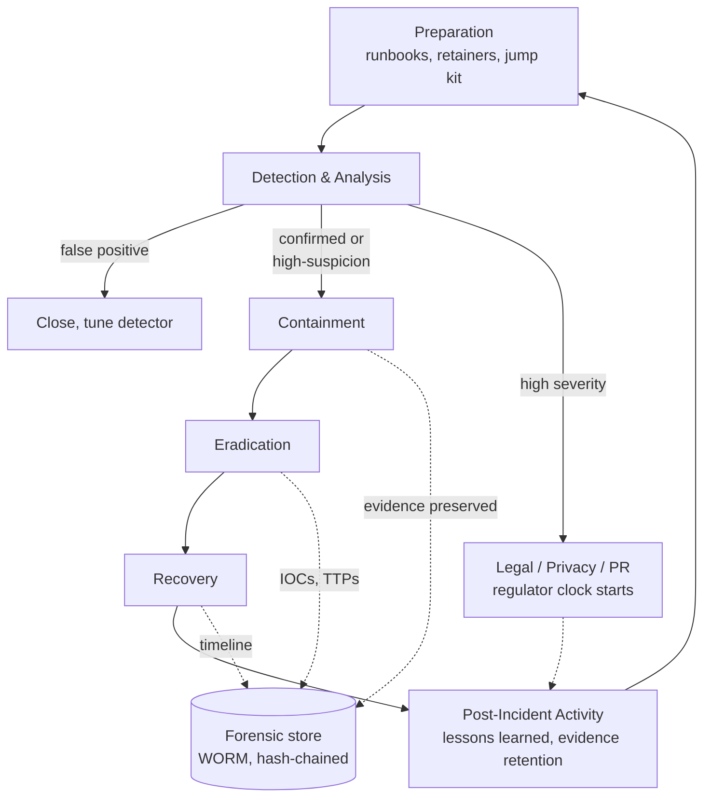
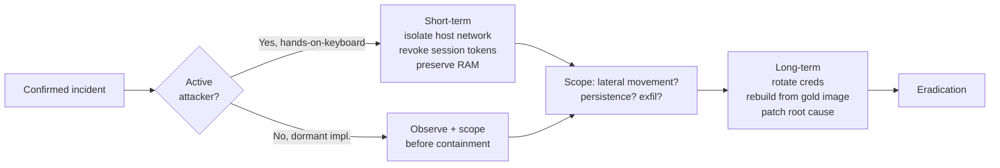
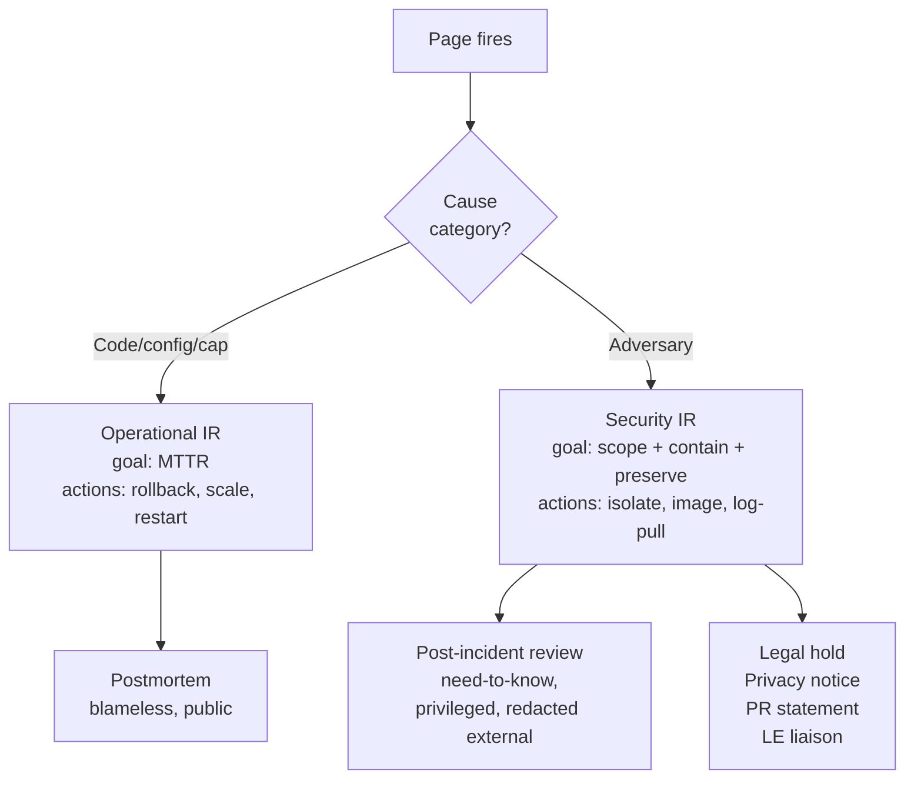

# Security Incident Response

## Why This Exists

**Problem.** When a real security incident hits — a leaked AWS access key, a compromised CI runner, a suspicious `aws:SourceIp` in CloudTrail from a country no employee lives in — engineers default to operational instincts: roll the host, restart the service, get the alert green. **Those instincts destroy evidence, tip off the attacker, and turn a containable intrusion into a regulator-reportable breach.** Security IR is not "ops IR but spicier"; the goals, stakeholders, success criteria, and even the *time horizon* are different.

**Key insight.** Operational IR optimizes for **MTTR** — restore service fast, post-mortem later. Security IR optimizes for **understanding scope first, then containment, then recovery — without alerting the adversary or destroying chain-of-custody.** A premature `terminate-instance` can wipe the only RAM image of the implant. A premature Slack post with the IOCs can warn the attacker that you've found them. A premature press release can preempt a regulator notification window and create legal liability. Slow down. Follow the playbook. The clock you're racing is *legal disclosure*, not *MTTR*.

**Reach for this when**
- An alert, third-party report, or unexplained anomaly suggests **unauthorized access, data disclosure, or malicious code execution**
- A credential, key, or session token may be **in the hands of an unauthorized party** (GitHub leak, phished employee, lost laptop with cached SSO)
- You see **CloudTrail/audit-log activity that no human or system can explain** (e.g., `iam:CreateUser` from an unknown principal, `s3:GetObject` on a sensitive bucket from a Tor exit node)
- **Ransomware, web shells, cryptominers, or persistent backdoors** are confirmed or suspected
- A regulator, customer, journalist, or law-enforcement agency contacts you about your data being **somewhere it shouldn't be**

**Don't reach for this when**
- The pager fired but root cause is clearly a deploy bug, capacity issue, or dependency outage — that's operational IR (`../../reliability/incident-response/`)
- A SAST/DAST tool found a vuln in code that has never shipped — that's vulnerability management, not IR
- An employee misclicked and emailed a spreadsheet to the wrong internal team — that's a privacy event triage flow, not (usually) an IR-grade incident
- You're doing a tabletop exercise — use this skill's structure, but mark every artifact as **TABLETOP — NOT REAL** to avoid misfiling

## Diagrams

### NIST 800-61 lifecycle, with the failure modes that matter



The arrows from C/D/E into the forensic store are the part teams skip under pressure. The arrow from B to Legal is the one that creates **regulatory liability if delayed** (GDPR Art. 33: 72 hours; many US state laws: "without unreasonable delay").

### Containment branching: short-term vs long-term



The "observe before containing" branch is counterintuitive — if you slam the door on a dormant attacker too early, you may miss persistence mechanisms and they re-enter via a backdoor you never found.

### Operational IR vs Security IR (the divergence)



## The NIST 800-61r2 lifecycle, in practice

NIST SP 800-61 Rev 2 ("Computer Security Incident Handling Guide") is the closest thing the industry has to a canonical IR framework. Every vendor playbook, SOC2 control, and Big-4 audit checklist maps back to it. Use its four phases as the load-bearing structure: **Preparation; Detection & Analysis; Containment, Eradication & Recovery; Post-Incident Activity.**

### 1. Preparation (the work you do *before* the incident)

You cannot improvise IR. The artifacts below must exist and be tested *before* page-1 of the real incident.

**Jump kit / "go bag":**
- Out-of-band comms channel (Signal group, separate Slack workspace, dedicated bridge) — assume the primary corp Slack/Teams may be compromised
- Pre-provisioned forensic AWS account (read-only access to prod logs, write-only to evidence bucket with Object Lock / WORM)
- Memory acquisition tooling (`avml` on Linux, `winpmem` on Windows, EBS snapshot scripts for cloud)
- Pre-signed legal hold templates, regulator notification templates
- Phone tree: on-call security lead, legal, privacy officer, comms, exec sponsor, outside IR retainer (Mandiant/CrowdStrike/Kroll/etc.)

**Detection plumbing:**
- Centralized logs with **immutable retention** (CloudTrail → S3 with Object Lock; auth logs → SIEM with WORM)
- Detections for the high-leverage TTPs in your environment (see code section below)
- **A way to disable detections is itself logged and alerted on** — attackers turn off your alarms first

**Practiced runbooks.** Tabletop quarterly. Run a real fire drill once a year. The first time a junior responder ever pulls a memory image cannot be during a real breach.

### 2. Detection & Analysis

Triage every signal against three questions:

1. **Is this real?** False positives are the dominant class. Don't escalate noise; do not under-call signal.
2. **What's the blast radius?** One host, one account, one tenant, the whole org?
3. **Is the adversary still active?** Hands-on-keyboard changes containment strategy fundamentally.

A useful triage record (store in your IR ticketing system, not in chat):

```yaml
incident_id: SEC-2026-0142
detected_at: 2026-06-05T14:22:11Z
detected_by: cloudtrail-anomaly-detector
reporter: secops@example.com
initial_indicator: |
  IAM user `ci-deployer` made `iam:CreateAccessKey` for itself
  from 185.220.101.0/24 (known Tor exit). User has no MFA.
  Last legitimate use: 2026-06-04T09:00Z from corp egress.
severity_initial: HIGH
confidence: HIGH
classification:
  - unauthorized_access
  - credential_compromise
hypothesis: |
  Long-lived access key for ci-deployer leaked or phished;
  attacker is provisioning persistence.
scope_unknown:
  - Did they assume any roles via that key?
  - Did they touch S3 / RDS / Secrets Manager?
  - Is the key also embedded in any GitHub repo?
legal_notified: false   # update on confirmation
privacy_notified: false # update if PII in scope
evidence_bucket: s3://acme-ir-evidence-prod/SEC-2026-0142/
```

**The single most important rule of analysis: write everything down with timestamps in UTC.** A timeline is the deliverable. Slack messages are not a timeline. A Google Doc that anyone can edit is not a timeline. Use a ticketing system that records authorship and edit history (Jira with audit log, ServiceNow, or an IR-specific tool like TheHive).

### 3. Containment

Two phases: **short-term** (stop active damage) and **long-term** (deny re-entry while you eradicate).

**Short-term containment options, ranked by evidence preservation:**

| Action | Preserves RAM | Preserves Disk | Stops attacker now | Notes |
|---|---|---|---|---|
| Network isolate (security group → deny-all) | Yes | Yes | Yes (severs C2) | Best default for cloud hosts |
| Revoke IAM access keys / session tokens | N/A | N/A | Yes (for that creds) | Does not stop sessions already established on hosts |
| Force-logoff SSO sessions | N/A | N/A | Partial | OAuth refresh tokens may persist |
| Snapshot EBS / capture memory, then terminate | No (after) | Yes (snapshot) | Yes | Standard cloud-host containment |
| `sudo poweroff` | No | Yes (if not encrypted-at-rest with TPM seal) | Yes | Destroys volatile evidence |
| Reimage immediately | No | No | Yes | **Forbidden** until evidence captured |

**Cloud-specific containment patterns (AWS — analogous primitives exist on GCP/Azure):**

```python
# Pattern: contain a compromised IAM user without destroying evidence.
# Goal: deny all new actions, but keep the principal so CloudTrail
# entries remain attributable and the account is preserved for analysis.

import boto3
from datetime import datetime, timezone

iam = boto3.client("iam")

DENY_ALL_POLICY = {
    "Version": "2012-10-17",
    "Statement": [{
        "Effect": "Deny",
        "Action": "*",
        "Resource": "*",
        # Tag the policy so responders see it in the console immediately.
        "Sid": "IR_QUARANTINE_DO_NOT_REMOVE_WITHOUT_IR_LEAD_APPROVAL",
    }],
}

def quarantine_user(username: str, incident_id: str) -> None:
    # 1. Attach explicit deny — this beats any allow in IAM evaluation logic.
    iam.put_user_policy(
        UserName=username,
        PolicyName=f"IR-Quarantine-{incident_id}",
        PolicyDocument=json.dumps(DENY_ALL_POLICY),
    )
    # 2. Deactivate (NOT delete) all access keys. Deletion would wipe
    #    the AccessKeyId we need to correlate in CloudTrail going forward.
    for key in iam.list_access_keys(UserName=username)["AccessKeyMetadata"]:
        iam.update_access_key(
            UserName=username,
            AccessKeyId=key["AccessKeyId"],
            Status="Inactive",
        )
    # 3. Delete login profile (web console password) if present.
    try:
        iam.delete_login_profile(UserName=username)
    except iam.exceptions.NoSuchEntityException:
        pass
    # 4. Tag user for downstream tooling.
    iam.tag_user(
        UserName=username,
        Tags=[
            {"Key": "ir:status", "Value": "quarantined"},
            {"Key": "ir:incident", "Value": incident_id},
            {"Key": "ir:quarantined-at", "Value": datetime.now(timezone.utc).isoformat()},
        ],
    )
    # NOTE: do NOT iam:DeleteUser. We need this principal alive for
    # the duration of the investigation to correlate prior actions.
```

```python
# Pattern: contain a compromised EC2 instance with evidence preservation.
# 1. Replace SG with quarantine SG (egress to forensic VPC only).
# 2. Snapshot all EBS volumes BEFORE any further action.
# 3. Capture memory via SSM if the host is still responsive.
# 4. Detach from any ASG / target groups so it does not get terminated
#    or replaced while we work on it.

ec2 = boto3.client("ec2")
ssm = boto3.client("ssm")
asg = boto3.client("autoscaling")

def isolate_instance(instance_id: str, incident_id: str, quarantine_sg: str):
    # Detach from ASG first — otherwise ASG may terminate the host
    # the moment we yank its SG and health checks fail.
    instance = ec2.describe_instances(InstanceIds=[instance_id])["Reservations"][0]["Instances"][0]
    for tag in instance.get("Tags", []):
        if tag["Key"] == "aws:autoscaling:groupName":
            asg.detach_instances(
                AutoScalingGroupName=tag["Value"],
                InstanceIds=[instance_id],
                ShouldDecrementDesiredCapacity=False,
            )
            break

    # Snapshot volumes BEFORE swapping SG. Snapshots are crash-consistent
    # but it's still better to capture before any further state change.
    for bdm in instance["BlockDeviceMappings"]:
        vol_id = bdm["Ebs"]["VolumeId"]
        ec2.create_snapshot(
            VolumeId=vol_id,
            Description=f"IR {incident_id} forensic snapshot of {vol_id}",
            TagSpecifications=[{
                "ResourceType": "snapshot",
                "Tags": [
                    {"Key": "ir:incident", "Value": incident_id},
                    {"Key": "ir:purpose", "Value": "forensic-evidence"},
                    {"Key": "ir:do-not-delete-before", "Value": "2031-06-05"},
                ],
            }],
        )

    # Capture memory via SSM Run Command if SSM agent is alive.
    # avml writes a LiME-format dump; ship to S3 with KMS + Object Lock.
    ssm.send_command(
        InstanceIds=[instance_id],
        DocumentName="AWS-RunShellScript",
        Parameters={"commands": [
            "set -euo pipefail",
            "curl -fsSL https://example-internal/avml -o /tmp/avml",
            "chmod +x /tmp/avml",
            f"/tmp/avml /tmp/{instance_id}.lime",
            f"aws s3 cp /tmp/{instance_id}.lime "
            f"s3://acme-ir-evidence-prod/{incident_id}/memory/ "
            "--sse aws:kms",
        ]},
        Comment=f"IR {incident_id} memory capture",
    )

    # Now swap to quarantine SG. Quarantine SG: egress only to forensic VPC.
    ec2.modify_instance_attribute(
        InstanceId=instance_id,
        Groups=[quarantine_sg],
    )
    # Tag, do not terminate.
    ec2.create_tags(Resources=[instance_id], Tags=[
        {"Key": "ir:status", "Value": "quarantined"},
        {"Key": "ir:incident", "Value": incident_id},
    ])
```

**Long-term containment** is everything that lets you keep production running while the compromised assets stay isolated: standing up clean replacement infrastructure, rotating *all* secrets that touched the blast-radius hosts, deploying additional detections to catch re-entry attempts. Plan for **weeks**, not hours.

### 4. Eradication

Eradication is the assertion: *"the adversary's access, persistence, and tools are gone from our environment."* You cannot make that assertion until you know the **full scope**. Eradicating before scoping is the most common reason teams have a "second incident" three weeks later — same actor, different foothold.

**Eradication checklist (adapt per incident):**

- [ ] All known IOCs (IPs, domains, hashes, JA3 fingerprints, IAM principals) are blocked at every relevant control plane (firewall, WAF, EDR, IAM SCP)
- [ ] All credentials in the blast radius are **rotated**, not just deactivated. This includes: IAM keys, SSH keys, OAuth client secrets, signing keys, KMS keys (re-encrypt), database passwords, service tokens (Slack/PagerDuty/GitHub/Datadog/etc.), TLS private keys if a host was rooted
- [ ] All compromised hosts are **rebuilt from a known-good image**, not "cleaned." You cannot prove the absence of an implant on a previously-rooted box
- [ ] All persistence mechanisms identified during scoping are removed (cron, systemd units, IAM users/roles, Lambda functions, EventBridge rules, SSM associations, kernel modules, scheduled tasks)
- [ ] Root-cause vulnerability is patched and a **detection** for re-exploitation is deployed
- [ ] If the attacker had access to source code or CI: review every commit/build artifact in the window for tampering (supply-chain implants are designed to survive eradication)

### 5. Recovery

Recovery brings systems back to production with **monitoring tuned to detect re-entry**. The temptation is to declare victory; resist. Run the recovered systems in heightened-monitoring mode for at least one full attacker-cycle (typically 2-4 weeks for crimeware, longer for state actors).

- Phased restoration: bring back least-sensitive tier first
- Validate integrity (file hashes, package signatures, IaC drift) before traffic
- Watch for re-exploitation attempts on the patched vuln — that's the single highest-fidelity signal that you eradicated correctly *and* the actor still wants in
- Communicate completion to the right audiences: internal stakeholders, customers (if disclosure obligated), regulators (per the timeline they impose)

### 6. Post-Incident Activity (the part everyone skips)

Run within **2 weeks** of recovery, while memory is fresh. Differs from a blameless ops post-mortem in three ways:

1. **Audience is restricted.** Need-to-know. The detailed report is often *attorney-client privileged* and never leaves Legal's hands. A redacted version goes to executives; an even more redacted version may go to customers/regulators.
2. **You are looking for control failures, not engineering bugs.** "Detection didn't fire" is a finding. "We have no inventory of long-lived IAM keys" is a finding. "Our IR runbook said to call a number that's been disconnected for 18 months" is a finding.
3. **Outputs feed back into Preparation**, not just engineering backlogs. New detections, new tabletop scenarios, new contractual asks of vendors.

A good IR review answers, in writing:

- **Timeline** (UTC, every action, every actor) — this is non-negotiable
- **Initial access vector** — how did they get in?
- **Dwell time** — first malicious action → first detection → containment
- **Scope** — accounts, hosts, data, services touched
- **Data impact** — was customer/employee data accessed, exfiltrated, or modified?
- **Detection gaps** — what should have caught this earlier?
- **Containment lessons** — what slowed us down?
- **Action items** — owners, deadlines, control category

## Preserving forensic evidence

Evidence has two failure modes: **destroyed** (you can no longer prove what happened) and **inadmissible** (you can prove it but a court won't accept it). Both kill investigations and litigation.

### Order of volatility (RFC 3227)

Capture from most volatile to least volatile:

1. CPU registers, cache
2. RAM (process list, network connections, loaded modules, kernel structures)
3. Network state (active connections, ARP/routing tables, listening ports)
4. Running processes
5. Disk
6. Remote logs / off-host artifacts
7. Physical configuration, archival media

In cloud, the practical equivalent: **EBS snapshot before terminate; memory via SSM/agent if available; CloudTrail / VPC Flow / GuardDuty findings exported to immutable storage.**

### Chain of custody

Every artifact needs an unbroken paper trail from collection → analysis → archival.

```yaml
# evidence/manifest-SEC-2026-0142.yaml
# Append-only. Hash-chained. Stored in S3 with Object Lock.

incident: SEC-2026-0142
artifacts:
  - id: EVID-001
    type: ebs-snapshot
    source: vol-0a1b2c3d (instance i-0123456789abcdef0)
    captured_at: 2026-06-05T14:48:02Z
    captured_by: alice@example.com
    captured_via: aws-api-call (CreateSnapshot)
    sha256: n/a (snapshot id snap-0fedcba98)
    aws_snapshot_id: snap-0fedcba9876543210
    storage_location: aws-snapshot, account 9999-ir-forensic, us-east-1
    chain:
      - actor: alice@example.com
        action: captured
        at: 2026-06-05T14:48:02Z
      - actor: bob@example.com
        action: copied to forensic account
        at: 2026-06-05T15:10:11Z

  - id: EVID-002
    type: memory-image
    source: i-0123456789abcdef0 (avml LiME format)
    captured_at: 2026-06-05T14:51:20Z
    captured_by: alice@example.com (via SSM Run Command)
    sha256: 4f8a...e2c1
    storage_location: s3://acme-ir-evidence-prod/SEC-2026-0142/memory/
    s3_object_lock_until: 2031-06-05
    chain:
      - actor: alice@example.com
        action: captured
        at: 2026-06-05T14:51:20Z
      - actor: alice@example.com
        action: hashed (sha256 verified)
        at: 2026-06-05T14:55:00Z
```

**Object Lock / WORM is non-negotiable for evidence storage.** If an attacker has admin in your AWS account and can delete or modify CloudTrail logs and snapshots, you have no investigation. S3 Object Lock in compliance mode prevents deletion *even by root*. Use it.

### What not to do

- **Don't log into the compromised host with admin creds to "look around."** You contaminate the artifact and may trip attacker tripwires.
- **Don't run unsigned binaries on the compromised host** to gather data — you're potentially writing over deleted-but-not-overwritten disk regions.
- **Don't kick the attacker before scoping** unless they are actively destroying data (ransomware encryption in progress, data deletion underway).
- **Don't use the corporate Slack** to discuss the incident if you suspect the corporate identity provider is compromised. Switch to out-of-band immediately.
- **Don't delete the attacker's tools or files** before imaging — you've now destroyed the only copy of the malware sample.

## Operational IR vs Security IR — the divergence

| Dimension | Operational IR | Security IR |
|---|---|---|
| Primary goal | Restore service (MTTR) | Understand scope, contain, preserve evidence |
| Time horizon | Minutes to hours | Days to weeks (sometimes months) |
| Comms | Public Slack, status page, blameless | Need-to-know, often privileged |
| Default action on a sick host | Restart / reroll | **Do not touch** until imaged |
| Who's in the room | SRE, eng, product | + Legal, Privacy, PR, IR retainer, exec sponsor |
| Postmortem | Public, blameless, engineering-focused | Privileged, control-focused, redacted external |
| Adversary | Bad code, bad config, bad luck | Intelligent, adaptive, possibly watching your response |
| Success metric | Service recovered | Adversary evicted *and* re-entry detected/prevented |
| Failure mode | Repeat outage | Repeat compromise (often by same actor) |

**The two IR modes can collide.** Example: ransomware encrypting NFS in production. Ops wants to fail over to DR. Security wants the encryption-in-progress host preserved for forensics and worries the attacker has poisoned DR too. **The IR Commander (security) outranks the ops on-call for the duration**, by pre-agreed policy. This must be written down, signed off by leadership, and rehearsed. The first time you decide who's in charge cannot be at 3am during the real event.

## Legal, privacy, and PR involvement

These are not optional, and they are not "later." Engage them at the **first moment of confirmed or high-suspicion incident**, before containment in many cases.

### When to call legal

- Any suspected unauthorized access to systems containing personal data, payment data, or health data
- Any suspected exfiltration, regardless of data class
- Ransomware (sanctions/OFAC implications on payment)
- Insider threat (employment law, evidence preservation for potential litigation)
- Third-party contact (researcher, journalist, regulator, law enforcement)
- Anything that might trigger a contractual or statutory disclosure obligation

**Legal hold.** Once litigation is "reasonably anticipated," you have a duty to preserve relevant records. Counsel will issue a hold to custodians; engineering's job is to make sure auto-deletion of logs, chats, tickets, and emails is suspended for hold scope. Build the off-switch *before* you need it.

**Attorney-client privilege.** A detailed forensic report is most useful when produced *under direction of counsel* — that's how it gets privilege protection in subsequent litigation. Many orgs have outside counsel engage the IR retainer (Mandiant, Crowdstrike, Kroll) so the engagement and report are privileged from the start. Engineering writes facts; conclusions about *liability* go in counsel-directed deliverables.

### Regulator notification clocks (representative; consult counsel for your specific obligations)

| Regime | Trigger | Clock | Notes |
|---|---|---|---|
| GDPR (EU) | Personal data breach with risk to rights | 72h to lead supervisory authority | Data subjects "without undue delay" if high risk |
| HIPAA (US health) | Breach of unsecured PHI | 60 days to individuals, HHS | Annual log if <500 individuals |
| PCI DSS | Cardholder data compromise | "Immediately" to acquirer/brands | Forensic investigator (PFI) typically required |
| SEC (US public co.) | Material cybersecurity incident | 4 business days from materiality determination | Form 8-K Item 1.05 |
| US state laws | Personal info breach | Varies (e.g., CA: most expedient; FL: 30d) | All 50 states + DC have laws |
| NIS2 (EU) | Significant incident at essential/important entity | 24h early warning, 72h notification, 1 month report | |

**The clock often starts at "discovery" or "reasonable belief" — not at "fully scoped."** Don't sandbag the legal clock waiting for engineering certainty.

### PR / customer communication

- **Don't write the public statement during the incident.** Write template statements during preparation; have legal pre-review them. During the incident, tailor the template.
- **Don't speculate about cause, attribution, or scope publicly until you know.** "Sophisticated nation-state actor" is the most-misused phrase in breach comms; it's sometimes true, often face-saving, and frequently invites worse press when the truth comes out.
- **Coordinate channel-by-channel.** Customer email, status page, Twitter/Mastodon/X, blog, support macros, sales talking points, regulator filings — these must say the same thing or you create a story about *inconsistency*.
- **Have the CISO or designated IR Commander own external statements.** Engineers should not be talking to journalists during an incident.

## High-leverage detections (what every shop should have running)

```sql
-- CloudTrail: IAM access key created for self (privilege-escalation primitive).
-- Especially suspicious if the user has no MFA or has been dormant.
SELECT
    eventTime,
    userIdentity.userName  AS actor,
    requestParameters.userName AS target,
    sourceIPAddress,
    userAgent
FROM cloudtrail
WHERE eventName = 'CreateAccessKey'
  AND userIdentity.userName = requestParameters.userName
  AND eventTime > now() - interval 1 hour;

-- CloudTrail: principal disabled GuardDuty / CloudTrail / Config.
-- Attackers turn off detections before doing the loud thing.
SELECT *
FROM cloudtrail
WHERE eventName IN (
    'StopLogging', 'DeleteTrail', 'PutEventSelectors',
    'DisableOrganizationAdminAccount', 'DeleteDetector',
    'UpdateDetector',  -- for disable
    'DeleteConfigurationRecorder', 'StopConfigurationRecorder'
)
  AND eventTime > now() - interval 24 hour;

-- S3: large GetObject volume on a sensitive bucket from a new principal.
-- Tune the bucket list and "new" definition to your environment.
SELECT
    userIdentity.arn AS actor,
    requestParameters.bucketName AS bucket,
    count(*) AS gets,
    sum(coalesce(additionalEventData.bytesTransferredOut, 0)) AS bytes_out
FROM cloudtrail
WHERE eventName = 'GetObject'
  AND requestParameters.bucketName IN ('acme-prod-pii', 'acme-prod-finance')
  AND eventTime > now() - interval 1 hour
GROUP BY 1, 2
HAVING bytes_out > 1e9    -- 1 GB in an hour is suspicious for these buckets
ORDER BY bytes_out DESC;
```

```python
# EDR-like host signal: new persistence on Linux host.
# Run as a periodic check on a baseline; alert on diff.
# This is a sketch, not a complete osquery pack.

PERSISTENCE_QUERIES = {
    "cron_user": "SELECT * FROM crontab WHERE path NOT LIKE '/etc/%';",
    "cron_system": "SELECT * FROM crontab WHERE path LIKE '/etc/%';",
    "systemd_units": (
        "SELECT name, source_path, fragment_path, user FROM systemd_units "
        "WHERE source_path NOT LIKE '/lib/systemd/%' "
        "  AND source_path NOT LIKE '/usr/lib/systemd/%';"
    ),
    "ssh_authorized_keys": (
        "SELECT u.username, k.* FROM users u "
        "JOIN authorized_keys k ON u.uid = k.uid;"
    ),
    "kernel_modules_unsigned": (
        "SELECT * FROM kernel_modules WHERE status != 'Live' OR signed = 0;"
    ),
    "shell_history_recent": (
        "SELECT * FROM shell_history WHERE time > "
        "(strftime('%s','now') - 86400);"
    ),
}
# Diff against last-known-good per-host snapshot. New entries → alert.
```

## Trade-offs

| Benefit | Cost |
|---|---|
| Following NIST 800-61 phases gives you a defensible, auditable response | Slower than "just reroll the box"; demands org buy-in to not optimize for MTTR |
| Preserving forensic evidence enables attribution, litigation, and learning | Time, storage cost, and the discipline to *not* touch a sick host |
| Engaging legal/privacy/PR early protects the org from regulatory & reputational damage | More people in the room means slower decisions; risk of leaks |
| Out-of-band comms protect against compromised IdP | Friction, missed messages, retraining muscle memory mid-crisis |
| Object Lock / WORM evidence storage prevents adversary tampering | Cannot delete during retention window — even in error; planning required |
| Pre-engaged IR retainer accelerates major incidents | Annual cost ($$$) for a service you hope to never use |
| Aggressive containment (network isolate, revoke creds) stops active damage | May tip off attacker, who pivots or detonates payload (e.g., wiper) |
| "Observe before contain" reveals full TTPs and persistence | Active damage continues during observation window |
| Privileged post-incident report shields candid analysis | Less learning shared with the broader security community |
| Detailed runbooks + tabletops shorten real-incident time-to-action | Maintenance burden; runbooks rot fast as infra changes |

## Common Pitfalls

- **Rebooting / rerolling the host immediately.** Wipes RAM, kills running attacker tooling you needed to capture, may trigger attacker dead-man-switch. *Only* do this if active destruction is in progress.
- **Logging into the compromised host with admin / domain-admin credentials.** Now those creds are present in memory of a box the attacker controls. Use a break-glass account with limited scope, or work from snapshots/images instead.
- **Discussing the incident in the corporate Slack/Teams when the IdP may be compromised.** Move to out-of-band on confirmation, not "if it gets bad."
- **Treating it like an ops post-mortem.** Public Slack channel, blameless write-up posted to engineering wiki. Now your write-up is discoverable in litigation, your detection logic is in the public attacker's playbook, and your customers learned about their breach from a wiki crawler.
- **Eradicating without scoping.** Same actor returns in 2 weeks via a persistence mechanism you missed. This is the textbook "second incident."
- **Rotating only the obviously compromised credential.** Attackers harvest creds laterally. If a host was rooted, rotate everything that ever touched it: AWS keys, SSH keys, app secrets, KMS keys, signing keys, third-party tokens.
- **Letting the legal clock slip while engineering hunts for certainty.** GDPR's 72-hour clock and SEC's 4-business-day clock start at *discovery* / *materiality determination*, not at "fully resolved." Engage counsel early to manage the clock.
- **Using snapshots without Object Lock.** Attacker with admin credentials can delete your forensic snapshots. Object Lock in compliance mode is the only thing that survives a root-level adversary.
- **No phone tree, no pager rotation, no exec sponsor.** Page-one of the incident is the wrong moment to figure out who has authority to authorize a $200k IR retainer engagement.
- **Tabletop exercises that always succeed.** A tabletop you "pass" taught you nothing. Inject failures: the IdP is down; the on-call's laptop is the compromised one; the retainer's number is busy; legal counsel is on a flight.
- **Speculating publicly about attribution.** "Nation-state actor" / "sophisticated APT" gets walked back painfully when post-mortem reveals it was an exposed Jenkins console with default creds.
- **Forgetting backup integrity.** Modern ransomware deletes/encrypts backups first. Verify backups are isolated, immutable, and tested *before* you need them — and confirm during eradication that the restore path is clean.

## Decision Table

| Situation | Lean toward | Why |
|---|---|---|
| Alert fires, suspected adversary action | Security IR (this skill) | Goals diverge from ops IR; preserve evidence |
| Page fires, root cause clearly is a deploy | Operational IR (`../../reliability/incident-response/`) | MTTR > forensics; no adversary in scope |
| Active hands-on-keyboard attacker, data exfil in progress | Short-term containment NOW, image after | Stop active damage trumps perfect evidence |
| Dormant implant discovered during routine hunt | Observe + scope before containing | Reveals full TTPs and all persistence |
| Ransomware with active encryption | Isolate network, capture memory immediately | Stop spread; capture key material before reboot |
| Lost/stolen laptop with cached SSO | Revoke sessions + force re-MFA + rotate device-bound creds | Probabilistic exposure; act fast, log everything |
| Credential leaked to public GitHub | Rotate immediately, then scope use of leaked cred in CloudTrail | Public exposure clock — assume adversarial scraping bots already have it |
| Regulator / journalist contacts you with allegation | Confirm, engage legal/PR before any technical action | Comms posture before forensics |
| Insider threat suspected | Loop in legal + HR before *any* containment | Employment law, privilege, evidence preservation for potential prosecution |
| SAST finding in unshipped code | Vulnerability mgmt, not IR | No exposure, no incident |
| "Maybe a brute-force attempt" auth log noise | Tune detector, not IR | Triage > escalation; protect the on-call's attention |

## References

- NIST — SP 800-61 Rev 2, *Computer Security Incident Handling Guide* — https://csrc.nist.gov/pubs/sp/800/61/r2/final
- NIST — SP 800-86, *Guide to Integrating Forensic Techniques into Incident Response* — https://csrc.nist.gov/pubs/sp/800/86/final
- NIST — SP 800-184, *Guide for Cybersecurity Event Recovery* — https://csrc.nist.gov/pubs/sp/800/184/final
- IETF — RFC 3227, *Guidelines for Evidence Collection and Archiving* — https://www.rfc-editor.org/rfc/rfc3227
- IETF — RFC 2350, *Expectations for Computer Security Incident Response* — https://www.rfc-editor.org/rfc/rfc2350
- Google — *Building Secure and Reliable Systems*, ch. 17 "Crisis Management" and ch. 18 "Recovery and Aftermath" — https://sre.google/books/building-secure-reliable-systems/
- Google — *Site Reliability Engineering*, ch. 14 "Managing Incidents" (operational baseline; security IR diverges) — https://sre.google/sre-book/managing-incidents/
- MITRE — ATT&CK Framework (mapping observed TTPs during analysis) — https://attack.mitre.org/
- MITRE — D3FEND (defensive countermeasure taxonomy) — https://d3fend.mitre.org/
- SANS — *Incident Handler's Handbook* — https://www.sans.org/white-papers/33901/
- CISA — *Federal Government Cybersecurity Incident & Vulnerability Response Playbooks* — https://www.cisa.gov/sites/default/files/2024-08/Federal_Government_Cybersecurity_Incident_and_Vulnerability_Response_Playbooks_508C.pdf
- AWS — *AWS Security Incident Response Guide* — https://docs.aws.amazon.com/whitepapers/latest/aws-security-incident-response-guide/welcome.html
- AWS Builders' Library — *Building dashboards for operational visibility* (detection plumbing analog) — https://aws.amazon.com/builders-library/building-dashboards-for-operational-visibility/
- ENISA — *Good Practice Guide for Incident Management* — https://www.enisa.europa.eu/publications/good-practice-guide-for-incident-management
- FIRST — *CSIRT Services Framework* — https://www.first.org/standards/frameworks/csirts/csirt_services_framework_v2.1
- ISO/IEC 27035 — *Information security incident management* (paywalled) — https://www.iso.org/standard/78973.html
- VERIS — *Vocabulary for Event Recording and Incident Sharing* (incident taxonomy used by Verizon DBIR) — https://verisframework.org/
- Verizon — *Data Breach Investigations Report* (annual; pattern data on dwell time, vectors) — https://www.verizon.com/business/resources/reports/dbir/
- Mandiant — *M-Trends* annual report (dwell time benchmarks, TTPs) — https://www.mandiant.com/m-trends
- Cloud Security Alliance — *Cloud Incident Response Framework* — https://cloudsecurityalliance.org/artifacts/cloud-incident-response-framework
- ICO (UK) — *Personal data breach notification* (GDPR Art. 33 in practice) — https://ico.org.uk/for-organisations/report-a-breach/personal-data-breach/
- SEC — *Cybersecurity Risk Management, Strategy, Governance, and Incident Disclosure* (Form 8-K Item 1.05) — https://www.sec.gov/rules/final/2023/33-11216.pdf
- Brian Krebs — *KrebsOnSecurity* (case studies, attacker behavior post-detection) — https://krebsonsecurity.com/

## See Also

- `../../reliability/incident-response/` — Operational IR companion; covers MTTR-focused incident command, blameless post-mortems, status-page comms
- `../threat-modeling/` — Pre-incident: identifying what would be incident-worthy in your design before attackers do
- `../secrets-management/` — Reducing the blast radius and rotation cost when credentials are compromised
- `../audit-logging/` — Detection plumbing prerequisite; CloudTrail/auth logs/SIEM with immutable retention
- `../vulnerability-management/` — Companion when IR scope expands to build pipelines, dependencies, signing keys
- `../../reliability/disaster-recovery/` — Recovery patterns that overlap with security recovery; isolation requirements differ
- `../../reliability/observability/` — Logs you actually need at 3am during an incident
- `../../performance/tracing/` — Reconstructing actor activity across microservices
