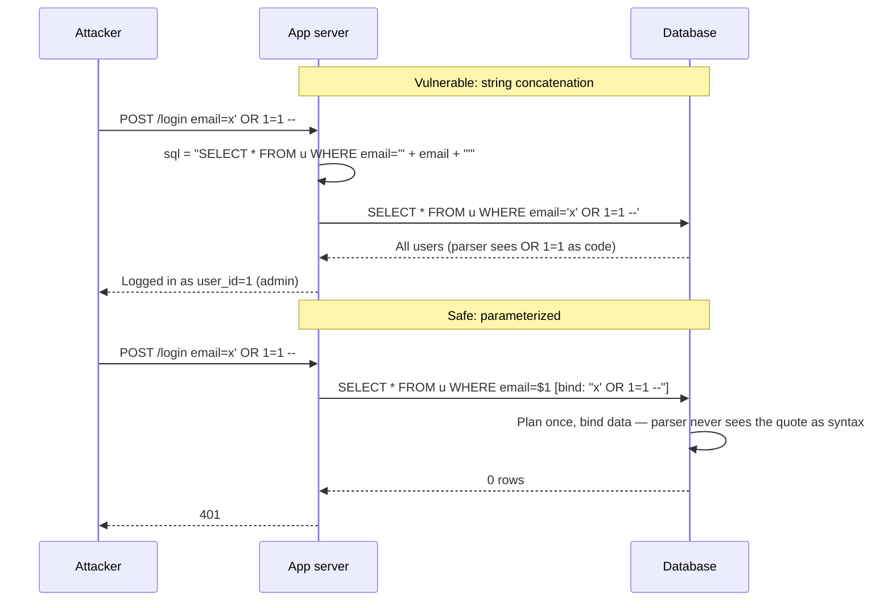
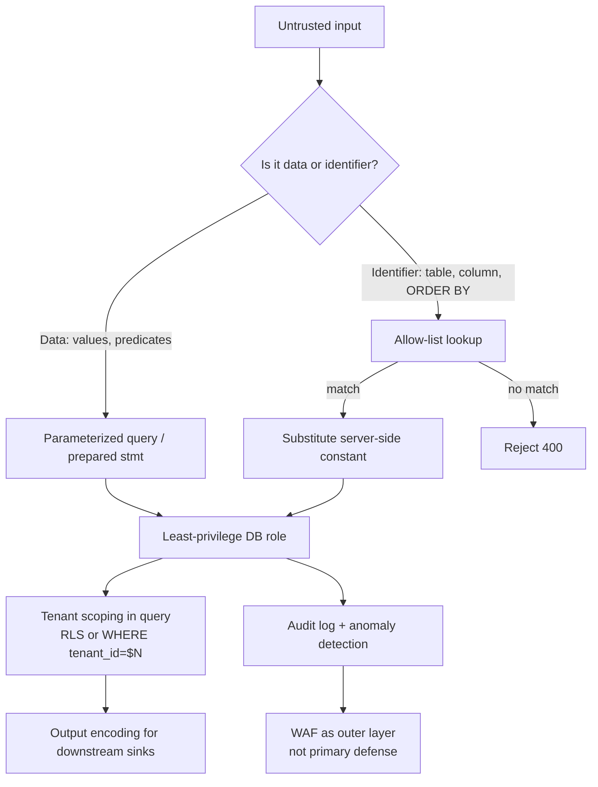
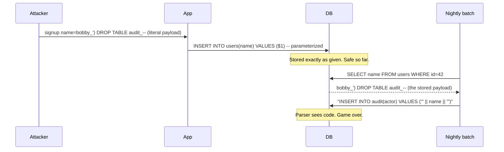

# SQL Injection (SQLi)

## Why This Exists

**Problem.** SQL injection has been a top-tier vulnerability for over twenty-five years. It still ships in 2026 because most defenses target the *symptom* (special characters) rather than the *cause* (mixing untrusted data with code as a single string). The attack is cheap, automated (sqlmap, Ghauri), and produces catastrophic outcomes: full DB read, write, RCE through `xp_cmdshell` / `COPY ... FROM PROGRAM` / UDF loading, lateral movement via stored credentials, and credential exfiltration via blind/time-based oracles when the DB is firewalled off from the internet.

**Key insight.** SQLi is a **code/data confusion** problem, not a string-escaping problem. The fix is to send the query *structure* and the *data* over **separate channels** so the database parser can never reinterpret data as syntax. Every other technique (escaping, WAFs, type coercion, stored procedures) is either an approximation of this or a defense-in-depth layer behind it. OWASP states this directly: parameterized queries are the **primary defense**; everything else is secondary. ([OWASP SQL Injection Prevention Cheat Sheet](https://cheatsheetseries.owasp.org/cheatsheets/SQL_Injection_Prevention_Cheat_Sheet.html))

**Reach for this when:**
- You're writing any code that reaches a relational database (Postgres, MySQL, Oracle, SQL Server, SQLite, Redshift, Aurora, Snowflake — all vulnerable).
- A code review surfaces string concatenation, f-strings, `%s`-formatting, template literals, or `format()` calls building SQL.
- You see dynamic `ORDER BY`, `LIMIT`, `IN (...)`, table/column names, or `LIKE` patterns from user input.
- You're using an ORM and reach for `raw()`, `execute()`, `Query.where(text(...))`, `Sequel.lit`, `JdbcTemplate.queryForList(String)` with concatenation, or any escape hatch.
- A pen test report cites "blind boolean SQLi", "time-based SQLi", "second-order SQLi", or "out-of-band SQLi (DNS/HTTP exfil)".
- You inherited a stored-procedure-heavy codebase and someone claimed "we use sprocs so we're safe."

**Don't reach for this when:**
- The data store is non-SQL key-value (Redis GET/SET) — but **do** reach for it for NoSQL injection in MongoDB `$where`, query operators, and any DB that exposes a query language with user-controlled structure.
- You're hardening against XSS, SSRF, or path traversal — different code/data confusions, related but distinct skills.

## Diagrams

### How injection actually works



### Defense layers (defense in depth)



## Core Defense: Parameterized Queries

The DB driver sends the SQL text and the parameter values in **separate protocol messages**. The server parses the SQL once with placeholders, then binds bytes into typed slots. There is no string interpolation step where user data could change the parse tree.

### Python — psycopg (Postgres)

```python
import psycopg
from psycopg.rows import dict_row

# UNSAFE — classic concatenation. Don't ship this.
def find_user_unsafe(conn, email: str):
    sql = f"SELECT id, email FROM users WHERE email = '{email}'"  # noqa: S608
    return conn.execute(sql).fetchone()

# SAFE — %s is a placeholder, NOT printf formatting.
# psycopg sends the string and the params as separate wire messages.
def find_user(conn, email: str):
    return conn.execute(
        "SELECT id, email FROM users WHERE email = %s",
        (email,),
    ).fetchone()

# SAFE — IN (...) with a variable-length list. Use a tuple of params,
# never str.join. psycopg expands the list into N placeholders.
def find_users_by_ids(conn, user_ids: list[int]):
    if not user_ids:
        return []
    return conn.execute(
        "SELECT id, email FROM users WHERE id = ANY(%s)",
        (user_ids,),  # psycopg adapts list -> array; no string building
    ).fetchall()

# SAFE — LIKE with user-controlled pattern. Escape % and _ in the *value*,
# not in the SQL. Bind the escaped value as a parameter.
def search_users(conn, fragment: str):
    pattern = fragment.replace("\\", "\\\\").replace("%", "\\%").replace("_", "\\_")
    return conn.execute(
        "SELECT id, email FROM users WHERE email LIKE %s ESCAPE '\\'",
        (f"%{pattern}%",),
    ).fetchall()
```

### Java — JDBC PreparedStatement

```java
// UNSAFE
String sql = "SELECT id FROM accounts WHERE owner = '" + owner + "'";
stmt.executeQuery(sql);

// SAFE
try (PreparedStatement ps = conn.prepareStatement(
        "SELECT id FROM accounts WHERE owner = ? AND tenant_id = ?")) {
    ps.setString(1, owner);     // bound as VARCHAR; quotes inside are data
    ps.setLong(2, tenantId);    // bound as BIGINT; type-checked by driver
    try (ResultSet rs = ps.executeQuery()) { /* ... */ }
}
```

`PreparedStatement.setString` does not "escape" — it sends the value over the
extended query protocol as a typed parameter. The DB never re-parses it.

### Go — database/sql

```go
// SAFE — pq/pgx use $1..$N placeholders, mysql uses ?
const q = `SELECT id, email FROM users WHERE email = $1 AND tenant_id = $2`
row := db.QueryRowContext(ctx, q, email, tenantID)

// UNSAFE — fmt.Sprintf is the canonical Go SQLi footgun.
// Linters: go-critic 'sqlClosed', sqlrows; static analysis: gosec G201/G202.
q := fmt.Sprintf("SELECT id FROM users WHERE email = '%s'", email) // DON'T
```

### Node.js — pg

```ts
// SAFE — values array becomes $1..$N
await client.query(
  'SELECT id, email FROM users WHERE email = $1',
  [email],
);

// UNSAFE — template literal. Reviewers: any backtick-with-dollar inside
// a query string is a smell. Prefer the parameterized form above.
await client.query(`SELECT id FROM users WHERE email = '${email}'`); // DON'T
```

## ORMs: The "Safe by Default" Layer (and Its Escape Hatches)

ORMs (SQLAlchemy, Django ORM, Hibernate, ActiveRecord, GORM, Prisma, TypeORM) parameterize automatically when you use the high-level builder. **Every ORM ships at least one escape hatch** that re-introduces concatenation. Treat the escape hatch as a code-review trigger.

### SQLAlchemy

```python
from sqlalchemy import select, text, bindparam
from sqlalchemy.orm import Session

# SAFE — the Core/ORM expression layer always parameterizes
stmt = select(User).where(User.email == email)
session.scalars(stmt).first()

# SAFE — text() with bound parameters
stmt = text("SELECT id FROM users WHERE email = :email").bindparams(
    bindparam("email", email)
)
session.execute(stmt)

# UNSAFE — text() with f-string. SQLAlchemy will not save you.
stmt = text(f"SELECT id FROM users WHERE email = '{email}'")  # DON'T

# UNSAFE — .filter(text("col = '" + val + "'")). Same problem in disguise.
```

Django ORM is similar: `.filter(email=email)` is safe; `.extra(where=["email = '%s'" % v])` and `.raw("SELECT ... %s" % v)` are not. `Manager.raw("... %s", [v])` *is* safe — note the comma, not the `%`.

### The ORM rules of thumb

1. If you can express the predicate in the ORM's expression language, do so.
2. If you must drop to raw SQL, **always** pass values as the second argument (bound), never via interpolation into the first argument.
3. Identifier-level dynamism (table, column, ORDER BY direction) **cannot be parameterized** in any DB driver. See the next section.

## Dynamic Identifiers: ORDER BY, Column Names, Table Names

Bind parameters carry **values**, not identifiers. `ORDER BY $1` is a syntax error in Postgres. Drivers cannot help you here. The only safe pattern is **server-side allow-listing**: the user sends an opaque key, the server maps it to a known-safe identifier.

```python
# Allow-list maps user-facing keys to validated SQL fragments.
# The map is the entire trust boundary; the user input is only used
# as a dictionary key, never injected into SQL.
SORT_COLUMNS = {
    "created":   "created_at",
    "name":      "display_name",
    "amount":    "amount_cents",
}
SORT_DIRS = {"asc": "ASC", "desc": "DESC"}

def list_orders(conn, tenant_id: int, sort_key: str, direction: str,
                limit: int, offset: int):
    col = SORT_COLUMNS.get(sort_key)
    dir_ = SORT_DIRS.get(direction.lower())
    if col is None or dir_ is None:
        raise ValueError(f"invalid sort: {sort_key} {direction}")

    # f-string is OK here ONLY because col and dir_ are constants
    # we wrote ourselves. tenant_id, limit, offset are parameters.
    sql = f"""
        SELECT id, amount_cents, created_at
        FROM orders
        WHERE tenant_id = %s
        ORDER BY {col} {dir_}
        LIMIT %s OFFSET %s
    """
    return conn.execute(sql, (tenant_id, limit, offset)).fetchall()
```

For arbitrary identifiers (e.g., a multi-tenant analytics tool that genuinely needs dynamic table names), use the driver's identifier-quoting helper:

- Postgres / psycopg: `psycopg.sql.Identifier(name)` — quotes and validates per Postgres rules.
- Postgres in plpgsql: `format('SELECT * FROM %I', tbl)` — `%I` is identifier-safe.
- JDBC / SQL Server: there is no built-in helper; check against `INFORMATION_SCHEMA.TABLES` for the current schema before substitution.

```python
from psycopg import sql

# SAFE — Identifier validates and double-quotes per the server's rules
query = sql.SQL("SELECT * FROM {} WHERE tenant_id = %s").format(
    sql.Identifier(table_name)
)
conn.execute(query, (tenant_id,))
```

Even with `Identifier`, **still allow-list**. Identifier quoting prevents syntax injection but does not prevent the user from reading `pg_authid` if they can name any table.

## Second-Order SQLi

First-order SQLi: input flows directly into a query in the same request. Second-order SQLi: input is **stored safely** (parameterized insert), then later **read out and concatenated** into a different query. The classic case is `username` containing a quote, stored cleanly, then later interpolated into `audit_log` SQL by a batch job. Because the value came from "trusted" storage, developers often skip parameterization on the second hop.



**Defenses, in order of preference:**

1. **Parameterize on every hop.** Every read-then-write path treats DB values as untrusted just like HTTP input. The trust boundary is the **SQL parser**, not the network.
2. Don't normalize at write time hoping it makes downstream code safe. Normalization is for correctness, not security.
3. If you must build SQL from stored values (rare; usually a code smell), use the same allow-list / identifier-quoting rules as for HTTP input.

## "We Use Stored Procedures, So We're Safe" — No

Stored procedures are not a SQLi defense **by themselves**. The vulnerability lives wherever a query string is built from untrusted data, and that can happen *inside* the procedure as easily as outside.

```sql
-- VULNERABLE STORED PROCEDURE (SQL Server example, but shape is universal)
CREATE PROCEDURE search_users
    @name NVARCHAR(200)
AS
BEGIN
    DECLARE @sql NVARCHAR(MAX);
    SET @sql = N'SELECT id, email FROM users WHERE name LIKE ''%' + @name + '%''';
    EXEC(@sql);   -- dynamic SQL with concatenation. Sproc-ness is irrelevant.
END
```

```sql
-- SAFE STORED PROCEDURE
CREATE PROCEDURE search_users
    @name NVARCHAR(200)
AS
BEGIN
    SET NOCOUNT ON;
    SELECT id, email
    FROM users
    WHERE name LIKE '%' + @name + '%';   -- @name is a parameter, not concat
END
```

Or, if dynamic SQL inside the procedure is genuinely required, use `sp_executesql` with parameters — never `EXEC()` on a built string. Postgres equivalent: `EXECUTE ... USING` in plpgsql, with `%I` for identifiers and `%L` (or `USING`) for values.

What stored procedures **do** give you (and why teams confuse this with SQLi protection):

- A natural place to enforce **least privilege**: the app role gets `EXECUTE` on the procedure, no direct `SELECT`/`UPDATE` on tables. This caps the **blast radius** of any SQLi but doesn't prevent it.
- A schema-defined parameter list, which makes it harder to *accidentally* concatenate at the call site.
- Centralized auditing.

Use sprocs for those reasons if your shop already uses them. Don't claim they're a SQLi fix.

## NoSQL Injection (Brief)

The same code/data confusion applies to MongoDB, DynamoDB PartiQL, Elasticsearch query strings, and graph DBs. Examples:

```js
// VULNERABLE — body.email is allowed to be { $ne: null }, returning all users
db.users.findOne({ email: req.body.email, password: req.body.password });

// SAFE — coerce to primitive types before querying
db.users.findOne({
  email: String(req.body.email),
  password: String(req.body.password),
});
```

For any DB exposing operators in user-controlled object keys (`$where`, `$regex`, `$expr` in Mongo), validate the input shape (e.g., with Zod, Pydantic, JSON Schema) **before** passing it to the driver.

## Defense in Depth Beyond Parameterization

Parameterization is the primary defense. These are layers behind it, not substitutes:

- **Least-privilege DB role.** The app's DB user has the minimum grants for its workload. No `SUPERUSER`, no `DROP`, no access to `pg_authid` / `mysql.user` / `dbo.sys*`. RDS IAM auth and per-service roles per the AWS Builders' Library "Reliability, constant work, and a good cup of coffee" principle: less privilege = smaller blast radius.
- **Row-Level Security** (Postgres `CREATE POLICY`, SQL Server RLS predicates). A second backstop for tenant isolation. Even if SQLi smuggles a predicate past your `WHERE tenant_id = $N`, RLS rejects rows the session role can't see. ([Postgres RLS docs](https://www.postgresql.org/docs/current/ddl-rowsecurity.html))
- **Output isolation.** Don't return raw DB error messages to clients. `ORA-00933`, `PG::SyntaxError: ERROR:  syntax error at or near "..."`, and ODBC error chains have all enabled error-based SQLi. Return a generic 500, log the detail server-side with a correlation id.
- **WAF.** ModSecurity / AWS WAF / Cloudflare can block obvious payloads (`UNION SELECT`, `OR 1=1`, comment sequences). They are **outer perimeter only** and bypassed routinely with case variation, comment splitting (`UN/**/ION`), encoding, and second-order. Do not rely on them.
- **Static analysis.** CodeQL, Semgrep (`taint mode`), Snyk Code, SonarQube find string-built SQL well. Run them on every PR. Spotbugs FindSecBugs catches Java JDBC concatenation. `gosec` G201/G202 for Go.
- **Secrets segregation.** App DB credentials must not be reusable for admin tasks. Rotate via IAM auth (Aurora, RDS) or short-lived secrets (HashiCorp Vault dynamic secrets).
- **Audit + anomaly detection.** Burst of `SELECT pg_sleep`, `BENCHMARK(`, `WAITFOR DELAY`, or unusual query shapes from one source IP — that's a time-based SQLi probe. Hook it into pager rotation.

## Trade-offs

| Benefit | Cost |
|---|---|
| Parameterized queries fully prevent injection at the parser level | Cannot parameterize identifiers; need allow-listing for ORDER BY / table names |
| ORM expression layers make the safe path the default | Escape hatches (`raw`, `text`, `extra`, `Sequel.lit`) re-introduce risk silently; reviewers must police them |
| Prepared statements can be cached server-side, lowering CPU on hot queries | Some drivers (older mysql) emulate prepares client-side; check `useServerPrepStmts` |
| Stored procedures cap blast radius via `EXECUTE`-only grants | Add deployment friction; can hide vulnerable dynamic SQL inside the procedure |
| RLS provides a backstop independent of app code | Adds plan-time cost (~5–15% in Postgres for hot paths); policies need testing |
| WAFs block low-skill mass scanners | High false positives; trivially bypassed by skilled attackers; create false sense of safety |
| Strong typing of parameters (e.g., `setLong`, `bindparam(Integer)`) provides defense even against logic bugs | Adds verbosity; some dynamic-language ORMs don't enforce types |
| Allow-listing identifiers eliminates one class of risk completely | Requires an enumerated list at deploy time; awkward for genuinely user-defined schemas |

## Common Pitfalls

- **String concatenation hidden in helpers.** `buildWhereClause(filters)` returns a string of `"col = '" + v + "'"` joined by `" AND "`. The call site looks clean; the helper is the bug. Search for `+ "'"` and `"' "` in code review.
- **`%s`-formatting that looks like a placeholder.** `cursor.execute("SELECT ... WHERE x = %s" % value)` — the `%` happens in Python *before* the driver sees the SQL. Comma, not percent: `cursor.execute("... %s", (value,))`. This is the #1 Python SQLi bug.
- **Dynamic ORDER BY with `?`.** `SELECT ... ORDER BY ?` parses but does nothing — most DBs treat `ORDER BY <constant>` as a no-op. Devs see "tests pass" and ship. Audit specifically for this.
- **`LIKE` patterns built without escaping `%` and `_`.** Not a security bug per se, but a correctness bug that often hides a real concat: dev "fixes" it with `WHERE col LIKE '%" + escape(v) + "%'` and reintroduces injection.
- **Trust in length/type checks.** `if len(input) < 50` and `if input.isalnum()` are not SQLi defenses. They're filters that complement parameterization, not replace it.
- **`mysql_real_escape_string` and friends.** Character-set bugs (GBK, latin1) historically allowed escape bypasses. Use prepared statements; don't roll your own escaping.
- **Second-order via JSON columns.** Devs parameterize the `INSERT INTO logs(payload) VALUES ($1)`, then later `SELECT payload->>'sql' FROM logs` and `EXEC` the result for a "replay" feature. Attacker controls the entire query.
- **`bind_param` typo masking injection.** `mysqli::bind_param("s", $a, $b)` — the type-string has one char but two values; PHP silently misbinds. Always count types.
- **Reflective ORM `.where(col_name=...)`.** `User.objects.filter(**{user_input: value})` — the kwarg key is a column name, not parameterized. Allow-list filter keys.
- **Test fixtures using `EXEC sp_executesql @sql`.** A test fixture that runs raw SQL gets copy-pasted into prod. Treat fixtures as production code.
- **War story: time-based blind via `pg_sleep` over 90 minutes.** A reporting endpoint with concatenated `WHERE created BETWEEN '...' AND '...'`. WAF didn't fire because each request was 8s. Attacker exfiltrated `pg_authid` via 1-bit-per-request boolean oracles. Lesson: WAFs without rate-limiting on slow queries don't see the attack.
- **War story: ORDER BY direction injected.** `ORDER BY created_at ${dir}` where `dir` was supposed to be `ASC`/`DESC`. Attacker sent `ASC, (SELECT CASE WHEN ... THEN pg_sleep(5) ELSE 1 END)` and got a time oracle on every paginated list view. Allow-list `dir`.

## Decision Table

| Situation | Use this | Not this | Why |
|---|---|---|---|
| User-supplied value in `WHERE col = ?` | Bound parameter | Concatenation, even with regex validation | Validation drifts; binding is structural |
| User-supplied list for `IN (...)` | Driver array adapter (`= ANY($1)` in Postgres) or N placeholders | `IN (' + ids.join(",") + ')'` | Concatenation reintroduces injection regardless of `parseInt` |
| User chooses sort column | Allow-list dict mapping key → validated identifier | `ORDER BY ${col}` with regex `^[a-z_]+$` | Regex permits `pg_sleep(5)`; allow-list is fail-closed |
| User chooses sort direction | Allow-list `{asc, desc}` → `ASC, DESC` | Direct interpolation | Same as above |
| User supplies search fragment for `LIKE` | Bind escaped pattern as parameter | Bind raw value into pattern string | Bind only — escape `%`/`_` in the value |
| Multi-tenant query | Parameter for `tenant_id` **plus** RLS policy | App-level filter only | Defense in depth; RLS is the backstop when SQLi or app bug skips the filter |
| Need to call DB by stored procedure | `CALL sp(?, ?)` with bound parameters; sproc itself uses `sp_executesql`/`USING` | `EXEC('sp ' + arg)` or sproc with `EXEC(@sql)` | Concat inside sproc is just as exploitable |
| Migration / schema change with dynamic table name | Generated by a deploy tool with literal identifiers; never user input | Runtime dynamic DDL with user input | DDL with user input = "drop the company" button |
| Reporting / BI tool that genuinely needs ad-hoc SQL | Read-only DB role, query timeout, separate replica | Same connection as the app | Limit blast radius; isolate noisy queries |
| Legacy code with thousands of concatenated queries | CodeQL/Semgrep + incremental rewrite, prioritizing user-reachable endpoints | Big-bang rewrite or "we'll add a WAF" | Cost-effective; WAFs are bypassable |

## References

- OWASP — SQL Injection Prevention Cheat Sheet — https://cheatsheetseries.owasp.org/cheatsheets/SQL_Injection_Prevention_Cheat_Sheet.html
- OWASP — Query Parameterization Cheat Sheet — https://cheatsheetseries.owasp.org/cheatsheets/Query_Parameterization_Cheat_Sheet.html
- OWASP — SQL Injection (concept page) — https://owasp.org/www-community/attacks/SQL_Injection
- OWASP — Top 10 2021, A03 Injection — https://owasp.org/Top10/A03_2021-Injection/
- OWASP — Testing for SQL Injection (WSTG) — https://owasp.org/www-project-web-security-testing-guide/stable/4-Web_Application_Security_Testing/07-Input_Validation_Testing/05-Testing_for_SQL_Injection
- PortSwigger Web Security Academy — SQL injection (incl. blind, second-order, time-based, OOB) — https://portswigger.net/web-security/sql-injection
- CWE-89 — Improper Neutralization of Special Elements used in an SQL Command — https://cwe.mitre.org/data/definitions/89.html
- PostgreSQL Documentation — Row Security Policies — https://www.postgresql.org/docs/current/ddl-rowsecurity.html
- PostgreSQL Documentation — `format()` and `%I` / `%L` — https://www.postgresql.org/docs/current/functions-string.html#FUNCTIONS-STRING-FORMAT
- psycopg 3 Documentation — Passing parameters to SQL queries — https://www.psycopg.org/psycopg3/docs/basic/params.html
- SQLAlchemy Documentation — `text()` and bound parameters — https://docs.sqlalchemy.org/en/20/core/sqlelement.html#sqlalchemy.sql.expression.text
- Microsoft Learn — `sp_executesql` (Transact-SQL) — https://learn.microsoft.com/en-us/sql/relational-databases/system-stored-procedures/sp-executesql-transact-sql
- Oracle — Using Bind Variables (Database Concepts) — https://docs.oracle.com/en/database/oracle/oracle-database/19/tgdba/tuning-system-global-area.html
- Bobby Tables — A guide to preventing SQL injection — https://bobby-tables.com/
- Google — Building Secure and Reliable Systems, ch. 12 "Writing Code" (SQL injection as code/data confusion) — https://sre.google/books/building-secure-reliable-systems/
- Halfond, Viegas & Orso — *A Classification of SQL Injection Attacks and Countermeasures* (2006) — https://faculty.cc.gatech.edu/~orso/papers/halfond.viegas.orso.ISSSE06.pdf
- AWS Builders' Library — Reliability and constant work — https://aws.amazon.com/builders-library/reliability-and-constant-work/

## See Also

- `../authn/` — authentication failure modes that compound with SQLi (e.g., login form bypass)
- `../authz/` — row-level security, tenant scoping, and least-privilege DB roles
- `../xss/` — sibling code/data confusion at the HTML layer
- `../ssrf/` — sibling code/data confusion at the URL layer
- `../secrets-management/` — DB credential rotation and IAM auth
- `../../data-systems/relational/` — RLS policies, prepared-statement caching, `pg_stat_statements`
- `../threat-modeling/` — STRIDE-T, blast-radius reasoning around the DB tier
