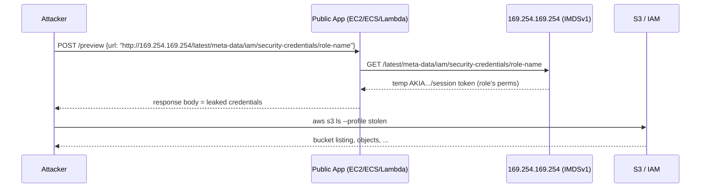
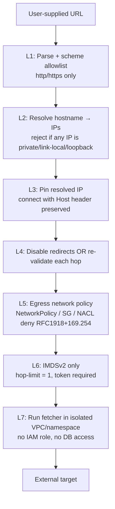
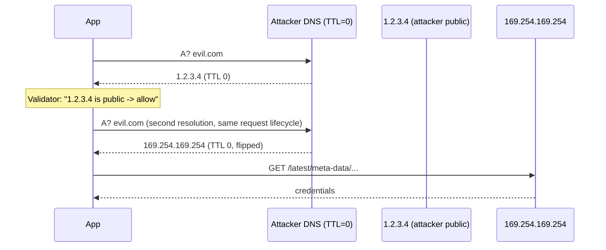

# SSRF — Server-Side Request Forgery

## Why This Exists

**Problem.** Your server fetches URLs on behalf of users — link previews, webhook deliveries, image proxies, PDF rendering, OAuth callbacks, RSS importers, SSO metadata fetch, file-from-URL upload. Each of those is a primitive: "attacker says a URL, your server fetches it." Once attackers control which URL your *trusted* backend hits, they've borrowed your network position. They can reach internal services that have no auth (because "it's only on the VPC"), the cloud metadata endpoint (169.254.169.254), localhost-only admin panels, internal Kubernetes APIs, Redis without `requirepass`, and other VPC-bound databases.

**Key insight.** SSRF is not a URL-validation bug. It's a **trust boundary** bug: your egress network has more privilege than your ingress, and a fetch primitive collapses the two. The fix is **not** "block 169.254.169.254"; it's **deny-by-default egress + IMDSv2 + a separate fetcher service**. Defense at the URL parsing layer is necessary but never sufficient — DNS rebinding, IPv6 mapping, decimal-IP encodings, redirects, and `gopher://` will all eventually defeat string-level allowlists.

**Reach for this when**
- Any feature accepts a URL/host from untrusted input and the server fetches it (webhooks, link unfurlers, PDF/image renderers, OAuth/OIDC discovery, SAML metadata, SCIM, RSS/Atom, server-side image proxies, file-from-URL uploads, "import from", iframe screenshotters).
- You're on AWS/GCP/Azure and any service can reach the metadata IP (`169.254.169.254`, `fd00:ec2::254`, `metadata.google.internal`).
- You expose a webhook outbound system that delivers customer-defined URLs.
- You're deploying Headless Chrome / Puppeteer / wkhtmltopdf for any user-influenced HTML.

**Don't reach for this when**
- The "URL fetch" is fully a *static, pre-baked URL set* with no user influence (e.g., your service polls a known SaaS partner). Still validate, but it's not an SSRF surface.
- You're auditing a pure client-side fetch (browser → third-party). That's CORS/CSRF territory, not SSRF.

---

## Diagrams

### The basic SSRF pivot



This is essentially the Capital One 2019 path: a misconfigured WAF acting as a fetch proxy → IMDSv1 → `WAF-Role` credentials → S3 read of ~106M records.

### Defense-in-depth layers



If any one layer fails, the next still holds. L1–L4 are application code. L5–L7 are infrastructure. The Capital One incident failed at L4/L5/L6 simultaneously.

### DNS rebinding race



The validator and the actual `connect(2)` resolve DNS *twice*. Between calls, the attacker flips the answer. The fix is to resolve **once**, validate the IP, then dial that exact IP with `Host:` header preserved (see code below).

---

## Core defenses (with real code)

### 1. Python — safe HTTP client with IP-pinning + scheme/IP allowlist

This is the canonical pattern. It defeats DNS rebinding because we resolve once, decide once, and dial the chosen IP. Most off-the-shelf libraries (`requests`, `httpx`, `urllib3`) do *not* do this for you.

```python
import ipaddress
import socket
from urllib.parse import urlparse, urlunparse
import http.client
import ssl

# Block: RFC1918, loopback, link-local (incl. 169.254.169.254), CGNAT,
# IPv6 ULA, IPv6 link-local, IPv4-mapped IPv6 (::ffff:10.0.0.1 etc), multicast.
_DISALLOWED_NETS = [
    ipaddress.ip_network(n) for n in (
        "0.0.0.0/8",         # "this network"
        "10.0.0.0/8",        # RFC1918
        "100.64.0.0/10",     # CGNAT — internal in many corp VPCs
        "127.0.0.0/8",       # loopback
        "169.254.0.0/16",    # link-local (IMDS lives here)
        "172.16.0.0/12",     # RFC1918
        "192.0.0.0/24",      # IETF reserved
        "192.0.2.0/24",      # TEST-NET-1
        "192.168.0.0/16",    # RFC1918
        "198.18.0.0/15",     # benchmarking
        "198.51.100.0/24",   # TEST-NET-2
        "203.0.113.0/24",    # TEST-NET-3
        "224.0.0.0/4",       # multicast
        "240.0.0.0/4",       # reserved
        "255.255.255.255/32",
        # IPv6:
        "::1/128",           # loopback
        "fc00::/7",          # ULA
        "fe80::/10",         # link-local
        "ff00::/8",          # multicast
        "::ffff:0:0/96",     # IPv4-mapped — must reject so 10.x can't sneak in
        "fd00:ec2::/32",     # IMDS over IPv6 (EC2)
        "2001:db8::/32",     # docs
    )
]

class SSRFBlocked(Exception):
    pass

def _is_public_ip(ip: ipaddress._BaseAddress) -> bool:
    if ip.is_private or ip.is_loopback or ip.is_link_local or \
       ip.is_multicast or ip.is_reserved or ip.is_unspecified:
        return False
    for net in _DISALLOWED_NETS:
        if ip in net:
            return False
    return True

def safe_fetch(user_url: str, *, timeout: float = 5.0,
               max_bytes: int = 5 * 1024 * 1024,
               allow_redirects: bool = False) -> bytes:
    parsed = urlparse(user_url)

    # L1: scheme allowlist. Block file:, gopher:, dict:, ftp:, ldap:, jar:, etc.
    if parsed.scheme not in ("http", "https"):
        raise SSRFBlocked(f"scheme not allowed: {parsed.scheme}")

    host = parsed.hostname
    if not host:
        raise SSRFBlocked("no host")

    # L2: resolve once. Reject if ANY resolved address is non-public.
    # AAAA + A both — attackers love IPv6 oversights.
    try:
        infos = socket.getaddrinfo(host, parsed.port or (443 if parsed.scheme == "https" else 80),
                                   type=socket.SOCK_STREAM)
    except socket.gaierror as e:
        raise SSRFBlocked(f"dns failed: {e}")

    addrs = {info[4][0] for info in infos}
    for a in addrs:
        ip = ipaddress.ip_address(a)
        if not _is_public_ip(ip):
            raise SSRFBlocked(f"resolved to non-public IP: {a}")

    # L3: pick one resolved IP and dial it directly.
    # Critical: we connect to the IP, not to `host`. This neuters DNS rebinding
    # because the kernel never resolves the name a second time.
    chosen_ip = next(iter(addrs))
    port = parsed.port or (443 if parsed.scheme == "https" else 80)

    if parsed.scheme == "https":
        # SNI + cert verification must use the original hostname, not the IP.
        ctx = ssl.create_default_context()
        conn = http.client.HTTPSConnection(chosen_ip, port, timeout=timeout, context=ctx)
        conn.sock = None  # set later
        # http.client doesn't support SNI override cleanly; in production use
        # urllib3 PoolManager with a custom resolver that returns chosen_ip.
        conn._http_vsn_str = "HTTP/1.1"
    else:
        conn = http.client.HTTPConnection(chosen_ip, port, timeout=timeout)

    path = urlunparse(("", "", parsed.path or "/", parsed.params, parsed.query, ""))
    try:
        # Preserve original Host header so virtual hosts work.
        conn.request("GET", path, headers={"Host": host, "User-Agent": "fetcher/1.0"})
        resp = conn.getresponse()

        # L4: redirects. Either disable, or re-run safe_fetch on the new URL
        # (which re-resolves and re-validates).
        if 300 <= resp.status < 400 and "location" in {h.lower() for h, _ in resp.getheaders()}:
            if not allow_redirects:
                raise SSRFBlocked(f"redirect to {resp.getheader('Location')} blocked")
            return safe_fetch(resp.getheader("Location"), timeout=timeout,
                              max_bytes=max_bytes, allow_redirects=False)  # one hop max

        # L8: bound the response — protects against decompression bombs and disk fill.
        return resp.read(max_bytes + 1)[:max_bytes]
    finally:
        conn.close()
```

Note what this does **not** rely on:
- It doesn't blocklist `169.254.169.254` by string. Attackers can write `0x7f000001`, `2130706433`, `127.1`, `[::ffff:127.0.0.1]`, `localtest.me` (resolves to 127.0.0.1), `spoofed.burpcollaborator.net`. Always operate on the **resolved IP**, never the string.
- It doesn't trust `requests.get(..., verify=False)` or library-level redirect handling.

### 2. Go — same pattern, using `net.Resolver` + custom `DialContext`

```go
package safefetch

import (
	"context"
	"errors"
	"net"
	"net/http"
	"net/url"
	"time"
)

var ErrSSRF = errors.New("ssrf blocked")

func isPublic(ip net.IP) bool {
	if ip4 := ip.To4(); ip4 != nil {
		ip = ip4
	}
	return !(ip.IsLoopback() || ip.IsPrivate() || ip.IsLinkLocalUnicast() ||
		ip.IsLinkLocalMulticast() || ip.IsMulticast() || ip.IsUnspecified() ||
		// 169.254.0.0/16 covered by IsLinkLocalUnicast, but be explicit:
		ip.Equal(net.IPv4(169, 254, 169, 254)) == false && true) // (kept verbose for clarity)
}

func SafeClient(timeout time.Duration) *http.Client {
	dialer := &net.Dialer{Timeout: timeout}

	dial := func(ctx context.Context, network, addr string) (net.Conn, error) {
		host, port, err := net.SplitHostPort(addr)
		if err != nil {
			return nil, err
		}
		ips, err := net.DefaultResolver.LookupIPAddr(ctx, host)
		if err != nil {
			return nil, err
		}
		// Reject if ANY answer is non-public. Don't "pick the public one" —
		// attacker-controlled DNS could return [public, internal] and a future
		// retry could pick the internal one.
		for _, ip := range ips {
			if !isPublic(ip.IP) {
				return nil, ErrSSRF
			}
		}
		// Dial the IP literal so the kernel doesn't re-resolve.
		return dialer.DialContext(ctx, network, net.JoinHostPort(ips[0].IP.String(), port))
	}

	return &http.Client{
		Timeout: timeout,
		Transport: &http.Transport{
			DialContext: dial,
			// Cap idle conns; never reuse across tenants if multi-tenant fetcher.
			MaxIdleConns: 0,
		},
		// Block redirects entirely; re-enter SafeClient for each hop if needed.
		CheckRedirect: func(req *http.Request, via []*http.Request) error {
			return http.ErrUseLastResponse
		},
	}
}

// Validate URL before passing to client — cheap pre-check.
func ValidateURL(raw string) error {
	u, err := url.Parse(raw)
	if err != nil {
		return err
	}
	if u.Scheme != "http" && u.Scheme != "https" {
		return ErrSSRF
	}
	if u.Host == "" {
		return ErrSSRF
	}
	return nil
}
```

### 3. Network policy — Kubernetes egress deny-by-default

App-layer code is layer 1. The infrastructure layer must independently block the same egress. Capital One's WAF *should have* been unable to reach IMDS at the network layer.

```yaml
# Default-deny egress for the link-preview namespace.
# Allow only DNS to kube-dns and HTTPS to anything except RFC1918 + 169.254.
apiVersion: networking.k8s.io/v1
kind: NetworkPolicy
metadata:
  name: previewer-egress
  namespace: previewer
spec:
  podSelector:
    matchLabels:
      app: link-preview
  policyTypes: [Egress]
  egress:
    - to:
        - namespaceSelector:
            matchLabels:
              kubernetes.io/metadata.name: kube-system
          podSelector:
            matchLabels:
              k8s-app: kube-dns
      ports:
        - protocol: UDP
          port: 53
    - to:
        - ipBlock:
            cidr: 0.0.0.0/0
            except:
              - 10.0.0.0/8
              - 172.16.0.0/12
              - 192.168.0.0/16
              - 169.254.0.0/16   # IMDS, link-local
              - 100.64.0.0/10    # CGNAT
              - 127.0.0.0/8
      ports:
        - protocol: TCP
          port: 443
        - protocol: TCP
          port: 80
```

For AWS-native equivalents: NACLs at the subnet level, Security Group egress rules, or — best — a separate VPC for the fetcher service with an egress-only NAT and **no route** to internal subnets.

### 4. AWS — IMDSv2 enforcement (the Capital One fix)

IMDSv1 is the GET-only credential vending endpoint that the 2019 breach abused. IMDSv2 requires a `PUT` with `X-aws-ec2-metadata-token-ttl-seconds` to obtain a session token first — SSRF primitives that only allow `GET` cannot reach it. Set `HttpTokens: required` and **`HttpPutResponseHopLimit: 1`** so the token can't traverse a Docker bridge to a sandboxed container.

```hcl
# Terraform — enforce IMDSv2 + hop limit 1 at instance launch.
resource "aws_launch_template" "app" {
  name_prefix = "app-"
  image_id    = data.aws_ami.al2023.id
  instance_type = "t3.medium"

  metadata_options {
    http_endpoint               = "enabled"
    http_tokens                 = "required"   # IMDSv2 ONLY
    http_put_response_hop_limit = 1            # blocks container escape to host IMDS
    instance_metadata_tags      = "disabled"
  }

  # IAM role attached here MUST be least-privilege. Even with IMDSv2,
  # if SSRF leaks creds, you want stolen-creds to do as little as possible.
  iam_instance_profile {
    name = aws_iam_instance_profile.app_least_priv.name
  }
}

# Org-level guardrail: deny launching any instance with IMDSv1.
data "aws_iam_policy_document" "deny_imdsv1" {
  statement {
    effect = "Deny"
    actions = ["ec2:RunInstances"]
    resources = ["arn:aws:ec2:*:*:instance/*"]
    condition {
      test     = "StringNotEquals"
      variable = "ec2:MetadataHttpTokens"
      values   = ["required"]
    }
  }
}
```

For ECS/Fargate, set `ECS_DISABLE_IMDS_PROXY=true` is **not** the answer; instead use task IAM roles via the task metadata endpoint, and bind app egress to a policy that denies `169.254.169.254`. For EKS, prefer **IRSA** (IAM Roles for Service Accounts) so pods get scoped credentials via OIDC instead of the node's IMDS.

### 5. Webhook delivery — the special case

Webhooks are an *intentional* SSRF primitive: the user gives you a URL and you fetch it. You cannot say "no untrusted URLs." The defense is identical to safe_fetch, plus:

- **HMAC-sign** the body with a per-tenant secret so the receiver can verify, and so an attacker who points the webhook at `internal-api.corp/admin` can't forge a real internal request — the internal service won't be checking your HMAC and will reject the malformed call (defense in depth).
- **Run the deliverer in its own VPC/account** with no IAM role and no path to your data plane. Stripe and GitHub publish their egress IPs precisely so customers can pin them; that's only safe because the deliverer fleet is *only* a deliverer.
- **Time-out aggressively** (5–10s) and cap retries; webhooks are a great DoS amplifier otherwise.
- **Don't follow redirects** across origin boundaries. A 302 from `customer.com` → `169.254.169.254` is the classic bypass.

---

## Trade-offs

| Defense | Benefit | Cost |
|---|---|---|
| URL string allowlist | Simple, fast, no infra change | Defeated by DNS rebinding, IP-encoding tricks, redirects, IPv6, `localtest.me`, decimal IPs. **Necessary but never sufficient.** |
| Resolve-once + IP allowlist (`safe_fetch`) | Defeats DNS rebinding for that request | Breaks SNI/virtual-host setups if implemented naively; you must preserve `Host:` header. Cert validation needs the original hostname, not IP. |
| Disable redirects | Closes the 302→IMDS loophole entirely | Some legitimate webhooks rely on redirects; need to expose `allow_redirects` per-tenant, re-validating each hop. |
| Egress NetworkPolicy / SG-based blocks | Layer-7 bug can't reach layer-3 forbidden destinations | Requires CNI that enforces (Calico/Cilium/AWS VPC CNI w/ policy); easy to forget when adding a new namespace. Doesn't help if attacker pivots through a service that *is* allowed. |
| IMDSv2 + hop limit 1 | Closes the credential-vending side-door even if SSRF lands | Older SDKs (pre-2019 botocore) or weird clients may not handle the PUT-then-GET dance; legacy AMIs default to v1. Hop-limit 1 breaks Docker setups that NAT through host (intentional — fix the architecture). |
| Isolated fetcher service / separate AWS account | Stolen creds have nothing to steal; blast radius = zero | Operational overhead, cross-account IAM, observability split. Worth it for high-risk fetchers (PDF render, headless browser). |
| Headless browser sandbox (gVisor / Firecracker) | Defeats RCE-via-Chromium-bug + SSRF combos | Performance overhead (5–20%), more infra; chromium escapes are rare but devastating. |
| HMAC-signed webhook payloads | Internal services that *would* be hit reject the unsigned hit | Doesn't help if the internal service is unauthenticated GET (e.g., Redis on `:6379`). |

---

## Common Pitfalls

- **"We block 169.254.169.254."** Then the attacker uses `http://[::ffff:169.254.169.254]/`, `http://0xa9fea9fe/`, `http://2852039166/`, `http://169.254.169.254.nip.io/`, `http://metadata.google.internal/`, or `http://[fd00:ec2::254]/` (IMDS over IPv6 on EC2). Always validate the **resolved IP**, not the string.
- **Resolving DNS twice.** Code path: `validate(host) → http.get(host)`. The validator's resolver and the connection's resolver are different `getaddrinfo` calls. Between them, attacker DNS flips. Fix: resolve once, dial the IP literal, preserve `Host:`.
- **Following redirects with the same client.** The validated URL is `https://customer.com/...` and the response is `302 Location: http://169.254.169.254/...`. `requests`/`httpx`/`urllib` follow it without re-running your validator. Either disable redirects or re-enter `safe_fetch` on each hop.
- **`gopher://` and `dict://` and `file://`.** `curl` and libcurl-backed libraries support these by default. `gopher://localhost:6379/_FLUSHALL%0d%0aSHUTDOWN%0d%0a` is a real, weaponized payload against unauthenticated Redis. Always allowlist scheme to `{http, https}`.
- **PDF/HTML renderers (wkhtmltopdf, Puppeteer, Chromium headless).** The *user-supplied HTML* contains `` and the renderer fetches it from inside your VPC. Sandboxes for these MUST be on a network with no internal route. Treat the renderer as completely compromised.
- **Image proxies that rewrite to internal CDN.** The proxy validates `https://example.com/foo.jpg`, then internally rewrites to `http://internal-img-cache.svc/?url=example.com/foo.jpg` — and the cache fetches *without* re-validation. Validate at *every* hop that takes URL input.
- **Open redirect on your own domain becomes SSRF.** `https://yourapp.com/redirect?to=http://169.254.169.254/` — your own validator allowed `yourapp.com`. Either don't have open redirects, or treat your own domain like any other input.
- **IPv4-mapped IPv6 (`::ffff:10.0.0.1`).** Many libraries categorize this as "global IPv6" and let it through, then the kernel routes it as IPv4 RFC1918. Reject the whole `::ffff:0:0/96` block.
- **CGNAT (`100.64.0.0/10`).** Some corporate VPCs and CNIs use CGNAT internally. If your environment does, block it.
- **EKS pods using node IMDS.** Without IRSA + IMDSv2 hop-limit 1, a pod can hit the node's IMDS and steal the *node* role's credentials, which are usually far broader than the pod needs.
- **Capital One, 2019.** A misconfigured ModSecurity WAF on EC2 was used as a fetch primitive. SSRF → IMDSv1 → temporary credentials of `*-WAF-Role` → `s3:ListBucket` + `s3:GetObject` on ~700 buckets → 106M records. Three independent failures: SSRF in WAF config, IMDSv1 still enabled, and an IAM role that was massively over-privileged. **Any one fix would have broken the chain.** This is why defense-in-depth here is non-negotiable.

---

## Decision Table

| Situation | Use this | Don't use |
|---|---|---|
| Public app accepts arbitrary URL for link unfurl | `safe_fetch` (resolve-once, IP-pin) + isolated fetcher VPC + IMDSv2 | String allowlist alone; "we trust customer.com"; library defaults |
| Webhook delivery to customer URLs | Same as above + HMAC + dedicated AWS account + published egress IPs | Sharing fetcher fleet with main app; following redirects silently |
| Server-side image proxy | Allowlist content-types + size cap + isolated namespace + `safe_fetch` | Trusting `Content-Type` from upstream; serving result from same origin (CSP issues) |
| Headless Chrome / PDF rendering of user HTML | Run in dedicated VPC with no internal route, gVisor/Firecracker sandbox, network egress allowlist | Running renderer in app namespace; trusting Chromium's same-origin policy |
| OAuth / OIDC discovery (`/.well-known/openid-configuration`) | Validate issuer URL is in tenant-configured allowlist; `safe_fetch` for the discovery doc | Letting tenants configure arbitrary issuer URLs without IP validation |
| SAML metadata fetch | Same: tenant-bound allowlist + IP validation; treat metadata XML as untrusted (XXE risk too) | Auto-discovery from arbitrary IdP URLs |
| You're on EKS | IRSA + IMDSv2 required + hop-limit 1 + NetworkPolicy denying RFC1918 from app namespaces | Pod accessing node IMDS; node role with broad permissions |
| You're on Lambda | Lambda has no IMDS, but `AWS_*` env vars carry creds — make sure the SSRF primitive can't read `/proc/self/environ` (i.e., don't combine SSRF with file-scheme support) | Assuming "Lambda is safe from SSRF" |
| You need to fetch internal-by-design (e.g., known partner) | Egress proxy with hardcoded allowlist of (host, IP-range) pairs; mutual TLS to partner | Reusing the public-fetcher path |

---

## References

- OWASP — Server Side Request Forgery Prevention Cheat Sheet — https://cheatsheetseries.owasp.org/cheatsheets/Server_Side_Request_Forgery_Prevention_Cheat_Sheet.html
- OWASP — Web Security Testing Guide §4.7.4 SSRF — https://owasp.org/www-project-web-security-testing-guide/stable/4-Web_Application_Security_Testing/07-Input_Validation_Testing/19-Testing_for_Server-Side_Request_Forgery
- PortSwigger Web Security Academy — Server-side request forgery (SSRF) — https://portswigger.net/web-security/ssrf
- Krebs on Security — What We Can Learn from the Capital One Hack (2019) — https://krebsonsecurity.com/2019/08/what-we-can-learn-from-the-capital-one-hack/
- US DoJ — *United States v. Paige A. Thompson* indictment (Capital One, technical details of the SSRF→IMDS path) — https://www.justice.gov/usao-wdwa/press-release/file/1188626/download
- AWS — Add defense in depth against open firewalls, reverse proxies, and SSRF vulnerabilities with enhancements to the EC2 Instance Metadata Service (IMDSv2 announcement, 2019) — https://aws.amazon.com/blogs/security/defense-in-depth-open-firewalls-reverse-proxies-ssrf-vulnerabilities-ec2-instance-metadata-service/
- AWS — IMDSv2 user guide — https://docs.aws.amazon.com/AWSEC2/latest/UserGuide/configuring-instance-metadata-service.html
- AWS — IAM Roles for Service Accounts (IRSA) on EKS — https://docs.aws.amazon.com/eks/latest/userguide/iam-roles-for-service-accounts.html
- Google Cloud — Securing the metadata server — https://cloud.google.com/compute/docs/metadata/overview#metadata_security_considerations
- Google — *Building Secure & Reliable Systems* — ch. 8 "Design for Resilience" + ch. 6 "Design for Understanding" — https://sre.google/books/building-secure-reliable-systems/
- CWE-918 — Server-Side Request Forgery (SSRF) — https://cwe.mitre.org/data/definitions/918.html
- Orange Tsai — *A New Era of SSRF — Exploiting URL Parser in Trending Programming Languages!* (Black Hat USA 2017) — https://www.blackhat.com/docs/us-17/thursday/us-17-Tsai-A-New-Era-Of-SSRF-Exploiting-URL-Parser-In-Trending-Programming-Languages.pdf
- Wallarm — DNS Rebinding attack explained — https://www.wallarm.com/what/dns-rebinding-attack
- HackerOne — SSRF reports disclosed (real-world case studies) — https://hackerone.com/hacktivity?querystring=ssrf
- RFC 6890 — Special-Purpose IP Address Registries (the canonical list of address blocks to reject) — https://datatracker.ietf.org/doc/html/rfc6890
- RFC 5735 — Special-Use IPv4 Addresses — https://datatracker.ietf.org/doc/html/rfc5735

---

## See Also

- `../secrets-management/` — IMDS exfil is one of three top credential-leak paths; the others are env vars and build logs
- `../../reliability/rate-limiting/` — SSRF is also a great DoS amplifier; cap per-tenant fetch rate and concurrency
