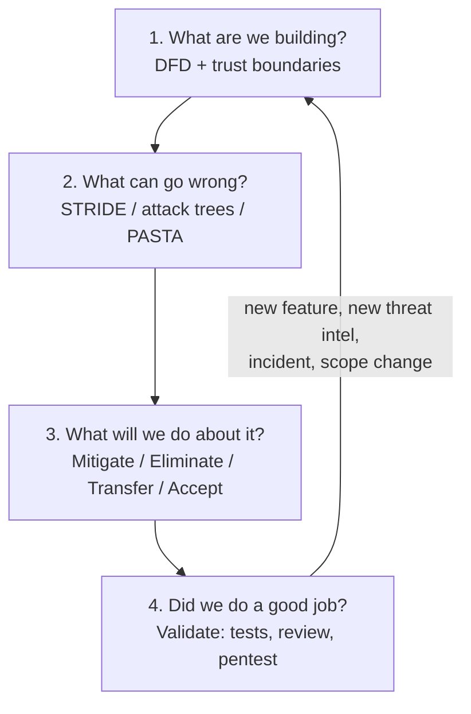
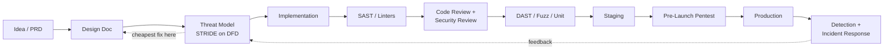
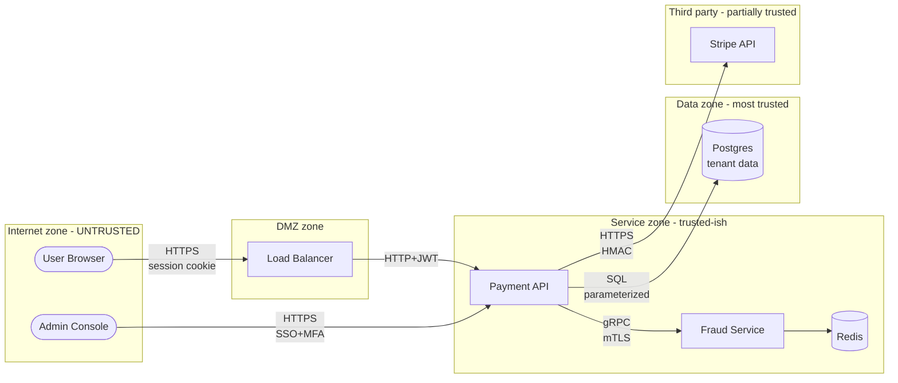
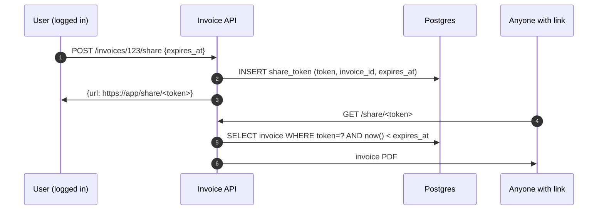

# Threat Modeling

## Why This Exists

**Problem.** Security bugs found in production cost 30–100x more to fix than ones found at design time (NIST SP 800-64; IBM Systems Sciences Institute). Most exploitable flaws — IDOR, SSRF, auth bypass, missing rate limits, trust boundary confusion — are *design* defects, not coding defects. No SAST/DAST/fuzzer reliably catches them because they require understanding *intent*: which actor is trusted to do what, across which boundary. Penetration tests find them, but a pentest costs $50k and happens once a year, after the design is frozen.

**Key insight.** Threat modeling is **structured paranoia applied to a diagram.** You draw the system, mark the trust boundaries, and ask one of four questions for every component or data flow that crosses a boundary:

> 1. What are we building? (model)
> 2. What can go wrong? (threats)
> 3. What are we going to do about it? (mitigations)
> 4. Did we do a good enough job? (validation)

— Adam Shostack, *Threat Modeling: Designing for Security* (Wiley 2014). The Microsoft SDL canonized this as the **Four Question Frame** and it remains the spine of every modern methodology (STRIDE, PASTA, LINDDUN, OCTAVE).

**Reach for this when:**

- Designing or substantially changing any system that handles auth, money, PII, PHI, secrets, or multi-tenant data.
- A feature crosses a **trust boundary** — internet → VPC, user → admin, tenant A → tenant B, customer → internal service, untrusted file → parser.
- After a near-miss or incident: threat-model the *class* of bug, not just the instance.
- Onboarding a new dependency that runs in your trust zone (npm package, OSS library, vendor SDK).
- Pre-launch security review, SOC 2 / PCI / HIPAA audit prep.
- Repeated bugs in the same area ("third SSRF this year") — design defect, not a coding one.

**Don't reach for this when:**

- The change is purely cosmetic (CSS, copy, log message wording with no PII).
- You don't have a diagram yet — *draw the DFD first*, then threat-model it. STRIDE without a DFD is theater.
- You're under incident-response time pressure — stabilize first, threat-model the post-mortem.
- The system is a throwaway prototype with no real data and no path to production. (But beware: prototypes graduate.)

---

## Diagrams

### The Four-Question Frame (Shostack)



### Where threat modeling fits in the SDLC



The earlier you find a threat, the cheaper the fix. **A threat found at the whiteboard costs an eraser. The same threat found in production costs an incident.**

### Example DFD with trust boundaries (a payment service)



The dashed/zone borders are **trust boundaries**. Every arrow crossing one is a candidate for STRIDE.

---

## STRIDE — the workhorse

STRIDE was invented at Microsoft (Loren Kohnfelder, Praerit Garg, 1999) and is the most widely-used per-element threat taxonomy. Apply it to every element of the DFD; not every category applies to every element type.

| Letter | Threat                  | Property violated  | Typical example                                    |
|--------|-------------------------|--------------------|----------------------------------------------------|
| **S**  | Spoofing                | Authentication     | Forging a JWT, session fixation, ARP spoofing      |
| **T**  | Tampering               | Integrity          | Modifying a request in transit, SQL injection      |
| **R**  | Repudiation             | Non-repudiation    | User denies action, no audit log                   |
| **I**  | Information disclosure  | Confidentiality    | Leaked secrets in logs, IDOR, verbose error pages  |
| **D**  | Denial of service       | Availability       | Algorithmic complexity attack, resource exhaustion |
| **E**  | Elevation of privilege  | Authorization      | Tenant A reads tenant B's data, missing AuthZ check|

### Per-element STRIDE coverage matrix

Microsoft's "STRIDE-per-element" rule: only the categories below typically apply to each element type. Saves you from manufacturing implausible threats.

| Element            | S | T | R | I | D | E |
|--------------------|---|---|---|---|---|---|
| External entity    | X |   | X |   |   |   |
| Process            | X | X | X | X | X | X |
| Data flow          |   | X |   | X | X |   |
| Data store         |   | X | X | X | X |   |

(Source: Shostack ch. 3; Microsoft SDL Threat Modeling Tool docs.)

### STRIDE applied to the payment-service DFD

For the `User → API` flow, in YAML so it's diff-able and stored alongside code:

```yaml
# threat-model.yaml — checked in next to design.md
asset: payment-api
flow: user_browser -> payment_api
trust_boundary_crossed: internet -> service_zone

threats:
  - id: TM-PAY-S-01
    category: Spoofing
    description: |
      Attacker obtains a stolen session cookie (XSS, malware, shared device,
      reused-on-evil-coffee-shop-wifi) and impersonates the user.
    likelihood: high
    impact: high
    mitigations:
      - Short-lived session cookies (30 min idle, 8h absolute) — IMPLEMENTED
      - HttpOnly + Secure + SameSite=Lax — IMPLEMENTED
      - Re-authenticate (step-up) for sensitive actions: change-password,
        add-payment-method, transfer > $1000 — IMPLEMENTED via WebAuthn
      - Device fingerprint + risk-based MFA on anomaly — PLANNED Q3
    residual_risk: low
    owner: payments-platform-team
    validates_with:
      - integration test: it("rejects expired session", ...)
      - pentest 2024-Q4

  - id: TM-PAY-T-01
    category: Tampering
    description: |
      MITM modifies amount or destination account in transit between
      user and load balancer.
    likelihood: low
    impact: critical
    mitigations:
      - HSTS preload — IMPLEMENTED
      - TLS 1.3 only, modern cipher suites — IMPLEMENTED
      - Server-side validation: client-supplied amount is *only* a hint;
        canonical amount is computed server-side from cart_id — IMPLEMENTED
    residual_risk: low

  - id: TM-PAY-I-01
    category: Information disclosure
    description: |
      IDOR — user A requests /api/invoices/123 where 123 belongs to user B.
      Authorization check is missing or relies only on "is logged in".
    likelihood: high  # this is the #1 bug class for SaaS APIs
    impact: high      # PII / financial disclosure
    mitigations:
      - All resource lookups go through ResourceAuthZ middleware that
        joins (resource.tenant_id, resource.owner_id) against
        (caller.tenant_id, caller.user_id, caller.roles).
      - Postgres row-level security as defense in depth — IMPLEMENTED
      - Lint rule: any handler with :id in path MUST call authorize() —
        ENFORCED via custom Semgrep rule (see security/idor-rule.yaml)
    residual_risk: medium  # new endpoints can forget; rule catches most
    validates_with:
      - "100% of /:id endpoints have an authorize() call (Semgrep CI gate)"
      - "Contract test: GET /invoices/:id of another tenant returns 404"
```

Why YAML, not a Word doc? **Threat models that don't live in version control rot within one quarter.** Diff-able, reviewable in PRs, greppable, machine-checkable in CI.

---

## DREAD — and why most teams don't use it anymore

DREAD scores each threat 1–10 on five axes and averages: **D**amage, **R**eproducibility, **E**xploitability, **A**ffected users, **D**iscoverability. Microsoft itself **deprecated DREAD around 2008** because reviewers gave wildly different scores for the same threat — too subjective, false precision.

```python
# DREAD calculator — included for completeness; prefer CVSS or qualitative
# likelihood/impact for new work.
from dataclasses import dataclass

@dataclass
class DREAD:
    damage: int           # 1=trivial, 10=catastrophic
    reproducibility: int  # 1=hard once, 10=automated
    exploitability: int   # 1=skilled+tools, 10=script kiddie
    affected_users: int   # 1=one user, 10=all users
    discoverability: int  # 1=internal docs only, 10=Google-able

    def __post_init__(self):
        for k, v in vars(self).items():
            if not 1 <= v <= 10:
                raise ValueError(f"{k}={v} must be 1..10")

    @property
    def score(self) -> float:
        return (self.damage + self.reproducibility + self.exploitability
                + self.affected_users + self.discoverability) / 5

    @property
    def severity(self) -> str:
        s = self.score
        if s >= 8: return "critical"
        if s >= 6: return "high"
        if s >= 4: return "medium"
        return "low"

# Reality check: ask three engineers to score the same threat and watch
# them disagree by 3+ points on every axis. That's why we replaced it.
idor = DREAD(damage=8, reproducibility=10, exploitability=9,
             affected_users=10, discoverability=7)
print(idor.score, idor.severity)  # 8.8 critical
```

**Recommendation:** use **CVSS 3.1** for vulnerabilities (objective, vendor-shared) and a 3×3 **likelihood × impact** matrix for design-time threats (qualitative, calibrated by team). OWASP Risk Rating Methodology is also fine. Skip DREAD unless you're maintaining a legacy threat model that already uses it.

---

## PASTA — when the business needs to be in the room

**P**rocess for **A**ttack **S**imulation and **T**hreat **A**nalysis (Tony UcedaVélez & Marco Morana, 2015). Seven stages, *risk-centric* (vs. STRIDE which is *software-centric*). PASTA aligns threats to business impact, which is what executives, auditors, and the CISO want to see.

| # | Stage                                | Output                                   |
|---|--------------------------------------|------------------------------------------|
| 1 | Define business objectives           | What we're protecting & why              |
| 2 | Define technical scope               | Stack, services, data, perimeter         |
| 3 | Application decomposition            | DFDs, trust boundaries (same as STRIDE)  |
| 4 | Threat analysis                      | Threat intel, MITRE ATT&CK, abuse cases  |
| 5 | Vulnerability & weakness analysis    | Map threats → CWEs, existing weaknesses  |
| 6 | Attack modeling                      | Attack trees per high-value target       |
| 7 | Risk & impact analysis + countermeas.| $-denominated risk, prioritized backlog  |

PASTA is heavier than STRIDE — typically a 1–2 week engagement for a critical system, not a 90-minute whiteboard session. Use it for **crown-jewel systems** (payment platform, identity provider, EHR, anything where a breach is reportable). Use STRIDE for everything else.

---

## Attack trees — when you want to know "how would I break in?"

Attack trees (Bruce Schneier, *Dr. Dobb's Journal*, 1999) decompose a goal into AND/OR sub-goals. Useful when STRIDE has produced a candidate threat and you need to know **all the ways** it could be realized — and therefore where to spend mitigation budget.

```text
Goal: Steal user funds from payment platform
├── OR
│   ├── Compromise user account
│   │   ├── OR
│   │   │   ├── Phish credentials                       (mitigate: WebAuthn)
│   │   │   ├── Stuff reused passwords                  (mitigate: HIBP check)
│   │   │   ├── SIM-swap to bypass SMS-OTP              (mitigate: drop SMS)
│   │   │   └── Steal session cookie via XSS            (mitigate: CSP, HttpOnly)
│   ├── Compromise admin account
│   │   ├── AND
│   │   │   ├── Bypass SSO                              (low: IdP enforces MFA)
│   │   │   └── Exploit admin endpoint w/o re-auth      (mitigate: step-up)
│   ├── Exploit application directly
│   │   ├── OR
│   │   │   ├── IDOR on /api/transfer                   (mitigate: AuthZ middleware)
│   │   │   ├── Race condition on balance check         (mitigate: SELECT … FOR UPDATE)
│   │   │   ├── Replay an old signed request            (mitigate: nonce + ts window)
│   │   │   └── SSRF to internal banking partner        (mitigate: egress allowlist)
│   ├── Compromise infrastructure
│   │   ├── Steal AWS keys from CI logs                 (mitigate: OIDC, no long-lived)
│   │   ├── Supply-chain attack on npm dep              (mitigate: lockfile, Sigstore)
│   │   └── Insider threat (rogue employee)             (mitigate: 2-person review,
│   │                                                              audit logs, JIT access)
└── (each leaf gets a cost / probability estimate; defender invests
     where (cost-to-attacker × probability) is *lowest*)
```

Attack trees pair beautifully with **MITRE ATT&CK** (https://attack.mitre.org/) — each leaf maps to one or more ATT&CK techniques, which gives you a published catalog of detections and mitigations.

---

## Data-flow diagrams — the foundation everything else stands on

A DFD with the right level of detail is **the most important artifact**. STRIDE without a DFD is a vibes-based exercise.

**Levels** (DeMarco, Yourdon — adapted by Shostack):

- **Level 0 (context):** the system as one process; external entities and trust boundaries.
- **Level 1 (subsystem):** one bubble per major service / subsystem.
- **Level 2 (process):** for any process where threats look interesting, decompose further.
- Stop decomposing when no new threats appear. A typical system is fine at Level 1 + selectively Level 2.

**Notation (Shostack/SDL):**

| Symbol         | Meaning                                                |
|----------------|--------------------------------------------------------|
| Rectangle      | External entity (user, third party, you don't control) |
| Circle         | Process (something that runs your code)                |
| Two parallel lines | Data store (DB, S3, Redis, file)                   |
| Arrow          | Data flow (always directional, label with protocol)    |
| Dashed line    | Trust boundary (process / network / privilege)         |

**Common DFD mistakes:**

- Drawing infrastructure (load balancers, NAT) as if they were trust boundaries when they aren't, or *not drawing* a real boundary (e.g. forgetting that browser → server is one).
- Bidirectional arrows. There's always a request and a response — draw both, threats differ by direction.
- Missing the **out-of-band data flows**: backups, logs to SIEM, debugging dumps, vendor support sessions. These are juicy targets and frequently forgotten.
- Forgetting that **humans are external entities**: support engineers, admins, on-call responders. They have privileges and they get phished.

---

## A working example: end-to-end on a feature PR

Suppose a team is adding a "share invoice via public link" feature. Thirty-minute threat model:

**1. What are we building?**



Trust boundary: `V` is on the internet, **unauthenticated**, and learns about a token only out-of-band (email, Slack, accidental tweet).

**2. What can go wrong? (STRIDE)**

| Letter | Threat                                                              | Mitigation                                              |
|--------|---------------------------------------------------------------------|---------------------------------------------------------|
| S      | Anyone presenting the token is treated as the recipient             | Tokens must be 128-bit cryptographically random; rate-limit; log access |
| T      | Token guessing / enumeration                                        | 128-bit random; constant-time compare; rate limit per IP|
| R      | Recipient denies viewing it                                         | Log token + IP + UA + ts; surface in sender's UI        |
| I      | Token leaks via Referer header to third-party JS on linked page     | Set `Referrer-Policy: no-referrer`; expire fast         |
| I      | Token in server log → SIEM → SOC analyst → malicious insider        | Strip query string from access logs; or use POST + body |
| I      | Token forever-cached by Google/Bing → public via search             | `X-Robots-Tag: noindex`; expiry; revocation             |
| D      | Attacker generates many shares to fill DB                           | Rate limit per user; per-user share quota              |
| E      | Token grants more than view (edit, delete) due to over-broad scope  | Token scope is read-only by design; enforced at handler |

**3. What will we do?** Implement above; lint rule: any new public route must declare its threat model row in `threat-model.yaml`.

**4. Did we do a good job?** Contract tests for each row; pentest in next quarterly engagement; alarms on token-access rate.

This whole exercise is ~30 min for two engineers. **The cost of skipping it is the breach blog post.**

---

## When in the dev cycle?

Microsoft SDL — and a decade of follow-on research — converged on this cadence:

| Phase            | Threat-modeling activity                                         | Owner             |
|------------------|------------------------------------------------------------------|-------------------|
| Idea / PRD       | Identify trust boundaries; flag if there are any                 | PM + Tech Lead    |
| Design doc       | **Full STRIDE on Level-1 DFD; write `threat-model.yaml`**        | Tech Lead + SecEng|
| Code review      | Reviewer checks: do new flows match the model? new ones added?   | Reviewer          |
| Pre-launch       | Pentest the high-risk threats; update model with findings        | SecEng + ext.     |
| Post-incident    | Threat-model the *class* of bug; update org-wide patterns        | IC + SecEng       |
| Quarterly        | Re-review threat models for top-N services (drift)               | SecEng            |

The SDL prescribes "start at design, never finish" — threat models are **living documents**, not one-off deliverables. AWS Well-Architected Security Pillar (SEC01-BP07) and Google BSRS ch. 8 say the same.

---

## Trade-offs

| Benefit                                                              | Cost                                                                  |
|----------------------------------------------------------------------|-----------------------------------------------------------------------|
| Catches design defects (IDOR, SSRF, missing AuthZ) that no scanner finds | Time investment up-front; needs at least one person with adversarial mindset |
| Cheap: 30–90 min for STRIDE on a mid-size feature                    | Easy to do badly — vibes-based threats, no DFD, no follow-up          |
| Creates shared mental model across PM/Eng/Sec                        | Without a written artifact in VCS, knowledge evaporates in 1 quarter  |
| Audit-friendly (SOC 2 CC7.1, PCI 6.5, ISO 27001 A.14.2.5)            | Auditors want evidence; YAML-in-repo is great, "we did it on a whiteboard" is not |
| Decomposes vague "is this secure?" into concrete, falsifiable items  | False sense of security if the model is incomplete (missing flows, missing boundaries) |
| STRIDE's per-element heuristic prevents tunnel vision                | STRIDE doesn't surface business-logic flaws (race conditions in workflows, abuse cases) |

---

## Common Pitfalls

- **No DFD, just STRIDE.** "We brainstormed threats" without a diagram = security theater. The diagram forces you to surface assumptions about who-talks-to-whom and where authority lives.
- **Wrong level of abstraction.** Level-3 DFDs of every getter/setter — you drown in noise. Level-0 only — you miss the only flow that mattered. Aim for one bubble per service or per significant module.
- **Forgetting the out-of-band flows.** Backups, log shipping, metrics, tracing, debug endpoints, "support can impersonate any user" — these have *eaten companies* (Uber 2016 backup; Capital One 2019 SSRF to metadata; LastPass 2022 backup theft).
- **Treating the threat model as a deliverable, not a living artifact.** New endpoint shipped without a model update = drift. Make the model a required PR file (`threat-model.yaml` diff in CODEOWNERS).
- **Confusing "we have TLS" with "we mitigated tampering."** TLS mitigates *network* tampering only. The server can still tamper, the client can still send anything, the DBA can still UPDATE.
- **Trusting the network.** Inside the VPC ≠ trusted. BeyondCorp / zero-trust assumes any network can be hostile (lateral movement is real — see Mandiant M-Trends).
- **DREAD pseudo-precision.** Two engineers, three-point disagreement on every axis. Switch to qualitative likelihood × impact, or CVSS for known CVEs.
- **Threat model done by security team in isolation.** Engineers don't read it; mitigations don't ship. Threat modeling **must** be done *with* the team owning the system.
- **Skipping the "did we do a good job?" question.** Without validation (tests, lint rules, pentest), you have a wishlist, not a security control.
- **Modeling the system as designed, not as built.** A year later, six undocumented flows exist. Re-model on cadence (quarterly for crown jewels) and on every significant arch change.
- **No abuse cases.** STRIDE is great for the technical layer; it under-emphasizes business-logic abuse: coupon stacking, refund loops, bot-driven account creation, scraping. Add abuse-case storyboarding.
- **Forgetting privacy threats.** STRIDE under-covers privacy. Use **LINDDUN** (Linkability, Identifiability, Non-repudiation, Detectability, Disclosure of information, Unawareness, Non-compliance) for PII/PHI systems.

---

## Decision Table

| Situation                                                 | Use                                       | Why                                                                |
|-----------------------------------------------------------|-------------------------------------------|--------------------------------------------------------------------|
| New feature in an existing service, design-doc time       | **STRIDE** on the feature's DFD slice     | Fast, fits in design review, generates checked-in artifact         |
| Greenfield crown-jewel system (payments, identity, EHR)   | **PASTA** end-to-end                      | Business risk lens; auditor-ready; merits the heavier process      |
| Need to know "how could an attacker reach X?"             | **Attack tree** rooted at X               | Decomposes a single goal exhaustively; finds cheap leaves          |
| PII/PHI-heavy system, GDPR / HIPAA in scope               | **LINDDUN** + STRIDE                      | LINDDUN covers privacy properties STRIDE under-weights             |
| Quick triage of an incoming security finding              | **CVSS 3.1**                              | Industry-standard severity for known vulns                         |
| Comparing two design alternatives security-wise           | STRIDE on each + diff the residual risks  | Forces apples-to-apples; surfaces what each alt buys you           |
| Legacy system you've never threat-modeled                 | STRIDE-per-element on Level-1 DFD; one service per session | Time-boxes the work; produces a backlog you can prioritize    |
| Repeated bugs in one area (3 IDORs in 6 months)           | Attack tree on the asset + class-level fix| Shifts from whack-a-mole to systemic mitigation                    |
| Vendor / third-party integration review                   | STRIDE on the integration surface only    | Scope the model to what you control + the trust boundary at vendor |
| Post-incident                                             | Attack tree + STRIDE on the path that was used | Uncovers sibling weaknesses before the next attacker finds them  |

---

## References

**Primary methodology sources**

- Adam Shostack — *Threat Modeling: Designing for Security* (Wiley, 2014). The canonical book; Four-Question Frame, STRIDE-per-element, DFD discipline. — https://shostack.org/books/threat-modeling-book
- Microsoft — *The STRIDE Threat Model* — https://learn.microsoft.com/en-us/azure/security/develop/threat-modeling-tool-threats
- Microsoft SDL — *Threat Modeling* — https://www.microsoft.com/en-us/securityengineering/sdl/threatmodeling
- Loren Kohnfelder & Praerit Garg — *The Threats To Our Products* (1999, original STRIDE memo). Often cited; not always findable online.
- OWASP — *Threat Modeling Cheat Sheet* — https://cheatsheetseries.owasp.org/cheatsheets/Threat_Modeling_Cheat_Sheet.html
- OWASP — *Threat Modeling Process* — https://owasp.org/www-community/Threat_Modeling_Process
- OWASP — *Application Threat Modeling* — https://owasp.org/www-community/Application_Threat_Modeling
- OWASP — *Risk Rating Methodology* — https://owasp.org/www-community/OWASP_Risk_Rating_Methodology
- Tony UcedaVélez & Marco M. Morana — *Risk Centric Threat Modeling: Process for Attack Simulation and Threat Analysis (PASTA)* (Wiley, 2015).
- Bruce Schneier — *Attack Trees* (Dr. Dobb's Journal, 1999) — https://www.schneier.com/academic/archives/1999/12/attack_trees.html
- KU Leuven DistriNet — *LINDDUN: Privacy Threat Modeling* — https://linddun.org/
- Threat Modeling Manifesto (2020) — https://www.threatmodelingmanifesto.org/

**Catalogs you'll cite from your model**

- MITRE ATT&CK (adversary techniques) — https://attack.mitre.org/
- MITRE CWE (weakness enumeration) — https://cwe.mitre.org/
- MITRE CAPEC (attack patterns) — https://capec.mitre.org/
- FIRST CVSS 3.1 specification — https://www.first.org/cvss/v3.1/specification-document
- OWASP Top 10 (web) — https://owasp.org/www-project-top-ten/
- OWASP API Security Top 10 — https://owasp.org/www-project-api-security/
- OWASP ASVS (Application Security Verification Standard) — https://owasp.org/www-project-application-security-verification-standard/

**Tools**

- Microsoft Threat Modeling Tool — https://learn.microsoft.com/en-us/azure/security/develop/threat-modeling-tool
- OWASP Threat Dragon — https://owasp.org/www-project-threat-dragon/
- pytm (Python threat-modeling-as-code) — https://github.com/izar/pytm
- IriusRisk (commercial) — https://www.iriusrisk.com/

**Aligned reading**

- Google — *Building Secure and Reliable Systems* — ch. 8 *Design for Security* — https://sre.google/books/building-secure-reliable-systems/
- AWS — *Well-Architected Framework, Security Pillar* (SEC01-BP07: Identify threats and prioritize mitigations) — https://docs.aws.amazon.com/wellarchitected/latest/security-pillar/welcome.html
- AWS Builders' Library (security articles) — https://aws.amazon.com/builders-library/
- NIST SP 800-154 — *Guide to Data-Centric System Threat Modeling* (2016) — https://csrc.nist.gov/publications/detail/sp/800-154/draft
- NIST SP 800-30 Rev. 1 — *Guide for Conducting Risk Assessments* — https://csrc.nist.gov/publications/detail/sp/800-30/rev-1/final
- DDIA (Kleppmann) — ch. 7 *Transactions* and ch. 9 *Consistency and Consensus* (race conditions and consistency are recurring threat-model concerns).
- BeyondCorp papers (Google) — https://research.google/pubs/?area=security-privacy — for trust-boundary thinking in zero-trust networks.

---

## See Also

- `../authn/` — Spoofing mitigations: WebAuthn, OIDC, mTLS, session management.
- `../authz/` — Elevation-of-privilege mitigations: RBAC/ABAC/ReBAC, AuthZ middleware patterns.
- `../secrets-management/` — Information-disclosure mitigations: secret stores, rotation, never-in-logs.
- `../../reliability/rate-limiting/` — Denial-of-service mitigations and abuse-case defense.
- `../zero-trust/` — Trust-boundary thinking applied to network architecture.
- `../../reliability/incident-response/` — What you do *after* a threat materializes; feeds new entries back into the model.
