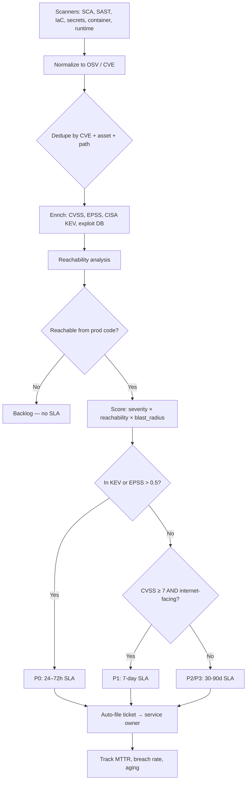
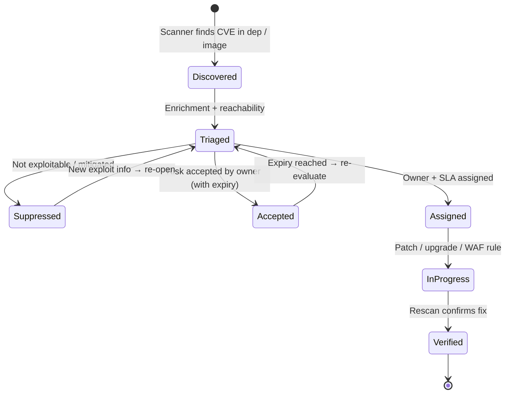
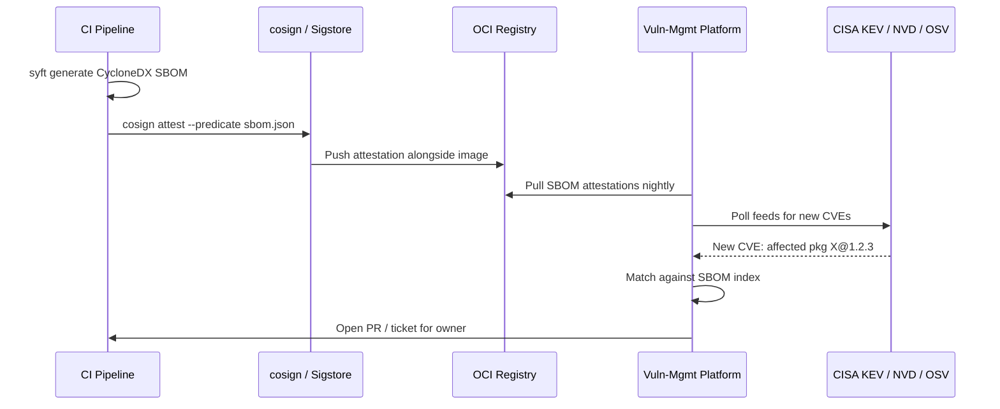

# Vulnerability Management

## Why This Exists

**Problem.** Modern services pull in 1,000+ transitive dependencies, ship to dozens of environments, and accumulate findings from SCA, SAST, container scans, IaC scans, secret scanners, and runtime sensors. Most security programs drown in a backlog of "Criticals" that don't matter and miss the one CVE that does. Log4Shell (CVE-2021-44228, CVSS 10.0) was patched in hours by mature shops and is *still* exploited in 2024+ at others. The MOVEit breach (CVE-2023-34362) hit ~2,700 organizations because a 0-day in a niche file-transfer tool sat in supply chains nobody had inventoried.

**Key insight.** A CVE is not a vulnerability *in your system* — it's a possibility. The risk equation is roughly:

```
risk ≈ exploitability  ×  reachability  ×  blast_radius
```

- **Exploitability** = CVSS base score + temporal metrics + EPSS probability + presence in CISA KEV. CVSS alone is a poor prioritizer (cf. Jacobs et al., FIRST EPSS data: ~95% of CVEs are never exploited in the wild).
- **Reachability** = is the vulnerable function actually called from your code paths? Most SCA tools flag "Critical" on a transitive dep that your code never reaches. Reachability analysis (Snyk Reachable Vulns, Endor Labs, OSS Review Toolkit) cuts noise by 70–95%.
- **Blast radius** = is this internet-facing? Does it handle auth tokens, PII, or hold money? An unauth RCE on the marketing site is not the same as an unauth RCE on your IAM service.

**Reach for this when.**
- You're starting (or rebuilding) a vuln-management program and need to choose tools and SLAs.
- A new CVE hits the news (Log4Shell, Spring4Shell, xz-utils backdoor) and you need a triage runbook.
- An auditor or customer asks for your SBOM, patch policy, or SOC2/FedRAMP/PCI vuln-management evidence.
- Dependabot/Snyk PRs have become unreviewable noise and engineers are auto-merging them blindly.
- Executive Order 14028 / SLSA / NIST SSDF compliance is in scope.

**Don't reach for this when.**
- You need *runtime* threat detection (intrusion detection, EDR, SIEM) — that's [`../security-incident-response/`](../security-incident-response/).
- You're hardening a single application's code (use SAST + secure coding) — see [`../owasp-top-10/`](../owasp-top-10/) and [`./`](./).
- You're doing red-team / pentest work — different discipline, different cadence.
- The asset isn't yours (third-party SaaS) — that's vendor risk management.

---

## Diagrams

**Triage pipeline: from raw scanner output to a ranked, owned ticket.**



**Lifecycle of a single CVE in your environment.**



**SBOM ingestion at supply-chain scale.**



---

## Core Workflows

### 1. Triage scoring — don't trust CVSS alone

CVSS is a *severity* score, not a *risk* score. Use a composite. The pseudocode below mirrors what FIRST recommends and what mature programs (Google, Netflix, GitHub) actually run.

```python
# triage.py — score a finding for prioritization
from dataclasses import dataclass
from typing import Optional

@dataclass
class Finding:
    cve_id: str
    cvss_base: float          # 0.0 - 10.0, from NVD
    epss_score: float         # 0.0 - 1.0, probability of exploit in 30d
    in_kev: bool              # CISA Known Exploited Vulnerabilities catalog
    public_exploit: bool      # Metasploit / ExploitDB / public PoC
    reachable: Optional[bool] # None = unknown (assume True conservatively)
    internet_facing: bool
    handles_secrets: bool     # auth, PII, payment, crypto keys
    has_compensating_control: bool  # WAF rule, network segmentation, etc.

def priority(f: Finding) -> str:
    # CISA KEV is non-negotiable. Federal civilian agencies have a binding
    # operational directive (BOD 22-01) requiring KEV remediation within
    # 2 weeks. Adopt the same posture even if you're not federal.
    if f.in_kev:
        return "P0"  # 72h SLA, page on-call

    # EPSS > 0.5 means top ~2% most likely to be exploited.
    # Combined with public exploit code, treat as KEV-adjacent.
    if f.epss_score >= 0.5 and f.public_exploit:
        return "P0"

    # Reachability gate: if we can prove the vulnerable code path is
    # unreachable, we can defer aggressively. Only trust this if your
    # reachability tool understands reflection, DI, and dynamic dispatch
    # in your language. Java/Python/JS reachability is noisy.
    if f.reachable is False and not f.in_kev:
        return "P3"  # 90d SLA, batch with routine upgrades

    # Severity × exposure
    if f.cvss_base >= 9.0 and f.internet_facing:
        return "P0" if f.handles_secrets else "P1"
    if f.cvss_base >= 7.0 and (f.internet_facing or f.handles_secrets):
        return "P1" if not f.has_compensating_control else "P2"
    if f.cvss_base >= 4.0:
        return "P2"
    return "P3"

# SLA mapping — published, enforced, measured.
SLA_DAYS = {"P0": 3, "P1": 14, "P2": 30, "P3": 90}
```

**Pitfalls in this scoring:**
- "Reachable=False" from an SCA tool is a *hypothesis*, not proof. xz-utils (CVE-2024-3094) was a backdoor in a build-time dep — runtime reachability tools missed it.
- EPSS shifts daily. Re-score nightly, not at ingest time.
- "Internet-facing" needs a CMDB / asset inventory you trust. Most orgs don't have one. Build it before tuning the scorer.

### 2. CVE response runbook (Log4Shell-class incident)

When CISA tweets at 2 AM, you need a runbook, not improvisation. This is the shape of one that survived contact with reality at multiple Fortune 500s.

```yaml
# runbooks/critical-cve.yaml
trigger:
  - cisa_kev_addition: true
  - epss_24h_delta: ">= 0.3"
  - vendor_advisory_severity: critical
  - news_threshold: "trending on security Twitter / oss-security ML"

phases:
  - name: detect
    sla: 1h
    actions:
      - query_sbom_index_for_affected_package
      - query_runtime_inventory  # what's actually deployed right now
      - query_image_registry_for_pinned_versions
      - identify_internet_facing_subset
    output: list of (service, env, version, exposure)

  - name: contain
    sla: 4h
    actions:
      - deploy_waf_virtual_patch    # e.g., block ${jndi: for Log4Shell
      - block_egress_to_known_c2    # if exploit needs callback
      - rotate_secrets_if_RCE       # assume compromise on internet-facing RCE
      - pull_vulnerable_images_from_prod_registry  # prevent rollouts

  - name: eradicate
    sla: 72h_p0_24h
    actions:
      - upgrade_dependency
      - rebuild_and_redeploy
      - verify_via_authenticated_scan

  - name: recover
    sla: 7d
    actions:
      - hunt_for_indicators_of_compromise  # logs, EDR, anomalies
      - rotate_long_lived_creds
      - review_data_egress

  - name: lessons
    sla: 14d
    actions:
      - blameless_postmortem
      - update_detection_signatures
      - feed_new_iocs_to_siem
```

### 3. SCA gating in CI — the one config people get wrong

The mistake: "fail the build on any High or Critical." Result: engineers disable the scanner or auto-merge fix PRs without review. The fix: **gate on net-new findings + KEV/EPSS, never on the cumulative backlog.**

```yaml
# .github/workflows/sca.yml — Trivy + reachability gate
name: sca
on: [pull_request]

jobs:
  scan:
    runs-on: ubuntu-latest
    steps:
      - uses: actions/checkout@v4
        with: { fetch-depth: 0 }  # need history for diff vs base

      # Generate SBOM for both base and PR HEAD
      - name: SBOM (base)
        run: |
          git checkout ${{ github.base_ref }}
          syft . -o cyclonedx-json > sbom-base.json
      - name: SBOM (head)
        run: |
          git checkout ${{ github.head_ref }}
          syft . -o cyclonedx-json > sbom-head.json

      - name: Scan base
        run: trivy sbom sbom-base.json --format json > vulns-base.json
      - name: Scan head
        run: trivy sbom sbom-head.json --format json > vulns-head.json

      # Diff: only fail on NEW findings introduced by this PR.
      # Existing backlog is tracked separately, on its own SLA.
      - name: Diff & gate
        run: |
          python3 scripts/sca_gate.py \
            --base vulns-base.json \
            --head vulns-head.json \
            --kev-feed https://www.cisa.gov/sites/default/files/feeds/known_exploited_vulnerabilities.json \
            --epss-threshold 0.5 \
            --fail-on "kev,epss_high,critical_internet_facing" \
            --warn-on "high,medium"
```

```python
# scripts/sca_gate.py — the diff-and-gate that actually lets engineers ship
import json, sys, urllib.request, argparse

def load_kev(url):
    with urllib.request.urlopen(url, timeout=10) as r:
        data = json.load(r)
    return {v["cveID"] for v in data["vulnerabilities"]}

def vulns_by_cve(report):
    out = {}
    for r in report.get("Results", []):
        for v in r.get("Vulnerabilities", []) or []:
            out[(v["VulnerabilityID"], v["PkgName"])] = v
    return out

def main():
    p = argparse.ArgumentParser()
    p.add_argument("--base"); p.add_argument("--head")
    p.add_argument("--kev-feed"); p.add_argument("--epss-threshold", type=float, default=0.5)
    args = p.parse_args()

    base = vulns_by_cve(json.load(open(args.base)))
    head = vulns_by_cve(json.load(open(args.head)))
    new_keys = set(head) - set(base)
    kev = load_kev(args.kev_feed)

    blockers = []
    for k in new_keys:
        v = head[k]
        cve = v["VulnerabilityID"]
        sev = v.get("Severity", "UNKNOWN")
        if cve in kev:
            blockers.append((cve, "in CISA KEV"))
        elif sev == "CRITICAL":
            blockers.append((cve, "CRITICAL severity introduced by this PR"))
        # EPSS lookup omitted for brevity — fetch from FIRST API

    if blockers:
        print("BLOCKED. New findings require remediation or explicit risk acceptance:")
        for cve, why in blockers:
            print(f"  - {cve}: {why}")
        sys.exit(1)
    print(f"OK. {len(new_keys)} new finding(s), none meet block criteria.")

if __name__ == "__main__":
    main()
```

### 4. Secret scanning — pre-commit + post-commit + history

A leaked AWS key on GitHub gets scraped and used within minutes (Truffle Security's research: median ~10 minutes from push to abuse). One-layer defense is not enough.

```yaml
# .pre-commit-config.yaml — first line of defense, fast feedback
repos:
  - repo: https://github.com/gitleaks/gitleaks
    rev: v8.18.0
    hooks:
      - id: gitleaks
        # Block commits with high-confidence secrets locally.
        # NEVER make this advisory only — engineers will ignore warnings.

  - repo: https://github.com/trufflesecurity/trufflehog
    rev: v3.63.0
    hooks:
      - id: trufflehog
        args: ['--only-verified']  # verified = key was tested and works
```

```bash
# CI — scan FULL history on every push to catch what pre-commit missed.
# Yes, it's slow on large repos. Cache the last-scanned commit.
trufflehog git file://. --since-commit "$LAST_SCANNED" --only-verified --fail

# Org-wide — scan every repo nightly. GitHub's Push Protection is good
# but only covers ~200 high-confidence patterns; complement, don't replace.
trufflehog github --org=mycompany --only-verified
```

**Critical: rotation, not just deletion.** Force-pushing a removed secret does *not* remediate. The commit is in GitHub's reflog, in CI logs, in mirrors. Treat any leaked secret as compromised: **rotate the credential, then audit usage.** AWS's `aws iam get-access-key-last-used` after rotation tells you if it was used.

### 5. SBOM generation and consumption

Executive Order 14028 made SBOMs table-stakes for federal contracts. CycloneDX (OWASP) and SPDX (Linux Foundation) are the two standards. Pick one and stick with it; both are widely supported.

```bash
# Generate SBOM at build time — source of truth is your build, not a scanner.
# syft is the de facto standard; supports Go, Node, Python, Java, Rust, Ruby,
# container images, OS packages, Helm charts.
syft packages dir:. -o cyclonedx-json=sbom.cdx.json
syft packages dir:. -o spdx-json=sbom.spdx.json

# Sign and attest — without this, the SBOM is unverifiable.
cosign attest --predicate sbom.cdx.json \
              --type cyclonedx \
              --key cosign.key \
              ghcr.io/myorg/myapp:v1.2.3

# Consumer side: verify before trusting.
cosign verify-attestation --type cyclonedx \
                          --key cosign.pub \
                          ghcr.io/myorg/myapp:v1.2.3 \
  | jq -r '.payload | @base64d | fromjson | .predicate' > sbom.json

# Continuous scanning: re-scan SBOMs nightly, not just images.
# A new CVE published today affects packages you built last year.
grype sbom:sbom.json --fail-on high
```

**SBOM antipattern:** generating an SBOM only at release and never re-scanning it. The whole point is that vuln data is *time-varying* and packages aren't.

### 6. Reachability analysis — cut the noise

Most "Critical" SCA findings are noise because the vulnerable function is in a code path your app never executes. Reachability analysis (call-graph from your entry points to the vulnerable symbol) typically eliminates 70–90% of findings.

```bash
# Snyk Reachable Vulns (Java, JS, Python — quality varies)
snyk test --reachable

# Endor Labs / Semgrep Supply Chain — both do this well for many ecosystems

# Open-source path: build a call graph and intersect with the OSV vuln DB's
# "affected functions" field (when populated).
# For Go specifically, govulncheck does symbol-level reachability and is
# remarkably accurate because Go's static linking makes the call graph clean.
govulncheck ./...
# Output explicitly says "Vulnerability #1: GO-2023-1234 — your code calls
# vulnerable function X" vs. "your code does NOT call any vulnerable function."
```

**Where reachability lies to you:**
- **Reflection / DI / annotation-driven code** (Spring, Hibernate): static analysis can't see runtime-resolved calls. False negatives.
- **Build-time / dev-time deps**: xz-utils, eslint plugins. The vuln runs during build, not at runtime. Reachability says "unreachable" — and it's wrong.
- **Container base image vulns**: kernel-level, libc-level. Not "reachable" from your code, but still exploitable on the host.

Use reachability to *deprioritize*, never to *suppress without an expiry*.

---

## Trade-offs

| Benefit | Cost |
|---|---|
| **CVSS-only triage**: simple, universally available, auditor-friendly. | Very poor signal-to-noise. ~95% of CVEs are never exploited (FIRST EPSS data). Drowns teams. |
| **EPSS + KEV-weighted triage**: focuses on actually-exploited bugs. | Requires daily feed updates, asset inventory, and engineer training. New CVEs lack EPSS data for ~24h. |
| **Reachability analysis**: cuts findings by 70–95%. | False negatives on reflective / dynamic code. Tooling cost (Snyk, Endor, Semgrep SC). Lulls teams into ignoring "unreachable" findings that turn out reachable. |
| **CI gating on net-new findings only**: keeps engineers shipping. | Existing backlog can rot. Need a parallel SLA-driven backlog burndown. |
| **CI gating on cumulative backlog**: forces fast cleanup. | Builds break for unrelated reasons. Engineers disable scanners or mass-suppress. |
| **Auto-merge Dependabot / Renovate PRs**: keeps deps fresh, surface area shrinks. | Supply-chain attack: a malicious dep version is auto-merged. Need version pinning + delay window + `npm audit signatures`. |
| **Manual review of every dep PR**: catches malicious updates. | Doesn't scale past ~50 services. Engineers rubber-stamp. |
| **SBOM + signed attestations**: provable supply chain, EO 14028 compliance, customer trust. | Storage cost, key management, consumer-side verification effort. Most consumers don't actually verify. |
| **SAST in CI (blocking)**: catches bugs before merge. | High false-positive rate (especially Java/C++). Slows PRs. Hard to retrofit on legacy code without grandfathering. |
| **SAST in nightly batch (advisory)**: low PR friction. | Findings ignored. No accountability. |
| **Patch SLA: 24/72h for KEV**: aligns with CISA BOD 22-01, low real risk. | Requires mature CD pipeline. Rushed patches sometimes break prod (cf. CrowdStrike July 2024 — though that was a config push, the principle holds). |
| **Patch SLA: 30d for everything**: simple, auditor-pleasing. | Misses the 0.1% that need immediate response. Log4Shell window was hours, not weeks. |
| **Risk acceptance with expiry**: pragmatic, lets teams defer. | Without enforced expiry and re-review, becomes permanent suppression. |

---

## Common Pitfalls

- **"We have 8,000 Criticals"** — you have a normalization problem, not a security problem. Dedupe by (CVE, asset, install path), then re-score by exploitability and reachability. The real number is usually 50–200 actionable items.
- **Patching the dependency but not redeploying the image.** The CVE is fixed in the lock file but your prod pods are still running the vulnerable binary. Vuln management ends at "verified in prod via authenticated scan," not at "PR merged."
- **Suppressing forever.** "Won't fix, accepted risk" with no expiry date is permanent technical debt. Every suppression must have an owner and an expiry (90 days max) and re-trigger triage on expiry.
- **Trusting the scanner's "fixed in" version.** Sometimes the upstream fix is in a major version that breaks your API. The fix is a major version *upgrade*, not a patch. SCA tools rarely surface this distinction.
- **No asset inventory.** You can't patch what you can't find. The single highest-leverage investment is a CMDB / service catalog with ownership, internet exposure, and data sensitivity tags. Without it, you're prioritizing in the dark.
- **Dependabot PR fatigue.** 200 PRs/week, engineers auto-merge or ignore. Fix: group updates (Renovate's `groupName`), delay window for new versions (catch supply-chain attacks like `event-stream`, `ua-parser-js`, `xz-utils`), and require signed packages where the ecosystem supports it (npm provenance, Maven Central signing).
- **Secret rotation without revocation.** Rotating the key but leaving the old one valid for "compatibility" defeats the purpose. Revoke the old credential immediately; if something breaks, you've found shadow IT.
- **Container base-image rot.** `FROM ubuntu:20.04` is a moving target until you pin the digest, and then it's frozen and accumulates CVEs. Right answer: pin the digest, rebuild weekly with the latest patched base, automate via Renovate or Chainguard Images.
- **Trusting "0 vulnerabilities" from a scanner.** Scanners only know the CVEs in their feed. Zero-days, internal CVEs, custom code bugs aren't there. SAST + fuzzing + threat modeling cover different ground.
- **No exception process.** Engineers will always have a legitimate reason to defer. If the official process is "you can't," they'll route around you (build flags, vendored copies, "we're not actually using that path"). Have a written, fast, auditable risk-acceptance flow.
- **Ignoring transitive depth.** A CVE in a dep-of-a-dep-of-a-dep is *yours*. Tools that only show direct deps (older `npm audit`, basic GitHub alerts) miss most real risk. Always scan the full lock file / SBOM.
- **Conflating CVSS with risk.** CVSS 9.8 on a library you load but don't use < CVSS 6.5 on your auth path. Reachability and blast-radius matter more than the headline number.
- **Log4Shell amnesia.** Two years later, internal Java services still run vulnerable Log4j because nobody owns the package. Lifecycle management of *internal* services and *legacy* services is where most breaches happen, not on the new stuff.

---

## Decision Table

| Situation | Use this | Not that | Why |
|---|---|---|---|
| New CVE hits CISA KEV | P0 runbook, 72h SLA | Wait for CVSS to be assigned | KEV = confirmed exploited in the wild; CVSS lags |
| 8,000 findings in backlog | Re-prioritize by EPSS + KEV + reachability | Sort by CVSS desc and start at top | CVSS sort buries the actually-exploitable items |
| Choosing first SCA tool | Trivy (free) or Snyk / Endor (commercial) | Roll your own with `npm audit` + scripts | Reachability + ecosystem coverage are hard to build |
| Choosing SBOM format | CycloneDX for security focus, SPDX for licensing focus | Custom format | Both have ecosystem tooling; custom = nobody can consume |
| Secret scanning, single repo | gitleaks pre-commit + GitHub Push Protection | TruffleHog only at scan time | Stop secrets at commit, catch any leaks in history |
| Secret scanning, org-wide (1000+ repos) | TruffleHog enterprise + GitGuardian | Per-repo gitleaks | Centralized policy, alerting, secret rotation workflows |
| SAST for Python / Go / JS | Semgrep (rules-based, low FP) | Old-school taint analyzers (high FP) | Semgrep ruleset quality is the main reason it's adopted |
| SAST for Java / C / C++ | CodeQL or Coverity | Semgrep alone | Deep dataflow needed; Semgrep is shallower for these |
| Container base images | Pinned digest + Renovate auto-rebuild + Chainguard / distroless | `:latest` or unpinned tag | Reproducibility + minimal attack surface |
| Patch SLA for internal-only service, low data sensitivity | 30d for High, 90d for Medium | Same SLA as internet-facing | Risk-tier your SLA; one-size-fits-all wastes engineering capacity |
| Patch SLA for internet-facing, handles PII / payments | 24h for KEV, 7d for Critical, 30d for High | Same SLA as internal | Blast radius is qualitatively different |
| Dep update strategy, monorepo | Renovate (group + schedule + auto-merge minor/patch + delay window for new versions) | Dependabot single-PR-per-dep | PR volume + supply-chain delay window |
| Dep update strategy, polyrepo with mature CI | Dependabot auto-merge with required CI checks | Manual review queue | Velocity matters; rely on tests + delay window |
| Risk acceptance for a CVE you can't fix | Time-bound exception (90d max), compensating control documented, auto-reopens | Permanent suppression | Drift detection + audit trail |
| Reachability shows "unreachable" for a KEV CVE | Patch anyway | Suppress because unreachable | KEV means actively exploited; reachability tools have blind spots |

---

## References

- **CISA Known Exploited Vulnerabilities Catalog** — the authoritative list of CVEs being actively exploited — https://www.cisa.gov/known-exploited-vulnerabilities-catalog
- **CISA BOD 22-01** — Reducing the Significant Risk of Known Exploited Vulnerabilities — https://www.cisa.gov/news-events/directives/bod-22-01-reducing-significant-risk-known-exploited-vulnerabilities
- **FIRST EPSS** — Exploit Prediction Scoring System — https://www.first.org/epss/
- **FIRST CVSS v3.1 Specification** — https://www.first.org/cvss/v3.1/specification-document
- **NIST NVD** — National Vulnerability Database — https://nvd.nist.gov/
- **OSV.dev** — Open Source Vulnerabilities database (Google) — https://osv.dev/
- **OWASP Top 10 — A06:2021 Vulnerable and Outdated Components** — https://owasp.org/Top10/A06_2021-Vulnerable_and_Outdated_Components/
- **OWASP CycloneDX Specification** — https://cyclonedx.org/specification/overview/
- **SPDX Specification** (Linux Foundation) — https://spdx.dev/specifications/
- **NIST SP 800-218 — Secure Software Development Framework (SSDF)** — https://csrc.nist.gov/publications/detail/sp/800-218/final
- **Executive Order 14028** — Improving the Nation's Cybersecurity (the SBOM mandate) — https://www.whitehouse.gov/briefing-room/presidential-actions/2021/05/12/executive-order-on-improving-the-nations-cybersecurity/
- **SLSA Framework** — Supply-chain Levels for Software Artifacts — https://slsa.dev/
- **Sigstore / cosign** — keyless artifact signing — https://docs.sigstore.dev/
- **Building Secure and Reliable Systems** (Google SRE, free) — Ch. 9 "Design for Understandability," Ch. 14 "Deploying Code," Ch. 15 "Investigating Systems" — https://sre.google/books/building-secure-reliable-systems/
- **Google SRE Book** — Ch. 17 "Testing for Reliability" — https://sre.google/sre-book/testing-reliability/
- **Jacobs, Romanosky, Adjerid, Baker** — "Improving Vulnerability Remediation Through Better Exploit Prediction" — Workshop on the Economics of Information Security 2019 — https://weis2019.econinfosec.org/wp-content/uploads/sites/6/2019/05/WEIS_2019_paper_53.pdf
- **Truffle Security** — research on time-to-abuse for leaked secrets — https://trufflesecurity.com/blog/
- **GitHub Security Lab — CodeQL** — https://codeql.github.com/
- **Semgrep Registry** — community SAST rules — https://semgrep.dev/explore
- **Snyk Vulnerability DB** — https://security.snyk.io/
- **Trivy documentation** (Aqua Security) — https://trivy.dev/
- **Syft documentation** (Anchore) — https://github.com/anchore/syft
- **Grype documentation** (Anchore) — https://github.com/anchore/grype
- **gitleaks** — https://github.com/gitleaks/gitleaks
- **TruffleHog** — https://github.com/trufflesecurity/trufflehog
- **govulncheck** (Go's symbol-level reachability) — https://go.dev/blog/vuln
- **Renovate documentation** — https://docs.renovatebot.com/
- **xz-utils backdoor (CVE-2024-3094) — Andres Freund's discovery post** — https://www.openwall.com/lists/oss-security/2024/03/29/4
- **DDIA** — Designing Data-Intensive Applications, ch. 1 "Reliable, Scalable, and Maintainable Applications" — for the framing of operational concerns including security — Kleppmann, O'Reilly 2017.
- **AWS Builders' Library — Building dashboards for operational visibility** — https://aws.amazon.com/builders-library/building-dashboards-for-operational-visibility/ (apply the same principles to vuln-management dashboards: leading indicators > lagging)

---

## See Also

- [`../owasp-top-10/`](../owasp-top-10/) — preventing vulnerabilities from being introduced in the first place.
- [`../security-incident-response/`](../security-incident-response/) — runtime detection, IR, SIEM — what to do when a CVE is being exploited *now*.
- [`../threat-modeling/`](../threat-modeling/) — STRIDE/PASTA, deciding which assets warrant the strictest SLA.
- [`../../reliability/incident-response/`](../../reliability/incident-response/) — full IR playbook for breach scenarios that bypass vuln management.
- [`../compliance/`](../compliance/) — SOC2, PCI, FedRAMP, HIPAA evidence collection from the vuln-management program.
