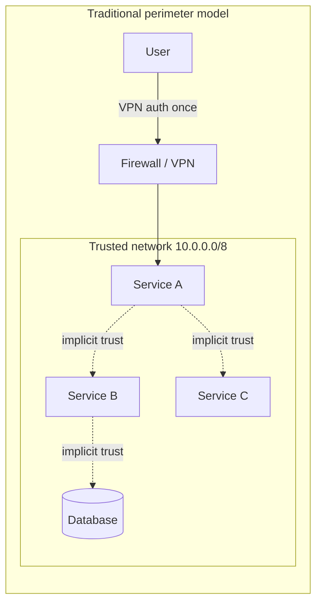
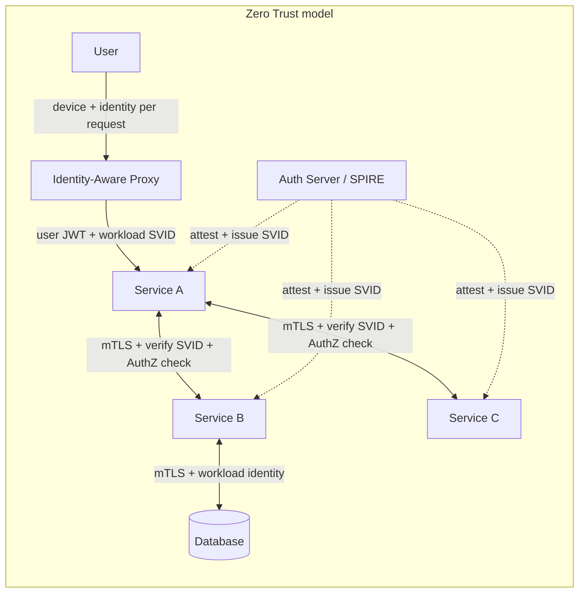
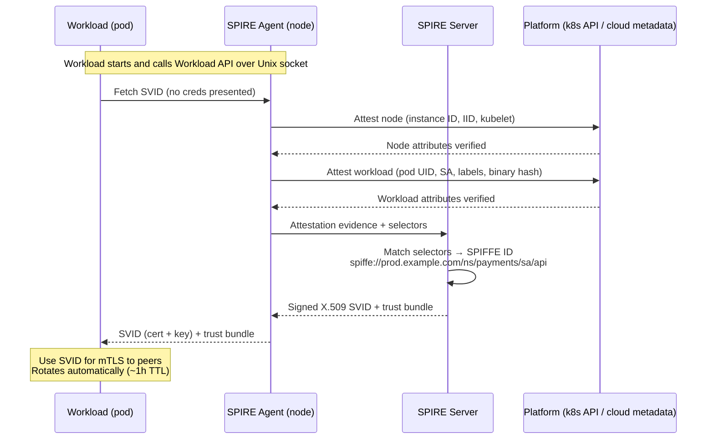
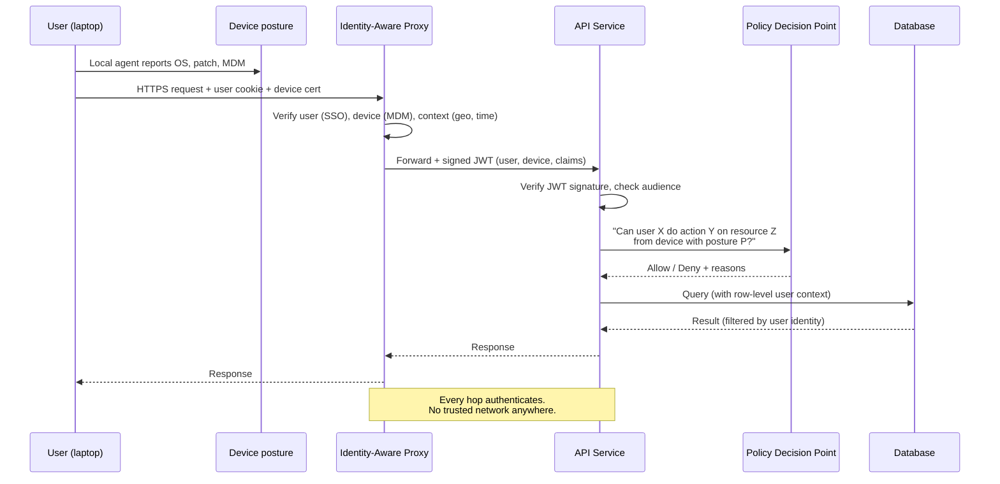

# Zero Trust

## Why This Exists

**Problem.** The traditional security model is a hard shell with a soft interior: a firewall at the perimeter, a VPN to get inside, and once you're inside the network you're trusted. This model fails catastrophically against three realities:

1. **Lateral movement.** One phished laptop, one compromised service, one leaked VPN credential — and the attacker is now "inside" with broad reach. See: every major breach since 2010 (Target, OPM, SolarWinds, Uber 2022, Okta 2023).
2. **Cloud and SaaS.** Workloads run on shared infrastructure across regions, accounts, and providers. There is no perimeter to defend.
3. **Workload identity.** "It came from 10.0.5.42" tells you nothing about which version of which service made the call, who deployed it, or whether it should be allowed.

**Key insight.** Trust must be **established per-request from cryptographic identity**, not inferred from network location. The network is hostile by default — even your own VPC. Every call carries proof of who is calling (workload identity), who the user is (if applicable), and what the request is for. Every receiver verifies that proof. The network is just a transport; it grants no privileges.

This is the **Zero Trust** model, articulated by Forrester (Kindervag, 2010), implemented at scale by Google as **BeyondCorp** (Ward & Beyer, 2014), and standardized for workloads as **SPIFFE/SPIRE** (CNCF). NIST SP 800-207 (2020) is the canonical reference architecture.

**Reach for this when:**
- You're designing a new system from scratch and want defensible security primitives.
- You're decommissioning a corporate VPN and moving to identity-aware proxies.
- You have a microservice mesh where any service can call any other service (east-west chaos).
- You need cryptographic, rotateable, attestable identity for workloads (no more long-lived API keys in env vars).
- Compliance / threat models demand assume-breach posture (financial services, healthcare, critical infra, defense).
- You're building multi-tenant SaaS and "the network" is shared with adversaries.

**Don't reach for this when:**
- You're a 3-person startup with one VPC and one service. The complexity isn't justified yet — but design with rotateable identity and TLS so you can adopt it later.
- You need it *just* for human users on devices — that's BeyondCorp / SSO + IAP, not full workload Zero Trust. Scope appropriately.
- You think Zero Trust is a product you can buy. It's an architecture. Vendors sell pieces (IAP, ZTNA, SPIRE, service mesh). The integration is on you.
- You're going to bolt mTLS on top of a system with shared service accounts and god-mode roles. Identity hygiene comes first; transport security is the easy part.

## Diagrams

### Perimeter model vs Zero Trust





### SPIFFE/SPIRE workload attestation flow



### Per-request authorization



## Core principles

The five tenets, distilled from NIST SP 800-207 and BeyondCorp:

1. **Never trust the network.** Treat every network — corp LAN, VPC, k8s pod network, anything — as hostile. No implicit trust based on IP, subnet, or VLAN.
2. **Authenticate every call.** Every request carries cryptographic identity (mTLS cert, signed JWT, MAC) and is verified by the receiver. No "internal calls bypass auth."
3. **Authorize every call.** Authentication answers *who*. Authorization answers *what they can do*. Both happen on every request, evaluated against current policy — not cached forever.
4. **Encrypt every hop.** TLS 1.2+ end-to-end. No "TLS terminates at the load balancer and we trust the rest." If the LB and the service live on different machines, that's an untrusted hop.
5. **Identity must be attested and rotateable.** Long-lived shared secrets in env vars are the enemy. Workloads prove they are who they claim to be via platform attestation (kernel, hypervisor, k8s API, cloud IID); credentials are short-lived and auto-rotated.

## BeyondCorp: Zero Trust for humans

Google published the BeyondCorp architecture across six papers (2014–2018) describing how they decommissioned their corporate VPN. The model:

- **Every device is enrolled** in an inventory with a hardware-bound certificate (TPM-backed where possible). No cert → no access, even from an office Ethernet jack.
- **Every user authenticates** via SSO with strong MFA (security keys, not SMS).
- **All applications are accessed through an Identity-Aware Proxy (IAP).** No flat corp network. The IAP terminates user TLS, validates the user + device, and forwards to the backend with a signed JWT (or short-lived header-based identity).
- **Access is determined per-request** based on a *Trust Tier* derived from device posture (patch level, disk encryption, MDM compliance, presence of EDR), user role, sensitivity of the resource, and contextual signals (geo, time of day, anomaly detection).
- **No VPN.** A laptop on a coffee-shop Wi-Fi has the same access (and the same per-request checks) as a laptop on the corporate LAN.

The cloud-native equivalents:
- **Google Cloud IAP** + **Cloud IAM** + **Chrome Enterprise** / **Endpoint Verification**.
- **AWS Verified Access** (built on the same model).
- **Cloudflare Zero Trust / Access**, **Tailscale**, **Twingate**, **Zscaler ZTNA**.

The hard part is not the proxy. It's the **device inventory and posture pipeline** — knowing which laptops exist, who owns them, whether they're patched, and revoking certs when they leave the company. Most BeyondCorp programs stall here.

## SPIFFE and SPIRE: Zero Trust for workloads

SPIFFE (Secure Production Identity Framework for Everyone) is a CNCF spec defining:

- **SPIFFE ID:** A URI naming a workload, e.g. `spiffe://prod.example.com/ns/payments/sa/charge-api`.
- **SVID (SPIFFE Verifiable Identity Document):** A signed credential — either an X.509 certificate (`x509-SVID`) or a JWT (`jwt-SVID`) — whose subject is the SPIFFE ID.
- **Trust Bundle:** The set of CA certs / JWKS keys that authenticate SVIDs from a trust domain.
- **Workload API:** A local Unix-domain-socket gRPC API (`/run/spire/sockets/agent.sock` by convention) where workloads fetch their SVID without presenting any credentials. The agent identifies the caller from the OS (PID, UID, k8s pod UID, etc.).

**SPIRE** is the reference implementation: a SPIRE Server (root of trust, mints SVIDs) and a SPIRE Agent on every node (attests workloads locally and serves the Workload API). Selectors map workload attributes (k8s namespace, service account, pod label, AWS instance tag, binary hash) to SPIFFE IDs.

### A minimal SPIRE registration entry

```bash
# Register: any pod in the 'payments' namespace running with service account 'charge-api'
# gets the SPIFFE ID spiffe://prod.example.com/ns/payments/sa/charge-api
spire-server entry create \
  -spiffeID spiffe://prod.example.com/ns/payments/sa/charge-api \
  -parentID spiffe://prod.example.com/ns/spire/sa/spire-agent \
  -selector k8s:ns:payments \
  -selector k8s:sa:charge-api \
  -selector k8s:container-image:registry.example.com/charge-api@sha256:abc123... \
  -ttl 3600
```

Note the selectors compose: namespace **and** service account **and** container image digest. The image digest selector is what defends against a malicious sidecar in the same pod — the sidecar's image won't match, so it gets a different SPIFFE ID (or none).

### Fetching and using an SVID in Go

```go
// Real-world pattern: a server that accepts mTLS from any peer in the same trust domain,
// then enforces fine-grained authz on the SPIFFE ID.
package main

import (
    "context"
    "fmt"
    "log"
    "net/http"

    "github.com/spiffe/go-spiffe/v2/spiffeid"
    "github.com/spiffe/go-spiffe/v2/spiffetls/tlsconfig"
    "github.com/spiffe/go-spiffe/v2/workloadapi"
)

func main() {
    ctx := context.Background()

    // X509Source connects to the local Workload API socket and keeps SVIDs fresh.
    // No credentials, no config — the agent attests us via the OS.
    source, err := workloadapi.NewX509Source(ctx)
    if err != nil {
        log.Fatalf("workload api: %v", err)
    }
    defer source.Close()

    // Authorize peers: only callers whose SPIFFE ID matches one of these may connect.
    // This is COARSE authentication — fine-grained authz comes later in the handler.
    allowedCallers := tlsconfig.AuthorizeOneOf(
        spiffeid.RequireFromString("spiffe://prod.example.com/ns/checkout/sa/api"),
        spiffeid.RequireFromString("spiffe://prod.example.com/ns/refunds/sa/worker"),
    )

    tlsCfg := tlsconfig.MTLSServerConfig(source, source, allowedCallers)

    mux := http.NewServeMux()
    mux.HandleFunc("/charge", func(w http.ResponseWriter, r *http.Request) {
        // The TLS layer already verified the peer SVID. Extract it for authz.
        peerID, err := peerSPIFFEID(r)
        if err != nil {
            http.Error(w, "no peer identity", http.StatusUnauthorized)
            return
        }

        // Fine-grained authz: only checkout-api can call /charge, not refunds-worker.
        if peerID.String() != "spiffe://prod.example.com/ns/checkout/sa/api" {
            http.Error(w, "forbidden", http.StatusForbidden)
            return
        }

        // ... actual handler ...
        fmt.Fprintf(w, "charged, called by %s\n", peerID)
    })

    server := &http.Server{
        Addr:      ":8443",
        Handler:   mux,
        TLSConfig: tlsCfg,
    }
    log.Fatal(server.ListenAndServeTLS("", ""))
}

func peerSPIFFEID(r *http.Request) (spiffeid.ID, error) {
    if r.TLS == nil || len(r.TLS.PeerCertificates) == 0 {
        return spiffeid.ID{}, fmt.Errorf("no peer cert")
    }
    // X.509 SVIDs encode the SPIFFE ID in the URI SAN.
    uris := r.TLS.PeerCertificates[0].URIs
    if len(uris) == 0 {
        return spiffeid.ID{}, fmt.Errorf("no URI SAN")
    }
    return spiffeid.FromURI(uris[0])
}
```

What this code gets right that ad-hoc mTLS gets wrong:

- **No long-lived secrets on disk.** The SVID is fetched from a Unix socket; the private key never touches a file system.
- **Auto-rotation.** `X509Source` keeps fetching new SVIDs before the old ones expire (typical TTL: 1 hour). Compromised keys age out fast.
- **Trust bundle is dynamic.** When the CA rotates, every workload sees the new bundle within seconds. No manual cert distribution.
- **Authentication and coarse authorization are at the TLS layer.** Fine-grained authz is in the handler, where it belongs.

## Per-request authorization with policy

mTLS gets you authentication. Authorization is a separate problem and harder to do well.

The pattern is **PEP/PDP separation** (Policy Enforcement Point / Policy Decision Point):

- **PEP:** Sidecar, library, or middleware in the request path. It collects the inputs (caller identity, action, resource, context) and asks the PDP.
- **PDP:** A policy engine (OPA / Rego, Cedar, custom) that evaluates rules and returns Allow/Deny + obligations.

```rego
# OPA / Rego: payment service authorization
package payments.charge

default allow = false

# Workload authorization: only checkout-api in prod may call charge
allow {
    input.peer.spiffe_id == "spiffe://prod.example.com/ns/checkout/sa/api"
    input.action == "charge"
}

# User authorization piggybacks on workload authz: the JWT carries the human user
# whose session triggered this call. We re-verify it server-side.
allow {
    input.peer.spiffe_id == "spiffe://prod.example.com/ns/checkout/sa/api"
    input.action == "refund"
    token := input.user_jwt
    payload := io.jwt.decode_verify(token, {"cert": data.idp_cert, "aud": "payments"})
    payload[2].roles[_] == "support_lead"
    payload[2].mfa_age_seconds < 300   # MFA in last 5 minutes for sensitive actions
}

# Deny by default. Log the reason.
reason["wrong_caller"] {
    not input.peer.spiffe_id == "spiffe://prod.example.com/ns/checkout/sa/api"
}
```

Critical properties:
- **Default deny.** If no rule allows, you reject. This catches new endpoints, mistyped paths, and forgotten auth checks.
- **Identity is layered:** workload identity (SPIFFE) + user identity (JWT) + device posture + context. All four can be required for high-sensitivity actions.
- **Decisions are logged.** Every Allow and Deny goes to an audit log with the inputs that produced the decision. This is non-negotiable for incident response.

## Service mesh as a Zero Trust substrate

Istio, Linkerd, Consul Connect, AWS App Mesh — all give you mTLS-by-default and policy enforcement at the sidecar. The mesh terminates TLS in a sidecar (Envoy, linkerd2-proxy), so the application code can stay HTTP. This is the easiest on-ramp for an existing fleet.

The trade: you depend on the sidecar lifecycle (every pod has two containers; one extra hop; one extra component to upgrade and patch). You also pay latency tax (typically <1 ms p50, but tail latency suffers under congestion). For high-throughput data planes, a sidecar-less approach (Istio Ambient, Cilium WireGuard, or library-level SPIFFE) may win.

```yaml
# Istio AuthorizationPolicy: only checkout pods may POST /charge to payments
apiVersion: security.istio.io/v1
kind: AuthorizationPolicy
metadata:
  name: payments-charge-only-checkout
  namespace: payments
spec:
  selector:
    matchLabels:
      app: payments
  action: ALLOW
  rules:
  - from:
    - source:
        principals: ["cluster.local/ns/checkout/sa/api"]
    to:
    - operation:
        methods: ["POST"]
        paths: ["/charge"]
    when:
    - key: request.auth.claims[mfa_age]
      values: ["fresh"]   # claim asserted by upstream IAP for sensitive ops
```

## Zero Trust vs network segmentation

These are **complementary**, not alternatives. The common confusion:

- **Network segmentation** (VLANs, security groups, NACLs, Calico network policies) = layer 3/4 controls. "Subnet A cannot talk to subnet B." Cheap, coarse, blast-radius oriented.
- **Zero Trust** = layer 7, identity-driven. "Service A authenticated as `charge-api` v2.3.4 may call `POST /refund` on service B if user has role X."

You want both:

| Concern | Network segmentation | Zero Trust (identity) |
| --- | --- | --- |
| Defense in depth | Reduces blast radius if identity is compromised | Survives flat-network design |
| Performance | ~free (kernel-level) | mTLS ~5–15% CPU, sidecar ~0.5–1 ms latency |
| Granularity | Subnet / pod-label level | Per-call, per-user, per-resource |
| Audit | "10.0.5.42 talked to 10.0.6.99" — useless | "checkout-api@v2.3.4 called payments.refund as user U for $X" |
| Failure mode | Misconfigured rule → outage | Cert expiry / clock skew → outage |
| Adversary value | Slows lateral movement | Stops it: stolen IP doesn't help you |

Don't pick one. **Use network policy as a brittle but cheap outer fence; use identity as the load-bearing wall.**

## Trade-offs

| Benefit | Cost |
| --- | --- |
| Lateral movement is contained: a compromised pod can only reach what its SPIFFE ID is authorized for | Every workload needs an identity, registration entries, and a policy. Tooling and ownership become real engineering work |
| No long-lived secrets in env vars or config files; rotation is automatic | Bootstrapping problem: how does the SPIRE agent itself get attested? Solved by node attestation (cloud IID, k8s, TPM) but adds setup complexity |
| Cryptographic audit trail: every call is signed by a named workload | Audit log volume explodes (10–100× a perimeter model). Need streaming pipeline + retention strategy |
| Network can be flat / cloud-native without ceding security | mTLS adds latency (typically 0.3–1 ms p50, worse p99). High-RPS services feel it |
| Decommission VPN; remote work is the same as office work | BeyondCorp requires a device inventory, MDM, and posture pipeline — multi-quarter org investment |
| Policy is code (OPA, Cedar) → reviewable, testable, version-controlled | Policy bugs cause outages. Need staging + dry-run + good observability of denies |
| Compatible with multi-cloud, multi-cluster federation (SPIFFE trust domains) | Cross-domain federation is non-trivial; mismatched clock skew or trust bundles cause silent breakage |
| Defense against insider threat: a rogue admin can't just `curl` the database | Must commit to "no break-glass shared accounts." Painful when an incident happens at 3 AM and the on-call doesn't have a pre-provisioned identity |

## Common Pitfalls

- **mTLS terminates at the LB, then plaintext to the service.** Common in early adoption. The "trusted hop" between LB and service is exactly where attackers land. Either mesh-everywhere or terminate at the workload.
- **Long-lived service tokens "for emergencies."** A 90-day API key in Vault that "only on-call uses" *will* leak — into a Slack thread, a Jira ticket, a debug log. Use short-lived SVIDs with break-glass escalation through audited channels.
- **Identity sprawl.** Every team invents its own SPIFFE ID scheme: `payments.api`, `prod-payments-svc`, `payments/v2/api`. Define a trust-domain-wide naming convention before the second team adopts SPIRE.
- **Selectors that are too loose.** `k8s:ns:payments` alone means every pod in the namespace gets the same SVID — including a malicious sidecar injected via a compromised CI pipeline. Add `k8s:sa:` and `k8s:container-image:` (digest, not tag) selectors.
- **Cert rotation outages.** SVID TTL is 1 hour; clock skew of 5 minutes between server and client; a network blip blocks SVID refresh; suddenly half the fleet is presenting expired certs. Monitor SVID refresh failures with high-priority alerts. Set `MaxClockSkew` generously. Run NTP everywhere.
- **Policy as documentation, not enforcement.** "We have an AuthorizationPolicy" — but it's in `dryRun` mode and nobody looks at the deny logs. Six months later it's a paperweight. Drive denies to zero in dry-run, then enforce.
- **Forgetting east-west authz.** Teams enforce at the ingress IAP, then assume internal calls are fine. The pivot from a compromised pod still owns you. Authz at every hop, not just the edge.
- **JWT-everywhere with no audience check.** A JWT minted for service A is replayed against service B because both trust the same IdP. Always verify `aud` and `iss`.
- **Treating BeyondCorp as a VPN replacement only.** It's a *device + user + context* gate. If you skip device posture, you've just moved the trust assumption from "is on the VPN" to "has the cookie" — barely better.
- **No emergency authentication path.** When SPIRE Server is down, every workload's SVID expires within an hour. Plan for this: longer TTLs in the data plane than the control plane, fail-static caches, regional SPIRE deployments. Bootstrap dependency analysis matters (BSRS ch. 11).
- **Buying "Zero Trust" from a vendor.** ZTNA appliances solve the user-to-app problem and stop there. Workload-to-workload, audit, identity rotation, attestation — those are still on you.
- **Skipping device posture in BeyondCorp.** Without it, a stolen authenticated cookie owns the kingdom. Hardware-bound device certs (TPM/Secure Enclave) are the load-bearing piece.

## Decision Table

| Scenario | Recommendation |
| --- | --- |
| Greenfield microservices on k8s | Service mesh (Linkerd or Istio) with SPIFFE IDs, mTLS by default, OPA for authz |
| Existing monolith + a few services on EC2 | Start with workload IAM roles (AWS) or workload identity (GCP/Azure), add SPIRE later when service count grows |
| Replacing corporate VPN | BeyondCorp pattern: IAP (Cloud IAP / AWS Verified Access / Cloudflare Access) + SSO + MDM + device certs |
| Multi-cloud, multi-cluster | SPIFFE trust domain federation; standardize on SPIFFE IDs across providers |
| 3-person startup, 1 service | Skip SPIRE for now. Use cloud IAM, mTLS via cert-manager, short-lived tokens. Avoid shared API keys |
| Regulated (HIPAA, PCI, FedRAMP) | Full Zero Trust. Auditors will ask. Document policy-as-code, key rotation, device posture |
| Need fast east-west authz with no sidecar overhead | Library-level SPIFFE (go-spiffe, spiffe-helper) or Cilium with WireGuard + identity-aware policies |
| Just need encryption between two services | mTLS via cert-manager + SPIFFE IDs in URI SAN. Don't reinvent. Don't use a self-signed CA from 2014 |
| Workload needs to call AWS / GCP APIs | Federate SPIFFE IDs to cloud IAM (AWS roles-anywhere, GCP Workload Identity Federation). No long-lived cloud creds |
| Network segmentation alone is "good enough" | Almost never. It buys time against unsophisticated attackers; it does not survive a foothold inside |

## References

- Kindervag, John — *No More Chewy Centers: Introducing the Zero Trust Model of Information Security* — Forrester Research, 2010 (the original Zero Trust paper)
- NIST — *SP 800-207: Zero Trust Architecture* — https://csrc.nist.gov/publications/detail/sp/800-207/final
- NIST — *SP 800-207A: A Zero Trust Architecture Model for Access Control in Cloud-Native Applications in Multi-Location Environments* — https://csrc.nist.gov/pubs/sp/800/207/a/final
- Ward, Rory & Beyer, Betsy — *BeyondCorp: A New Approach to Enterprise Security* — ;login: vol. 39 no. 6, USENIX, December 2014 — https://research.google/pubs/pub43231/
- Osborn, Barclay; McWilliams, Justin; Beyer, Betsy; Saltonstall, Max — *BeyondCorp: Design to Deployment at Google* — ;login: vol. 41 no. 1, Spring 2016 — https://research.google/pubs/pub44860/
- Cittadini, Luca; Spear, Batz; Beyer, Betsy; Saltonstall, Max — *BeyondCorp Part III: The Access Proxy* — ;login: Winter 2016 — https://research.google/pubs/pub45728/
- Escobedo, Victor; Zyzniewski, Filip; Saltonstall, Max; Beyer, Betsy — *BeyondCorp 5: The User Experience* — ;login: Spring 2017 — https://research.google/pubs/pub46366/
- Janosko, Hunter; Spear, Batz; Saltonstall, Max — *BeyondCorp 6: Building a Healthy Fleet* — ;login: 2018 — https://research.google/pubs/pub47356/
- Google — *BeyondCorp papers index* — https://www.beyondcorp.com/
- SPIFFE Project — *SPIFFE Specification* — https://github.com/spiffe/spiffe/blob/main/standards/SPIFFE.md
- SPIFFE Project — *SVID and Workload API specs* — https://spiffe.io/docs/latest/spiffe-about/spiffe-concepts/
- SPIRE Project — *SPIRE Documentation* — https://spiffe.io/docs/latest/spire-about/
- Feldman, Evan; Howard, Andrew; et al. — *Solving the Bottom Turtle: A SPIFFE Way to Establish Trust in Your Infrastructure via Universal Identity* — book, free PDF — https://spiffe.io/book/
- Beyer, Betsy; Jones, Chris; Petoff, Jennifer; Murphy, Niall (eds.) — *Site Reliability Engineering* — O'Reilly, free online — https://sre.google/sre-book/table-of-contents/
- Adkins, Heather; Beyer, Betsy; Blankinship, Paul; Lewandowski, Piotr; Oprea, Ana; Stubblefield, Adam — *Building Secure and Reliable Systems* — O'Reilly, free online — https://sre.google/books/building-secure-reliable-systems/ (esp. ch. 6 "Design for Understandability", ch. 8 "Design for Resilience", ch. 11 "Case Study: Designing, Implementing, and Maintaining a Publicly Trusted CA")
- CNCF — *Zero Trust Whitepaper* — https://github.com/cncf/tag-security/blob/main/security-whitepaper/v2/CNCF_cloud-native-security-whitepaper-May2022-v2.pdf
- Open Policy Agent — *OPA Documentation* — https://www.openpolicyagent.org/docs/latest/
- AWS — *AWS Verified Access* — https://docs.aws.amazon.com/verified-access/latest/ug/what-is-verified-access.html
- AWS Builders' Library — *Beyond five 9s: Lessons from our highest available data planes* — https://aws.amazon.com/builders-library/ (broader resilience patterns relevant to control-plane design for SPIRE/IdP)
- Istio — *Security Architecture* — https://istio.io/latest/docs/concepts/security/
- Linkerd — *Automatic mTLS* — https://linkerd.io/2/features/automatic-mtls/
- Saltzer, J. H. & Schroeder, M. D. — *The Protection of Information in Computer Systems* — Proceedings of the IEEE, 1975 (origin of "least privilege" and "fail-safe defaults")
- Kleppmann, Martin — *Designing Data-Intensive Applications* — O'Reilly, 2017 — ch. 9 "Consistency and Consensus" (relevant for understanding clock skew and certificate validity windows)

## See Also

- `../authn/` — OAuth2, OIDC, JWT validation, session management
- `../authz/` — RBAC, ABAC, ReBAC, OPA, Cedar policy patterns
- `../secrets-management/` — Vault, KMS, sealed secrets, secret rotation
- `../mtls/` — Mutual TLS deep dive, cert-manager, certificate rotation
- `../../architecture-patterns/service-mesh/` — Istio, Linkerd, Consul Connect deployment patterns
- `../audit-logging/` — Tamper-evident audit logs, SIEM pipelines
- `../threat-modeling/` — STRIDE, attack trees, assume-breach posture
- `../../reliability/incident-response/` — Break-glass procedures, credential rotation playbooks
